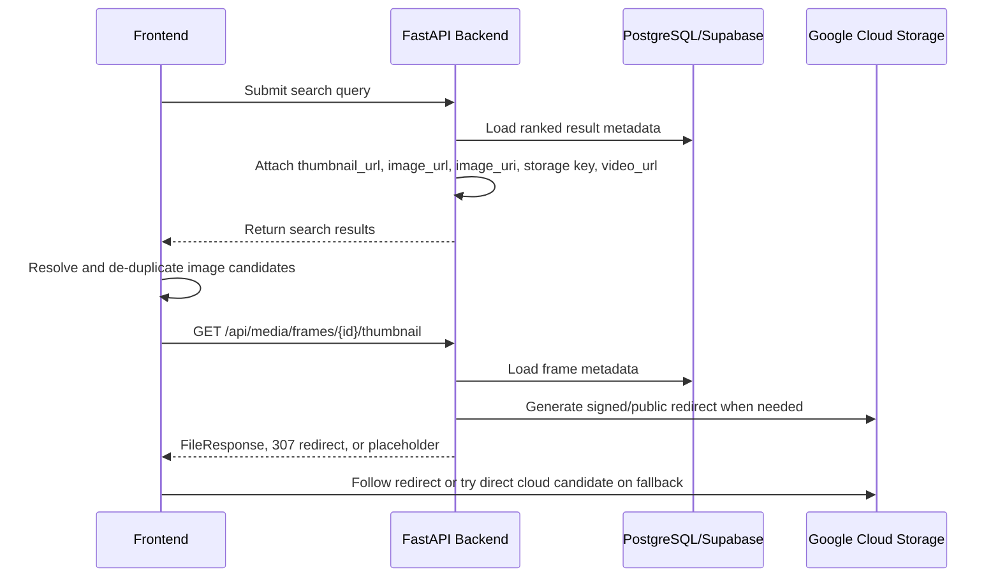
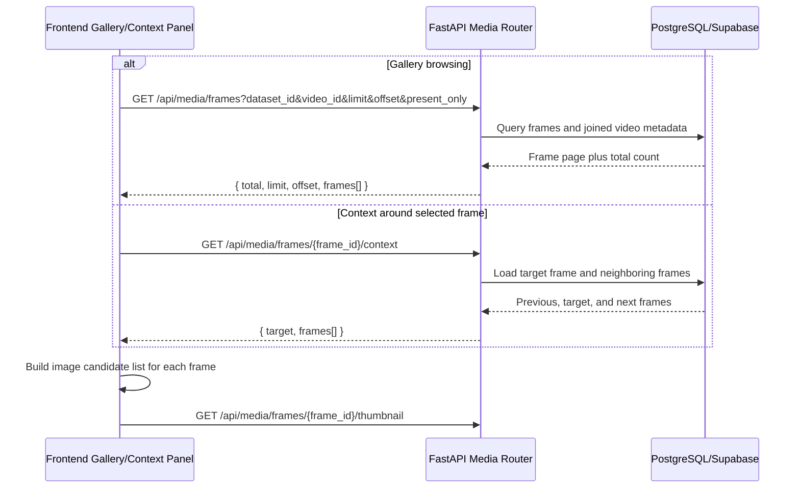
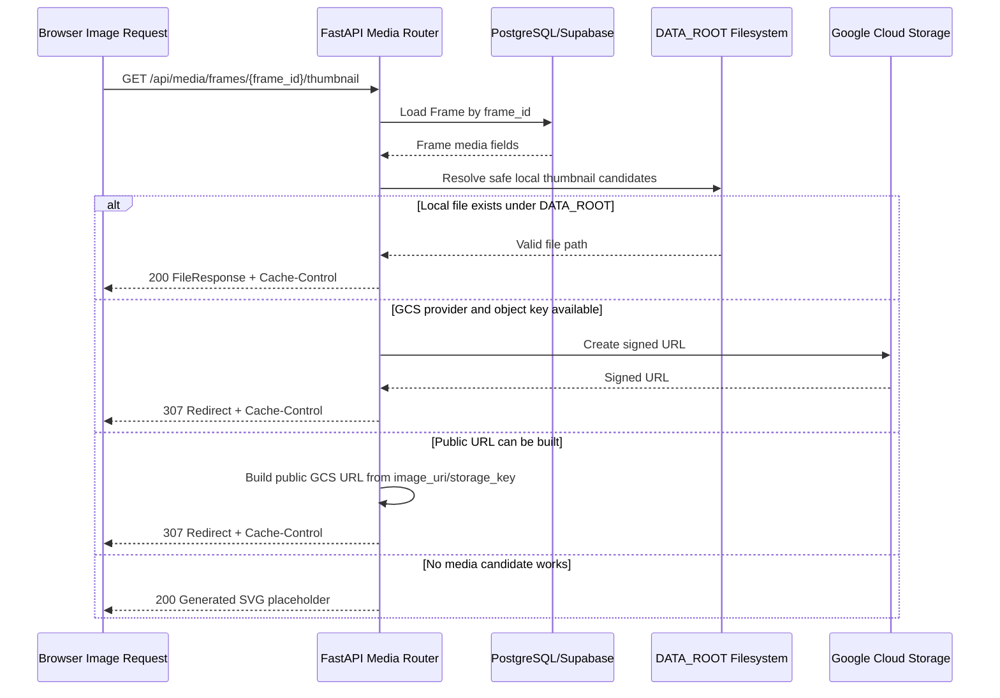
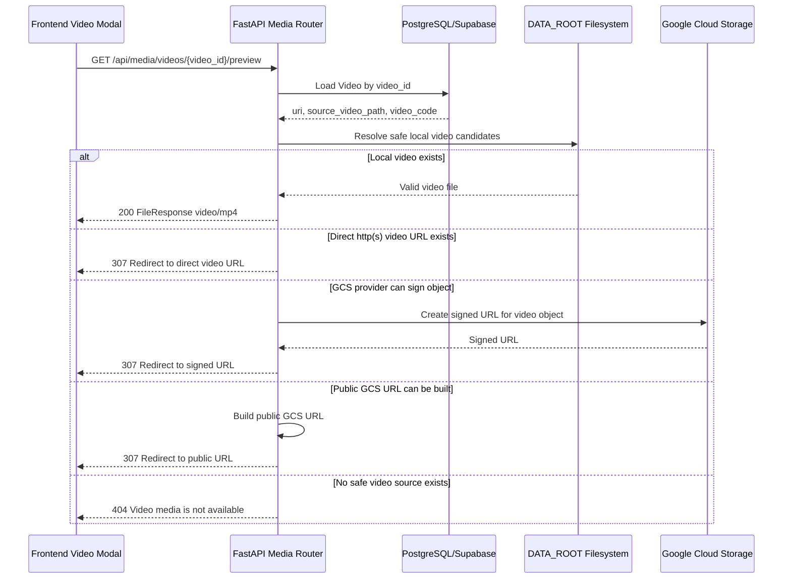

# Backend Media Delivery Technical Report

## 1. Purpose

This document describes how the backend resolves frame images and source videos for the frontend search experience. It focuses on the technical contract between retrieval results, database media metadata, Google Cloud Storage (GCS), local development storage, and the FastAPI media endpoints.

The goal of this design is to make frame and video rendering reliable across two operating modes:

- Local development, where media can be served from `DATA_ROOT`.
- Cloud execution, where frames and videos live in GCS and may be public or private.

## 2. Executive Summary

The backend does not require the frontend to understand every storage detail. Search APIs return normalized media fields, and the `/api/media` router provides stable fallback endpoints for thumbnails, frame lists, context frames, and video previews.

For images, the backend exposes both a stable thumbnail endpoint and direct cloud/public candidates. The current frontend prefers the stable thumbnail endpoint first because it supports local media, private GCS buckets, signed redirects, public GCS URLs, and a final generated placeholder.

For videos, the frontend opens a stable backend preview endpoint. The backend then streams a local file or redirects the browser to a direct, signed, or public cloud URL.

## 3. System Components

| Component | Location | Responsibility |
| --- | --- | --- |
| FastAPI media router | `apps/backend/app/modules/media/router.py` | Serves frame lists, frame context, thumbnails, and video previews. |
| Retrieval service | `apps/backend/app/modules/retrieval/service.py` | Adds media fields to search result items. |
| Retrieval schema | `apps/backend/app/modules/retrieval/schemas.py` | Defines API response fields consumed by the frontend. |
| Media URL helpers | `apps/backend/app/modules/media/urls.py` | Converts `gs://...` URIs and object keys into browser-loadable URLs. |
| Database models | `apps/backend/app/db/models.py` | Stores frame and video media metadata. |
| Storage dependency | `apps/backend/app/core/deps.py` | Creates the configured object storage client, including GCS. |
| Runtime config | `apps/backend/app/core/config.py` | Defines `DATA_ROOT`, `STORAGE_PROVIDER`, `GCS_BUCKET`, credentials, and public URL base. |

## 4. Media Data Contract

### Frame Fields

The frame table contains several fields because the system supports both local files and cloud objects.

| Field | Meaning | Typical Value |
| --- | --- | --- |
| `image_rel_path` | Local relative frame path under `DATA_ROOT` or a frame subfolder. | `L21_V001/shot_auto_middle_f000120.jpg` |
| `image_storage_key` | Object key inside the configured GCS bucket. | `frames/L21_V001/shot_auto_middle_f000120.jpg` |
| `image_url` | Browser-loadable image URL when the object is public or signed. | `https://storage.googleapis.com/...` |
| `image_uri` | Storage URI for the original object. | `gs://bucket/frames/...jpg` |
| `thumbnail_uri` | Preferred thumbnail URL or URI when available. | `https://.../thumb.jpg` |
| `is_media_present` | Boolean flag used to filter gallery frames that have media. | `true` |

### Video Fields

| Field | Meaning | Typical Value |
| --- | --- | --- |
| `video_id` | Stable database/API identifier. | `L21_V001` |
| `video_code` | Human-readable video code used in UI and path matching. | `L21_V001` |
| `uri` | Source video URI, often cloud-backed. | `gs://bucket/videos/L21_V001.mp4` |
| `source_video_path` | Local or cloud path to the original video. | `raw_videos/L21_V001.mp4` |

## 5. Backend API Surface

| Method | Endpoint | Purpose |
| --- | --- | --- |
| `GET` | `/api/media/frames` | Returns paginated frame metadata for the gallery/debugging workflow. |
| `GET` | `/api/media/frames/{frame_id}/context` | Returns neighboring frames around a selected frame. |
| `GET` | `/api/media/frames/{frame_id}/thumbnail` | Returns or redirects to a displayable frame image. |
| `GET` | `/api/media/videos/{video_id}/preview` | Returns or redirects to a displayable source video. |
| `GET` | `/search` or retrieval endpoints | Returns ranked search results with frame/video media fields. |

The frame list endpoint supports:

| Query Parameter | Purpose |
| --- | --- |
| `dataset_id` | Limits results to one dataset. |
| `video_id` | Limits results to one video. |
| `limit` | Page size. The backend caps it at 200. |
| `offset` | Pagination offset. |
| `present_only` | Returns only frames where media is marked present. |

## 6. End-to-End Retrieval Flow

This diagram shows the normal search-to-image path. The frontend receives media candidates from retrieval, then loads the stable thumbnail endpoint first. The backend decides whether to serve local media, redirect to GCS, or return a placeholder.



### Frame Gallery and Context Flow

Frame gallery and context views use the media router directly. They are designed for visual inspection and debugging after frames have been extracted and uploaded.



## 7. Frame Image Resolution

### Search Result Payload

The retrieval service returns these media fields for each result:

| Field | Description |
| --- | --- |
| `thumbnail_url` | Stable backend fallback endpoint: `/api/media/frames/{frame_id}/thumbnail`. |
| `image_url` | Best browser-loadable image URL generated from frame metadata. |
| `image_uri` | Original image URI, usually `gs://...`. |
| `image_storage_key` | GCS object key when available. |
| `video_url` | Stable backend video preview endpoint. |
| `video_uri` | Original video URI/path when available. |

### Backend Thumbnail Fallback Order

When the frontend requests `/api/media/frames/{frame_id}/thumbnail`, the backend resolves media in this order:

1. Try a local file under `DATA_ROOT`.
2. If `STORAGE_PROVIDER=gcs`, generate a signed URL from `image_storage_key` or `image_uri` and return a `307` redirect.
3. Build a public GCS URL from `image_url`, `image_uri`, or `image_storage_key` and return a `307` redirect.
4. Return a generated SVG placeholder when no media can be resolved.

This makes the endpoint stable even when the database contains incomplete or mixed local/cloud metadata.



### Local Path Safety

Local frame resolution is intentionally constrained to `DATA_ROOT`. Candidate paths are resolved and validated before `FileResponse` is used. This prevents arbitrary file access through manipulated relative paths.

The local search checks common frame layouts:

- `DATA_ROOT/frames/{image_rel_path}`
- `DATA_ROOT/{image_rel_path}`
- `DATA_ROOT/keyframes/{image_rel_path}`
- `DATA_ROOT/frames/{video_code}/...f{frame_idx}.jpg`
- `DATA_ROOT/keyframes/{video_code}/...f{frame_idx}.jpg`

## 8. Video Preview Resolution

The frontend opens videos through:

```text
/api/media/videos/{video_id}/preview
```

The backend resolves the video in this order:

1. Serve a local file under `DATA_ROOT` when `uri` or `source_video_path` points to a valid local path.
2. Redirect to a direct `http(s)` URL when the video field already contains one.
3. Generate a signed GCS URL when `STORAGE_PROVIDER=gcs`, the bucket matches `GCS_BUCKET`, and credentials are configured.
4. Build a public GCS URL as a best-effort fallback.
5. Return `404` when no usable source exists.

The endpoint sets the media type using `mimetypes.guess_type` and defaults to `video/mp4`.



## 9. GCS URL Normalization

The helper module `apps/backend/app/modules/media/urls.py` centralizes GCS path handling.

| Function | Responsibility |
| --- | --- |
| `split_gcs_uri()` | Accepts `gs://bucket/key` or a bare object key when a default bucket is configured. |
| `gcs_public_url()` | Converts GCS references into browser-loadable `https://storage.googleapis.com/...` URLs or a configured public base URL. |

The backend keeps this logic centralized so retrieval, media routing, and import scripts do not each implement slightly different path rules.

## 10. Performance Strategy

| Concern | Backend Technique |
| --- | --- |
| Browser cache reuse | Media responses and redirects use `Cache-Control: public, max-age=3600`. |
| Large gallery payloads | `/api/media/frames` is paginated and capped at 200 items per request. |
| Avoiding API bottlenecks | Public cloud media can be loaded directly by the browser. |
| Private bucket support | Backend returns signed URLs instead of exposing service account credentials. |
| Database query efficiency | Frame queries use relationship loading where video metadata is required. |
| Local development speed | Local media files are served with `FileResponse`. |

## 11. Configuration

| Variable | Required For | Description |
| --- | --- | --- |
| `DATA_ROOT` | Local development and fallback serving | Root directory for local frames and videos. |
| `STORAGE_PROVIDER=gcs` | Private/public GCS serving | Enables the GCS object storage client. |
| `GCS_BUCKET` | GCS object key resolution | Default bucket used for bare object keys and bucket validation. |
| `GCS_CREDENTIALS_FILE` | Private GCS buckets | Service account JSON used to generate signed URLs. |
| `GCS_PUBLIC_URL` | Public/CDN bucket URLs | Optional public base URL used instead of raw `storage.googleapis.com`. |

## 12. Security and Reliability Notes

- The frontend never receives GCS service account credentials.
- Private GCS objects are accessed through signed URLs generated by the backend.
- Local filesystem serving is restricted to paths inside `DATA_ROOT`.
- `gs://...`, bare GCS object keys, direct URLs, and local paths are normalized through shared helpers.
- The thumbnail endpoint degrades gracefully to a placeholder instead of breaking the entire search result card.
- The video endpoint returns `404` when no safe, usable video source exists.

## 13. Troubleshooting Checklist

| Symptom | Backend Check |
| --- | --- |
| Image does not render | Call `/api/media/frames/{frame_id}/thumbnail` directly and inspect redirect/file response. |
| GCS image returns `403` | Verify `STORAGE_PROVIDER=gcs`, `GCS_BUCKET`, and `GCS_CREDENTIALS_FILE`. |
| GCS public URL is wrong | Check `image_uri`, `image_storage_key`, and `GCS_PUBLIC_URL`. |
| Local frame not found | Confirm `DATA_ROOT` and `image_rel_path` layout. |
| Video preview returns `404` | Confirm `videos.uri` or `videos.source_video_path` points to an existing local file or valid GCS object. |
| Gallery is empty | Verify frames have `is_media_present=true` or call with `present_only=false`. |

## 14. Future Improvements

- Add a batch signed URL endpoint for private buckets to reduce one redirect per image.
- Store generated thumbnails separately from full-size frames for lower bandwidth.
- Add CDN support through `GCS_PUBLIC_URL` when the bucket is public.
- Add backend metrics for thumbnail redirect latency, signed URL generation count, and missing media rate.
- Add integration tests covering local media, public GCS URLs, and private signed GCS redirects.
