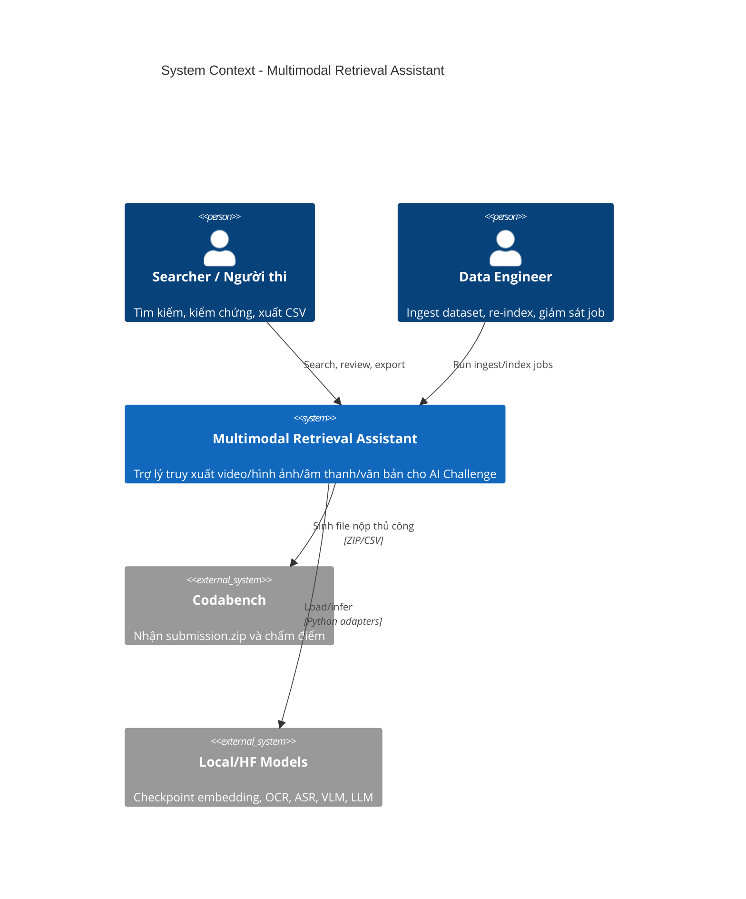
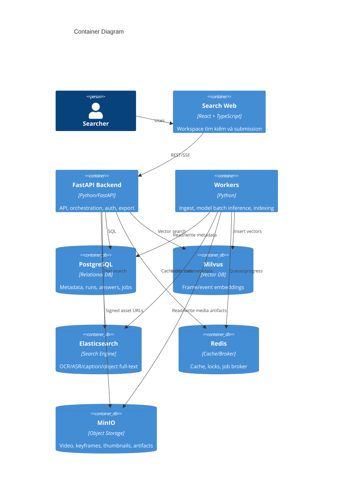
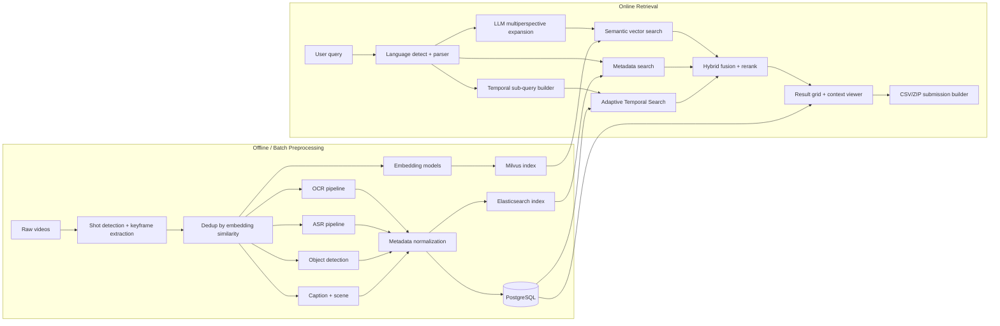
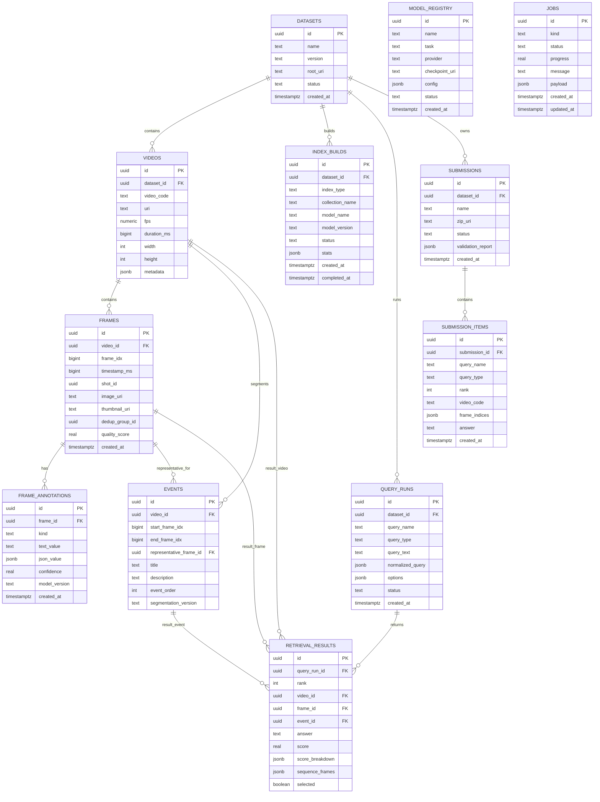
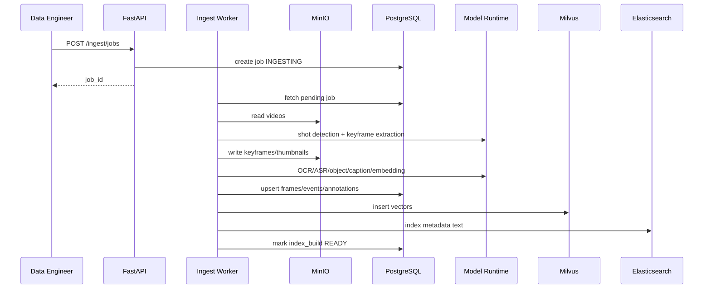

# Multimodal Retrieval Assistant — Technical Design

> Blueprint kỹ thuật hệ thống AI Challenge 2026 • Phiên bản 1.0

## 1. Kiến trúc tổng thể

### 1.1 Architectural Style được chọn

Backend dùng **Modular Monolith với FastAPI**, tách rõ các module nghiệp vụ và module hạ tầng. Các tác vụ nặng như ingest video, trích xuất OCR/ASR, chạy embedding, build Milvus index và rerank batch chạy trong **worker bất đồng bộ**. Frontend là một ứng dụng web TypeScript chuyên cho tìm kiếm tương tác.

Lý do chọn Modular Monolith:

- Một codebase dễ phát triển nhanh, kiểm soát version model/index/schema đồng bộ.
- Các module vẫn có boundary rõ nên có thể tách thành service riêng khi tải tăng.
- FastAPI phù hợp hệ Python ML, dễ tích hợp PyTorch, Hugging Face, Milvus SDK, WhisperX, PaddleOCR.
- Worker async giúp pipeline GPU/batch không chặn request search.

### 1.2 Thành phần chính

| Thành phần | Vai trò | Công nghệ |
| --- | --- | --- |
| **Search Web** | UI search, review, context viewer, temporal workspace, export submission | TypeScript, React, Vite |
| **FastAPI Backend** | REST API, auth nội bộ, query orchestration, submission builder | FastAPI, Pydantic, SQLAlchemy |
| **Retrieval Engine** | Semantic search, metadata search, hybrid fusion, ATS, QA rerank | Python module trong backend/worker |
| **Ingest Workers** | Extract keyframes, OCR, ASR, object, caption, embedding, event segmentation | Celery/RQ/Dramatiq, PyTorch |
| **Model Runtime** | Load/chạy model thật hoặc mock adapter | Hugging Face, PyTorch, optional ONNX/TensorRT |
| **PostgreSQL** | Metadata quan hệ, runs, answers, jobs, model/index versions | PostgreSQL 16 |
| **Milvus** | Vector database cho frame/event/image-query embeddings | Milvus 2.x |
| **Elasticsearch** | Full-text/fuzzy search OCR, ASR, caption, object labels | Elasticsearch 8.x |
| **Redis** | Cache, job state ngắn hạn, locks, rate limit nội bộ | Redis 7 |
| **MinIO** | Lưu video/keyframe/thumbnail/audio/artifacts | S3-compatible object storage |

### 1.3 Cách các thành phần giao tiếp

- **Frontend ↔ Backend**: REST JSON, streaming/SSE tùy chọn cho job progress và long-running query.
- **Backend ↔ PostgreSQL**: SQLAlchemy connection pool, transaction cho mọi thay đổi submission/run.
- **Backend ↔ Milvus**: search vector theo collection + partition/model version.
- **Backend ↔ Elasticsearch**: keyword, fuzzy, phrase, field boosts cho OCR/ASR/caption/object.
- **Backend ↔ Workers**: Redis broker hoặc RabbitMQ nếu cần độ bền cao hơn; job id lưu trong PostgreSQL.
- **Workers ↔ Model Runtime**: adapter nội bộ, batch inference, device-aware scheduling.
- **Workers ↔ MinIO**: đọc video/keyframe/audio, ghi artifact và thumbnail.

### 1.4 Nguyên tắc thiết kế

- **Real build first**: module, schema, API, job state và export đều là thật; mock chỉ thay thế model/data khi chưa có tài nguyên.
- **Model-agnostic**: nghiệp vụ gọi interface `EmbeddingModel`, `CaptionModel`, `VlmQaModel`, `ObjectDetector`, không gọi trực tiếp checkpoint.
- **Index versioning**: mọi vector/metadata gắn `model_version`, `index_build_id`, `dataset_version` để rollback/rebuild.
- **Human-in-the-loop**: hệ thống xếp hạng tốt, nhưng UI phải giúp người thi xác nhận nhanh.
- **Top-k aware**: scoring ưu tiên đưa đáp án đúng lên sớm vì Codabench tính R@1, R@5, R@20, R@50, R@100.

---

## 2. C4 Diagram

### 2.1 Level 1 — System Context



### 2.2 Level 2 — Container



---

## 3. High-Level Architecture



### 3.1 Luồng dữ liệu offline

1. **Dataset scan** đọc `DatasetManifest`, nhận biết video id, đường dẫn, fps, duration, split.
2. **Shot detection** dùng AutoShot adapter nếu có, fallback PySceneDetect/mock.
3. **Keyframe extraction** lấy frame đầu/giữa/cuối mỗi shot, thêm frame định kỳ nếu shot dài.
4. **Dedup** dùng embedding nhẹ, loại frame có cosine similarity `> 0.90` trong cùng shot/neighbor window.
5. **Metadata extraction** chạy OCR, ASR, object detection, caption, scene classification.
6. **Embedding** tạo vector cho frame và event bằng một hoặc nhiều model.
7. **Event segmentation** gom frame thành event theo video, thời gian, shot, scene/location/text similarity.
8. **Index build** ghi PostgreSQL, insert Milvus, index Elasticsearch, lưu `index_build_id`.

### 3.2 Luồng truy vấn online

1. Người dùng nhập query hoặc import file `query-*.txt`.
2. Query parser nhận dạng loại query: `kis`, `qa`, `trake`, `image`, `freeform`.
3. Language detector chuẩn hóa tiếng Việt/Anh; có thể dịch sang English cho embedding model.
4. LLM multiperspective sinh 3-7 biến thể query nếu bật.
5. Semantic search gọi Milvus theo từng embedding model/variant.
6. Metadata search gọi Elasticsearch với boosts cho OCR, ASR, object, caption, scene.
7. Hybrid fusion hợp nhất điểm, loại trùng, rerank theo context.
8. Với TRAKE, ATS xây chuỗi frame hợp lệ theo video và thời gian.
9. UI hiển thị result, context strip, score breakdown, selected tray.
10. Submission builder export CSV/ZIP đúng format.

---

## 4. Thiết kế module backend

```text
backend/app/
├── main.py
├── core/
│   ├── config.py
│   ├── logging.py
│   ├── security.py
│   └── observability.py
├── db/
│   ├── session.py
│   ├── models/
│   └── migrations/
├── modules/
│   ├── datasets/
│   ├── media/
│   ├── ingest/
│   ├── models/
│   ├── indexing/
│   ├── retrieval/
│   ├── temporal/
│   ├── qa/
│   ├── submissions/
│   ├── jobs/
│   └── admin/
├── workers/
│   ├── ingest_worker.py
│   ├── model_worker.py
│   └── index_worker.py
└── adapters/
    ├── vector_db/milvus.py
    ├── text_search/elasticsearch.py
    ├── object_storage/s3.py
    └── model_runtime/
```

> Sơ đồ ERD PostgreSQL dễ nhìn hơn nằm ở `docs/database_erd.md`.

### 4.1 Module responsibilities

| Module | Trách nhiệm |
| --- | --- |
| `datasets` | Dataset manifest, video registry, dataset version, mock data generator |
| `media` | Asset URLs, keyframe/thumbnail metadata, video frame context |
| `ingest` | Tạo và điều phối job preprocessing |
| `models` | Model registry, adapter config, model health, benchmark info |
| `indexing` | Milvus collection, Elasticsearch schema, index build lifecycle |
| `retrieval` | Query parsing, semantic search, metadata search, fusion, rerank |
| `temporal` | Adaptive Temporal Search, event segmentation, sequence scoring |
| `qa` | VLM/LLM answer generation, normalization, answer candidate ranking |
| `submissions` | CSV validator/export, ZIP builder, submission runs |
| `jobs` | Job state, progress, retries, logs |
| `admin` | Healthcheck, metrics, config inspection |

---

## 5. Thiết kế cơ sở dữ liệu

### 5.1 Lựa chọn database

| Loại dữ liệu | Lựa chọn | Lý do |
| --- | --- | --- |
| Dataset/video/frame/event metadata | PostgreSQL | Quan hệ rõ, cần transaction, audit và join |
| Vector frame/event/query image | Milvus | ANN search, filter theo metadata/model version |
| OCR/ASR/caption/object text | Elasticsearch | Fuzzy, phrase, field boosting, highlight |
| Media blobs | MinIO | File lớn, signed URL, tách khỏi DB |
| Cache/job broker/locks | Redis | TTL, nhanh, đơn giản |

### 5.2 PostgreSQL schema chính

```sql
CREATE TABLE datasets (
  id UUID PRIMARY KEY,
  name TEXT NOT NULL,
  version TEXT NOT NULL,
  root_uri TEXT NOT NULL,
  status TEXT NOT NULL CHECK (status IN ('DRAFT','INGESTING','READY','FAILED')),
  created_at TIMESTAMPTZ NOT NULL DEFAULT now(),
  UNIQUE (name, version)
);

CREATE TABLE videos (
  id UUID PRIMARY KEY,
  dataset_id UUID NOT NULL REFERENCES datasets(id),
  video_code TEXT NOT NULL,
  uri TEXT NOT NULL,
  fps NUMERIC(8,3),
  duration_ms BIGINT,
  width INT,
  height INT,
  metadata JSONB NOT NULL DEFAULT '{}',
  UNIQUE (dataset_id, video_code)
);

CREATE TABLE frames (
  id UUID PRIMARY KEY,
  video_id UUID NOT NULL REFERENCES videos(id),
  frame_idx BIGINT NOT NULL,
  timestamp_ms BIGINT NOT NULL,
  shot_id UUID,
  image_uri TEXT NOT NULL,
  thumbnail_uri TEXT,
  dedup_group_id UUID,
  quality_score REAL,
  created_at TIMESTAMPTZ NOT NULL DEFAULT now(),
  UNIQUE (video_id, frame_idx)
);

CREATE TABLE events (
  id UUID PRIMARY KEY,
  video_id UUID NOT NULL REFERENCES videos(id),
  start_frame_idx BIGINT NOT NULL,
  end_frame_idx BIGINT NOT NULL,
  representative_frame_id UUID REFERENCES frames(id),
  title TEXT,
  description TEXT,
  event_order INT NOT NULL,
  segmentation_version TEXT NOT NULL
);

CREATE TABLE frame_annotations (
  id UUID PRIMARY KEY,
  frame_id UUID NOT NULL REFERENCES frames(id),
  kind TEXT NOT NULL CHECK (kind IN ('OCR','ASR','OBJECT','CAPTION','SCENE','TAG')),
  text_value TEXT,
  json_value JSONB NOT NULL DEFAULT '{}',
  confidence REAL,
  model_version TEXT NOT NULL,
  created_at TIMESTAMPTZ NOT NULL DEFAULT now()
);

CREATE TABLE model_registry (
  id UUID PRIMARY KEY,
  name TEXT NOT NULL,
  task TEXT NOT NULL,
  provider TEXT NOT NULL,
  checkpoint_uri TEXT,
  config JSONB NOT NULL DEFAULT '{}',
  status TEXT NOT NULL CHECK (status IN ('MOCK','READY','DISABLED','FAILED')),
  created_at TIMESTAMPTZ NOT NULL DEFAULT now(),
  UNIQUE (name, task)
);

CREATE TABLE index_builds (
  id UUID PRIMARY KEY,
  dataset_id UUID NOT NULL REFERENCES datasets(id),
  index_type TEXT NOT NULL CHECK (index_type IN ('MILVUS','ELASTICSEARCH','POSTGRES')),
  collection_name TEXT,
  model_name TEXT,
  model_version TEXT,
  status TEXT NOT NULL CHECK (status IN ('BUILDING','READY','STALE','FAILED')),
  stats JSONB NOT NULL DEFAULT '{}',
  created_at TIMESTAMPTZ NOT NULL DEFAULT now(),
  completed_at TIMESTAMPTZ
);

CREATE TABLE query_runs (
  id UUID PRIMARY KEY,
  dataset_id UUID NOT NULL REFERENCES datasets(id),
  query_name TEXT,
  query_type TEXT NOT NULL CHECK (query_type IN ('KIS','QA','TRAKE','IMAGE','FREEFORM')),
  query_text TEXT NOT NULL,
  normalized_query JSONB NOT NULL DEFAULT '{}',
  options JSONB NOT NULL DEFAULT '{}',
  status TEXT NOT NULL CHECK (status IN ('RUNNING','DONE','FAILED')),
  created_at TIMESTAMPTZ NOT NULL DEFAULT now()
);

CREATE TABLE retrieval_results (
  id UUID PRIMARY KEY,
  query_run_id UUID NOT NULL REFERENCES query_runs(id) ON DELETE CASCADE,
  rank INT NOT NULL,
  video_id UUID NOT NULL REFERENCES videos(id),
  frame_id UUID REFERENCES frames(id),
  event_id UUID REFERENCES events(id),
  answer TEXT,
  score REAL NOT NULL,
  score_breakdown JSONB NOT NULL DEFAULT '{}',
  sequence_frames JSONB NOT NULL DEFAULT '[]',
  selected BOOLEAN NOT NULL DEFAULT false,
  UNIQUE (query_run_id, rank)
);

CREATE TABLE submissions (
  id UUID PRIMARY KEY,
  dataset_id UUID NOT NULL REFERENCES datasets(id),
  name TEXT NOT NULL,
  zip_uri TEXT,
  status TEXT NOT NULL CHECK (status IN ('DRAFT','VALID','EXPORTED','FAILED')),
  validation_report JSONB NOT NULL DEFAULT '{}',
  created_at TIMESTAMPTZ NOT NULL DEFAULT now()
);

CREATE TABLE submission_items (
  id UUID PRIMARY KEY,
  submission_id UUID NOT NULL REFERENCES submissions(id) ON DELETE CASCADE,
  query_name TEXT NOT NULL,
  query_type TEXT NOT NULL CHECK (query_type IN ('KIS','QA','TRAKE')),
  rank INT NOT NULL,
  video_code TEXT NOT NULL,
  frame_indices JSONB NOT NULL DEFAULT '[]',
  answer TEXT,
  created_at TIMESTAMPTZ NOT NULL DEFAULT now(),
  UNIQUE (submission_id, query_name, rank)
);

CREATE TABLE jobs (
  id UUID PRIMARY KEY,
  kind TEXT NOT NULL,
  status TEXT NOT NULL CHECK (status IN ('PENDING','RUNNING','COMPLETED','FAILED')),
  progress REAL NOT NULL DEFAULT 0,
  message TEXT,
  payload JSONB NOT NULL DEFAULT '{}',
  created_at TIMESTAMPTZ NOT NULL DEFAULT now(),
  updated_at TIMESTAMPTZ NOT NULL DEFAULT now()
);
```

### 5.3 PostgreSQL ERD



### 5.4 Milvus collections

| Collection | Vector | Metadata fields | Mục đích |
| --- | --- | --- | --- |
| `frame_embeddings_{dataset}_{model}` | `FLOAT_VECTOR(dim)` | `frame_id`, `video_id`, `frame_idx`, `timestamp_ms`, `event_id`, `model_version` | Text-to-frame/image-to-frame search |
| `event_embeddings_{dataset}_{model}` | `FLOAT_VECTOR(dim)` | `event_id`, `video_id`, `start_frame_idx`, `end_frame_idx`, `representative_frame_id` | Event retrieval, TRAKE candidate |
| `query_image_embeddings` | `FLOAT_VECTOR(dim)` | `session_id`, `asset_id`, `created_at` | Image query tạm thời |

Index mặc định: `HNSW` cho interactive low-latency; có thể dùng `IVF_FLAT/IVF_PQ` khi dataset lớn hơn và cần tiết kiệm RAM. Metric: cosine/IP sau khi normalize vector.

### 5.5 Elasticsearch index

Index `frame_text_{dataset}` gồm các field:

- `ocr_text`: text OCR trên màn hình, boost cao cho query có tên riêng/số.
- `asr_text`: transcript audio theo đoạn, boost cao cho QA liên quan lời nói.
- `caption_text`: caption từ BLIP/ClipCap/VLM.
- `object_labels`: danh sách object.
- `scene_label`: nơi chốn/môi trường.
- `video_code`, `frame_idx`, `timestamp_ms`, `event_id`.

Analyzer cần hỗ trợ tiếng Việt và tiếng Anh. Bản đầu có thể dùng standard analyzer + ascii folding + edge ngram cho fuzzy; sau đó thêm Vietnamese analyzer nếu chất lượng OCR tiếng Việt cần cải thiện.

---

## 6. Pipeline preprocessing

### 6.1 Video/keyframe pipeline



### 6.2 Model adapters đề xuất

| Task | Adapter interface | Model thật khuyến nghị | Mock fallback |
| --- | --- | --- | --- |
| Shot detection | `ShotDetector.detect(video)` | AutoShot, PySceneDetect fallback | Chia shot theo thời gian cố định |
| Frame dedup embedding | `ImageEmbedder.embed(images)` | BEiT-3/SigLIP/CLIP nhỏ | Hash màu + random deterministic vector |
| Semantic embedding | `MultimodalEmbedder.embed_image/text` | PE-core-BigG/OpenCLIP, BEiT-3, SigLIP | Deterministic vector theo text/frame id |
| OCR | `OcrEngine.extract(image)` | PaddleOCR + VietOCR | Trả text từ mock metadata |
| ASR | `AsrEngine.transcribe(audio)` | WhisperX | Trả transcript mock |
| Object detection | `ObjectDetector.detect(image)` | YOLOv11, Co-DETR/DETR adapter | Label mock theo manifest |
| Caption | `Captioner.caption(image)` | BLIP2, Qwen2.5-VL, LLaVA | Caption mock |
| Scene | `SceneClassifier.classify(image)` | Places365 ResNet | Scene mock |
| LLM query expansion | `QueryExpander.expand(query)` | GPT-4o/local Qwen/Mistral | Rule-based synonym expansion |
| VLM QA | `VisualQa.answer(image, question, context)` | Qwen2.5-VL/LLaVA/OpenAI-compatible | Answer mock/suggest manual |

### 6.3 Model registry

Ví dụ `configs/model_registry.yaml`:

```yaml
embedders:
  pe_core_bigg:
    task: multimodal_embedding
    provider: huggingface
    checkpoint_uri: models/pe-core-bigg
    device: cuda:0
    dtype: fp16
    batch_size: 32
    enabled: false
  clip_mock:
    task: multimodal_embedding
    provider: mock
    dim: 768
    enabled: true

ocr:
  paddle_vietocr:
    provider: local
    checkpoint_uri: models/paddleocr
    enabled: false

asr:
  whisperx:
    provider: huggingface
    checkpoint_uri: models/whisperx
    device: cuda:0
    enabled: false

llm:
  query_expander:
    provider: openai_compatible
    base_url: http://localhost:8001/v1
    model: qwen2.5-7b-instruct
    enabled: false
```

Backend đọc registry khi khởi động, ghi snapshot vào bảng `model_registry`, và mỗi job lưu `model_version` thực tế đã dùng.

---

## 7. Retrieval design

### 7.1 Query parser

`QueryParser` trả về cấu trúc:

```json
{
  "query_type": "TRAKE",
  "raw_text": "...",
  "language": "vi",
  "translated_text": "...",
  "entities": ["cyclist", "finish line", "pink helmet"],
  "temporal_events": [
    {"text": "first cyclist with pink helmet crosses finish line", "weight": 1.0},
    {"text": "second cyclist with blue helmet crosses finish line", "weight": 1.0},
    {"text": "third cyclist with red helmet crosses finish line", "weight": 1.0}
  ],
  "filters": {
    "video_ids": [],
    "time_range": null,
    "ocr_terms": []
  }
}
```

Parser có 3 tầng:

1. Rule-based nhận dạng hậu tố file query: `kis`, `qa`, `trake`.
2. NLP nhẹ: language detect, sentence split, entity/object/color/time extraction.
3. LLM parser tùy chọn để sinh `temporal_events`, `main_topic`, `alternative_queries`.

### 7.2 Semantic vector search

Mỗi query variant được embed bởi các model enabled. Với từng model:

1. Search Milvus top `k_model` theo cosine/IP.
2. Normalize score theo `score / max_score` trong result set.
3. Gắn source: `model_name`, `query_variant`, `collection`.

Ensemble:

```text
final_semantic_score(frame) =
  sum(weight_model * normalized_score_model_variant)
  + diversity_bonus
  - duplicate_penalty
```

Trọng số ban đầu:

- PE/OpenCLIP-like: `0.55`
- BEiT-3/SigLIP-like: `0.35`
- Image/event embedding phụ: `0.10`

Các trọng số này lưu trong `retrieval_profiles` để tuning theo benchmark.

### 7.3 Metadata search

Elasticsearch query dùng field boost:

| Field | Boost mặc định | Khi nào tăng |
| --- | --- | --- |
| `ocr_text` | 3.0 | Query có chữ in hoa, tên biển hiệu, số, mã, tiêu đề |
| `asr_text` | 2.5 | Query QA hỏi tên người/công ty/địa danh được nhắc trong audio |
| `object_labels` | 1.8 | Query có noun/object rõ |
| `caption_text` | 1.5 | Query mô tả hoạt động/cảnh |
| `scene_label` | 1.2 | Query có nơi chốn: street, kitchen, exhibition |

Metadata score được normalize về `[0,1]` và fusion cùng semantic score.

### 7.4 Hybrid fusion

Hybrid fusion hỗ trợ hai chế độ:

- **Weighted Sum** cho search nhanh, dễ giải thích.
- **Reciprocal Rank Fusion (RRF)** cho khi nhiều nguồn score không cùng phân phối.

Score cuối:

```text
score = 0.60 * semantic_score
      + 0.25 * metadata_score
      + 0.10 * temporal_context_score
      + 0.05 * user_boost_score
```

`score_breakdown` lưu đầy đủ để UI giải thích vì sao frame được xếp hạng cao.

### 7.5 Adaptive Temporal Search cho TRAKE

ATS dùng khi query có N sub-events.

Input:

- `Q = {q1, ..., qn}`
- `C_i`: candidate frames cho từng sub-query.
- `W = {w1, ..., wn}`: trọng số event.
- `delta_t_max`: khoảng cách frame/thời gian tối đa giữa hai event liên tiếp.
- `m_min`: số event tối thiểu cần match.

Ràng buộc:

```text
frame_idx(f_i+1) > frame_idx(f_i)
frame_idx(f_i+1) - frame_idx(f_i) <= delta_t_max
same_video(f_i, f_i+1)
```

Scoring:

```text
Score(sequence) = (1 / m) * sum(w_i * score(f_i))
                 + order_bonus
                 - gap_penalty
                 - missing_event_penalty
```

Output:

- `video_code`
- `sequence_frames`: danh sách frame cho từng event theo thứ tự
- `representative_frame`: frame giữa hoặc frame score cao nhất để hiển thị
- `confidence`

UI cho phép sửa thủ công từng frame trong sequence trước khi export.

### 7.6 QA retrieval

QA là pipeline hai bước:

1. **Retrieve evidence**: lấy top frames/events bằng semantic + metadata. Nếu câu hỏi cần audio/text, tăng boost ASR/OCR.
2. **Answer generation/ranking**:
   - VLM nhận image/frame context + question.
   - LLM/VLM tạo 1-5 answer candidates.
   - Normalizer cắt <=100 ký tự, bỏ câu thừa, chuẩn hóa số/màu/tên riêng.
   - UI cho sửa tay trước khi export.

Với query "Identify the name of a company..." hệ thống ưu tiên evidence từ OCR/ASR/caption rồi VLM/LLM trả answer ngắn như `Disney`.

---

## 8. API design

### 8.1 Dataset/Ingest

| Method | Endpoint | Mục đích |
| --- | --- | --- |
| `POST` | `/api/datasets` | Tạo dataset manifest |
| `GET` | `/api/datasets` | Liệt kê dataset |
| `POST` | `/api/ingest/jobs` | Tạo ingest/index job |
| `GET` | `/api/jobs/{job_id}` | Xem progress/log |
| `POST` | `/api/index-builds/{id}/activate` | Kích hoạt index build |

### 8.2 Retrieval

| Method | Endpoint | Mục đích |
| --- | --- | --- |
| `POST` | `/api/retrieval/search` | KIS/freeform search |
| `POST` | `/api/retrieval/qa` | QA search + answer candidates |
| `POST` | `/api/retrieval/trake` | TRAKE/ATS search |
| `GET` | `/api/retrieval/runs/{run_id}` | Lấy kết quả run |
| `POST` | `/api/retrieval/runs/{run_id}/select` | Chọn/sửa result |
| `GET` | `/api/frames/{frame_id}/context` | Lấy frame trước/sau |

Ví dụ request:

```json
{
  "dataset_id": "uuid",
  "query_name": "query-4-trake",
  "query_type": "TRAKE",
  "query_text": "A person enters a room, then picks up an object",
  "top_k": 100,
  "profile": "competition_default",
  "options": {
    "use_query_expansion": true,
    "use_metadata": true,
    "delta_t_max_ms": 180000,
    "min_match": 2
  }
}
```

### 8.3 Submission

| Method | Endpoint | Mục đích |
| --- | --- | --- |
| `POST` | `/api/submissions` | Tạo draft submission |
| `POST` | `/api/submissions/{id}/items` | Thêm kết quả cho query |
| `POST` | `/api/submissions/{id}/validate` | Validate CSV rules |
| `POST` | `/api/submissions/{id}/export` | Sinh ZIP |
| `GET` | `/api/submissions/{id}/download` | Download ZIP |

---

## 9. Frontend design

### 9.1 Cấu trúc màn hình chính

```text
┌─────────────────────────────────────────────────────────────┐
│ Top bar: dataset, active index, profile, health             │
├───────────────┬───────────────────────────────┬─────────────┤
│ Query panel   │ Result grid / grouped events  │ Selected    │
│ - mode        │ - keyframes                    │ answers     │
│ - query text  │ - score breakdown              │ - per query │
│ - sub-events  │ - quick select                 │ - CSV check │
│ - toggles     │                               │             │
├───────────────┴───────────────────────────────┴─────────────┤
│ Context viewer: previous/next frames, video scrub, metadata  │
└─────────────────────────────────────────────────────────────┘
```

### 9.2 Tính năng bắt buộc

- Mode selector: `KIS`, `QA`, `TRAKE`, `Image`, `Freeform`.
- Multi-query/sub-event panel cho TRAKE.
- Toggle modality: semantic, OCR, ASR, object, caption, scene, LLM expansion.
- Top-k slider/input, retrieval profile menu.
- Virtualized result grid để duyệt hàng trăm/thousands frames.
- Context strip trước/sau frame với phím tắt.
- Score breakdown popover.
- Selected answers tray theo từng query file.
- QA answer editor giới hạn 100 ký tự.
- TRAKE sequence editor kiểm tra số frame bằng số event.
- Submission validator và export ZIP.

### 9.3 Phím tắt đề xuất

| Phím | Hành động |
| --- | --- |
| `Ctrl/Cmd + Enter` | Run query |
| `1..9` | Chọn nhanh result theo vị trí |
| `J/K` | Di chuyển result |
| `A/D` | Xem frame trước/sau |
| `G` | Toggle group view |
| `M` | Toggle multiperspective expansion |
| `E` | Mở selected answer editor |
| `Ctrl/Cmd + S` | Validate draft submission |

---

## 10. Submission builder

### 10.1 Format

KIS:

```csv
L00_V000,1234
L00_V055,5555
```

QA:

```csv
L01_V028,3450,"Năm người"
```

TRAKE:

```csv
L10_V001,1200,1850,2100,2450
```

### 10.2 Validation rules

- Không có header row.
- UTF-8.
- Tối đa 100 dòng mỗi query.
- `video_code` không có đuôi `.mp4`.
- `frame_idx` là số nguyên.
- QA answer không quá 100 ký tự sau normalization.
- TRAKE số frame đúng bằng số event yêu cầu.
- File zip phải có thư mục gốc `submission/`.

### 10.3 Scoring-aware export

Vì điểm lấy max R-Score trong top `1,5,20,50,100`, builder phải giữ thứ tự ranking. UI cho phép pin một kết quả lên top khi người dùng chắc chắn, và hiển thị cảnh báo nếu result thủ công phá vỡ thứ tự score.

---

## 11. Các quyết định kỹ thuật quan trọng (ADR)

### ADR-001: FastAPI Modular Monolith thay vì microservices

Chọn FastAPI để gần hệ sinh thái ML Python và giảm overhead vận hành. Module boundary vẫn rõ để tách sau.

### ADR-002: Milvus là vector database chính

Yêu cầu đã chỉ định Milvus. Paper MEMORIA cũng ghi nhận Milvus/vector retrieval là cải tiến quan trọng. Milvus lưu frame/event embeddings theo model/index version.

### ADR-003: PostgreSQL là nguồn sự thật

PostgreSQL lưu metadata, runs, selected answers, model/index versions và submission audit. Milvus/Elasticsearch có thể rebuild từ PostgreSQL + MinIO artifacts.

### ADR-004: Elasticsearch cho metadata retrieval

OCR/ASR/caption cần fuzzy/phrase search và field boosts. Nếu muốn gọn lúc đầu, có thể bật PostgreSQL FTS adapter nhưng interface vẫn giữ `TextSearchClient`.

### ADR-005: Model Adapter + Registry bắt buộc

Vì model chưa có ngay và sẽ tải sau, mọi inference phải qua interface. Mock adapter phục vụ dev nhưng không làm thay đổi domain code.

### ADR-006: Ensemble nhiều embedding model

AIthena cho thấy nhiều representation giúp tăng ổn định hơn một model mạnh duy nhất. Thiết kế hỗ trợ weighted sum và RRF.

### ADR-007: ATS là module riêng cho TRAKE

TRAKE cần ràng buộc thứ tự và khoảng cách thời gian. ATS tách khỏi semantic search để có thể test bằng unit/integration riêng.

### ADR-008: UI ưu tiên speed-of-operation

Trong thi thật, người dùng cần thấy context, sửa answer và export nhanh. Thiết kế tránh trang marketing, tập trung workspace.

### ADR-009: Index versioning không được bỏ

Khi đổi checkpoint, kết quả có thể khác. Mọi vector/result phải truy ngược được về model/index version để debug và benchmark.

### ADR-010: Mock data/model là fallback kỹ thuật, không phải MVP

Mock dùng để unblock development. Tất cả contract, schema, worker, export và lifecycle đều theo hệ thật.

---

## 12. Cấu trúc thư mục source code đề xuất

```text
Multimodal-Retrieval/
├── apps/
│   ├── web/
│   │   ├── src/
│   │   │   ├── app/
│   │   │   ├── components/
│   │   │   ├── features/
│   │   │   │   ├── query-workspace/
│   │   │   │   ├── result-grid/
│   │   │   │   ├── context-viewer/
│   │   │   │   ├── temporal-editor/
│   │   │   │   └── submission-builder/
│   │   │   ├── lib/
│   │   │   └── api/
│   │   └── package.json
│   └── backend/
│       ├── app/
│       │   ├── main.py
│       │   ├── core/
│       │   ├── db/
│       │   ├── modules/
│       │   ├── workers/
│       │   └── adapters/
│       ├── alembic/
│       ├── tests/
│       └── pyproject.toml
├── configs/
│   ├── model_registry.yaml
│   ├── retrieval_profiles.yaml
│   └── dataset_manifest.example.yaml
├── data/
│   ├── mock/
│   ├── raw/
│   ├── processed/
│   └── submissions/
├── models/
│   ├── README.md
│   └── .gitkeep
├── scripts/
│   ├── ingest_dataset.ps1
│   ├── build_index.ps1
│   ├── benchmark_retrieval.py
│   └── export_submission.py
├── docs/
│   ├── requirements.md
│   ├── proposal.md
│   ├── design.md
│   └── runbook.md
├── docker-compose.yml
└── README.md
```

---

## 13. Testing và benchmark

### 13.1 Test layers

| Layer | Test |
| --- | --- |
| Unit | Query parser, ATS sequence builder, CSV validator, score fusion |
| Integration | PostgreSQL repositories, Milvus adapter, Elasticsearch adapter, MinIO URLs |
| Worker | Ingest mock dataset end-to-end, retry/resume job |
| API | Search endpoints, submission endpoints, job endpoints |
| Frontend | Query workspace interactions, selected tray, export flow |
| E2E | Import mock query pack, run search, select answers, export ZIP |

### 13.2 Benchmark metrics

- `R@1`, `R@5`, `R@20`, `R@50`, `R@100`.
- Mean of Top-k R-Score theo công thức Codabench khi có ground truth.
- Median rank và MRR để đo khả năng đưa đáp án lên sớm.
- Latency p50/p95/p99 theo loại query.
- Per-modality ablation: semantic-only, metadata-only, hybrid, hybrid+LLM, hybrid+ATS.

---

## 14. Observability và vận hành

### 14.1 Metrics

- `retrieval_latency_ms{type,profile}`
- `milvus_search_latency_ms{collection,model}`
- `elasticsearch_latency_ms{index}`
- `ingest_job_duration_seconds{stage}`
- `model_inference_latency_ms{model,task}`
- `submission_validation_failures_total{reason}`
- `cache_hit_ratio{cache_name}`

### 14.2 Logs

Mỗi retrieval run có `trace_id`, `query_run_id`, `dataset_version`, `index_build_id`, `profile`, `model_versions`. Log score breakdown ở mức summary, không log toàn bộ vector.

### 14.3 Runbook tối thiểu

- Cách thêm dataset thật.
- Cách tải model vào `models/`.
- Cách bật model trong registry.
- Cách chạy ingest/re-index.
- Cách rollback index build.
- Cách export submission.
- Cách đọc benchmark report.

---

## 15. Bảo mật và kiểm soát dữ liệu

- Không commit dataset thật, model weights hoặc API key.
- `.env` chỉ lưu local; document biến môi trường trong `.env.example`.
- Signed URL cho media asset nếu chạy qua backend.
- Role nội bộ: `admin`, `data_engineer`, `searcher`, `reviewer`.
- Audit log cho thao tác export submission và kích hoạt index.
- Có thể chạy offline hoàn toàn nếu dùng local model và local storage.

---

## 16. Phụ lục — Retrieval profiles

Ví dụ `configs/retrieval_profiles.yaml`:

```yaml
competition_default:
  semantic_weight: 0.60
  metadata_weight: 0.25
  temporal_weight: 0.10
  user_boost_weight: 0.05
  rrf:
    enabled: true
    k: 60
  query_expansion:
    enabled_default: true
    max_variants: 5
  milvus:
    top_k_per_model: 500
    final_top_k: 100
  metadata:
    ocr_boost: 3.0
    asr_boost: 2.5
    object_boost: 1.8
    caption_boost: 1.5
  temporal:
    delta_t_max_ms: 180000
    min_match_ratio: 0.67
```

## 17. Kết luận kỹ thuật

Thiết kế này tạo một hệ thống retrieval hoàn chỉnh: có ingest/index thật, Milvus/PostgreSQL đúng yêu cầu, frontend TypeScript phục vụ thi, FastAPI backend gần ML stack, và model adapter sẵn cho việc tải checkpoint sau. Mock data/model chỉ là lớp thay thế tạm thời, còn kiến trúc, schema, job lifecycle, retrieval flow và submission flow đều được thiết kế để vận hành như hệ thống thật.

## 18. Tài liệu tham khảo

- `docs/requirements.md`: yêu cầu hệ thống, stack công nghệ và ràng buộc mock data/model.
- `docs/huong_dan_nop_bai_so_tuyen.md`: định dạng KIS, QA, TRAKE và cấu trúc `submission.zip`.
- `docs/codabench_scoring.md`: cách tính R-Score, R@k và Final Score.
- `docs/template_design.md`, `docs/template_proposal.md`: cấu trúc blueprint tham khảo.
- `docs/papers/AIThena.pdf`: backbone thiết kế cho keyframe extraction, multimodal fusion, Adaptive Temporal Search và multiperspective LLM search.
- `docs/papers/MEMORIA.pdf`: tham khảo cho Milvus image embeddings, annotation categories, event segmentation và event retrieval UI.
- Codabench competition page: https://www.codabench.org/competitions/10187/
- MEMORIA LSC2025 DOI: https://doi.org/10.1145/3729459.3748693
