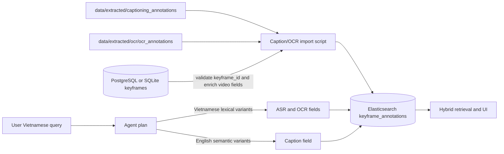

# Captioning and OCR Elasticsearch Ingest

## Purpose

`apps/backend/scripts/import_captioning_ocr_to_elasticsearch.py` imports frame-level captioning and OCR annotations into the existing `keyframe_annotations` Elasticsearch index. Each document is linked to a validated database keyframe, so a text hit can always be rendered and opened as a video/frame result by the backend.



## Indexed schema

The script writes one deterministic document per `(source_type, keyframe_id)`. Re-running it updates the same documents rather than duplicating them.

| Source | Elasticsearch field | Query language |
| --- | --- | --- |
| ASR | `asr_text`, `normalized_asr_text` | Vietnamese lexical query |
| OCR | `ocr_texts` | Vietnamese lexical query and exact visible text |
| Captioning | `caption` | English semantic rewrite produced for CLIP/Milvus |

The common fields include `video_id`, `video_code`, `keyframe_id`, `frame_idx`, `frame_seconds`, `timestamp_ms`, `extractor_version`, `model_name`, and `run_id`.

## Run with Docker

Run a dry check first:

```powershell
docker compose exec -T backend python scripts/import_captioning_ocr_to_elasticsearch.py --dry-run --batches L21
```

Import all batches and replace previous caption/OCR documents:

```powershell
docker compose exec -T backend python scripts/import_captioning_ocr_to_elasticsearch.py --replace-captioning --replace-ocr --refresh
```

Import only one source when required:

```powershell
docker compose exec -T backend python scripts/import_captioning_ocr_to_elasticsearch.py --skip-ocr --replace-captioning --refresh
docker compose exec -T backend python scripts/import_captioning_ocr_to_elasticsearch.py --skip-captioning --replace-ocr --refresh
```

The backend must be able to read the annotation folders through its mounted `/app/data` directory. The script exits before indexing if either requested folder is missing.

## Retrieval behavior

The agent now emits both modality weights (`visual`, `text`) and text-source weights (`asr`, `caption`, `ocr`). The source weights are normalized to one and become field boosts in Elasticsearch. For TRAKE, this decision is made independently for each event. This lets spoken facts favor ASR, visible scene/action requests favor captions, and visible names/numbers favor OCR.
