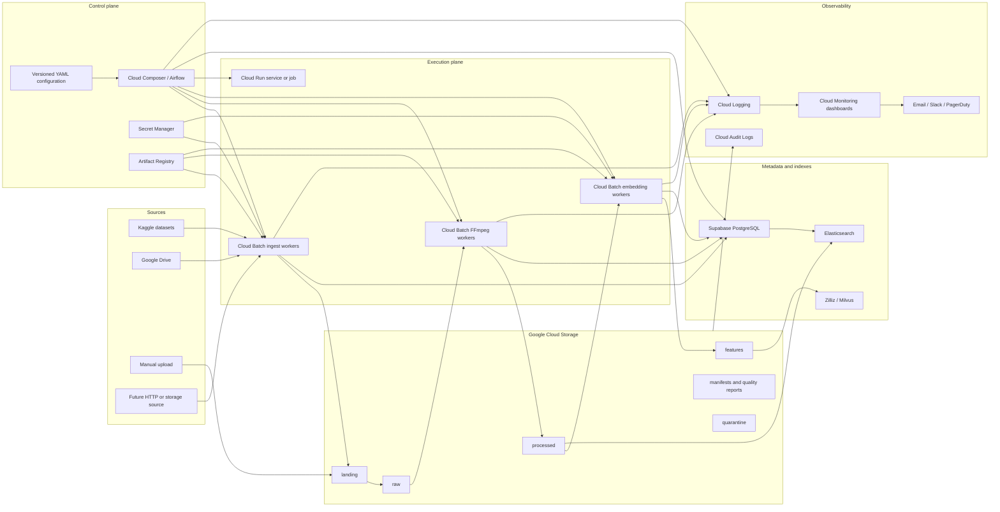
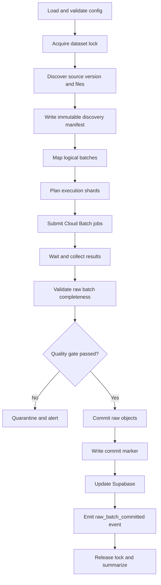
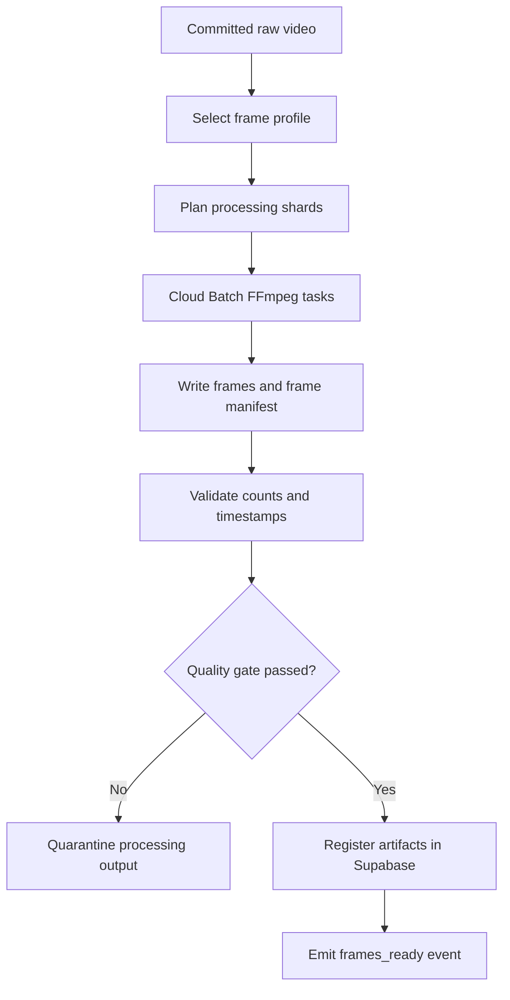

# Data Ingestion & Processing Pipeline Plan

**Project:** Multimodal Video Retrieval Data Platform  
**Primary cloud:** Google Cloud Platform  
**Primary object storage:** Google Cloud Storage  
**Relational metadata:** Supabase PostgreSQL  
**Vector index:** Zilliz Cloud / Milvus  
**Text index:** Elasticsearch  
**Document version:** 1.0  
**Date:** 2026-07-01

---

## 1. Executive summary

This document proposes a production-oriented, configuration-driven pipeline for ingesting large video datasets from multiple sources into Google Cloud Storage and subsequently processing the videos into frames, metadata, embeddings, and searchable text indexes.

Initial sources:

| Logical batch range | Source | Dataset reference |
|---|---|---|
| L21-L30 | Kaggle | `aresusayhi/ai-challenge-2025` |
| K01-K10 | Kaggle | `tuktuai/data-video-batch-2-1` |
| K11-K20 | Kaggle | `tuktuai/data-video-batch2-2` |

Future sources:

- Google Drive folders or individual files.
- Manual uploads through an internal upload service.
- Public HTTP/HTTPS sources.
- Other object storage providers.

The recommended architecture is:

- **Apache Airflow on Cloud Composer** for orchestration, scheduling, dependencies, retries, backfills, and operational UI.
- **Google Cloud Batch** for scalable, containerized transfer and video-processing workers.
- **Google Cloud Storage** as the authoritative storage layer for raw and derived binary artifacts.
- **Supabase PostgreSQL** as the authoritative relational catalog and workflow metadata store for datasets, videos, processing versions, and synchronization states.
- **Zilliz Cloud / Milvus** as a rebuildable vector search index.
- **Elasticsearch** as a rebuildable full-text search index.
- **Cloud Logging, Cloud Monitoring, Error Reporting, and alerting** for observability.
- **Artifact Registry** for versioned Docker images.
- **Secret Manager** for Kaggle, Supabase, Zilliz, Elasticsearch, and Google Drive credentials.
- **Terraform** for infrastructure as code.
- **Pub/Sub or Eventarc** for object-created events, especially manual uploads.

The central design principle is:

> GCS and Supabase are sources of truth. Zilliz and Elasticsearch are derived indexes that must be reproducible from versioned artifacts and metadata.

No distributed transaction should be attempted across GCS, PostgreSQL, Zilliz, and Elasticsearch. Instead, use immutable manifests, stable identifiers, idempotent writes, explicit state transitions, and an outbox/event-driven synchronization pattern.

---

## 2. Goals

### 2.1 Functional goals

1. Ingest large video datasets from Kaggle into GCS.
2. Add Google Drive and manual upload sources without redesigning the pipeline.
3. Process data in independently retryable batches such as `L21`, `L22`, `K01`, or smaller manifest shards.
4. Validate file integrity before publishing raw data.
5. Extract frames or keyframes with configurable FFmpeg profiles.
6. Store frame artifacts and processing metadata in a versioned layout.
7. Generate embedding files, import vectors into Zilliz, and record model lineage.
8. Index captions, transcripts, OCR, labels, and other text into Elasticsearch.
9. Store relational metadata and processing states in Supabase PostgreSQL.
10. Provide logs, metrics, dashboards, alerts, auditability, and operational runbooks.
11. Support backfill, replay, partial retry, reprocessing, and model-version migration.
12. Make all important runtime parameters configurable without editing pipeline code.

### 2.2 Non-goals

- Serving the final end-user search API.
- Training or selecting embedding models.
- Designing the ranking or reranking algorithm.
- Building a complete data annotation platform.
- Replacing Airflow's internal metadata database with Supabase.
- Treating Elasticsearch or Zilliz as primary data storage.

---

## 3. Core architectural principles

### 3.1 Immutable raw data

Objects in the `raw/` zone are immutable after validation and commit. A new source version creates a new object version or a new versioned path; it does not silently overwrite the old object.

### 3.2 Configuration-driven execution

Dataset references, batch rules, concurrency, disk size, machine type, extraction profile, retry count, and target prefixes are defined in version-controlled YAML files.

### 3.3 Manifest-first processing

Every ingestion run must produce an immutable manifest before downloading data. Workers process manifest shards, not ad hoc directory listings.

### 3.4 Idempotency

Re-running the same manifest must not duplicate videos, frames, vectors, or Elasticsearch documents.

### 3.5 Stable identifiers

All systems use the same identifiers:

- `dataset_id`
- `source_object_id`
- `video_id`
- `frame_id`
- `segment_id`
- `embedding_id`
- `run_id`
- `manifest_id`
- `processing_version`

### 3.6 Separation of storage and indexes

- GCS stores binary artifacts and bulk-import artifacts.
- Supabase stores relational metadata and lifecycle states.
- Zilliz stores vectors for similarity search.
- Elasticsearch stores searchable text documents.
- Indexes are disposable and rebuildable.

### 3.7 Independent pipeline stages

Ingestion, frame extraction, embedding, and indexing should be separate DAGs or workflows. A failure in Elasticsearch must not force re-downloading video data from Kaggle.

### 3.8 Observability by default

Every stage emits structured logs, metrics, state records, and validation reports with consistent correlation fields.

---

## 4. High-level architecture



---

## 5. Recommended technology stack

| Concern | Recommended technology | Purpose |
|---|---|---|
| Workflow orchestration | Cloud Composer / Apache Airflow | Scheduling, dependency management, retry, backfill, task mapping, UI |
| Batch execution | Google Cloud Batch | Provision and release VMs for transfer, FFmpeg, and embedding workloads |
| Small control services | Cloud Run | Upload API, event handler, manifest API, lightweight synchronization |
| Object storage | Google Cloud Storage | Raw videos, frames, manifests, reports, embedding files |
| Relational catalog | Supabase PostgreSQL | Datasets, source objects, videos, processing versions, statuses |
| Vector search | Zilliz Cloud / Milvus | Frame, clip, or video embeddings |
| Text search | Elasticsearch | Captions, transcripts, OCR, tags, descriptions |
| Event transport | Pub/Sub / Eventarc | Object-created notifications and outbox consumers |
| Logging | Cloud Logging | Centralized structured logs |
| Metrics/dashboard | Cloud Monitoring | Pipeline and infrastructure dashboards |
| Error aggregation | Error Reporting | Group repeated exceptions |
| Alert delivery | Cloud Monitoring alerting | Email, Slack webhook, PagerDuty |
| Secrets | Secret Manager | External credentials and API keys |
| Containers | Docker + Artifact Registry | Reproducible worker images |
| Infrastructure | Terraform | Reproducible GCP resources, IAM, monitoring |
| CI/CD | GitHub Actions or Cloud Build | Tests, image builds, DAG/config deployment |
| Video validation | FFprobe | Codec, duration, stream, corruption checks |
| Frame extraction | FFmpeg | Configurable frame and keyframe extraction |
| Data format | JSONL and Parquet | Manifests, validation reports, bulk imports |
| Lineage | OpenLineage-compatible Airflow integration, optional Marquez/DataHub | Dataset and job lineage |
| Application telemetry | OpenTelemetry, optional | Trace and metric correlation across services |

### 5.1 Why Google Cloud Batch instead of one permanent VM

Google Cloud Batch is preferable for large, intermittent workloads because it:

- Creates compute resources for each job.
- Supports task groups and parallel workers.
- Supports task retries and timeouts.
- Integrates with Cloud Logging.
- Can use Spot VMs for retryable processing.
- Avoids maintaining an idle VM.

Use a standard VM allocation for Kaggle or Drive transfer jobs when interruption would waste a large download. Use Spot VMs primarily for idempotent frame extraction or embedding tasks.

### 5.2 Cloud Run Jobs usage

Cloud Run Jobs are appropriate for small-to-medium tasks that fit their runtime and disk constraints. The main design should use Google Cloud Batch for:

- Very large archives.
- Large scratch-disk requirements.
- FFmpeg workloads.
- GPU embedding workloads.
- Long-running transfers.

---

## 6. Environment and project organization

For a production-style setup:

```text
organization/
├── project-video-platform-dev
├── project-video-platform-staging
└── project-video-platform-prod
```

At minimum, use separate GCP projects for development and production.

Recommended region policy:

1. Choose one primary GCP region.
2. Place GCS buckets, Batch jobs, Composer, Artifact Registry, and supporting services in the same or nearby region.
3. Create Zilliz and Supabase deployments in the closest available region.
4. Verify network egress implications before fixing the region.

Example placeholder:

```yaml
gcp:
  project_id: project-video-platform-dev
  region: asia-southeast1
  zone_preferences:
    - asia-southeast1-b
    - asia-southeast1-c
```

Do not hardcode the example region until Zilliz, Supabase, quotas, and organizational requirements are verified.

---

## 7. GCS bucket and prefix design

GCS uses object names and prefixes; normal "folders" are logical prefixes rather than traditional filesystem directories.

### 7.1 Recommended multi-bucket design

```text
gs://<project>-video-landing-<env>
gs://<project>-video-lake-<env>
gs://<project>-pipeline-control-<env>
gs://<project>-pipeline-archive-<env>
```

#### Landing bucket

Short-lived staging for:

- Manual uploads.
- Partially uploaded objects.
- Downloaded archives before validation.
- Temporary extraction outputs when direct upload is unsuitable.

#### Video lake bucket

Authoritative raw and derived data.

#### Pipeline control bucket

Protected manifests, configuration snapshots, validation reports, dead-letter manifests, and state exports.

#### Archive bucket

Optional long-retention log exports, audit exports, and backups.

### 7.2 Video lake layout

```text
gs://<project>-video-lake-<env>/
├── raw/
│   └── source=<source_type>/
│       └── dataset=<dataset_id>/
│           └── batch=<batch_id>/
│               └── source_version=<source_version>/
│                   └── video_id=<video_id>/
│                       ├── original.<ext>
│                       └── source_metadata.json
│
├── processed/
│   ├── frames/
│   │   └── dataset=<dataset_id>/
│   │       └── batch=<batch_id>/
│   │           └── profile=<frame_profile_version>/
│   │               └── video_id=<video_id>/
│   │                   ├── frame_000000001_ts_0000000000.jpg
│   │                   ├── frame_000000002_ts_0000001000.jpg
│   │                   └── frames_manifest.parquet
│   │
│   ├── keyframes/
│   │   └── dataset=<dataset_id>/
│   │       └── batch=<batch_id>/
│   │           └── profile=<keyframe_profile_version>/
│   │               └── video_id=<video_id>/
│   │
│   ├── frame_shards/
│   │   └── dataset=<dataset_id>/
│   │       └── batch=<batch_id>/
│   │           └── profile=<frame_profile_version>/
│   │               ├── shard-00000.tar
│   │               ├── shard-00001.tar
│   │               └── shard-index.parquet
│   │
│   ├── audio/
│   ├── transcripts/
│   ├── captions/
│   ├── ocr/
│   └── thumbnails/
│
├── features/
│   ├── embeddings/
│   │   └── modality=<image|video|text|audio>/
│   │       └── model=<model_name>/
│   │           └── model_version=<model_version>/
│   │               └── dataset=<dataset_id>/
│   │                   └── batch=<batch_id>/
│   │                       ├── part-00000.parquet
│   │                       ├── part-00001.parquet
│   │                       └── import_manifest.json
│   └── feature_metadata/
│
├── quarantine/
│   ├── source_download_failed/
│   ├── checksum_failed/
│   ├── invalid_video/
│   ├── schema_failed/
│   └── downstream_failed/
│
├── exports/
│   ├── zilliz/
│   └── elasticsearch/
│
└── tmp/
    └── run_id=<run_id>/
```

### 7.3 Pipeline control layout

```text
gs://<project>-pipeline-control-<env>/
├── configs/
│   ├── datasets/
│   ├── frame_profiles/
│   ├── embedding_profiles/
│   └── index_profiles/
├── manifests/
│   └── pipeline=<pipeline_name>/
│       └── run_date=<YYYY-MM-DD>/
│           └── run_id=<run_id>/
│               ├── discovered.jsonl
│               ├── planned.jsonl
│               ├── shards/
│               │   ├── shard-00000.jsonl
│               │   └── shard-00001.jsonl
│               └── manifest_summary.json
├── validation/
├── quality_reports/
├── checkpoints/
├── dead_letter/
├── lineage/
└── state_exports/
```

### 7.4 Landing layout

```text
gs://<project>-video-landing-<env>/
├── kaggle/
│   └── run_id=<run_id>/
├── google_drive/
│   └── run_id=<run_id>/
├── manual/
│   └── upload_session=<session_id>/
└── partial/
```

### 7.5 Storage policies

Recommended policies:

| Zone | Versioning | Lifecycle recommendation |
|---|---:|---|
| `raw/` | Yes | Retain; optionally move older data to colder storage |
| `processed/` | Optional | Retain current versions; delete superseded profiles after approval |
| `features/` | Optional | Rebuildable; retain active and rollback model versions |
| `tmp/` | No | Delete after 1-7 days |
| landing partial uploads | No | Delete incomplete objects after 1-3 days |
| manifests/config snapshots | Yes | Long retention |
| validation reports | Yes | Long enough for audit and reproducibility |
| quarantine | Yes | Review and expire after a defined period |

Additional controls:

- Enable uniform bucket-level access.
- Block public access.
- Use least-privilege IAM.
- Use object generation preconditions when committing data.
- Use checksum validation.
- Enable Cloud Audit Logs as required.
- Consider retention policies for raw datasets after requirements are stable.

---

## 8. Dataset source registry

Create a version-controlled registry file:

```yaml
# configs/datasets/video_sources.yaml

schema_version: 1

datasets:
  - dataset_id: l21_l30_ai_challenge_2025
    display_name: AI Challenge 2025 - L21 to L30
    source_type: kaggle
    enabled: true
    source:
      dataset_ref: aresusayhi/ai-challenge-2025
      dataset_url: https://www.kaggle.com/datasets/aresusayhi/ai-challenge-2025
    expected_batches:
      - L21
      - L22
      - L23
      - L24
      - L25
      - L26
      - L27
      - L28
      - L29
      - L30
    batch_detection:
      strategy: regex
      pattern: '(?i)(?:^|[/_.-])(L2[1-9]|L30)(?:[/_.-]|$)'
    include_patterns:
      - '**/*.mp4'
      - '**/*.avi'
      - '**/*.mov'
      - '**/*.mkv'
      - '**/*.zip'
    exclude_patterns:
      - '**/.DS_Store'
      - '**/__MACOSX/**'
    target_dataset_id: ai_challenge_2025
    priority: 100

  - dataset_id: k01_k10_data_video_batch_2_1
    display_name: Data Video Batch 2.1 - K01 to K10
    source_type: kaggle
    enabled: true
    source:
      dataset_ref: tuktuai/data-video-batch-2-1
      dataset_url: https://www.kaggle.com/datasets/tuktuai/data-video-batch-2-1
    expected_batches:
      - K01
      - K02
      - K03
      - K04
      - K05
      - K06
      - K07
      - K08
      - K09
      - K10
    batch_detection:
      strategy: regex
      pattern: '(?i)(?:^|[/_.-])(K0[1-9]|K10)(?:[/_.-]|$)'
    include_patterns:
      - '**/*.mp4'
      - '**/*.avi'
      - '**/*.mov'
      - '**/*.mkv'
      - '**/*.zip'
    target_dataset_id: data_video_batch_2_1
    priority: 100

  - dataset_id: k11_k20_data_video_batch_2_2
    display_name: Data Video Batch 2.2 - K11 to K20
    source_type: kaggle
    enabled: true
    source:
      dataset_ref: tuktuai/data-video-batch2-2
      dataset_url: https://www.kaggle.com/datasets/tuktuai/data-video-batch2-2
    expected_batches:
      - K11
      - K12
      - K13
      - K14
      - K15
      - K16
      - K17
      - K18
      - K19
      - K20
    batch_detection:
      strategy: regex
      pattern: '(?i)(?:^|[/_.-])(K1[1-9]|K20)(?:[/_.-]|$)'
    include_patterns:
      - '**/*.mp4'
      - '**/*.avi'
      - '**/*.mov'
      - '**/*.mkv'
      - '**/*.zip'
    target_dataset_id: data_video_batch_2_2
    priority: 100
```

Important:

- The discovery job must first list the actual Kaggle dataset files.
- The pipeline must not assume that the Kaggle internal folder layout matches the batch names.
- Any source object that cannot be mapped to one expected batch must be marked `UNMAPPED`, excluded from automatic publication, and shown in the quality dashboard.
- If names do not contain batch IDs, add an explicit mapping file.

Example explicit mapping:

```yaml
batch_mapping:
  - source_pattern: 'archive_part_01.zip'
    batch_id: K01
  - source_pattern: 'archive_part_02.zip'
    batch_id: K02
```

---

## 9. Runtime configuration

```yaml
# configs/pipelines/ingest_video.yaml

pipeline:
  name: ingest_video
  environment: dev
  schedule: '0 1 * * *'
  timezone: Asia/Ho_Chi_Minh
  max_active_runs: 1
  catchup: false

batch_planning:
  strategy: target_bytes
  target_batch_bytes: 21474836480  # 20 GiB
  max_files_per_shard: 100
  max_parallel_shards: 4
  preserve_logical_batch_boundary: true

download:
  scratch_disk:
    type: pd-balanced
    minimum_gb: 250
    size_multiplier_against_largest_archive: 2.5
  timeout_seconds: 43200
  chunk_size_mb: 64
  max_attempts: 4
  retry_backoff_seconds:
    - 30
    - 120
    - 600
    - 1800

upload:
  resumable: true
  checksum: crc32c
  use_generation_precondition: true
  max_parallel_uploads_per_worker: 4

validation:
  require_nonzero_size: true
  run_ffprobe: true
  require_video_stream: true
  minimum_duration_seconds: 0.1
  allowed_extensions:
    - mp4
    - avi
    - mov
    - mkv
  allowed_codecs: []
  fail_batch_on_unmapped_files: true
  fail_batch_on_checksum_error: true
  partial_success_allowed: false

publication:
  raw_immutable: true
  commit_marker_name: _SUCCESS.json

observability:
  structured_logging: true
  emit_custom_metrics: true
  log_sample_progress_every_seconds: 30
  alert_on_failed_files: true
  alert_on_duration_multiplier: 2.0
```

### 9.1 Safe runtime overrides

Airflow manual runs may allow a controlled set of overrides:

```json
{
  "dataset_id": "l21_l30_ai_challenge_2025",
  "logical_batches": ["L21", "L22"],
  "max_parallel_shards": 2,
  "force_rediscovery": false,
  "retry_failed_only": true
}
```

Do not allow arbitrary machine images, shell commands, bucket names, or secret names through `dag_run.conf`.

---

## 10. Repository structure

```text
video-data-platform/
├── dags/
│   ├── ingest_video_dag.py
│   ├── process_frames_dag.py
│   ├── generate_embeddings_dag.py
│   ├── sync_zilliz_dag.py
│   ├── sync_elasticsearch_dag.py
│   └── reconcile_indexes_dag.py
├── src/
│   ├── common/
│   │   ├── config.py
│   │   ├── ids.py
│   │   ├── logging.py
│   │   ├── metrics.py
│   │   ├── retries.py
│   │   └── storage.py
│   ├── sources/
│   │   ├── base.py
│   │   ├── kaggle.py
│   │   ├── google_drive.py
│   │   ├── manual_upload.py
│   │   └── http.py
│   ├── ingestion/
│   │   ├── discovery.py
│   │   ├── manifest.py
│   │   ├── planner.py
│   │   ├── downloader.py
│   │   ├── validator.py
│   │   ├── uploader.py
│   │   └── publisher.py
│   ├── processing/
│   │   ├── ffprobe_validator.py
│   │   ├── frame_extractor.py
│   │   ├── shard_writer.py
│   │   └── metadata_writer.py
│   ├── embeddings/
│   │   ├── encoder.py
│   │   ├── parquet_writer.py
│   │   └── zilliz_importer.py
│   ├── indexing/
│   │   ├── elastic_documents.py
│   │   ├── elastic_bulk.py
│   │   └── reconciliation.py
│   └── db/
│       ├── models.py
│       ├── repositories.py
│       ├── outbox.py
│       └── migrations/
├── configs/
│   ├── datasets/
│   ├── pipelines/
│   ├── frame_profiles/
│   ├── embedding_profiles/
│   └── elasticsearch/
├── docker/
│   ├── ingest.Dockerfile
│   ├── ffmpeg.Dockerfile
│   └── embedding.Dockerfile
├── terraform/
│   ├── environments/
│   └── modules/
├── tests/
│   ├── unit/
│   ├── integration/
│   └── fixtures/
├── scripts/
│   ├── trigger_backfill.py
│   ├── create_retry_manifest.py
│   ├── reconcile_gcs_supabase.py
│   └── rebuild_indexes.py
├── pyproject.toml
├── Makefile
└── README.md
```

---

## 11. Source adapter interface

All sources implement the same contract.

```python
from dataclasses import dataclass
from typing import Iterable, Protocol

@dataclass(frozen=True)
class SourceObject:
    source_type: str
    source_dataset_ref: str
    source_object_id: str
    source_path: str
    source_revision: str | None
    size_bytes: int | None
    checksum: str | None
    modified_at: str | None
    metadata: dict

class SourceAdapter(Protocol):
    def discover(self, source_config: dict) -> Iterable[SourceObject]:
        ...

    def download(
        self,
        source_object: SourceObject,
        local_path: str,
        checkpoint: dict | None,
    ) -> dict:
        ...

    def get_version(self, source_config: dict) -> str:
        ...
```

This abstraction permits new sources without changing the downstream stages.

---

## 12. Kaggle ingestion design

### 12.1 Authentication

Store Kaggle credentials in Secret Manager.

Recommended secret names:

```text
kaggle-credentials
kaggle-username
kaggle-api-token
```

Grant the Batch worker service account access only to the required secret versions.

Do not:

- Commit `kaggle.json`.
- Store credentials in Airflow variables as plain text.
- Print tokens in logs.
- Bake credentials into Docker images.

### 12.2 Discovery

The Kaggle adapter performs:

1. Retrieve dataset metadata and current dataset version.
2. List all files.
3. Record file names and sizes.
4. Apply include/exclude rules.
5. Resolve each file to a logical batch.
6. Compare against prior source revisions.
7. Create `SourceObject` records.
8. Write `discovered.jsonl`.
9. Insert or update discovery records in Supabase.

### 12.3 Download strategy

Kaggle downloads are client-mediated. The controlled Batch worker should use temporary local disk:

```text
Kaggle
  -> Batch worker scratch disk
  -> validate downloaded archive or file
  -> extract if required
  -> validate video
  -> resumable upload to GCS landing/raw
  -> delete scratch data
```

Download one Kaggle file or archive at a time where possible. Avoid downloading an entire large dataset as one opaque archive when per-file access is available.

Scratch disk sizing:

```text
required scratch =
  largest compressed source object
  + largest expanded object group
  + upload buffering
  + 20% safety margin
```

A practical initial rule:

```text
scratch_gb = max(250 GB, 2.5 x largest_archive_size)
```

### 12.4 Archive handling

For each archive:

1. Validate archive readability.
2. List entries before extraction.
3. Reject unsafe paths such as `../`.
4. Extract only allowed video extensions.
5. Detect duplicates.
6. Do not publish the archive contents until all required validation succeeds.
7. Preserve the original archive only if it is required for audit or source reconstruction.

### 12.5 Initial dataset runs

Recommended execution order:

```text
Run 1: discovery only for all three Kaggle datasets
Run 2: ingest L21 only
Run 3: ingest K01 only
Run 4: ingest one medium-size batch
Run 5: ingest remaining batches with limited concurrency
```

Do not start all `L21-L30` and `K01-K20` batches concurrently before validating:

- Kaggle API behavior.
- Scratch disk sizing.
- Average transfer throughput.
- GCS upload performance.
- File naming rules.
- Quotas and costs.

---

## 13. Google Drive ingestion design

### 13.1 Source representation

```yaml
- dataset_id: partner_drive_videos
  source_type: google_drive
  source:
    folder_id: '<drive-folder-id>'
    shared_drive_id: '<optional-shared-drive-id>'
    recursive: true
  batch_detection:
    strategy: parent_folder
```

### 13.2 Authentication

Preferred options:

1. A service account with the required folder or Shared Drive access.
2. Domain-wide delegation only when organizationally required.
3. User OAuth for personal Drive sources where service-account sharing is not suitable.

Store credential material in Secret Manager.

### 13.3 Discovery metadata

Record:

- Drive file ID.
- File name.
- MIME type.
- Size.
- Modified time.
- MD5 checksum when available.
- Parent folder IDs.
- `canDownload` capability.
- Shared Drive ID.
- Source revision/version information.

Use Drive file ID as the durable source object ID; do not rely only on the file name.

### 13.4 Download

Use the Drive API media download for blob files and chunked downloads. Support byte-range or chunk-level retry where available.

Flow:

```text
Drive file
  -> Batch worker
  -> chunked download/checkpoint
  -> local validation
  -> resumable GCS upload
  -> checksum/size validation
  -> raw commit
```

The same manifest, validation, publication, and retry model used for Kaggle applies to Drive.

---

## 14. Manual upload design

Users must never upload directly into `raw/`.

Recommended flow:

```text
Upload UI/API
  -> create upload_session in Supabase
  -> generate V4 signed upload URL
  -> client uploads to landing/manual/upload_session=<id>/
  -> GCS OBJECT_FINALIZE event
  -> Pub/Sub/Eventarc handler registers source object
  -> scheduled or triggered Airflow ingestion
  -> validation
  -> commit into raw/
```

### 14.1 Upload session fields

```text
upload_session_id
requested_by
expected_filename
expected_content_type
expected_size_bytes
optional_client_checksum
landing_uri
expires_at
status
created_at
completed_at
```

### 14.2 Event delivery behavior

GCS notifications may be delivered more than once. The event handler must be idempotent using:

```text
bucket + object_name + object_generation
```

A duplicate event must not create a duplicate video.

---

## 15. Manifest specification

### 15.1 Manifest record

```json
{
  "manifest_schema_version": 1,
  "manifest_id": "mft_20260701_01J...",
  "run_id": "ingest_20260701_01J...",
  "dataset_id": "l21_l30_ai_challenge_2025",
  "logical_batch_id": "L21",
  "source_type": "kaggle",
  "source_dataset_ref": "aresusayhi/ai-challenge-2025",
  "source_dataset_version": "version-or-observed-timestamp",
  "source_object_id": "kaggle-file-reference",
  "source_path": "path/inside/dataset/video.mp4",
  "source_revision": "source-version",
  "source_size_bytes": 123456789,
  "source_checksum": null,
  "video_id": "vid_7a58...",
  "target_raw_uri": "gs://.../raw/source=kaggle/dataset=.../batch=L21/source_version=.../video_id=.../original.mp4",
  "status": "PLANNED",
  "attempt": 0,
  "config_hash": "sha256:...",
  "created_at": "2026-07-01T01:00:00Z"
}
```

### 15.2 Manifest rules

- Immutable after creation.
- Written to GCS before workers start.
- Hash recorded in Supabase.
- Sharded by target bytes and file count.
- Each shard independently retryable.
- A retry creates a new retry manifest referencing the original records.
- Never edit a failed manifest in place.

### 15.3 Batch planning

Use both business batches and execution shards.

Example:

```text
Logical batch L21
├── execution shard L21-000: 18.4 GiB, 12 files
├── execution shard L21-001: 19.8 GiB, 10 files
└── execution shard L21-002: 7.2 GiB, 4 files
```

The business batch remains `L21`. The execution shards control parallelism and retries.

---

## 16. Stable ID design

### 16.1 Video ID

Recommended deterministic input:

```text
source_type
+ source_dataset_ref
+ source_object_id
+ source_revision or strong source checksum
```

Conceptually:

```text
video_id = UUIDv5(namespace, canonical_source_identity)
```

or:

```text
video_id = SHA256(canonical_source_identity)
```

### 16.2 Frame ID

```text
frame_id = SHA256(
  video_id
  + timestamp_ms
  + frame_profile_version
)
```

### 16.3 Segment ID

```text
segment_id = SHA256(
  video_id
  + start_ms
  + end_ms
  + segmentation_profile_version
)
```

### 16.4 Embedding ID

```text
embedding_id = SHA256(
  entity_id
  + modality
  + model_name
  + model_version
  + preprocessing_version
)
```

Stable IDs enable idempotent upsert into Supabase, Zilliz, and Elasticsearch.

---

## 17. Supabase PostgreSQL data model

Supabase stores domain metadata, not raw log lines.

### 17.1 Recommended tables

```text
datasets
source_objects
ingestion_runs
ingestion_tasks
videos
video_artifacts
processing_runs
frame_profiles
frames or keyframes
embedding_versions
embedding_entities
text_documents
index_sync_state
outbox_events
quality_results
pipeline_incidents
```

### 17.2 Source-of-truth boundaries

| Data | Source of truth |
|---|---|
| Original video bytes | GCS `raw/` |
| Frames and derived media | GCS `processed/` |
| Bulk embedding files | GCS `features/` |
| Dataset/video relationships | Supabase |
| Processing state and lineage | Supabase |
| Operational log lines | Cloud Logging |
| Searchable vectors | Zilliz, rebuildable |
| Searchable text | Elasticsearch, rebuildable |
| Immutable run manifests | GCS control bucket |

### 17.3 Example schema

```sql
create type ingestion_status as enum (
  'DISCOVERED',
  'PLANNED',
  'DOWNLOADING',
  'DOWNLOADED',
  'VALIDATING',
  'UPLOADING',
  'COMMITTED',
  'SKIPPED',
  'QUARANTINED',
  'FAILED',
  'CANCELLED'
);

create table datasets (
  id uuid primary key,
  dataset_key text unique not null,
  display_name text not null,
  source_type text not null,
  source_ref text not null,
  active boolean not null default true,
  created_at timestamptz not null default now(),
  updated_at timestamptz not null default now()
);

create table source_objects (
  id uuid primary key,
  dataset_id uuid not null references datasets(id),
  source_object_key text not null,
  source_revision text,
  source_path text not null,
  logical_batch_id text,
  size_bytes bigint,
  source_checksum text,
  discovered_at timestamptz not null,
  metadata jsonb not null default '{}'::jsonb,
  unique(dataset_id, source_object_key, source_revision)
);

create table ingestion_runs (
  id uuid primary key,
  pipeline_name text not null,
  manifest_id text not null,
  config_hash text not null,
  status text not null,
  started_at timestamptz,
  ended_at timestamptz,
  total_objects integer not null default 0,
  successful_objects integer not null default 0,
  failed_objects integer not null default 0,
  total_bytes bigint not null default 0,
  error_summary jsonb
);

create table videos (
  id uuid primary key,
  source_object_id uuid not null references source_objects(id),
  dataset_id uuid not null references datasets(id),
  logical_batch_id text,
  raw_gcs_uri text not null,
  raw_gcs_generation bigint,
  crc32c text,
  size_bytes bigint not null,
  duration_ms bigint,
  width integer,
  height integer,
  fps numeric,
  video_codec text,
  audio_codec text,
  status text not null,
  committed_at timestamptz,
  metadata jsonb not null default '{}'::jsonb
);

create table video_artifacts (
  id uuid primary key,
  video_id uuid not null references videos(id),
  artifact_type text not null,
  profile_version text not null,
  gcs_uri text not null,
  gcs_generation bigint,
  checksum text,
  size_bytes bigint,
  status text not null,
  created_at timestamptz not null default now(),
  unique(video_id, artifact_type, profile_version, gcs_uri)
);

create table index_sync_state (
  entity_type text not null,
  entity_id uuid not null,
  target_system text not null,
  target_version text not null,
  status text not null,
  attempt_count integer not null default 0,
  last_error jsonb,
  updated_at timestamptz not null default now(),
  primary key(entity_type, entity_id, target_system, target_version)
);

create table outbox_events (
  id uuid primary key,
  aggregate_type text not null,
  aggregate_id uuid not null,
  event_type text not null,
  payload jsonb not null,
  created_at timestamptz not null default now(),
  published_at timestamptz,
  attempt_count integer not null default 0,
  last_error text
);
```

### 17.4 Frame metadata scale warning

Extracting one frame per second from many hours of video can create millions of frame records.

Recommended options:

1. Store one row per keyframe in Supabase.
2. Store full frame manifests as Parquet in GCS.
3. Store only frames used by search or annotations in Supabase.
4. If every frame must be relationally queryable, partition tables by dataset or date and load with PostgreSQL bulk operations.

Do not insert millions of frames using one HTTP request per row.

---

## 18. Ingestion DAG design



### 18.1 Airflow tasks

```text
validate_config
acquire_dataset_lock
resolve_source_version
discover_source_objects
persist_source_objects
write_discovery_manifest
map_logical_batches
plan_manifest_shards
submit_batch_jobs
monitor_batch_jobs
collect_worker_results
run_batch_quality_gate
commit_raw_batch
write_success_marker
update_catalog
publish_outbox_events
emit_run_metrics
send_summary
release_dataset_lock
```

### 18.2 Locking

Only one active ingestion run should modify the same:

```text
dataset_id + source_version + logical_batch_id
```

Use a PostgreSQL advisory lock, lock table, or equivalent idempotency record.

### 18.3 Dynamic task mapping

Airflow should create one mapped task per execution shard rather than one task per video. Thousands of tiny Airflow tasks can overload the scheduler and metadata database.

---

## 19. Worker ingestion lifecycle

For each manifest record:

```text
PLANNED
  -> DOWNLOADING
  -> DOWNLOADED
  -> VALIDATING
  -> UPLOADING
  -> COMMITTED
```

Failure branches:

```text
DOWNLOADING -> FAILED_RETRYABLE
VALIDATING  -> QUARANTINED
UPLOADING   -> FAILED_RETRYABLE
COMMITTING  -> FAILED_RECONCILIATION_REQUIRED
```

Worker algorithm:

1. Read the manifest shard from GCS.
2. Fetch secrets.
3. Check whether the target object already exists.
4. If it exists with matching identity and checksum, mark `SKIPPED_ALREADY_COMMITTED`.
5. Download source object to scratch storage.
6. Validate source size and archive structure.
7. Extract allowed video files if required.
8. Run FFprobe validation.
9. Compute local CRC32C and optional SHA-256.
10. Upload using resumable upload.
11. Verify GCS object metadata and checksum.
12. Write per-file result JSONL.
13. Update Supabase task state in batches.
14. Delete local scratch data.
15. Emit final shard metrics.

---

## 20. Raw data validation and publication

### 20.1 File-level validation

- Size is greater than zero.
- Extension is allowed.
- MIME type is plausible.
- FFprobe can open the file.
- At least one video stream exists.
- Duration is valid.
- Resolution is valid.
- Container and codec metadata are captured.
- Checksum matches the expected or computed value.
- Uploaded GCS object size matches the local object.
- GCS CRC32C validation succeeds.

### 20.2 Batch-level validation

- All expected logical batches are present.
- All manifest entries have a terminal state.
- No unmapped files remain unless explicitly approved.
- Successful bytes match planned bytes within defined rules.
- Duplicate video IDs are zero.
- Duplicate content checksums are reviewed.
- Failed file count is zero for atomic batches, or below a configured threshold for partial batches.
- Commit marker is absent before publication.
- Supabase counts match manifest counts.

### 20.3 Commit pattern

Upload initially to a run-scoped staging prefix:

```text
raw_staging/run_id=<run_id>/...
```

After validation, either:

1. Copy objects to final immutable paths and write a commit marker; or
2. Upload directly to final immutable content-addressed paths but mark them unpublished in Supabase until the batch quality gate passes.

Recommended for this project:

- Upload directly to deterministic final object paths using generation preconditions.
- Keep `videos.status = VALIDATING`.
- Change to `COMMITTED` only after the batch quality gate.
- Write:

```text
raw/.../batch=L21/source_version=<version>/_SUCCESS.json
```

Example commit marker:

```json
{
  "run_id": "ingest_20260701_01J...",
  "manifest_id": "mft_20260701_01J...",
  "dataset_id": "l21_l30_ai_challenge_2025",
  "batch_id": "L21",
  "source_version": "source-version",
  "object_count": 26,
  "total_bytes": 123456789012,
  "manifest_sha256": "...",
  "committed_at": "2026-07-01T05:12:00Z"
}
```

---

## 21. Frame extraction pipeline

Frame extraction is a separate workflow triggered only for committed raw videos.



### 21.1 Frame profile configuration

```yaml
# configs/frame_profiles/fps_1_v1.yaml

profile_id: fps_1_v1
profile_version: 1
mode: fixed_fps
fps: 1
image_format: jpg
jpeg_quality: 2
resize:
  enabled: false
  width: null
  height: null
preserve_aspect_ratio: true
output:
  individual_frames: true
  create_parquet_manifest: true
  create_webdataset_shards: false
validation:
  maximum_timestamp_gap_multiplier: 1.5
  minimum_frames: 1
```

Keyframe profile:

```yaml
profile_id: scene_keyframes_v1
profile_version: 1
mode: scene_change
scene_threshold: 0.35
minimum_interval_seconds: 1.0
maximum_interval_seconds: 10.0
image_format: jpg
```

### 21.2 Output choice

Individual frame objects are convenient for online retrieval but can create many small objects.

Recommended dual strategy:

- Store selected or searchable frames individually.
- Store dense frame sequences as WebDataset/TAR shards or another sequential format for ML training.
- Always write a Parquet manifest mapping frame IDs and timestamps to object locations.

### 21.3 Frame manifest fields

```text
frame_id
video_id
frame_index
timestamp_ms
profile_version
gcs_uri
gcs_generation
width
height
checksum
extraction_run_id
created_at
```

### 21.4 FFmpeg worker isolation

Use one video per task for large videos or a small group of short videos per task. The worker should write outputs to a temporary run prefix and publish only after validating the expected frame count.

---

## 22. Embedding pipeline

### 22.1 Embedding stages

```text
frames_ready
  -> choose embedding profile
  -> load frame manifest
  -> distributed inference
  -> write versioned Parquet/Numpy files to GCS
  -> validate row count and dimensions
  -> register embedding version in Supabase
  -> bulk import to Zilliz
  -> run sample search checks
  -> mark Zilliz sync complete
```

### 22.2 Embedding profile

```yaml
profile_id: clip_vit_b32_v1
modality: image
model_name: ViT-B-32
model_provider: open_clip
model_weights: laion2b_s34b_b79k
model_version: 1
embedding_dimension: 512
normalize: true
metric_type: COSINE
batch_size: 256
precision: fp16
preprocessing_version: open_clip_default_v1
target_collection_alias: frame_embeddings_current
```

### 22.3 GCS first, Zilliz second

Always persist embeddings to GCS before importing them into Zilliz:

```text
features/embeddings/
  modality=image/
  model=ViT-B-32/
  model_version=1/
  dataset=.../
  batch=L21/
  part-00000.parquet
```

This enables:

- Reimport without recomputing embeddings.
- Index rebuild.
- Model comparison.
- Row-count validation.
- Audit and reproducibility.

### 22.4 Zilliz import strategy

- Use insert/upsert for small continuous updates.
- Use bulk import for large batch loads.
- Use stable `embedding_id` or `frame_id` as the primary key.
- Keep the collection schema explicit.
- Record collection name, alias, index parameters, metric, dimension, and import job ID in Supabase.
- Validate imported entity count.
- Run a small query/search smoke test.
- Use versioned collections and aliases for migrations.

Example:

```text
frame_embeddings_v1_202607
frame_embeddings_v2_202609

alias:
frame_embeddings_current -> frame_embeddings_v2_202609
```

Do not overwrite an active collection in place during a major model migration.

---

## 23. Elasticsearch indexing pipeline

### 23.1 Indexed document types

Potential documents:

- Video metadata.
- Clip or segment captions.
- Speech transcripts.
- OCR text.
- Human annotations.
- Tags and labels.
- Source descriptions.
- Batch and dataset metadata.

Do not index raw frame bytes.

### 23.2 Stable document ID

Use:

```text
_id = segment_id
```

or another deterministic entity ID.

### 23.3 Bulk indexing

Use the Elasticsearch Bulk API with:

- Bounded batch size.
- Per-item error parsing.
- Retry for transient failures.
- Dead-letter records for permanent mapping failures.
- Idempotent `index` or `update` operations.
- Explicit mappings rather than unrestricted dynamic fields.

### 23.4 Versioned index and alias

```text
video_text_v1_202607
video_text_v2_202609

read alias:
video_text_current

write alias:
video_text_write
```

For mapping changes:

1. Create a new index.
2. Bulk index from Supabase/GCS artifacts.
3. Validate counts and test queries.
4. Atomically switch the read alias.
5. Retain the previous index for rollback.
6. Delete it only after the rollback period.

---

## 24. Cross-system consistency

A single ACID transaction across GCS, Supabase, Zilliz, and Elasticsearch is not practical.

### 24.1 Recommended state model

Supabase contains independent status fields:

```text
raw_status
frame_status
embedding_artifact_status
zilliz_sync_status
text_artifact_status
elasticsearch_sync_status
```

Example:

```text
raw_status = COMMITTED
frame_status = COMPLETE
embedding_artifact_status = COMPLETE
zilliz_sync_status = FAILED_RETRYABLE
elasticsearch_sync_status = COMPLETE
```

The raw and processed data remain valid even if Zilliz is temporarily unavailable.

### 24.2 Outbox pattern

Within the same PostgreSQL transaction that updates a committed entity, insert an event into `outbox_events`.

Example events:

```text
raw_video_committed
raw_batch_committed
frames_ready
embedding_artifacts_ready
text_documents_ready
zilliz_import_completed
elasticsearch_index_completed
```

A publisher sends these events to Pub/Sub or allows Airflow consumers to poll the outbox.

### 24.3 Reconciliation jobs

Schedule periodic reconciliation:

```text
GCS raw objects vs Supabase videos
GCS frame manifests vs Supabase artifacts
GCS embedding rows vs Zilliz entity counts
Supabase text documents vs Elasticsearch document counts
Outbox unpublished events vs target status
```

Reconciliation must produce a report and optionally a repair manifest.

---

## 25. Structured logging

### 25.1 Required correlation fields

Every log entry should include as many of these as applicable:

```text
environment
pipeline_name
dag_id
run_id
task_id
batch_job_id
batch_task_index
manifest_id
manifest_shard_id
dataset_id
logical_batch_id
source_type
source_object_id
video_id
frame_profile_version
embedding_profile_id
attempt
stage
status
error_code
retryable
```

### 25.2 Example log

```json
{
  "severity": "INFO",
  "message": "Video uploaded and checksum verified",
  "environment": "prod",
  "pipeline_name": "ingest_video",
  "run_id": "ingest_20260701_01J...",
  "manifest_id": "mft_20260701_01J...",
  "manifest_shard_id": "L21-001",
  "dataset_id": "l21_l30_ai_challenge_2025",
  "logical_batch_id": "L21",
  "source_type": "kaggle",
  "source_object_id": "path/video_001.mp4",
  "video_id": "vid_7a58...",
  "stage": "UPLOAD_GCS",
  "status": "SUCCESS",
  "attempt": 1,
  "bytes": 2938472938,
  "duration_seconds": 143.2,
  "throughput_mib_per_second": 19.57,
  "gcs_uri": "gs://.../original.mp4",
  "crc32c": "...",
  "timestamp": "2026-07-01T03:12:10Z"
}
```

### 25.3 Error log

```json
{
  "severity": "ERROR",
  "message": "Source download failed after retry",
  "pipeline_name": "ingest_video",
  "run_id": "ingest_20260701_01J...",
  "manifest_shard_id": "K03-002",
  "dataset_id": "k01_k10_data_video_batch_2_1",
  "logical_batch_id": "K03",
  "source_type": "kaggle",
  "source_object_id": "archive_part_03.zip",
  "stage": "SOURCE_DOWNLOAD",
  "status": "FAILED",
  "attempt": 4,
  "error_code": "SOURCE_CONNECTION_RESET",
  "retryable": true,
  "exception_type": "ConnectionResetError",
  "checkpoint_bytes": 4294967296,
  "next_action": "CREATE_RETRY_MANIFEST",
  "timestamp": "2026-07-01T04:01:23Z"
}
```

### 25.4 Logging rules

- Log JSON, not unstructured print statements.
- Do not log secrets or signed URLs.
- Do not log full vector arrays.
- Do not log every frame at INFO level.
- Emit periodic aggregate progress logs.
- Use DEBUG only for development or sampled diagnostics.
- Export long-term logs to BigQuery or GCS only when required.

---

## 26. Metrics

### 26.1 Pipeline metrics

```text
ingestion_runs_total
ingestion_runs_failed_total
ingestion_files_planned
ingestion_files_committed
ingestion_files_failed
ingestion_bytes_planned
ingestion_bytes_committed
ingestion_duration_seconds
ingestion_throughput_bytes_per_second
ingestion_retry_total
ingestion_unmapped_files
ingestion_quarantined_files
ingestion_data_freshness_seconds
ingestion_queue_age_seconds
```

### 26.2 Processing metrics

```text
frame_jobs_total
frame_jobs_failed_total
frames_generated_total
frame_extraction_duration_seconds
frames_per_second
invalid_video_total
embedding_entities_generated
embedding_inference_duration_seconds
zilliz_import_pending
zilliz_import_failed
elasticsearch_documents_pending
elasticsearch_bulk_item_failures
```

### 26.3 Infrastructure metrics

```text
Batch task CPU utilization
Batch task memory utilization
scratch disk utilization
network receive/transmit bytes
Composer scheduler health
Composer worker utilization
Pub/Sub oldest unacked message age
Cloud Run error rate
Supabase connection errors
Elasticsearch cluster health
Zilliz import job status
```

### 26.4 Metric implementation

Options:

1. Cloud Logging log-based metrics for status counts and errors.
2. Cloud Monitoring custom metrics for throughput, queue depth, and quality.
3. OpenTelemetry metrics for shared worker libraries.
4. Provider APIs for Zilliz, Supabase, and Elasticsearch health checks.

Avoid high-cardinality metric labels such as `video_id`. Put high-cardinality identifiers in logs, not metrics.

---

## 27. Dashboard design

### 27.1 Executive pipeline dashboard

Display:

- Latest run status by pipeline.
- Last successful ingestion time.
- Data freshness.
- Files and bytes committed in the last 24 hours.
- Failed and quarantined objects.
- Total raw storage growth.
- Downstream synchronization backlog.

### 27.2 Ingestion operations dashboard

Display:

- Active runs.
- Planned, running, successful, failed, and skipped shards.
- Progress by `L21-L30` and `K01-K20`.
- Current throughput.
- Retry counts.
- Largest and slowest files.
- Unmapped objects.
- Download versus upload duration.
- Kaggle/Drive API error counts.

### 27.3 Data quality dashboard

Display:

- FFprobe failures.
- Zero-byte files.
- Checksum mismatches.
- Duplicate checksums.
- Missing logical batches.
- Unexpected codecs or resolutions.
- Frame count anomalies.
- Embedding dimension mismatch.
- Supabase/GCS count mismatch.
- Zilliz and Elasticsearch reconciliation mismatch.

### 27.4 Downstream index dashboard

Display:

- Embedding artifact rows ready.
- Zilliz import jobs running/failed/completed.
- Zilliz expected versus actual entity count.
- Elasticsearch pending documents.
- Bulk item failure rate.
- Index alias version.
- Reconciliation age.

### 27.5 Infrastructure dashboard

Display:

- Composer scheduler and worker health.
- Batch task CPU, memory, and disk.
- Worker startup latency.
- Network throughput.
- Pub/Sub backlog.
- Cloud Run request and error rates.
- Cost labels by pipeline and environment.

---

## 28. Alerts

### 28.1 Warning

- Throughput falls below the baseline for 15 minutes.
- A shard retries more than twice.
- Pipeline duration exceeds 1.5 times its rolling baseline.
- Unmapped source objects are detected.
- Scratch disk utilization exceeds 80%.
- Zilliz or Elasticsearch backlog exceeds an agreed threshold.

### 28.2 Error

- A logical batch fails after retries.
- Any checksum mismatch occurs.
- Any committed raw object is missing from Supabase.
- Frame extraction quality gate fails.
- Elasticsearch bulk permanent failure rate exceeds threshold.
- Zilliz import job fails.
- Pipeline does not start within the schedule window.

### 28.3 Critical

- Multiple consecutive ingestion runs fail.
- Raw objects are unexpectedly deleted or overwritten.
- Supabase is unavailable and publication state cannot be recorded.
- GCS permission or billing failure blocks all ingestion.
- Large-scale reconciliation mismatch occurs.
- Audit log indicates unauthorized access or policy change.

### 28.4 Alert content

Every alert should contain:

```text
environment
pipeline
run_id
dataset_id
logical_batch_id
failed stage
failed object or shard count
error summary
retry state
Airflow run link
Cloud Logging query link
Batch job link
runbook link
recommended first action
```

---

## 29. Retry and failure handling

### 29.1 Retryable errors

- Network timeout.
- Connection reset.
- Temporary source API failure.
- HTTP 429 or temporary 5xx.
- GCS transient upload failure.
- Spot VM preemption.
- Temporary Elasticsearch or Zilliz unavailability.

Use exponential backoff with jitter.

### 29.2 Non-retryable errors

- Invalid credentials.
- Permission denied.
- Invalid archive.
- Unsupported video.
- Corrupt video.
- Schema mismatch.
- Embedding dimension mismatch.
- Elasticsearch mapping rejection.
- Configuration validation failure.

These require quarantine, configuration correction, or data repair.

### 29.3 Retry manifest

Example:

```json
{
  "retry_manifest_id": "retry_20260702_01J...",
  "parent_manifest_id": "mft_20260701_01J...",
  "reason": "Retry failed source downloads",
  "records": [
    {
      "source_object_id": "archive_part_03.zip",
      "logical_batch_id": "K03",
      "previous_error_code": "SOURCE_CONNECTION_RESET",
      "previous_attempts": 4
    }
  ]
}
```

Do not rerun successful objects unless explicitly forcing a revalidation.

---

## 30. Quarantine design

A quarantined record must include:

```text
source object identity
run and manifest IDs
logical batch
failure stage
failure code
exception summary
validation report URI
original or staged GCS URI
recommended remediation
quarantined_at
review status
reviewer
```

Quarantine states:

```text
NEW
UNDER_REVIEW
SOURCE_REPLACEMENT_REQUIRED
CONFIG_CHANGE_REQUIRED
REPROCESS_APPROVED
IGNORED_WITH_REASON
RESOLVED
```

---

## 31. Operational runbooks

### 31.1 Kaggle download failure

1. Open Airflow mapped task.
2. Filter Cloud Logging by `run_id`, `manifest_shard_id`, and `source_object_id`.
3. Confirm whether the error is authentication, rate limiting, network, or missing source file.
4. Check source dataset version.
5. If transient, create a retry manifest.
6. If the source file changed, run discovery and create a new manifest.
7. Never modify the original manifest.

### 31.2 GCS checksum mismatch

1. Mark object `QUARANTINED`.
2. Do not publish the logical batch.
3. Delete or retain the incorrect object according to incident policy.
4. Re-download the source object.
5. Recompute local checksum.
6. Upload with a new generation precondition.
7. Validate GCS checksum and size.
8. Record resolution in `quality_results`.

### 31.3 Invalid video

1. Save FFprobe output.
2. Move or reference the object under `quarantine/invalid_video/`.
3. Mark video as invalid in Supabase.
4. Determine whether the problem exists at the source.
5. Do not repeatedly retry a deterministic corruption error.
6. Allow a documented exception only if downstream tools support it.

### 31.4 Frame extraction mismatch

1. Compare expected versus actual duration and frame count.
2. Inspect FFmpeg stderr.
3. Check variable frame rate and timestamp behavior.
4. Retry using the same profile only if the failure was transient.
5. For deterministic profile problems, create a new profile version.
6. Do not overwrite the previous profile output.

### 31.5 Zilliz import failure

1. Verify embedding files and schema.
2. Confirm dimensions and primary keys.
3. Check import job status.
4. Retry import without recomputing embeddings when GCS artifacts are valid.
5. Run entity count and sample search validation.
6. Update `index_sync_state`.

### 31.6 Elasticsearch mapping failure

1. Parse per-item Bulk API errors.
2. Send permanent failures to dead-letter storage.
3. Correct document generation or create a new mapping/index version.
4. Reindex only failed documents or rebuild a versioned index.
5. Switch alias only after validation.

---

## 32. Security and IAM

### 32.1 Service accounts

Recommended dedicated service accounts:

```text
sa-airflow-orchestrator
sa-batch-ingest-worker
sa-batch-ffmpeg-worker
sa-batch-embedding-worker
sa-upload-api
sa-event-handler
sa-ci-deployer
sa-monitoring-reader
```

Do not use one broad service account for all jobs.

### 32.2 Example permission boundaries

#### Ingest worker

- Read specific Kaggle/Drive secrets.
- Write landing and raw prefixes.
- Read manifest shards.
- Write task result reports.
- Insert or update only required Supabase records through a controlled connection.
- Write logs and metrics.

#### FFmpeg worker

- Read committed raw objects.
- Write only selected processed prefixes.
- Read frame profile configuration.
- No access to Kaggle credentials.

#### Embedding worker

- Read processed frame data.
- Write embedding artifacts.
- Read model and Zilliz credentials.
- No permission to delete raw videos.

#### Upload API

- Create signed URLs for landing only.
- No direct raw write permission.
- Create upload-session records.

### 32.3 Secrets

Store:

```text
Kaggle API credentials
Google Drive credentials or delegated configuration
Supabase database URL and role credentials
Zilliz API key
Elasticsearch API key
Slack or PagerDuty webhook
```

Use separate secrets per environment. Rotate credentials and audit access.

### 32.4 Network

- Prefer private networking where supported.
- Restrict database access.
- Configure Zilliz and Elasticsearch network controls.
- Limit egress destinations where practical.
- Do not expose GCS buckets publicly.
- Use signed URLs for time-limited user access.

---

## 33. Data quality rules

### 33.1 Source and raw rules

```text
source_object_id is not null
logical_batch_id is recognized
source path is unique within a source revision
planned size is nonnegative
downloaded bytes match source metadata when available
GCS size matches local size
GCS CRC32C is valid
video can be opened by FFprobe
video has at least one video stream
duration > configured minimum
raw path matches naming convention
```

### 33.2 Frame rules

```text
every frame references one committed video
timestamp is within video duration
frame IDs are unique
frame manifest row count matches output count
dimensions are valid
profile version is recorded
no output is published before success marker
```

### 33.3 Embedding rules

```text
embedding dimension equals profile dimension
no NaN or infinity values
normalization property matches profile
entity ID exists
embedding row count matches source frame/segment selection
model version and preprocessing version are present
```

### 33.4 Elasticsearch rules

```text
document ID is deterministic
required text fields exist
timestamps are parseable
dataset and batch filters are present
bulk item failures are parsed individually
document count is reconcilable
```

---

## 34. Data lineage

Every derived artifact must be traceable through:

```text
source dataset version
-> source object
-> raw GCS object generation
-> frame extraction run and profile
-> frame artifact
-> embedding run, model, and preprocessing version
-> Zilliz collection/import job
-> text-generation run
-> Elasticsearch index version
```

Minimum lineage fields:

```text
git_commit_sha
container_image_digest
config_hash
manifest_id
run_id
source_revision
input_gcs_generation
processing_profile_version
model_name
model_version
output_gcs_generation
created_at
```

Airflow can emit OpenLineage-compatible events later, but these fields should exist from the first implementation.

---

## 35. Container images

Recommended images:

```text
video-ingest-worker:<git-sha>
video-ffmpeg-worker:<git-sha>
video-embedding-worker:<git-sha>
video-index-worker:<git-sha>
```

Pin:

- Python version.
- FFmpeg version.
- Kaggle client version.
- Google client libraries.
- Model library versions.
- CUDA and driver compatibility for GPU workers.

Use image digests in production Batch job definitions where possible.

---

## 36. CI/CD

### 36.1 Pull request checks

- Python formatting and linting.
- Type checking.
- Unit tests.
- Config schema validation.
- DAG import tests.
- Terraform validation.
- Container build test.
- Security and dependency scan.
- Synthetic small-video integration test.

### 36.2 Deployment flow

```text
merge to main
  -> build versioned container images
  -> push to Artifact Registry
  -> deploy DAGs and configuration to dev
  -> run synthetic pipeline
  -> promote exact image digest and config commit to staging
  -> approval
  -> promote to production
```

Do not rebuild a different image during promotion; promote the same immutable digest.

---

## 37. Infrastructure as code

Terraform should manage:

- GCS buckets.
- Lifecycle rules.
- Uniform access and public-access prevention.
- Service accounts and IAM.
- Secret Manager secret containers.
- Artifact Registry.
- Pub/Sub topics and subscriptions.
- Cloud Run services/jobs.
- Cloud Batch-related service accounts and permissions.
- Cloud Composer environment.
- Cloud Monitoring dashboards.
- Alert policies.
- Log sinks.
- Budget alerts.
- Network configuration.

Database migrations should be managed separately with a migration tool such as Alembic, Flyway, or a Supabase migration workflow.

---

## 38. Cost controls

1. Use Batch so compute exists only during jobs.
2. Use Spot VMs for idempotent processing tasks.
3. Avoid excessive Airflow task counts.
4. Limit frame extraction rate until storage growth is measured.
5. Use keyframes where one-frame-per-second extraction is unnecessary.
6. Store dense frames in shards for training workloads.
7. Apply lifecycle deletion to temporary prefixes.
8. Keep GCS, Batch, Zilliz, and other services geographically close.
9. Tag resources with:
   - `environment`
   - `pipeline`
   - `dataset`
   - `team`
   - `cost_center`
10. Add budget alerts before scaling all batches.
11. Benchmark CPU versus GPU embedding throughput and cost.
12. Do not assume nighttime execution is automatically cheaper; savings usually come from Spot capacity or workload scheduling choices.

---

## 39. Phased implementation plan

### Phase 0: Foundation

Deliverables:

- GCP development project.
- GCS landing, lake, and control buckets.
- IAM service accounts.
- Secret Manager setup.
- Artifact Registry.
- Terraform baseline.
- Supabase schema migration framework.
- Structured logging library.

Acceptance:

- A test container can read a manifest, write a test object, log to Cloud Logging, and update a test Supabase record.

### Phase 1: Kaggle discovery and manifest

Deliverables:

- Kaggle source adapter.
- Dataset registry for all three sources.
- Discovery-only Airflow DAG.
- Immutable manifest format.
- Batch classification report.
- Unmapped-file report.

Acceptance:

- All Kaggle files are listed.
- Every selected file is mapped to one of `L21-L30` or `K01-K20`, or explicitly reported as unmapped.
- Re-running discovery is idempotent.

### Phase 2: Single-batch ingestion

Deliverables:

- Cloud Batch ingest worker.
- Scratch disk handling.
- Download, archive extraction, FFprobe validation, resumable upload.
- GCS checksum validation.
- Supabase run/task/video records.
- `L21` and `K01` pilot runs.

Acceptance:

- Failed files can be retried independently.
- Re-running a successful manifest does not duplicate objects.
- Raw commit marker is generated only after quality success.

### Phase 3: Observability

Deliverables:

- Cloud Monitoring dashboards.
- Log-based metrics.
- Alert policies.
- Run summary notifications.
- Operational runbooks.
- Reconciliation report.

Acceptance:

- A forced failure generates an actionable alert.
- Operators can locate the failed source object from the alert.
- Dashboard counts match manifest counts.

### Phase 4: Full Kaggle backfill

Deliverables:

- Controlled ingestion of `L21-L30`.
- Controlled ingestion of `K01-K20`.
- Performance and cost report.
- Final tuning of batch size, worker concurrency, machine type, and disk size.

Acceptance:

- All approved batches are committed or explicitly quarantined.
- GCS/Supabase reconciliation is clean.
- No unexplained unmapped files remain.

### Phase 5: Frame extraction

Deliverables:

- FFmpeg Batch worker.
- Versioned frame profiles.
- Frame manifests.
- Keyframe and fixed-FPS modes.
- Processing dashboard.

Acceptance:

- Reprocessing with a new profile does not overwrite old outputs.
- Frame count and timestamp quality checks pass.
- Failed videos can be retried independently.

### Phase 6: Embeddings and Zilliz

Deliverables:

- Embedding profiles.
- Versioned GCS embedding artifacts.
- Zilliz collection schema and aliases.
- Bulk import job.
- Count and search validation.
- Reconciliation job.

Acceptance:

- Zilliz can be rebuilt from GCS embedding artifacts.
- Stable IDs match Supabase entities.
- A failed import does not require recomputing embeddings.

### Phase 7: Elasticsearch

Deliverables:

- Document schema.
- Versioned index templates and aliases.
- Bulk indexing worker.
- Dead-letter handling.
- Reconciliation and reindex workflow.

Acceptance:

- Mapping changes are deployed with a new versioned index.
- Alias switching supports rollback.
- Bulk item failures are visible and retryable.

### Phase 8: Google Drive and manual upload

Deliverables:

- Drive source adapter.
- Upload API and signed URLs.
- Landing event handler.
- Source registration.
- Shared validation/publication workflow.

Acceptance:

- A Drive file and a manually uploaded file follow the same manifest and raw commit process as Kaggle data.
- Duplicate object events do not create duplicate videos.

---

## 40. Initial rollout checklist

### Infrastructure

- [ ] Create development GCP project.
- [ ] Enable required APIs.
- [ ] Create GCS buckets.
- [ ] Configure lifecycle policies.
- [ ] Configure public-access prevention.
- [ ] Create service accounts.
- [ ] Configure IAM.
- [ ] Create Artifact Registry.
- [ ] Create Secret Manager secrets.
- [ ] Deploy Composer.
- [ ] Configure Cloud Logging and Monitoring.
- [ ] Configure budget alerts.

### Data and configuration

- [ ] Add the three Kaggle dataset definitions.
- [ ] Run discovery-only jobs.
- [ ] Review actual file names and sizes.
- [ ] Confirm batch mapping.
- [ ] Calculate largest archive and scratch disk requirements.
- [ ] Confirm required storage capacity.
- [ ] Define raw retention policy.
- [ ] Define one initial frame profile.
- [ ] Define one initial embedding profile.

### Pipeline

- [ ] Implement source adapter interface.
- [ ] Implement Kaggle adapter.
- [ ] Implement manifest schema.
- [ ] Implement deterministic IDs.
- [ ] Implement Batch worker.
- [ ] Implement FFprobe validation.
- [ ] Implement resumable GCS upload.
- [ ] Implement Supabase repositories.
- [ ] Implement retry manifest.
- [ ] Implement quarantine report.
- [ ] Implement dashboards and alerts.

### Pilot

- [ ] Ingest one small source file.
- [ ] Force a transient download failure.
- [ ] Force an invalid-video failure.
- [ ] Retry only failed records.
- [ ] Re-run a successful manifest.
- [ ] Verify no duplicate GCS object or Supabase row.
- [ ] Ingest `L21`.
- [ ] Ingest `K01`.
- [ ] Review performance and cost before scaling.

---

## 41. Recommended minimum viable production stack

If the full architecture is too expensive initially, keep the same interfaces and reduce managed components:

| Full target | Lower-cost initial option |
|---|---|
| Cloud Composer | Self-managed Airflow on one VM or Docker Compose for development |
| Google Cloud Batch | One Compute Engine VM with systemd/cron for first pilot |
| Pub/Sub events | Scheduled landing-bucket scan |
| OpenLineage platform | Lineage columns in Supabase and manifests |
| Multiple GCP projects | Separate buckets and service accounts in one project |

However, retain these non-negotiable features from the first version:

- Immutable manifest.
- Deterministic IDs.
- Structured logging.
- File-level status.
- Checksums.
- FFprobe validation.
- Retry failed records only.
- Versioned configuration.
- Raw/processed/features/quarantine separation.
- GCS and Supabase source-of-truth boundaries.
- Rebuildable Zilliz and Elasticsearch indexes.

---

## 42. Final recommended workflow

```text
1. Airflow reads a versioned dataset configuration.
2. The source adapter discovers the current Kaggle/Drive/manual source objects.
3. The pipeline assigns stable source and video IDs.
4. It writes an immutable discovery manifest.
5. It maps source objects into logical batches such as L21 or K01.
6. It creates execution shards based on bytes and file count.
7. Airflow submits one Google Cloud Batch job per shard group.
8. Workers download to controlled scratch storage.
9. Workers validate archives and videos with checksums and FFprobe.
10. Workers upload with GCS resumable uploads and generation preconditions.
11. Batch-level quality gates validate completeness.
12. The pipeline commits raw metadata in Supabase and writes a GCS success marker.
13. An outbox event triggers or schedules frame extraction.
14. FFmpeg workers produce versioned frame artifacts and manifests.
15. Embedding workers produce versioned Parquet files in GCS.
16. Valid embedding files are bulk imported into a versioned Zilliz collection.
17. Captions, transcripts, OCR, and metadata are bulk indexed into a versioned Elasticsearch index.
18. Reconciliation jobs compare GCS, Supabase, Zilliz, and Elasticsearch.
19. Cloud Logging and Cloud Monitoring expose logs, metrics, dashboards, and alerts.
20. Operators retry only failed shards or entities through immutable retry manifests.
```

---

## 43. Official reference documentation

- Kaggle official CLI: https://github.com/Kaggle/kaggle-cli
- Cloud Storage uploads and resumable uploads: https://cloud.google.com/storage/docs/uploads
- Cloud Storage data validation and checksums: https://cloud.google.com/storage/docs/data-validation
- Cloud Storage for large data transfers: https://cloud.google.com/storage/docs/working-with-big-data
- Cloud Storage signed URLs: https://cloud.google.com/storage/docs/access-control/signing-urls-with-helpers
- Cloud Storage Pub/Sub notifications: https://cloud.google.com/storage/docs/pubsub-notifications
- Google Cloud Batch overview: https://cloud.google.com/batch/docs/get-started
- Google Cloud Batch retries: https://cloud.google.com/batch/docs/automate-task-retries
- Google Cloud Batch logging: https://cloud.google.com/batch/docs/analyze-job-using-logs
- Cloud Composer monitoring: https://cloud.google.com/composer/docs/composer-3/monitor-environments
- Cloud Composer Airflow logs: https://cloud.google.com/composer/docs/composer-2/view-logs
- Secret Manager best practices: https://cloud.google.com/secret-manager/docs/best-practices
- Artifact Registry Docker images: https://cloud.google.com/artifact-registry/docs/docker
- Google Drive API downloads: https://developers.google.com/workspace/drive/api/guides/manage-downloads
- Supabase PostgreSQL connection guide: https://supabase.com/docs/guides/database/connecting-to-postgres
- Zilliz data import: https://docs.zilliz.com/docs/import-data-via-sdks
- Elasticsearch Bulk API: https://www.elastic.co/docs/api/doc/elasticsearch/operation/operation-bulk

---

## 44. Key decisions to finalize before production

1. Primary GCP region.
2. Development versus production project split.
3. Raw data retention period.
4. Whether original Kaggle archives must also be retained.
5. Fixed-FPS versus keyframe extraction as the default.
6. Whether every frame needs a Supabase row.
7. Initial embedding model and dimension.
8. Zilliz cluster region and collection strategy.
9. Elasticsearch deployment and index mappings.
10. Partial-batch publication policy.
11. Alert destinations and on-call ownership.
12. Maximum monthly cost and concurrency limits.
