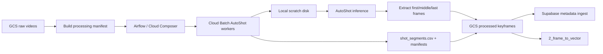

# 1. Video to Frame Cloud Plan - Trích xuất keyframe bằng AutoShot từ GCS

## 1. Mục tiêu

Tài liệu này mô tả kế hoạch xây dựng pipeline trích xuất frame ảnh từ video đã upload lên Google Cloud Storage bằng AutoShot, dựa trên thuật toán trong notebook `notebooks/data processing/get-keyframe-autoshot.ipynb`.

Pipeline cần biến dữ liệu video thô trên GCS thành:

- Ảnh keyframe đại diện cho từng shot: `first`, `middle`, `last`.
- File metadata `shot_segments.csv` tương thích với ingestion/backend hiện tại.
- Manifest xử lý để retry, audit, kiểm tra chất lượng và nối tiếp sang bước `2_frame_to_vector`.

Phạm vi tài liệu này chỉ bao gồm bước:

```text
GCS raw videos
  -> AutoShot shot boundary detection
  -> shot segments
  -> first/middle/last keyframes
  -> GCS processed keyframes + shot_segments.csv
```

## 2. Bối cảnh hiện tại

Repo hiện đã có pipeline upload Kaggle data lên GCS qua:

- `configs/data_ingestion_sources.yaml`
- `scripts/upload_kaggle_to_gcs.py`
- `dags/data_ingestion_kaggle.py`

Raw object path hiện đang theo dạng:

```text
gs://<bucket>/raw/source=kaggle/
  dataset=<dataset_id>/
  source_version=<source_version>/
  batch=<batch_id>/
  <relative_video_path>
```

Ví dụ dataset/batch:

- `dataset=ai_challenge_2025`, batch `L21` đến `L30`
- `dataset=data_video_batch_2_1`, batch `K01` đến `K10`
- `dataset=data_video_batch2_2`, batch `K11` đến `K20`

Backend schema hiện dùng các entity chính:

- `videos`
- `shots`
- `keyframes`

Vì vậy output của pipeline cloud phải giữ được các định danh ổn định:

```text
video_id    = L30_V001
shot_id     = L30_V001_S0000
keyframe_id = L30_V001_F000037
```

## 3. Thuật toán AutoShot cần giữ nguyên

Notebook `get-keyframe-autoshot.ipynb` đang làm các bước chính sau.

### 3.1 Chuẩn bị model

Notebook clone repo:

```text
https://github.com/wentaozhu/AutoShot
```

Model được import:

```python
from supernet_flattransf_3_8_8_8_13_12_0_16_60 import TransNetV2Supernet
```

Checkpoint:

```text
ckpt_0_200_0.pth
```

Khi đưa lên cloud, không nên clone GitHub ở runtime. Nên bake source AutoShot và dependencies vào Docker image, còn checkpoint đặt trong GCS hoặc bake vào image nếu version đã cố định.

### 3.2 Predict boundary score

Logic cần giữ:

1. Đọc video bằng `utils.get_frames(video_path)` từ AutoShot.
2. Frame input cho model được resize về `48x27 RGB`.
3. Chia batch bằng `utils.get_batches(frames)`.
4. Mỗi batch có shape ban đầu `[T, H, W, C]`, với `T = 100`.
5. Chuyển sang shape model cần:

```text
[B, C, T, H, W]
```

6. Chạy model, lấy `one_hot_logits`.
7. Dùng `sigmoid` để ra xác suất boundary.
8. Chỉ lấy vùng giữa `prob[25:75]` của mỗi batch 100 frame.
9. Ghép toàn bộ score và cắt về đúng `num_frames`.

Pseudo-code:

```python
scores = []
for batch in get_batches(frames):
    x = batch.transpose((3, 0, 1, 2))
    x = x[np.newaxis, ...]
    logits = model(torch.from_numpy(x).float().to(device))
    one_hot_logits = logits[0] if isinstance(logits, tuple) else logits
    prob = torch.sigmoid(one_hot_logits[0]).cpu().numpy().squeeze()
    scores.append(prob[25:75])

scores = np.concatenate(scores)[:len(frames)]
```

### 3.3 Convert boundary thành shot

Thông số mặc định từ notebook:

```text
threshold = 0.296
min_shot_len = 5
```

Boundary được lấy bằng:

```python
boundary_frames = np.where(scores > threshold)[0]
```

Sau đó chuyển thành shot:

```text
boundary_frames = [20, 60]
shots = [
  [0, 20],
  [21, 60],
  [61, 99],
]
```

Các shot ngắn hơn `min_shot_len` bị bỏ để giảm nhiễu. Nếu không detect được shot nào, coi toàn bộ video là một shot.

### 3.4 Lưu 3 frame đại diện

Với mỗi shot `[start, end]`, lưu:

```text
first  = start
middle = (start + end) // 2
last   = end
```

Lưu ý quan trọng: AutoShot predict trên frame resize nhỏ, nhưng ảnh output phải đọc lại từ video gốc bằng OpenCV để giữ chất lượng.

Tên file ảnh giữ giống notebook:

```text
shot_0000_first_f000000.jpg
shot_0000_middle_f000037.jpg
shot_0000_last_f000074.jpg
```

## 4. Kiến trúc cloud đề xuất



Thành phần khuyến nghị:

| Thành phần | Vai trò |
| --- | --- |
| GCS | Lưu raw video, output keyframe, CSV, manifest, logs |
| Cloud Batch | Chạy worker AutoShot theo shard video |
| Cloud Composer / Airflow | Điều phối theo dataset/batch/profile, retry, backfill |
| Docker image | Đóng gói AutoShot, PyTorch, FFmpeg, OpenCV, Google SDK |
| Supabase PostgreSQL | Lưu metadata `videos`, `shots`, `keyframes` |
| Cloud Logging | Log theo `run_id`, `video_id`, `batch_id`, `profile_version` |

## 5. GCS layout output

Đề xuất tạo profile version rõ ràng để có thể reprocess mà không ghi đè output cũ.

```text
gs://<bucket>/processed/keyframes/
  dataset=<dataset_id>/
  batch=<batch_id>/
  profile=autoshot_v1/
  video_id=<video_id>/
    shot_0000_first_f000000.jpg
    shot_0000_middle_f000037.jpg
    shot_0000_last_f000074.jpg
    frames_manifest.jsonl
```

Metadata cấp batch/run:

```text
gs://<bucket>/processed/keyframes_manifests/
  dataset=<dataset_id>/
  batch=<batch_id>/
  profile=autoshot_v1/
  run_id=<run_id>/
    processing_manifest.jsonl
    shot_segments.csv
    errors.jsonl
    summary.json
    _SUCCESS
```

Nếu muốn tương thích chặt hơn với demo/backend hiện tại, có thể tạo thêm layout phẳng:

```text
gs://<bucket>/keyframes/<video_id>/<image_file>.jpg
```

Nhưng layout source-of-truth vẫn nên là `processed/keyframes/.../profile=autoshot_v1/...`.

## 6. Output contract

### 6.1 `shot_segments.csv`

Giữ các cột từ notebook và bổ sung các cột cloud cần thiết:

| Cột | Ý nghĩa |
| --- | --- |
| `dataset_id` | Dataset logic, ví dụ `ai_challenge_2025` |
| `batch_id` | Batch logic, ví dụ `L30` |
| `video_id` | ID video ổn định, ví dụ `L30_V001` |
| `video_name` | Tên file video gốc |
| `video_gcs_uri` | URI video raw trên GCS |
| `video_gcs_generation` | Generation của object raw đã xử lý |
| `shot_id` | ID shot, ví dụ `L30_V001_S0000` |
| `shot_id_local` | Số shot từ AutoShot, ví dụ `0` |
| `shot_start_frame` | Frame bắt đầu shot |
| `shot_end_frame` | Frame kết thúc shot |
| `shot_start_sec` | Thời điểm bắt đầu shot |
| `shot_end_sec` | Thời điểm kết thúc shot |
| `frame_type` | `first`, `middle`, `last` |
| `frame_idx` | Index frame được trích |
| `frame_sec` | Thời điểm frame theo giây |
| `keyframe_id` | ID keyframe, ví dụ `L30_V001_F000037` |
| `image_rel_path` | `<video_id>/<image_file>.jpg` |
| `image_gcs_uri` | URI ảnh output trên GCS |
| `image_storage_key` | Object key trong bucket |
| `boundary_threshold` | Ngưỡng AutoShot đã dùng |
| `min_shot_len` | Min shot length đã dùng |
| `saved` | Ảnh có lưu/upload thành công không |
| `fps` | FPS theo OpenCV |
| `total_frames_opencv` | Tổng frame theo OpenCV |
| `profile_version` | Ví dụ `autoshot_v1` |
| `run_id` | Run xử lý |

### 6.2 Manifest mỗi video

Mỗi row trong `processing_manifest.jsonl`:

```json
{
  "run_id": "20260707T160000Z_ab12cd34",
  "dataset_id": "ai_challenge_2025",
  "batch_id": "L30",
  "video_id": "L30_V001",
  "video_name": "L30_V001.mp4",
  "input_gcs_uri": "gs://bucket/raw/source=kaggle/dataset=ai_challenge_2025/source_version=kaggle_current/batch=L30/Video_L30_a/video/L30_V001.mp4",
  "input_generation": "1234567890",
  "output_prefix": "processed/keyframes/dataset=ai_challenge_2025/batch=L30/profile=autoshot_v1/video_id=L30_V001/",
  "profile_version": "autoshot_v1",
  "threshold": 0.296,
  "min_shot_len": 5,
  "status": "planned"
}
```

## 7. Pipeline stages

### Stage 0: Chuẩn bị profile và artifact

Deliverables:

- Docker image `video-autoshot-worker:<git-sha>`.
- AutoShot source được bake vào image.
- Checkpoint `ckpt_0_200_0.pth` được đặt ở GCS:

```text
gs://<bucket>/models/autoshot/ckpt_0_200_0.pth
```

- File config profile:

```yaml
profile_version: autoshot_v1
algorithm: autoshot
checkpoint_uri: gs://<bucket>/models/autoshot/ckpt_0_200_0.pth
threshold: 0.296
min_shot_len: 5
frame_types:
  - first
  - middle
  - last
image_format: jpg
image_quality: 95
```

Acceptance:

- Worker chạy được một video local nhỏ.
- Output CSV có đủ `shot_id`, `keyframe_id`, `image_gcs_uri`.

### Stage 1: Build processing manifest từ GCS raw

Input:

- GCS raw prefix đã upload.
- Manifest từ `scripts/upload_kaggle_to_gcs.py`, nếu có.
- Hoặc list object theo prefix `raw/source=kaggle/dataset=.../batch=...`.

Logic:

1. List video object theo dataset/batch.
2. Lọc extension `.mp4`, `.avi`, `.mov`, `.mkv`, `.webm`.
3. Tạo `video_id` từ file stem hoặc mapping chuẩn.
4. Ghi `input_gcs_uri`, object size, generation, checksum nếu có.
5. Chia shard theo số video hoặc tổng dung lượng.

Output:

```text
processing_manifest.jsonl
shards/shard-00000.jsonl
shards/shard-00001.jsonl
summary.json
```

Acceptance:

- Không có video trùng `video_id` trong cùng dataset/batch/profile.
- Manifest giữ `input_generation` để đảm bảo reproducibility.

### Stage 2: Submit Cloud Batch jobs

Airflow DAG nhận params:

```text
dataset_id
batch_id
profile_version
run_id
manifest_uri
max_videos
dry_run
```

Mỗi Cloud Batch task xử lý một shard manifest.

Khuyến nghị runtime:

- CPU worker có thể chạy được, nhưng GPU worker sẽ nhanh hơn nếu quota cho phép.
- Scratch disk phải đủ chứa video lớn nhất + output frames + file tạm.
- Không stream video trực tiếp từ GCS vào OpenCV/FFmpeg; download về scratch local trước để ổn định và dễ retry.

### Stage 3: Worker xử lý từng video

Với mỗi video:

1. Download video raw từ GCS về scratch:

```text
/work/input/<video_id>.<ext>
```

2. Download checkpoint nếu chưa có local cache:

```text
/work/models/ckpt_0_200_0.pth
```

3. Validate video bằng FFprobe/OpenCV:

- Có video stream.
- Duration > 0.
- Frame count đọc được hoặc chấp nhận fallback.

4. Load AutoShot model một lần cho worker.
5. Chạy `predict_boundary_scores`.
6. Tạo `boundary_frames` với threshold `0.296`.
7. Convert thành shot với `min_shot_len=5`.
8. Dùng OpenCV đọc video gốc và lưu `first/middle/last`.
9. Ghi metadata row cho từng keyframe.
10. Upload ảnh và per-video manifest lên GCS.
11. Ghi trạng thái `success` hoặc `failed`.

Pseudo command:

```bash
python scripts/extract_autoshot_keyframes_gcs.py \
  --manifest-shard gs://<bucket>/processed/keyframes_manifests/.../shards/shard-00000.jsonl \
  --checkpoint-uri gs://<bucket>/models/autoshot/ckpt_0_200_0.pth \
  --output-bucket <bucket> \
  --profile-version autoshot_v1 \
  --threshold 0.296 \
  --min-shot-len 5
```

### Stage 4: Commit output

Worker không nên ghi thẳng `_SUCCESS` cấp batch. Thay vào đó:

1. Mỗi worker ghi result shard:

```text
results/shard-00000.result.json
results/shard-00000.shot_segments.csv
results/shard-00000.errors.jsonl
```

2. Airflow merge shard results thành:

```text
shot_segments.csv
errors.jsonl
summary.json
```

3. Nếu quality gate pass, ghi:

```text
_SUCCESS
```

Acceptance:

- `_SUCCESS` chỉ xuất hiện khi tất cả video planned đã thành công hoặc các lỗi đã được quarantine có chủ đích.
- Re-run cùng `run_id` không tạo duplicate row.

### Stage 5: Sync metadata sang Supabase

Sau khi `_SUCCESS`, chạy job import metadata.

Mapping:

| CSV | Supabase |
| --- | --- |
| `video_id`, `video_name`, `fps`, `total_frames_opencv`, `video_gcs_uri` | `videos` |
| `shot_id`, `video_id`, `shot_start_frame`, `shot_end_frame`, `shot_start_sec`, `shot_end_sec`, `boundary_threshold` | `shots` |
| `keyframe_id`, `video_id`, `shot_id`, `frame_idx`, `frame_sec`, `frame_type`, `image_rel_path`, `image_storage_key` | `keyframes` |

Idempotency:

- Upsert theo primary key.
- Không tạo keyframe trùng `(video_id, frame_idx)`.
- Nếu reprocess với profile mới, cần quyết định schema có lưu nhiều profile hay không. Nếu schema hiện tại chỉ giữ một bộ keyframe active, nên import profile mới vào môi trường/staging trước khi switch.

## 8. File/script cần triển khai

Đề xuất thêm các file sau:

```text
configs/frame_extraction_profiles.yaml
scripts/extract_autoshot_keyframes_gcs.py
dags/video_to_frame_autoshot_gcs.py
docker/autoshot-worker.Dockerfile
```

Trách nhiệm:

| File | Vai trò |
| --- | --- |
| `configs/frame_extraction_profiles.yaml` | Khai báo checkpoint, threshold, min shot length, output layout |
| `scripts/extract_autoshot_keyframes_gcs.py` | Worker đọc manifest shard, tải video, chạy AutoShot, upload frame |
| `dags/video_to_frame_autoshot_gcs.py` | DAG build manifest, submit Batch, merge result, quality gate |
| `docker/autoshot-worker.Dockerfile` | Image có PyTorch, FFmpeg, OpenCV, AutoShot code |

## 9. Quality gates

Các kiểm tra bắt buộc trước khi ghi `_SUCCESS`:

```text
planned_videos = succeeded_videos + failed_videos + quarantined_videos
failed_videos = 0 hoặc đã có lý do quarantine
mọi row shot_segments.csv có saved = true
số ảnh JPG trên GCS = số row saved=true
không có duplicate keyframe_id
không có duplicate (video_id, frame_idx)
shot_start_frame <= frame_idx <= shot_end_frame
shot_start_sec <= frame_sec <= shot_end_sec
image_gcs_uri tồn tại
profile_version khớp config
```

Nên có sample visual QA:

- Với mỗi batch, chọn ngẫu nhiên 5 video.
- Kiểm tra số shot, vài ảnh `first/middle/last`, duration và timestamp.
- So sánh số keyframe/video với notebook Kaggle cũ nếu cùng tập dữ liệu.

## 10. Retry và failure handling

Retry được thực hiện ở mức video, không retry cả batch nếu chỉ một video lỗi.

Lỗi retryable:

- GCS download timeout.
- GCS upload timeout.
- Worker preempted.
- Lỗi tạm thời khi đọc checkpoint.

Lỗi non-retryable:

- Video corrupt.
- Unsupported codec.
- AutoShot không đọc được frame nào.
- Checkpoint sai shape hoặc thiếu file.

Quarantine record cần có:

```text
run_id
dataset_id
batch_id
video_id
input_gcs_uri
input_generation
stage
error_code
error_message
failed_at
recommended_action
```

## 11. Idempotency và versioning

Nguyên tắc:

- Raw video không bị sửa trong bước này.
- Output nằm dưới `profile=autoshot_v1`.
- Reprocess thay đổi threshold/min_shot_len phải tạo profile mới, ví dụ `autoshot_v2_threshold_035`.
- Upload ảnh nên dùng generation precondition nếu ghi vào prefix final.
- Có thể ghi vào prefix tạm theo `run_id`, sau đó promote bằng manifest nếu cần kiểm soát chặt hơn.

Profile version nên được coi là một phần lineage:

```text
raw object generation
  -> autoshot worker image digest
  -> checkpoint URI + checksum
  -> threshold/min_shot_len
  -> output keyframe object generation
```

## 12. Observability

Log fields tối thiểu:

```text
run_id
dataset_id
batch_id
video_id
profile_version
input_gcs_uri
input_generation
stage
duration_ms
num_frames
num_boundaries
num_shots
num_keyframes
status
error
```

Metrics nên có:

- Videos processed/succeeded/failed.
- Frames/keyframes produced.
- Processing seconds per video.
- GCS bytes downloaded/uploaded.
- GPU/CPU utilization nếu có.
- Error count theo `error_code`.

## 13. Rollout plan

### Phase 1: Local/cloud worker smoke test

Mục tiêu:

- Chạy một video nhỏ từ GCS.
- Upload output lên prefix test.
- So sánh output với notebook trên cùng video.

Acceptance:

- Có ảnh JPG trên GCS.
- Có `shot_segments.csv`.
- `saved=true` cho toàn bộ row.

### Phase 2: Pilot một batch nhỏ

Mục tiêu:

- Chạy subset 5-10 video của `L30` hoặc `K01`.
- Test retry và quality gate.
- Kiểm tra chi phí, thời gian, dung lượng output.

Acceptance:

- `_SUCCESS` được ghi sau quality gate.
- Supabase import được `videos`, `shots`, `keyframes`.
- Backend media lookup đọc được `image_storage_key`.

### Phase 3: Full batch

Mục tiêu:

- Chạy full `L30` trước vì notebook cũ đã từng xử lý 96 video ở `Video_L30_a`.
- Sau đó scale ra các batch còn lại.

Acceptance:

- Count keyframes hợp lý so với notebook cũ.
- Không có duplicate keyframe.
- Các bước `2_frame_to_vector` đọc được output cloud.

### Phase 4: Production hardening

Mục tiêu:

- Tự động hóa DAG.
- Dashboard và alert.
- Retry manifest.
- Quarantine workflow.
- Profile version migration.

## 14. Rủi ro và quyết định cần chốt

| Vấn đề | Rủi ro | Quyết định đề xuất |
| --- | --- | --- |
| Clone AutoShot runtime | Phụ thuộc internet/GitHub, thiếu reproducibility | Bake AutoShot vào Docker image |
| Checkpoint lưu ở notebook/Kaggle | Cloud worker không truy cập được | Upload checkpoint lên GCS hoặc bake vào image |
| GCS path raw chưa đồng nhất | Manifest sai hoặc thiếu video | Dùng manifest từ upload pipeline làm nguồn chính |
| Variable frame rate | `frame_idx` và timestamp có thể lệch nhẹ | Lưu cả `fps`, `frame_sec`, `total_frames_opencv`; dùng OpenCV để trích ảnh gốc |
| Output quá nhiều file nhỏ | GCS listing chậm, chi phí operation tăng | Giữ ảnh riêng cho retrieval, cân nhắc shard/tar cho training |
| Reprocess ghi đè profile cũ | Mất lineage | Mỗi thay đổi thuật toán tạo profile mới |
| Schema hiện tại chưa version hóa keyframe profile | Khó lưu nhiều bộ keyframe song song | Ban đầu chỉ import một active profile, lưu profile trong artifact/manifest |

## 15. Checklist triển khai

- [ ] Upload AutoShot checkpoint lên GCS.
- [ ] Tạo `configs/frame_extraction_profiles.yaml`.
- [ ] Viết worker `scripts/extract_autoshot_keyframes_gcs.py`.
- [ ] Đóng gói Docker image có AutoShot, PyTorch, FFmpeg, OpenCV.
- [ ] Viết DAG `dags/video_to_frame_autoshot_gcs.py`.
- [ ] Build processing manifest từ raw GCS prefix hoặc ingest manifest.
- [ ] Chạy smoke test 1 video.
- [ ] Chạy pilot 5-10 video.
- [ ] Merge shard CSV thành `shot_segments.csv`.
- [ ] Thêm quality gate.
- [ ] Import metadata vào Supabase.
- [ ] Chạy full batch `L30`.
- [ ] Kết nối output sang bước `2_frame_to_vector`.

## 16. Definition of Done

Pipeline được coi là hoàn thành khi:

1. Airflow/CLI có thể nhận `dataset_id`, `batch_id`, `profile_version` và chạy AutoShot từ raw GCS video.
2. Output keyframe được upload lên GCS theo layout versioned.
3. `shot_segments.csv` có đầy đủ metadata cloud và tương thích backend.
4. Có `_SUCCESS`, `summary.json`, `errors.jsonl`.
5. Re-run không tạo duplicate output hoặc duplicate DB row.
6. Supabase có đủ `videos`, `shots`, `keyframes` cho batch pilot.
7. Bước `2_frame_to_vector` có thể dùng `image_gcs_uri` hoặc `image_storage_key` làm input.
