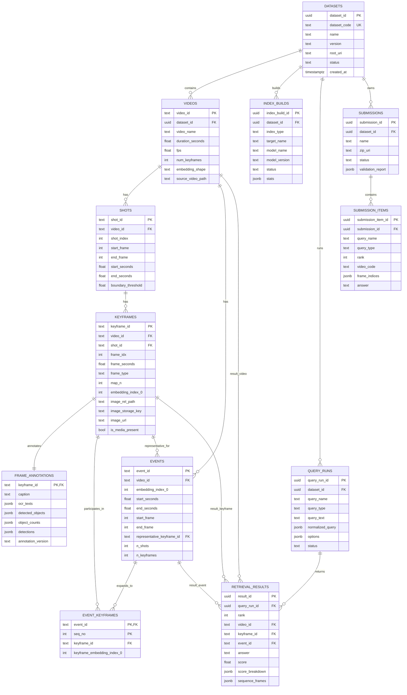

# PostgreSQL ERD (Target Demo-Aligned)

Tài liệu này mô tả ERD mục tiêu cho backend retrieval, đồng bộ với schema contract:
- `docs/database_schema_demo_v1.md`

Mục đích:
- chốt quan hệ bảng cho Module 1/2;
- đảm bảo import dữ liệu từ `demo/` không mất thông tin;
- giữ contract ổn định để map Elasticsearch và Milvus.

Nguồn dữ liệu ingest mặc định:
- `demo/per_video_summary.csv`
- `demo/shot_segments.csv`
- `demo/annotations/<video_id>/annotations.jsonl`
- `demo/features/map-keyframes/<video_id>.csv`
- `demo/features/map-event/<video_id>.csv`
- `demo/features/vit-ViT-B-32-laion2b_s34b_b79k/<video_id>.npy`
- `demo/features/events/<video_id>.npy`

Nguồn legacy (không dùng làm source-of-truth): `demo/annotations.jsonl`, `demo/Event Embedding/*`.

## 1. ERD Tổng Quan



## 2. Luồng dữ liệu chính

```text
datasets
  -> videos
      -> shots
          -> keyframes
              -> frame_annotations
      -> events
          -> event_keyframes
```

- `keyframes` là điểm giao giữa relational metadata và vector/text indexes.
- `event_keyframes` giúp truy vấn TRAKE theo chuỗi theo thứ tự mà không cần parse chuỗi text.

## 3. Constraint quan trọng

- `videos`: unique theo business id `video_id`.
- `shots`: unique `(video_id, shot_index)`.
- `keyframes`: unique `(video_id, frame_idx)`.
- `events`: unique `(video_id, embedding_index_0)`.
- `event_keyframes`: PK `(event_id, seq_no)` va unique `(event_id, keyframe_id)`.
- `retrieval_results`: unique `(query_run_id, rank)`.
- `submission_items`: unique `(submission_id, query_name, rank)`.

## 4. Index ưu tiên cao

```sql
create index if not exists idx_videos_dataset on videos(dataset_id);
create index if not exists idx_shots_video_time on shots(video_id, start_seconds, end_seconds);
create index if not exists idx_keyframes_video_time on keyframes(video_id, frame_seconds);
create index if not exists idx_keyframes_shot on keyframes(shot_id, frame_idx);
create index if not exists idx_events_video_time on events(video_id, start_seconds, end_seconds);
create index if not exists idx_event_keyframes_keyframe on event_keyframes(keyframe_id);
```

## 5. Boundary với Elasticsearch và Milvus

- PostgreSQL: source-of-truth.
- Elasticsearch: text retrieval index (caption, OCR, objects), id tham chiếu `keyframe_id`.
- Milvus: ANN vector index, id tham chiếu `keyframe_id` và `event_id`.
  - keyframe vectors: từ `features/vit-.../*.npy` theo mapping `map-keyframes`.
  - event vectors: từ `features/events/*.npy` theo mapping `map-event.event_embedding_index`.
