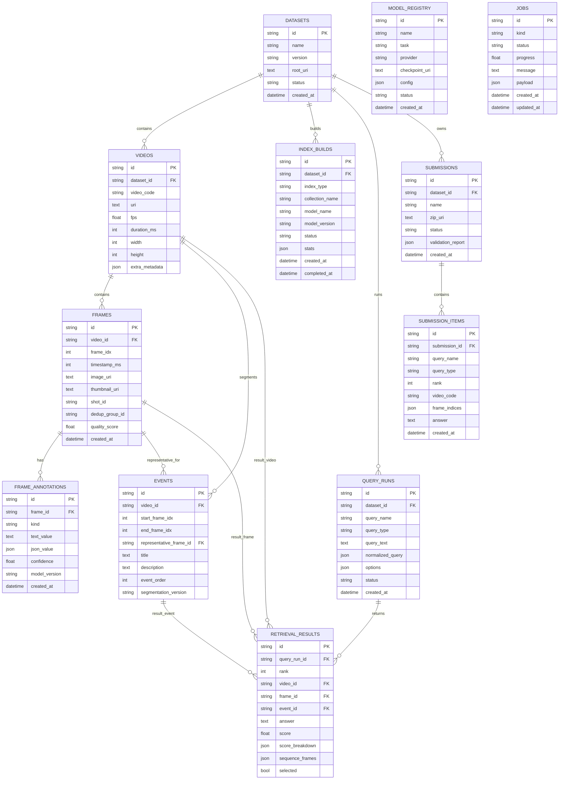

# PostgreSQL Database ERD

> Sơ đồ quan hệ PostgreSQL cho backend hiện tại. Milvus lưu vector embedding, Elasticsearch lưu text index; PostgreSQL là nguồn sự thật cho metadata, runs và submissions.

## 1. ERD Tổng Quan



## 2. Nhóm Bảng Theo Luồng

### 2.1 Dataset Và Media Metadata

```text
datasets
  -> videos
      -> frames
          -> frame_annotations
      -> events
```

Ý nghĩa:

- `datasets`: một bộ dữ liệu hoặc một version dataset.
- `videos`: video thuộc dataset, định danh bằng `video_code`, ví dụ `L00_V000`.
- `frames`: keyframe hoặc frame đại diện được dùng cho search/submission.
- `frame_annotations`: OCR, ASR, object labels, caption, scene, tag.
- `events`: cụm frame theo thời gian, dùng cho event retrieval và TRAKE.

### 2.2 Index Và Model Versioning

```text
model_registry
datasets -> index_builds
```

Ý nghĩa:

- `model_registry`: snapshot model/adapters đang dùng.
- `index_builds`: record cho Milvus/Elasticsearch/PostgreSQL index build.

Milvus và Elasticsearch không phải nguồn sự thật. Nếu index hỏng, có thể rebuild từ PostgreSQL + artifact trong MinIO/local storage.

### 2.3 Retrieval Runs

```text
datasets
  -> query_runs
      -> retrieval_results
```

Ý nghĩa:

- `query_runs`: mỗi lần user chạy query.
- `retrieval_results`: top-k results đã được rank, có score breakdown và sequence frames.
- `retrieval_results.sequence_frames`: dùng cho TRAKE, ví dụ `[1200, 1850, 2100]`.

### 2.4 Submission

```text
datasets
  -> submissions
      -> submission_items
```

Ý nghĩa:

- `submissions`: một lần export ZIP.
- `submission_items`: từng dòng CSV chuẩn bị nộp.

Format mapping:

| Query type | `submission_items` mapping | CSV output |
| --- | --- | --- |
| `KIS` | `video_code`, `frame_indices[0]` | `<video>,<frame>` |
| `QA` | `video_code`, `frame_indices[0]`, `answer` | `<video>,<frame>,<answer>` |
| `TRAKE` | `video_code`, `frame_indices[]` | `<video>,<frame_1>,...,<frame_n>` |

### 2.5 Jobs

```text
jobs
```

Ý nghĩa:

- Theo dõi ingest/index/preprocessing job.
- `payload` lưu tham số job.
- `progress` và `message` dùng cho UI/admin logs.

## 3. Constraint Quan Trọng

| Bảng | Constraint | Lý do |
| --- | --- | --- |
| `datasets` | unique `(name, version)` | Không trùng dataset version. |
| `videos` | unique `(dataset_id, video_code)` | Một video code chỉ xuất hiện một lần trong dataset. |
| `frames` | unique `(video_id, frame_idx)` | Chạy ingest lại không tạo trùng frame. |
| `query_runs` | FK `dataset_id` | Mỗi query run gắn với một dataset cụ thể. |
| `retrieval_results` | unique `(query_run_id, rank)` | Rank trong một query run không trùng. |
| `submission_items` | unique `(submission_id, query_name, rank)` | Một query trong submission không có hai dòng cùng rank. |

## 4. Gợi Ý Index PostgreSQL

Khi chuyển từ mock sang dataset lớn hơn, nên thêm các index sau:

```sql
CREATE INDEX idx_videos_dataset_code ON videos(dataset_id, video_code);
CREATE INDEX idx_frames_video_frame_idx ON frames(video_id, frame_idx);
CREATE INDEX idx_frames_video_timestamp ON frames(video_id, timestamp_ms);
CREATE INDEX idx_annotations_frame_kind ON frame_annotations(frame_id, kind);
CREATE INDEX idx_events_video_order ON events(video_id, event_order);
CREATE INDEX idx_query_runs_dataset_created ON query_runs(dataset_id, created_at DESC);
CREATE INDEX idx_retrieval_results_run_rank ON retrieval_results(query_run_id, rank);
CREATE INDEX idx_submission_items_submission_query_rank ON submission_items(submission_id, query_name, rank);
```

Nếu cần full-text fallback trong PostgreSQL:

```sql
CREATE INDEX idx_frame_annotations_text_trgm
ON frame_annotations
USING gin (text_value gin_trgm_ops);
```

Ghi chú: cần extension `pg_trgm`.

