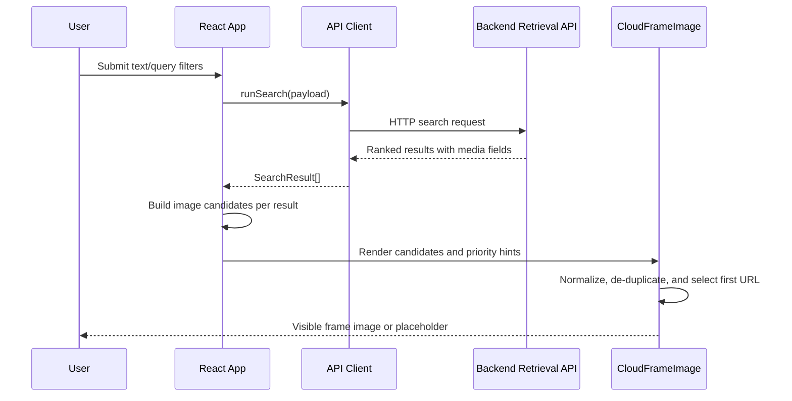
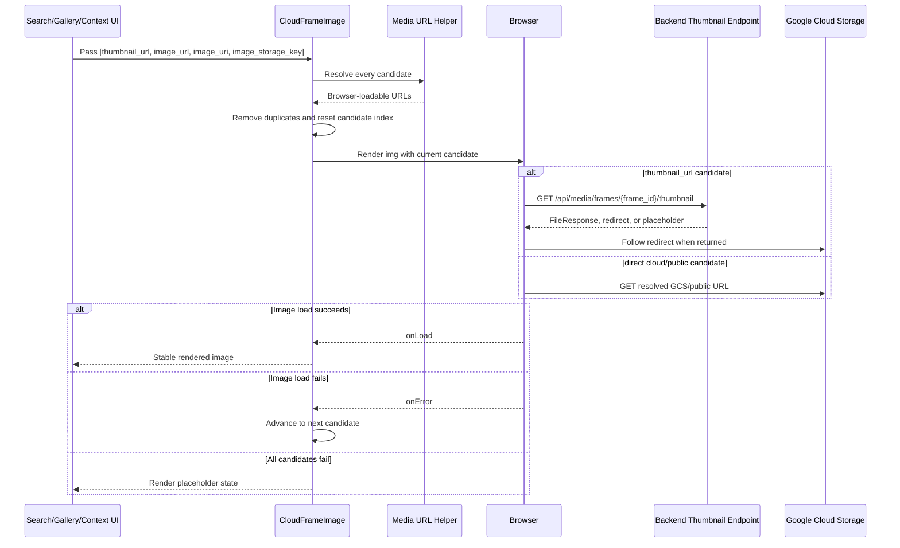
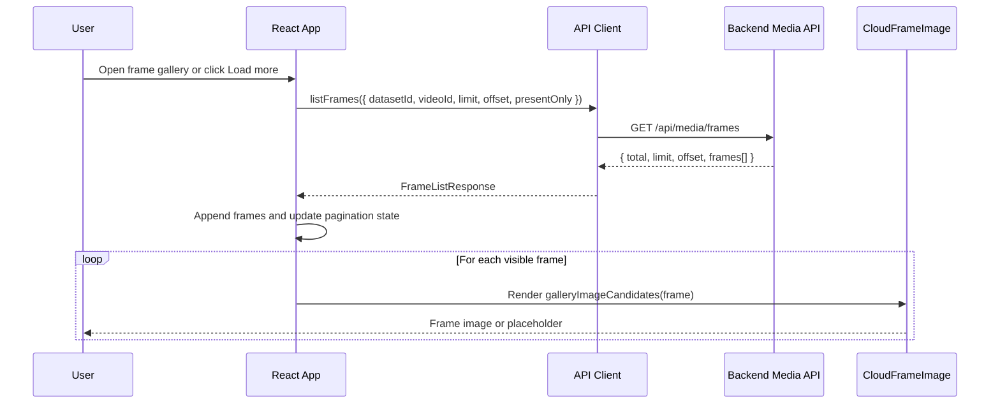
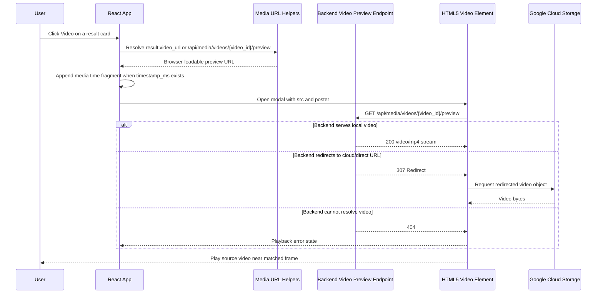

# Frontend Media Rendering Technical Report

## 1. Purpose

This document describes how the frontend loads frame images and source videos from backend APIs and Google Cloud Storage (GCS). It explains the UI surfaces, data contracts, URL normalization, fallback strategy, performance choices, and debugging workflow used by the current retrieval interface.

The frontend is responsible for fast rendering and user-friendly fallback behavior. It does not own storage credentials and does not decide whether a GCS object is private or public; those concerns remain on the backend.

## 2. Executive Summary

The frontend receives multiple media candidates for each frame and resolves them into browser-loadable URLs. It prefers the stable backend thumbnail endpoint first, then tries direct cloud/public fields. If an image candidate fails, the `CloudFrameImage` component automatically advances to the next candidate and finally shows a placeholder.

For videos, every result card exposes a `Video` action. The UI opens a modal player using the backend preview endpoint and appends a media time fragment when `timestamp_ms` exists so the player starts near the matched frame.

## 3. Frontend Components and Files

| Component/File | Responsibility |
| --- | --- |
| `apps/web/src/api/client.ts` | API requests and media URL normalization helpers. |
| `apps/web/src/types.ts` | TypeScript contracts for search results, context frames, and gallery frames. |
| `apps/web/src/App.tsx` | Search UI, frame gallery, context panel, image fallback component, and video preview modal. |
| `apps/web/src/styles.css` | Layout and visual states for media cards, image placeholders, actions, and video modal. |
| `apps/web/index.html` | Browser preconnect hints for GCS. |

## 4. UI Surfaces

| Surface | Source Data | Media Behavior |
| --- | --- | --- |
| Search result cards | Retrieval response items | Display matched frame image and a `Video` action. |
| Frame gallery | `GET /api/media/frames` | Displays paginated frames from the selected dataset/video. |
| Context panel | `GET /api/media/frames/{frame_id}/context` | Displays neighboring frames around a selected result. |
| Video preview modal | `GET /api/media/videos/{video_id}/preview` | Plays source video and seeks near matched timestamp via `#t=...`. |

## 5. Data Contracts

The frontend expects search results and frames to expose these media fields:

| Field | Used By | Purpose |
| --- | --- | --- |
| `thumbnail_url` | Search cards, context, gallery | Stable backend fallback endpoint. |
| `image_url` | Search cards, context, gallery | Direct browser-loadable image URL when available. |
| `image_uri` | Search cards, context, gallery | Original storage URI, commonly `gs://...`. |
| `image_storage_key` | Search cards, context, gallery | GCS object key fallback. |
| `video_url` | Search result video action | Stable backend video preview endpoint. |
| `video_uri` | Diagnostics/future direct video use | Original video URI/path. |
| `timestamp_ms` | Video modal | Starts playback near the matched frame. |

These fields are defined in `apps/web/src/types.ts` and are populated by the backend retrieval and media APIs.

### Search Result Rendering Sequence



## 6. Media URL Normalization

The frontend centralizes URL conversion in `apps/web/src/api/client.ts`.

| Helper | Behavior |
| --- | --- |
| `mediaUrl(path)` | Converts backend paths, direct URLs, `gs://...` URIs, and bare GCS keys into browser-loadable URLs. |
| `gcsMediaUrl(path)` | Builds GCS public URLs from `gs://bucket/key` or object keys. |
| `firstMediaUrl(...paths)` | Returns the first path that can be resolved into a browser URL. |

Supported input formats:

| Input | Output |
| --- | --- |
| `https://...` | Used directly. |
| `/api/...` | Prefixed with `VITE_API_BASE_URL`. |
| `gs://bucket/path/frame.jpg` | Converted to `https://storage.googleapis.com/bucket/path/frame.jpg` or the configured public base URL. |
| `frames/.../frame.jpg` | Converted when `VITE_GCS_BUCKET` or `VITE_GCS_PUBLIC_BASE_URL` is configured. |

## 7. Image Candidate Strategy

The current UI builds frame image candidates in this order:

1. `thumbnail_url`
2. `image_url`
3. `image_uri`
4. `image_storage_key`

The stable backend thumbnail endpoint is first because it works for both local media and private GCS buckets. Direct cloud fields remain in the candidate list so public buckets or pre-signed URLs can still render without manual user action if the first candidate fails.

Before rendering, candidates are normalized and de-duplicated. This avoids repeated requests when multiple fields resolve to the same browser URL.

## 8. `CloudFrameImage` Lifecycle

`CloudFrameImage` is the shared image component for search results, context frames, and gallery cards.

Runtime behavior:

1. Receive a list of candidate paths.
2. Convert each candidate through `mediaUrl()`.
3. Remove duplicate URLs.
4. Render the first candidate.
5. On image error, advance to the next candidate.
6. If every candidate fails, show a neutral placeholder instead of breaking the layout.



The component also uses browser-native performance hints:

| Attribute | Purpose |
| --- | --- |
| `loading="eager"` | Used for high-priority visible images. |
| `loading="lazy"` | Used for lower-priority images. |
| `decoding="async"` | Avoids blocking rendering while decoding images. |
| `fetchPriority="high"` | Prioritizes above-the-fold result images. |
| `referrerPolicy="no-referrer"` | Keeps cross-origin media requests cleaner. |

## 9. Frame Gallery Flow

The frame gallery uses:

```text
GET /api/media/frames?dataset_id={datasetId}&limit={limit}&offset={offset}&present_only=true
```



The UI keeps gallery state separate from search state:

- `frames` stores the currently loaded gallery page sequence.
- `total` tracks the backend total count.
- `offset` supports incremental loading.
- `present_only=true` avoids showing known-missing media by default.

The gallery is useful for manual verification after frames have been uploaded to GCS. Users can scan frames by dataset or video and confirm that the media returned by the backend belongs to the expected video.

## 10. Video Preview Flow

Each search result card renders a `Video` button when a `video_id` is available.

When clicked:

1. The UI builds a fallback endpoint: `/api/media/videos/{video_id}/preview`.
2. `firstMediaUrl()` resolves the preview source.
3. If `timestamp_ms` exists, the UI appends a media fragment such as `#t=12.40`.
4. The modal opens an HTML5 `<video>` player with `controls` and `preload="metadata"`.
5. The matched frame image is reused as the poster when available.

This design keeps the search results visible behind the modal and lets users quickly verify whether a retrieved frame belongs to the expected video.



## 11. Browser Performance Strategy

| Concern | Frontend Technique |
| --- | --- |
| GCS connection setup | `index.html` preconnects and DNS-prefetches `https://storage.googleapis.com`. |
| Above-the-fold image speed | Important result images use eager loading and high fetch priority. |
| Long result lists | Lower-priority images use lazy loading and async decoding. |
| Broken media fields | Candidate fallback prevents one bad URL from breaking the card. |
| Duplicate URLs | Candidate URLs are de-duplicated before rendering. |
| Video startup cost | Video uses `preload="metadata"` instead of downloading the whole file immediately. |

## 12. Frontend Configuration

| Variable | Purpose |
| --- | --- |
| `VITE_API_BASE_URL` | Backend origin used for API and `/api/...` media paths. |
| `VITE_GCS_BUCKET` | Default bucket used to resolve bare GCS object keys. |
| `VITE_GCS_PUBLIC_BASE_URL` | Optional public/CDN base URL for faster GCS object loading. |

Example:

```bash
VITE_API_BASE_URL=http://localhost:8000
VITE_GCS_BUCKET=your-gcs-bucket
VITE_GCS_PUBLIC_BASE_URL=https://storage.googleapis.com/your-gcs-bucket
```

For private buckets, do not expose service account credentials in the frontend. Keep credentials on the backend and let `/api/media/...` endpoints return signed redirects.

## 13. Error States and Troubleshooting

| Symptom | Frontend Check |
| --- | --- |
| No image is visible | Inspect the rendered image `src` and confirm the candidate list is not empty. |
| Image shows placeholder | Check network failures for `thumbnail_url`, `image_url`, `image_uri`, and `image_storage_key`. |
| GCS object key is not resolved | Verify `VITE_GCS_BUCKET` or `VITE_GCS_PUBLIC_BASE_URL`. |
| Backend media path is wrong | Verify `VITE_API_BASE_URL` and call the `/api/media/...` URL directly. |
| Video modal opens but does not play | Confirm `/api/media/videos/{video_id}/preview` returns a file or redirect. |
| Video starts at the wrong place | Verify `timestamp_ms` is present and frame timestamps are aligned with the source video. |

## 14. Future Improvements

- Add a virtualized frame gallery for very large datasets.
- Add a batch media metadata inspector panel for comparing `thumbnail_url`, `image_url`, and GCS fields.
- Add CDN-backed thumbnail URLs for public buckets.
- Add a frontend retry budget for transient cloud/network failures.
- Add Playwright tests for image fallback and video preview flows.
