# Processor Model Technical Report

**Document status:** Engineering reference  
**Audience:** Data, ML, backend, platform, and operations engineers  
**System area:** `scripts/processors` feature ingest pipeline  
**Last reviewed:** 2026-07-24  

## 1. Executive Summary

The processor pipeline converts cloud-hosted video keyframes and raw videos into searchable multimodal artifacts. It is designed for notebook-scale execution on Kaggle and Google Colab, while keeping database writes centralized on a trusted importer machine.

The current codebase separates operator entry points from reusable implementation:

```text
scripts/processors/
|-- processor_cli.py              # Main CLI entry point for discovery, shards, imports, plans, doctor, reconcile
|-- extract_gcs_annotations.py    # Direct/legacy GCS frame-to-cloud-sink runner
|-- extract_gcs_asr.py            # ASR entry point for raw videos
|-- download_models.py            # Model warmup/download entry point
|-- configs/                      # YAML configuration
|-- logs/                         # Runtime logs
|-- tests/                        # Processor tests
`-- src/                          # Internal implementation modules
```

At a high level, each run follows this contract:

1. Discover keyframes from GCS and create manifest shards.
2. Render notebook roles from YAML.
3. Run one model stage per worker, writing append-only JSONL artifacts.
4. Track checkpoint, lease, heartbeat, and terminal `_SUCCESS.json` state.
5. Reconcile run completeness before database import.
6. Import artifacts into Supabase/PostgreSQL, Elasticsearch, and Milvus/Zilliz.

## 2. System Goals And Non-Goals

### Goals

- Make model behavior configurable through YAML profiles.
- Support distributed notebook execution with resumable shards.
- Avoid direct database writes from untrusted/ephemeral notebook workers.
- Keep generated feature artifacts reproducible and auditable.
- Allow each model family to run independently: visual embedding, object detection, OCR, captioning, ASR, and text embedding.

### Non-Goals

- This pipeline does not perform online query-time retrieval.
- This pipeline does not extract keyframes from videos; it assumes AutoShot keyframes already exist on GCS.
- This pipeline does not own frontend media rendering.
- This pipeline does not run a scheduler; role plans are rendered as commands for humans or notebooks to execute.

## 3. Source Ownership Map

| Area | Path | Responsibility |
| --- | --- | --- |
| Main CLI | `scripts/processors/processor_cli.py` | Dispatches commands: discover, run shard, import, plan, notebook role, cells, kit, smoke, reconcile, doctor |
| Direct annotation runner | `scripts/processors/extract_gcs_annotations.py` | Legacy/direct mode: reads GCS frames, extracts enabled features, writes configured sinks immediately |
| ASR runner | `scripts/processors/extract_gcs_asr.py` | Runs faster-whisper on raw GCS videos with checkpoint/resume |
| Model warmup | `scripts/processors/download_models.py` | Downloads and initializes enabled model stack |
| Config path resolver | `scripts/processors/src/config_paths.py` | Centralizes config paths and legacy path resolution |
| YAML loader | `scripts/processors/src/pipeline_config.py` | Loads `processor.yaml`, merges selected profile, applies CLI overrides |
| Manifest source | `scripts/processors/src/manifest.py` | Discovers GCS keyframes, writes manifest and shard JSONL |
| GCS frame source | `scripts/processors/src/gcs_source.py` | Lists/downloads frame images and enriches frame timing from `shot_segments.csv` |
| Artifact I/O | `scripts/processors/src/artifact_io.py` | Reads/writes local or GCS JSON/JSONL artifacts |
| Checkpointing | `scripts/processors/src/checkpoint_store.py` | Lease, checkpoint, heartbeat, terminal marker |
| Feature shard runner | `scripts/processors/src/shard_runner.py` | Runs model extraction for one manifest shard |
| Extractor coordinator | `scripts/processors/src/extractors/pipeline.py` | Builds enabled feature extractors and merges their per-frame outputs |
| Sink adapters | `scripts/processors/src/cloud_sinks/` | PostgreSQL, Elasticsearch, Milvus, ASR Elasticsearch, text Milvus adapters |
| Importer | `scripts/processors/src/ingest_artifacts.py` | Reads feature artifacts, merges by keyframe, writes DB/search/vector sinks |
| Notebook orchestration | `scripts/processors/src/role_planner.py`, `notebook_role_runner.py`, `notebook_cells.py` | Renders commands, role execution wrappers, notebook cells, notebook kits |
| Readiness checks | `scripts/processors/src/processor_doctor.py` | Checks runtime packages, env vars, Python compatibility, optional GCS access |
| Local smoke | `scripts/processors/src/smoke_flow.py` | Synthetic end-to-end local wiring check |

## 4. Configuration Reference

### 4.1 Configuration Files

| File | Purpose | Primary Consumers |
| --- | --- | --- |
| `scripts/processors/configs/pipeline/processor.yaml` | Runtime, dataset, sink, model, and model-profile configuration | `pipeline_config.py`, `processor_cli.py`, `download_models.py`, `extract_gcs_annotations.py`, `shard_runner.py`, `processor_doctor.py` |
| `scripts/processors/configs/pipeline/notebook_roles.yaml` | Kaggle/Colab role map, stage assignment, shard sizing, GCS output roots | `role_planner.py`, `notebook_role_runner.py`, `notebook_cells.py`, `smoke_flow.py` |
| `scripts/processors/configs/runtime/checkpoint_policy.yaml` | Lease TTL, heartbeat interval, runtime guard, output marker policy | `role_planner.py`, `notebook_role_runner.py`, `shard_runner.py`, `extract_gcs_asr.py` |
| `.env` | Secrets and endpoint settings | `config.py`, `artifact_io.py`, sink adapters |

### 4.2 Top-Level `processor.yaml`

| Section | Key | Default/Example | Meaning |
| --- | --- | --- | --- |
| `run` | `gcs_prefix` | `processed/keyframes` | Base GCS keyframe prefix used by direct GCS annotation runs |
| `run` | `shot_segments` | `""` | Optional shot metadata CSV path, local or `gs://` |
| `run` | `batch_size` | `8` | Outer pipeline batch size |
| `run` | `download_workers` | `8` | Parallel GCS frame download workers |
| `run` | `gcs_timeout` | `20` | GCS request timeout/deadline in seconds |
| `run` | `max_frames` | `0` | Frame limit; `0` means unlimited |
| `run` | `video_ids` | `[]` | Optional video filter |
| `run` | `annotations_jsonl` | `data/processor_annotations_audit.jsonl` | Optional local audit output |
| `run` | `log_file` | `scripts/processors/logs/processor.log` | Processor log path |
| `run` | `continue_on_batch_error` | `true` | Continue direct annotation run when one batch fails |
| `dataset` | `code/name/version` | `aic-2026`, `v1` | Dataset labels used by sink import |
| `sinks` | `write_pg` | `true` | Enable PostgreSQL writes |
| `sinks` | `write_milvus` | `true` | Enable Milvus/Zilliz visual-vector writes |
| `sinks` | `write_elasticsearch` | `true` | Enable Elasticsearch text-document writes |
| `sinks` | `fail_on_sink_error` | `false` | Fail fast on sink errors instead of continuing |
| `sinks` | `milvus_collection` | `keyframe_embeddings_pe_core_bigG_14_448` | Default primary visual embedding collection |
| `sinks` | `elasticsearch_index` | `keyframe_annotations` | Default annotation index |
| `sinks` | `model_version` | `pe-core-bigG-14-448` | Version label stored with writes |
| `models` | `cache_dir` | `%USERPROFILE%/.cache/...` | Shared model cache directory |
| `models` | `device` | `auto` | `auto`, `cpu`, `cuda`, `cuda:0`, etc. |
| `models` | `enable_tf32` | `true` | CUDA matmul/CuDNN TF32 optimization toggle |

### 4.3 Model Configuration Matrix

| Model Flow | YAML Path | Provider | Main Config Keys | Output |
| --- | --- | --- | --- | --- |
| Visual embedding | `models.embedding` | `openclip` | `model_name`, `pretrained`, `batch_size`, `precision`, `l2_normalize` | `embedding: float[]` in feature artifact |
| Captioning | `models.caption` | `blip`, `blip2`, `openai_compatible_vlm` | `model_class`, `model_name`, `prompt`, `generation`, `base_url`, `api_key_env`, `max_tokens` | `annotation.caption` |
| OCR | `models.ocr` | `vietocr`, `paddle_vietocr`, `easyocr`, `craft_easyocr` | `recognizer_model`, `detector_model`, `languages`, thresholds, padding | `annotation.texts` |
| Object detection | `models.objects` | `yolo` | `model_name`, `image_size`, `batch_size`, `confidence` | `annotation.objects`, `object_counts`, `detections` |
| Text embedding | `models.text_embedding` | `sentence_transformers` | `model_name`, `batch_size`, `normalize` | Text vectors into Milvus collection |
| ASR | `notebook_roles.*.model` and CLI args | `faster-whisper` | `model-size`, `language`, `device`, `compute-type` | `aic.asr_artifact.v1` segment JSONL |

### 4.4 Profile Matrix

| Profile | Intended Runtime | Enabled Features | Sink Behavior | Notes |
| --- | --- | --- | --- | --- |
| `smoke` | Local/Kaggle dry wiring | embedding + objects | default sinks if used | Small frame limit and smaller batch |
| `embedding_only` | Local/direct embedding | embedding | default sink config | Disables caption/OCR/objects |
| `zilliz_embedding_only` | Vector-only ingestion | embedding | Milvus only | Large batch, fail on sink error |
| `full` | Local full model stack | embedding, caption, OCR, objects | all sinks | General full feature profile |
| `full_blip2` | Heavy caption experiments | embedding, BLIP-2 caption, OCR, objects | all sinks | Uses larger BLIP-2 model and offload settings |
| `visual_primary_pe_core` | Kaggle GPU | embedding | Milvus only | PE-Core primary visual collection |
| `visual_secondary_openclip_vith14` | Kaggle GPU | embedding | Milvus only | OpenCLIP ViT-H/14 secondary visual collection |
| `objects_only` | Kaggle GPU | objects | PostgreSQL + Elasticsearch | YOLO object metadata |
| `ocr_only` | Colab/Python <3.13 | OCR | PostgreSQL + Elasticsearch | PaddleOCR + VietOCR path |
| `craft_easyocr_only` | Colab/Python <3.13 | OCR | PostgreSQL + Elasticsearch | EasyOCR/CRAFT path |
| `caption_only` | Colab or local GPU | BLIP-2 caption | PostgreSQL + Elasticsearch | Heavy caption fallback path |
| `blip2_caption_verification` | Local/GPU verification | BLIP-2 caption | PostgreSQL + Elasticsearch | Caption/verification only; embedding disabled |
| `shot_context_caption_qwen_vl` | Colab with VLM endpoint | OpenAI-compatible VLM caption | PostgreSQL + Elasticsearch | Requires `VLM_BASE_URL` |
| `shot_context_caption_gemini` | Colab with Gemini proxy | OpenAI-compatible VLM caption | PostgreSQL + Elasticsearch | Requires `GEMINI_OPENAI_BASE_URL` |
| `full_text_features` | Importer | caption + OCR + objects config | PostgreSQL + Elasticsearch, no visual Milvus | Used to import text/object/ASR artifacts and build text embeddings |

### 4.5 Notebook Role Matrix

| Role ID | Runtime | Stage | Processor Profile | Features | Shard Policy |
| --- | --- | --- | --- | --- | --- |
| `kaggle_l21_primary_visual` | Kaggle | `visual_primary` | `visual_primary_pe_core` | embedding | 512 frames/shard |
| `kaggle_l21_secondary_visual` | Kaggle | `visual_secondary` | `visual_secondary_openclip_vith14` | embedding | 512 frames/shard |
| `kaggle_l21_objects` | Kaggle | `objects` | `objects_only` | objects | 512 frames/shard |
| `colab_l21_ocr` | Colab | `ocr` | `craft_easyocr_only` | ocr | 128 frames/shard |
| `colab_l21_caption` | Colab | `caption` | `shot_context_caption_qwen_vl` | caption | 128 frames/shard |
| `colab_l21_asr` | Colab | `asr` | `asr` | ASR | 1 raw-video prefix role per batch |

`L26` is excluded by default in `notebook_roles.yaml`. Scale-out targets are `L22`, `L23`, `L24`, `L25`, `L27`, `L28`, `L29`, and `L30`.

### 4.6 Checkpoint Policy

| Key | Value | Operational Meaning |
| --- | --- | --- |
| `checkpoint_root` | `gs://aic_ai_2026/checkpoints/pipeline=feature_ingest` | Root location for checkpoint state |
| `lease_ttl_seconds` | `2700` | Worker lease expires after 45 minutes without renewal |
| `heartbeat_seconds` | `120` | Worker updates lease/checkpoint every 2 minutes |
| `max_runtime_seconds.kaggle` | `28800` | 8-hour runtime guard |
| `max_runtime_seconds.colab` | `18000` | 5-hour runtime guard |
| `resume.enabled` | `true` | Enables resume from checkpoint cursor |
| `resume.cursor_field` | `next_index` | Manifest row/video cursor |
| `output.mode` | `append_only_part_files` | Never overwrite partial artifacts |
| `output.terminal_marker` | `_SUCCESS.json` | Shard is complete only when terminal marker exists |

### 4.7 Environment Variables

| Variable | Required By | Purpose |
| --- | --- | --- |
| `GCS_BUCKET` | All cloud runs | Bucket containing keyframes, raw videos, manifests, artifacts |
| `GCS_CREDENTIALS_FILE` | All cloud runs | Service account file path |
| `GCS_SERVICE_ACCOUNT_JSON` | Kaggle/Colab alternative | Inline service account JSON or path |
| `GCS_PUBLIC_URL` | Sink adapters | Public media URL base |
| `DATABASE_URL` | Importer/direct sink | Supabase/PostgreSQL connection |
| `MILVUS_URI` | Importer/direct sink | Milvus/Zilliz endpoint |
| `MILVUS_TOKEN` | Importer/direct sink | Milvus/Zilliz token |
| `ELASTICSEARCH_URL` | Importer/direct sink | Elasticsearch endpoint |
| `VLM_BASE_URL` | Qwen-compatible caption profile | OpenAI-compatible chat completions endpoint |
| `VLM_API_KEY` | Qwen-compatible caption profile | Optional bearer token |
| `GEMINI_OPENAI_BASE_URL` | Gemini caption profile | Gemini OpenAI-compatible endpoint |
| `GEMINI_API_KEY` | Gemini caption profile | Optional bearer token |

## 5. End-To-End Architecture

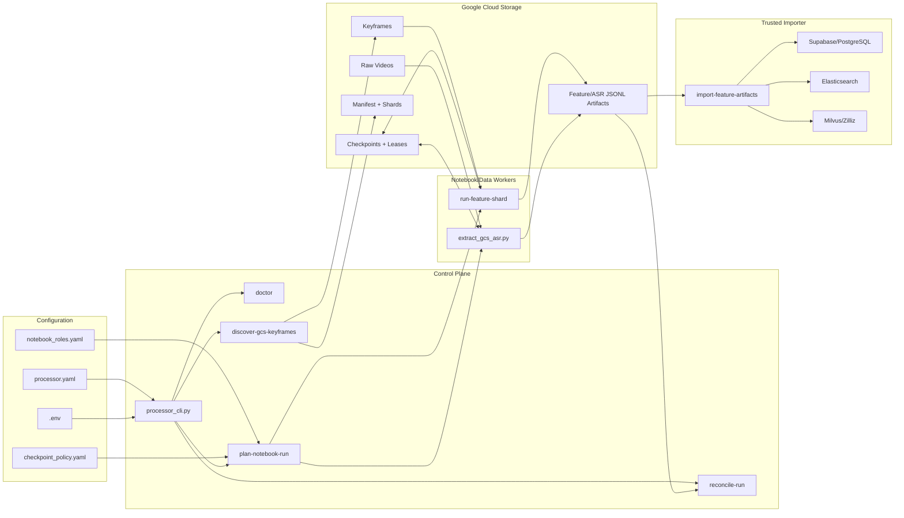
```mermaid
flowchart LR
  subgraph Config["Configuration"]
    P["processor.yaml"]
    R["notebook_roles.yaml"]
    C["checkpoint_policy.yaml"]
    E[".env"]
  end

  subgraph Control["Control Plane"]
    CLI["processor_cli.py"]
    Doctor["doctor"]
    Discover["discover-gcs-keyframes"]
    Planner["plan-notebook-run"]
    Reconcile["reconcile-run"]
  end

  subgraph Worker["Notebook/Data Workers"]
    Shard["run-feature-shard"]
    ASR["extract_gcs_asr.py"]
  end

  subgraph Storage["Google Cloud Storage"]
    Frames["Keyframes"]
    RawVideos["Raw Videos"]
    Manifest["Manifest + Shards"]
    Checkpoints["Checkpoints + Leases"]
    Artifacts["Feature/ASR JSONL Artifacts"]
  end

  subgraph Importer["Trusted Importer"]
    Import["import-feature-artifacts"]
    PG["Supabase/PostgreSQL"]
    ES["Elasticsearch"]
    MV["Milvus/Zilliz"]
  end

  P --> CLI
  R --> Planner
  C --> Planner
  E --> CLI
  CLI --> Doctor
  CLI --> Discover
  CLI --> Planner
  CLI --> Reconcile
  Discover --> Frames
  Discover --> Manifest
  Planner --> Shard
  Planner --> ASR
  Frames --> Shard
  RawVideos --> ASR
  Checkpoints <--> Shard
  Checkpoints <--> ASR
  Shard --> Artifacts
  ASR --> Artifacts
  Artifacts --> Reconcile
  Artifacts --> Import
  Import --> PG
  Import --> ES
  Import --> MV
```

## 6. Common Run Commands

| Flow | Command Shape | Result |
| --- | --- | --- |
| Runtime readiness | `python scripts/processors/processor_cli.py --profile smoke doctor --runtime kaggle --features embedding,objects` | JSON readiness report; exits non-zero when `ok=false` |
| Discover keyframes | `python scripts/processors/processor_cli.py --profile smoke discover-gcs-keyframes --bucket "$GCS_BUCKET" --dataset-id ai_challenge_2025 --batches L21 --frame-profile autoshot_v1 --run-id "$RUN_ID" --frames-per-shard 128` | Manifest JSONL, shard JSONL, summary JSON |
| Render worker plan | `python scripts/processors/processor_cli.py --profile smoke plan-notebook-run --run-id "$RUN_ID" --manifest-summary-uri <SUMMARY_URI>` | Machine role commands and import commands |
| Run one feature shard | `python scripts/processors/processor_cli.py --profile visual_primary_pe_core run-feature-shard --run-id "$RUN_ID" --stage visual_primary --features embedding --shard-uri <SHARD_URI> --output-prefix <FEATURE_PREFIX> --checkpoint-root <CHECKPOINT_ROOT> --warmup-models` | Feature artifact part files |
| Run ASR | `python scripts/processors/extract_gcs_asr.py --bucket "$GCS_BUCKET" --gcs-prefix <RAW_PREFIX> --run-id "$RUN_ID" --output-prefix <FEATURE_PREFIX> --checkpoint-root <CHECKPOINT_ROOT> --model-size small --language vi` | ASR artifact part files |
| Reconcile run | `python scripts/processors/processor_cli.py --profile smoke reconcile-run --run-id "$RUN_ID" --manifest-summary-uri <SUMMARY_URI>` | Completeness report before import |
| Import artifacts | `python scripts/processors/processor_cli.py --profile full_text_features import-feature-artifacts --artifact-uri <ARTIFACT_PREFIX> --dataset-code <CODE> --dataset-name <NAME> --dataset-version mvp_v1` | DB/search/vector writes |
| Warm models | `python scripts/processors/download_models.py --profile visual_primary_pe_core --features embedding` | Cached initialized primary PE-Core weights |

### 6.1 Flow Input/Output Contracts

This section is derived from the current `scripts/processors` implementation. The processor has two durable file families on Google Cloud Storage: manifest/checkpoint control files and append-only feature/ASR JSONL artifacts.

#### 6.1.1 Discover Keyframes Flow

| Item | Contract |
| --- | --- |
| Entry point | `processor_cli.py discover-gcs-keyframes` |
| Main code | `manifest.build_gcs_keyframe_manifest()`, `manifest.write_manifest_and_shards()` |
| Input | GCS bucket, one or more keyframe prefixes, `dataset_id`, `run_id`, `frames_per_shard`, optional `shot_segments.csv`, optional `max_frames` |
| Source file types | `.jpg`, `.jpeg`, `.png`, `.webp` under the configured GCS keyframe prefix |
| Output files | `keyframes.jsonl`, `manifest_summary.json`, and `shards/shard-00000.jsonl`... under the manifest output root |

`keyframes.jsonl` contains one JSON object per keyframe. Fields are:

| Field | Type | Meaning |
| --- | --- | --- |
| `dataset_id` | string | Logical dataset id passed to discovery |
| `batch` | string | Batch id parsed from the GCS path, for example `L21` |
| `video_id` | string | Video id parsed from `video_id=<id>` or parent path |
| `keyframe_id` | string | Stable id: `<video_id>_F<frame_idx:06d>` |
| `shot_id` | string or null | Stable shot id when `shot_index` exists: `<video_id>_S<shot_index:04d>` |
| `frame_idx` | integer | Frame index parsed from the image filename |
| `frame_seconds` | float | Timestamp from `shot_segments.csv`, otherwise `0.0` |
| `frame_type` | string | `first`, `middle`, `last`, `key`, or fallback `key` |
| `gcs_uri` | string | Full keyframe object URI |
| `bucket` | string | GCS bucket name |
| `blob_name` | string | Object key inside the bucket |
| `image_name` | string | Filename only |
| `shot_index` | integer or null | Shot index from path or shot metadata |
| `fps` | float or null | FPS from shot metadata when available |
| `size_bytes` | integer, optional | GCS object size when discovery reads blobs directly |
| `generation` | string, optional | GCS generation when discovery reads blobs directly |
| `global_index` | integer | Stable index after sorting by batch, video, frame, image name |

Each shard file repeats the manifest row fields and adds:

| Field | Type | Meaning |
| --- | --- | --- |
| `shard_index` | integer | Zero-based shard number |
| `shard_local_index` | integer | Zero-based row index inside the shard |

`manifest_summary.json` fields are:

| Field | Type | Meaning |
| --- | --- | --- |
| `run_id` | string | Run identifier |
| `manifest_uri` | string | URI of `keyframes.jsonl` |
| `summary_uri` | string | URI of the summary file itself |
| `shard_root` | string | Prefix containing shard JSONL files |
| `frames` | integer | Total keyframe count |
| `frames_per_shard` | integer | Shard size requested by the operator |
| `num_shards` | integer | Number of shard JSONL files written |
| `shards` | array[string] | Full shard file URIs |

#### 6.1.2 Plan And Notebook Role Flow

| Item | Contract |
| --- | --- |
| Entry points | `plan-notebook-run`, `run-notebook-role`, `render-notebook-cells`, `render-notebook-kit` |
| Main code | `role_planner.py`, `notebook_role_runner.py`, `notebook_cells.py` |
| Input | `run_id`, selected batches, `manifest_summary_uri` or `shard_root` + `num_shards`, role YAML, checkpoint policy YAML |
| Output | JSON plan, rendered role commands, optional local notebook kit markdown files |

The plan JSON includes:

| Field | Type | Meaning |
| --- | --- | --- |
| `run_id` | string | Run identifier |
| `batches` | array[string] | Batch scope after exclusions such as `L26` |
| `discovery` | object | Discovery command and `frames_per_shard` |
| `manifest_summary_uri` | string | Summary input used by the plan |
| `shard_root` | string | Effective shard root |
| `shards` | array[string] | Shard URIs assigned to frame stages |
| `machine_roles` | array[object] | Role id, runtime, stage, profile, features, command template, assigned shards |
| `imports` | array[object] | Import command names and command strings |

#### 6.1.3 Shared Feature Shard Flow

| Item | Contract |
| --- | --- |
| Entry point | `processor_cli.py run-feature-shard` |
| Main code | `shard_runner.run_feature_shard()` |
| Input | Merged processor config, `stage`, manifest shard JSONL, GCS keyframe images, `output_prefix`, `checkpoint_root`, `run_id`, optional `worker_id` |
| Output | Append-only feature artifact part JSONL files, `checkpoint.json`, `lease.json`, `_SUCCESS.json`, and a CLI summary JSON |

Every image model stage writes feature artifact rows with `schema_version = "aic.feature_artifact.v1"`. The part file path is:

```text
<output_prefix>/run_id=<RUN_ID>/stage=<stage>/shard_id=<shard-id>/worker_id=<worker-id>/attempt_id=<attempt-id>/part-00000.jsonl
```

One feature artifact row has this structure:

| Field | Type | Meaning |
| --- | --- | --- |
| `schema_version` | string | Always `aic.feature_artifact.v1` |
| `run_id` | string | Run identifier |
| `stage` | string | Logical stage, for example `visual_primary`, `objects`, `ocr`, `caption` |
| `shard_id` | string | Filename-derived shard id, for example `shard-00000` |
| `worker_id` | string | Notebook/worker id |
| `attempt_id` | string | `<worker_id>-<epoch_seconds>` |
| `part_index` | integer | Sequential part index for this attempt |
| `record_index` | integer | Manifest `global_index` or shard-local fallback |
| `created_at` | string | UTC ISO-8601 timestamp |
| `frame` | object | Frame metadata copied from the manifest and `FrameItem` |
| `annotation` | object | Caption, OCR, object, and detection payload |
| `embedding` | array[float] or null | Visual vector when an embedding model is enabled |
| `timings_seconds` | object | Rounded component timings, plus `total` |
| `status` | string | Currently `ok` for successfully built rows |

The nested `frame` object contains:

| Field | Type | Meaning |
| --- | --- | --- |
| `bucket` | string | Source GCS bucket |
| `blob_name` | string | Source object key |
| `gcs_uri` | string | Full keyframe URI |
| `video_id` | string | Video id |
| `keyframe_id` | string | Stable frame id |
| `shot_id` | string or null | Stable shot id |
| `shot_index` | integer or null | Shot index |
| `image_name` | string | Source image filename |
| `frame_idx` | integer | Source frame index |
| `frame_seconds` | float | Timestamp in seconds |
| `fps` | float or null | FPS when available |
| `frame_type` | string or null | Frame kind |
| `dataset_id` | string or null | Manifest dataset id |
| `batch` | string or null | Manifest batch id |
| `manifest_global_index` | integer or null | Original manifest global index |

The nested `annotation` object contains:

| Field | Type | Meaning |
| --- | --- | --- |
| `caption` | string | Caption text, or empty string |
| `texts` | array[string] | OCR text lines |
| `objects` | array[string] | Unique object labels |
| `object_counts` | object | Map from object label to count |
| `detections` | array[object] | YOLO detections with label, score, and boxes |

Each `annotation.detections[]` object contains:

| Field | Type | Meaning |
| --- | --- | --- |
| `label` | string | YOLO class label |
| `confidence` | float | Rounded confidence score |
| `bbox_xyxy_px` | array[float] | Pixel-space `[x1, y1, x2, y2]` rounded to two decimals |
| `bbox_xyxy_norm` | array[float] | Normalized `[x1, y1, x2, y2]` in `[0, 1]` |

The shard CLI summary JSON contains `status`, `run_id`, `stage`, `shard_id`, `worker_id`, `attempt_id`, `rows`, `processed`, `failed`, `next_index`, `output_parts`, and `completed_at`.

#### 6.1.4 Primary Visual Embedding Flow

| Item | Contract |
| --- | --- |
| Profile | `visual_primary_pe_core` |
| Stage | `visual_primary` |
| Model | OpenCLIP `hf-hub:timm/PE-Core-bigG-14-448`, empty `pretrained` |
| Input | Local RGB keyframe images downloaded from manifest rows |
| Output file | Feature artifact part JSONL under `stage=visual_primary` |
| Output JSON fields | Standard feature artifact fields; `embedding` is populated and `annotation` is empty/default unless other features are enabled |
| Vector structure in JSONL | `embedding: [float, ...]`; serialized from a normalized `float32` NumPy array with shape `(batch_size, dim)` |
| Vector collection after import | `keyframe_embeddings_pe_core_bigG_14_448` |
| Milvus payload | `id`, `vector`, `keyframe_id`, `video_id`, `frame_idx`, `model_version` |

The code creates the Milvus vector field dimension from `embeddings.shape[1]` at import time. PE-Core bigG/14/448 is expected to be a 1280-dimensional image vector in the current registry, but the collection schema is ultimately derived from the actual emitted vector length.

#### 6.1.5 Secondary Visual Embedding Flow

| Item | Contract |
| --- | --- |
| Profile | `visual_secondary_openclip_vith14` |
| Stage | `visual_secondary` |
| Model | OpenCLIP `ViT-H-14` with `laion2b_s32b_b79k` |
| Input | Local RGB keyframe images downloaded from manifest rows |
| Output file | Feature artifact part JSONL under `stage=visual_secondary` |
| Output JSON fields | Standard feature artifact fields; `embedding` is populated and `annotation` is empty/default unless other features are enabled |
| Vector structure in JSONL | `embedding: [float, ...]`; normalized float vector serialized from `float32` |
| Vector collection after import | `keyframe_embeddings_openclip_vith14` |
| Milvus payload | `id`, `vector`, `keyframe_id`, `video_id`, `frame_idx`, `model_version` |

The code derives the Milvus vector dimension from the actual artifact vector length. OpenCLIP ViT-H/14 is expected to emit 1024-dimensional vectors.

#### 6.1.6 Object Detection Flow

| Item | Contract |
| --- | --- |
| Profiles | `objects_only`, `smoke`, `full` |
| Stage | `objects` |
| Model | Ultralytics YOLO, default `yolo12n.pt` |
| Input | Local keyframe image files |
| Output file | Feature artifact part JSONL under `stage=objects` |
| Output JSON fields | Standard feature artifact fields; `annotation.objects`, `annotation.object_counts`, and `annotation.detections` are populated; `embedding` is `null` |
| Import destination | PostgreSQL frame annotations and Elasticsearch `keyframe_annotations` |

#### 6.1.7 OCR Flow

| Item | Contract |
| --- | --- |
| Profiles | `ocr_only`, `craft_easyocr_only`, `full` |
| Stage | `ocr` |
| Models | PaddleOCR + VietOCR, or EasyOCR/CRAFT |
| Input | Local keyframe image files |
| Output file | Feature artifact part JSONL under `stage=ocr` |
| Output JSON fields | Standard feature artifact fields; `annotation.texts` is populated with recognized text lines; `embedding` is `null` |
| Import destination | PostgreSQL annotations, Elasticsearch `ocr_texts`, and text Milvus through importer text embedding |

#### 6.1.8 Caption Flow

| Item | Contract |
| --- | --- |
| Profiles | `shot_context_caption_qwen_vl`, `shot_context_caption_gemini`, `caption_only`, `blip2_caption_verification`, `full_blip2` |
| Stage | `caption` |
| Input | Local keyframe image files plus manifest context (`video_id`, `shot_id`, `frame_idx`, `frame_seconds`, `frame_type`) |
| Output file | Feature artifact part JSONL under `stage=caption` |
| Output JSON fields | Standard feature artifact fields; `annotation.caption` is populated; `embedding` is `null` |
| Import destination | PostgreSQL annotations, Elasticsearch `caption`, and text Milvus through importer text embedding |

For OpenAI-compatible VLM profiles, the request is a chat-completions payload with a text prompt and a base64 data URI image. For BLIP/BLIP-2 profiles, the local Transformers model generates the caption from PIL images and the configured prompt.

#### 6.1.9 ASR Flow

| Item | Contract |
| --- | --- |
| Entry point | `extract_gcs_asr.py` |
| Stage | `asr` |
| Model | `faster-whisper-<model_size>`, default `small` |
| Input | Raw video files under `--gcs-prefix`; accepted suffixes are `.mp4`, `.avi`, `.mov`, `.mkv`, `.webm` |
| Output file | ASR artifact part JSONL under `stage=asr` |
| Output JSON fields | `aic.asr_artifact.v1` record with one object per processed video |
| Import destination | Elasticsearch ASR index and text Milvus through importer text embedding |

One ASR artifact row contains:

| Field | Type | Meaning |
| --- | --- | --- |
| `schema_version` | string | Always `aic.asr_artifact.v1` |
| `run_id` | string | Run identifier |
| `stage` | string | Usually `asr` |
| `shard_id` | string | Sanitized raw GCS prefix |
| `worker_id` | string | Worker id |
| `attempt_id` | string | `<worker_id>-<epoch_seconds>` |
| `created_at` | string | UTC ISO-8601 timestamp |
| `video_id` | string | Raw video id from filename stem |
| `source` | object | `video_id`, `bucket`, `blob_name`, `gcs_uri` |
| `segments` | array[object] | ASR segment records |
| `model` | object | `name` and detected/configured `language` |

Each `segments[]` item contains `segment_id`, `start_seconds`, `end_seconds`, `text`, `language`, and `confidence`.

#### 6.1.10 Database Import And Text Embedding Flow

| Item | Contract |
| --- | --- |
| Entry point | `processor_cli.py import-feature-artifacts` |
| Main code | `ingest_artifacts.import_feature_artifacts()` |
| Input | One or more artifact JSONL files or prefixes; both feature artifacts and ASR artifacts are accepted |
| Output | PostgreSQL rows, Elasticsearch frame docs, Elasticsearch ASR docs, visual Milvus vectors, text Milvus vectors, and an import summary JSON |

The importer expands every JSONL file under each `--artifact-uri`, reads rows, and merges frame artifacts by `keyframe_id`. Feature rows become frame records; ASR rows become segment records. Text embedding records are built from merged `caption + OCR texts + objects` and from ASR segment text.

Visual Milvus payload fields:

| Field | Type | Meaning |
| --- | --- | --- |
| `id` | string | `keyframe_id` |
| `vector` | array[float] | Visual embedding copied from feature artifact `embedding` |
| `keyframe_id` | string | Stable frame id |
| `video_id` | string | Video id |
| `frame_idx` | integer | Frame index |
| `model_version` | string | Sink `model_version` |

Text Milvus payload fields:

| Field | Type | Meaning |
| --- | --- | --- |
| `id` | string | `keyframe_id` for frame text or `segment_id` for ASR |
| `vector` | array[float] | SentenceTransformer output from `dangvantuan/vietnamese-embedding` by default |
| `keyframe_id` | string or null | Frame id for frame text |
| `video_id` | string or null | Video id |
| `text` | string | Combined frame text or ASR segment text |
| `doc_type` | string | `frame_text` or `asr_segment` |
| `model_version` | string | Text embedding model name |
| `metadata_json` | string | JSON-encoded metadata, including caption/OCR/object or ASR timing metadata |

Import summary JSON fields are `artifact_files`, `records`, `asr_records`, `text_records`, `pg`, `milvus`, `elasticsearch`, `asr_elasticsearch`, `text_milvus`, and `dry_run`.

#### 6.1.11 Reconcile Flow

| Item | Contract |
| --- | --- |
| Entry point | `processor_cli.py reconcile-run` |
| Input | `run_id`, `manifest_summary_uri`, feature output prefix, checkpoint root, stage list |
| Output | JSON report with manifest counts, per-stage artifact file/row counts, checkpoint success counts, and top-level `ok` |

#### 6.1.12 Direct GCS Annotation Flow

| Item | Contract |
| --- | --- |
| Entry point | `extract_gcs_annotations.py` |
| Input | GCS keyframe prefix, selected processor profile, sink config, optional `--features`, optional `--annotations-jsonl` |
| Output | Direct PostgreSQL/Milvus/Elasticsearch writes and optional local audit JSONL |

This direct runner does not write manifest shards, checkpoint files, or feature artifact JSONL to GCS. It processes batches in one process and immediately calls `CloudAnnotationSink.upsert_batch()`.

#### 6.1.13 Runtime Doctor Flow

| Item | Contract |
| --- | --- |
| Entry point | `processor_cli.py doctor` |
| Input | Runtime name (`kaggle`, `colab`, `importer`, or `all`), selected profile, optional feature filter, environment variables, optional GCS probe options |
| Output | JSON readiness report; CLI exits non-zero when top-level `ok` is `false` |

Doctor output fields include `runtime`, `features`, `feature_config`, `profile`, `python`, `python_compatibility`, `platform`, `env`, `packages`, `profile_config`, optional `gcs`, and top-level `ok`.

#### 6.1.14 Model Warmup Flow

| Item | Contract |
| --- | --- |
| Entry point | `download_models.py` |
| Input | Processor config path, selected profile, optional feature filter, optional device/cache overrides |
| Output | Cached model weights under `models.cache_dir`; no feature JSONL or GCS output is produced |

This flow instantiates `FrameFeatureExtractor` with the selected model config and calls `warmup()` for each enabled component.

#### 6.1.15 Local Smoke Flow

| Item | Contract |
| --- | --- |
| Entry point | `processor_cli.py smoke-local-flow` |
| Input | `run_id`, local workspace root or generated temp root, selected batches, frame count, frames per shard |
| Output | Local synthetic manifest, shard, checkpoint, feature artifact, ASR artifact, reconcile report, import dry-run summary, and top-level `ok` |

The local smoke flow mirrors the GCS-first contracts but writes into a local temporary workspace for fast wiring validation.

## 7. Control Plane Flow

### 7.1 Flow Diagram

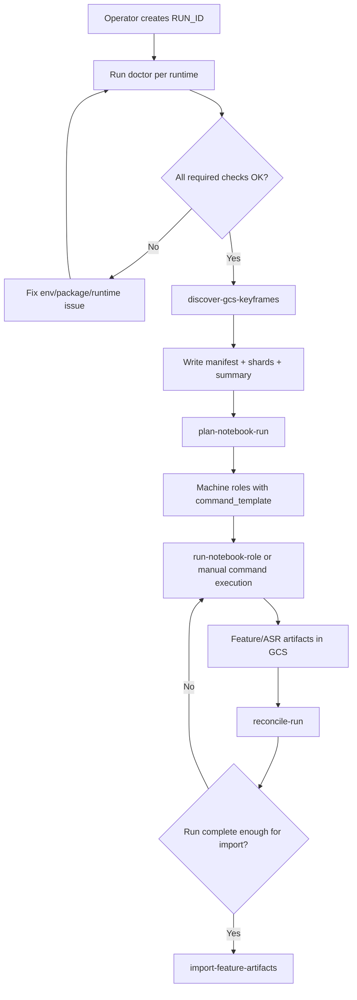
```mermaid
flowchart TD
  Start["Operator creates RUN_ID"] --> Doctor["Run doctor per runtime"]
  Doctor --> DoctorOK{"All required checks OK?"}
  DoctorOK -- "No" --> Fix["Fix env/package/runtime issue"]
  Fix --> Doctor
  DoctorOK -- "Yes" --> Discover["discover-gcs-keyframes"]
  Discover --> Manifest["Write manifest + shards + summary"]
  Manifest --> Plan["plan-notebook-run"]
  Plan --> Roles["Machine roles with command_template"]
  Roles --> Execute["run-notebook-role or manual command execution"]
  Execute --> Artifacts["Feature/ASR artifacts in GCS"]
  Artifacts --> Reconcile["reconcile-run"]
  Reconcile --> Ready{"Run complete enough for import?"}
  Ready -- "No" --> Execute
  Ready -- "Yes" --> Import["import-feature-artifacts"]
```

### 7.2 Sequence Diagram

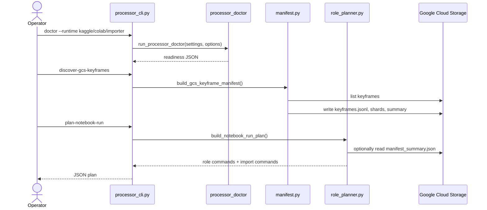
```mermaid
sequenceDiagram
  actor Operator
  participant CLI as processor_cli.py
  participant Doctor as processor_doctor
  participant Manifest as manifest.py
  participant Planner as role_planner.py
  participant GCS as Google Cloud Storage

  Operator->>CLI: doctor --runtime kaggle/colab/importer
  CLI->>Doctor: run_processor_doctor(settings, options)
  Doctor-->>CLI: readiness JSON
  Operator->>CLI: discover-gcs-keyframes
  CLI->>Manifest: build_gcs_keyframe_manifest()
  Manifest->>GCS: list keyframes
  Manifest->>GCS: write keyframes.jsonl, shards, summary
  Operator->>CLI: plan-notebook-run
  CLI->>Planner: build_notebook_run_plan()
  Planner->>GCS: optionally read manifest_summary.json
  Planner-->>CLI: role commands + import commands
  CLI-->>Operator: JSON plan
```

### 7.3 Class Diagram

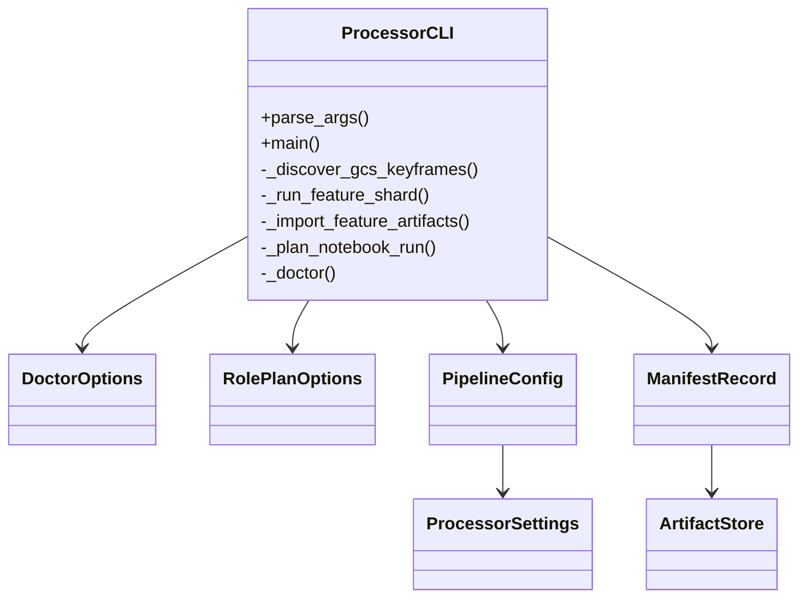
```mermaid
classDiagram
  class ProcessorCLI {
    +parse_args()
    +main()
    -_discover_gcs_keyframes()
    -_run_feature_shard()
    -_import_feature_artifacts()
    -_plan_notebook_run()
    -_doctor()
  }
  class DoctorOptions
  class RolePlanOptions
  class PipelineConfig
  class ProcessorSettings
  class ManifestRecord
  class ArtifactStore

  ProcessorCLI --> DoctorOptions
  ProcessorCLI --> RolePlanOptions
  ProcessorCLI --> PipelineConfig
  PipelineConfig --> ProcessorSettings
  ProcessorCLI --> ManifestRecord
  ManifestRecord --> ArtifactStore
```

## 8. Feature Shard Flow

The feature shard path is used by all image-frame model flows: visual embedding, object detection, OCR, and captioning.

### 8.1 Flow Diagram

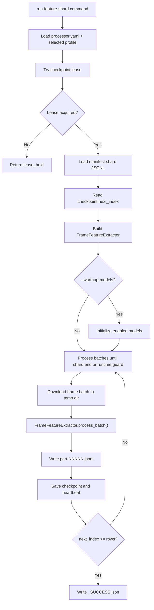
```mermaid
flowchart TD
  Cmd["run-feature-shard command"] --> LoadCfg["Load processor.yaml + selected profile"]
  LoadCfg --> Claim["Try checkpoint lease"]
  Claim --> LeaseOK{"Lease acquired?"}
  LeaseOK -- "No" --> StopLease["Return lease_held"]
  LeaseOK -- "Yes" --> LoadShard["Load manifest shard JSONL"]
  LoadShard --> Resume["Read checkpoint.next_index"]
  Resume --> BuildExtractor["Build FrameFeatureExtractor"]
  BuildExtractor --> Warmup{"--warmup-models?"}
  Warmup -- "Yes" --> InitModels["Initialize enabled models"]
  Warmup -- "No" --> Loop
  InitModels --> Loop["Process batches until shard end or runtime guard"]
  Loop --> Download["Download frame batch to temp dir"]
  Download --> Infer["FrameFeatureExtractor.process_batch()"]
  Infer --> Artifact["Write part-NNNNN.jsonl"]
  Artifact --> Save["Save checkpoint and heartbeat"]
  Save --> Done{"next_index >= rows?"}
  Done -- "No" --> Loop
  Done -- "Yes" --> Success["Write _SUCCESS.json"]
```

### 8.2 Sequence Diagram

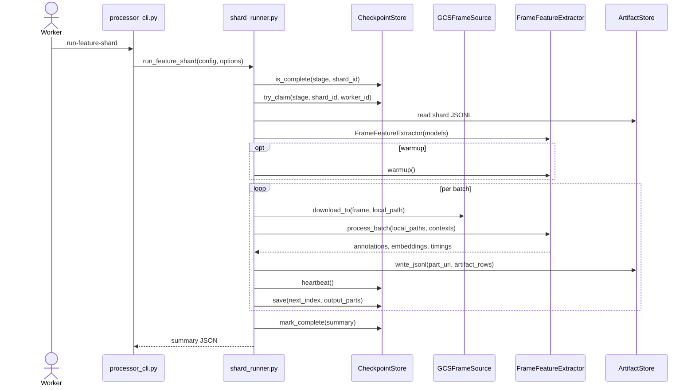
```mermaid
sequenceDiagram
  actor Worker
  participant CLI as processor_cli.py
  participant Runner as shard_runner.py
  participant Checkpoint as CheckpointStore
  participant Source as GCSFrameSource
  participant Extractor as FrameFeatureExtractor
  participant Store as ArtifactStore

  Worker->>CLI: run-feature-shard
  CLI->>Runner: run_feature_shard(config, options)
  Runner->>Checkpoint: is_complete(stage, shard_id)
  Runner->>Checkpoint: try_claim(stage, shard_id, worker_id)
  Runner->>Store: read shard JSONL
  Runner->>Extractor: FrameFeatureExtractor(models)
  opt warmup
    Runner->>Extractor: warmup()
  end
  loop per batch
    Runner->>Source: download_to(frame, local_path)
    Runner->>Extractor: process_batch(local_paths, contexts)
    Extractor-->>Runner: annotations, embeddings, timings
    Runner->>Store: write_jsonl(part_uri, artifact_rows)
    Runner->>Checkpoint: heartbeat()
    Runner->>Checkpoint: save(next_index, output_parts)
  end
  Runner->>Checkpoint: mark_complete(summary)
  Runner-->>CLI: summary JSON
```

### 8.3 Class Diagram

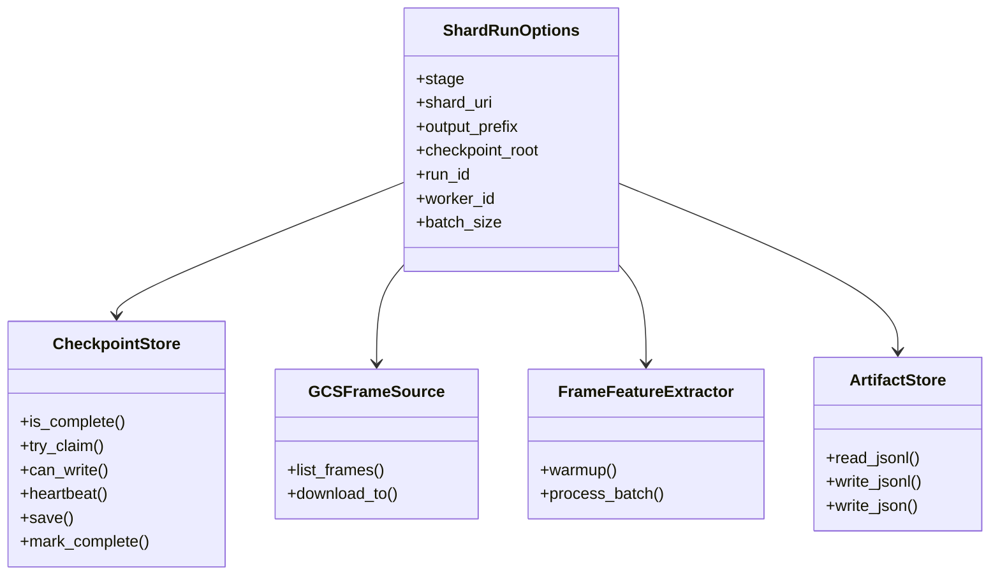
```mermaid
classDiagram
  class ShardRunOptions {
    +stage
    +shard_uri
    +output_prefix
    +checkpoint_root
    +run_id
    +worker_id
    +batch_size
  }
  class CheckpointStore {
    +is_complete()
    +try_claim()
    +can_write()
    +heartbeat()
    +save()
    +mark_complete()
  }
  class GCSFrameSource {
    +list_frames()
    +download_to()
  }
  class ArtifactStore {
    +read_jsonl()
    +write_jsonl()
    +write_json()
  }
  class FrameFeatureExtractor {
    +warmup()
    +process_batch()
  }

  ShardRunOptions --> CheckpointStore
  ShardRunOptions --> GCSFrameSource
  ShardRunOptions --> FrameFeatureExtractor
  ShardRunOptions --> ArtifactStore
```

## 9. Visual Embedding Flow

### 9.1 Configuration

| Profile | Model | Collection | Batch Size | Runtime |
| --- | --- | --- | --- | --- |
| `visual_primary_pe_core` | `hf-hub:timm/PE-Core-bigG-14-448` | `keyframe_embeddings_pe_core_bigG_14_448` | `16` | Kaggle GPU |
| `visual_secondary_openclip_vith14` | `ViT-H-14`, `laion2b_s32b_b79k` | `keyframe_embeddings_openclip_vith14` | `24` | Kaggle GPU |
| `embedding_only` / default | `hf-hub:timm/PE-Core-bigG-14-448` | `keyframe_embeddings_pe_core_bigG_14_448` | `16` | Local/direct primary embedding |

### 9.2 Flow Diagram

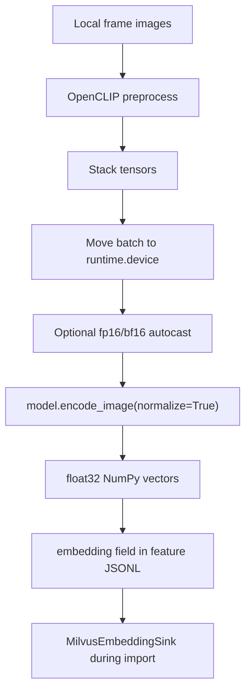
```mermaid
flowchart TD
  Images["Local frame images"] --> Preprocess["OpenCLIP preprocess"]
  Preprocess --> Tensor["Stack tensors"]
  Tensor --> Device["Move batch to runtime.device"]
  Device --> Autocast["Optional fp16/bf16 autocast"]
  Autocast --> Encode["model.encode_image(normalize=True)"]
  Encode --> Numpy["float32 NumPy vectors"]
  Numpy --> Artifact["embedding field in feature JSONL"]
  Artifact --> Import["MilvusEmbeddingSink during import"]
```

### 9.3 Sequence Diagram

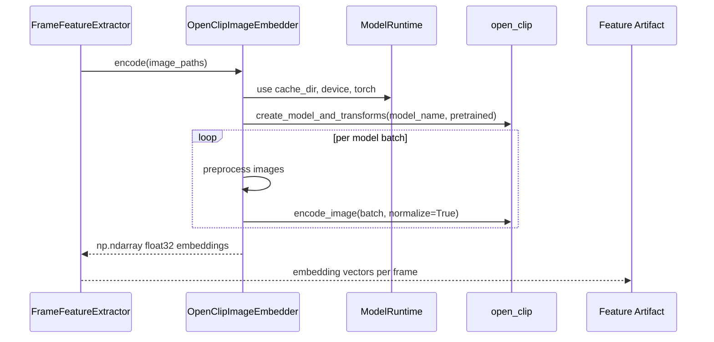
```mermaid
sequenceDiagram
  participant FFE as FrameFeatureExtractor
  participant Emb as OpenClipImageEmbedder
  participant RT as ModelRuntime
  participant OC as open_clip
  participant Artifact as Feature Artifact

  FFE->>Emb: encode(image_paths)
  Emb->>RT: use cache_dir, device, torch
  Emb->>OC: create_model_and_transforms(model_name, pretrained)
  loop per model batch
    Emb->>Emb: preprocess images
    Emb->>OC: encode_image(batch, normalize=True)
  end
  Emb-->>FFE: np.ndarray float32 embeddings
  FFE-->>Artifact: embedding vectors per frame
```

### 9.4 Class Diagram

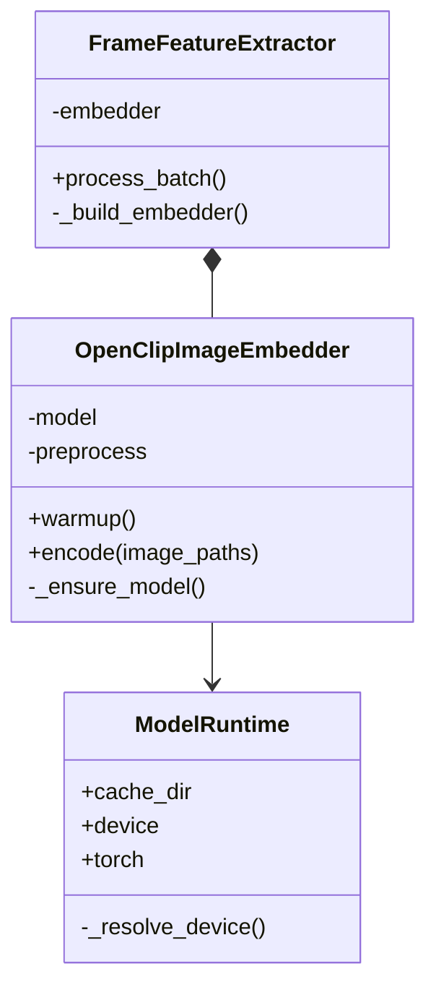
```mermaid
classDiagram
  class FrameFeatureExtractor {
    -embedder
    +process_batch()
    -_build_embedder()
  }
  class OpenClipImageEmbedder {
    -model
    -preprocess
    +warmup()
    +encode(image_paths)
    -_ensure_model()
  }
  class ModelRuntime {
    +cache_dir
    +device
    +torch
    -_resolve_device()
  }

  FrameFeatureExtractor *-- OpenClipImageEmbedder
  OpenClipImageEmbedder --> ModelRuntime
```

## 10. Object Detection Flow

### 10.1 Configuration

| Profile | Provider | Model | Output Sink |
| --- | --- | --- | --- |
| `objects_only` | YOLO/Ultralytics | `yolo12n.pt` | PostgreSQL + Elasticsearch |
| `smoke` | YOLO/Ultralytics | `yolo12n.pt` | Used for lightweight validation |
| `full` | YOLO/Ultralytics | `yolo12n.pt` default unless overridden | Combined with other features |

### 10.2 Flow Diagram

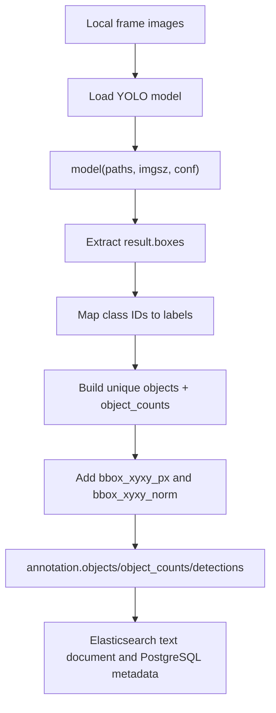
```mermaid
flowchart TD
  Images["Local frame images"] --> Load["Load YOLO model"]
  Load --> Infer["model(paths, imgsz, conf)"]
  Infer --> Boxes["Extract result.boxes"]
  Boxes --> Labels["Map class IDs to labels"]
  Labels --> Counts["Build unique objects + object_counts"]
  Counts --> BBox["Add bbox_xyxy_px and bbox_xyxy_norm"]
  BBox --> Artifact["annotation.objects/object_counts/detections"]
  Artifact --> Search["Elasticsearch text document and PostgreSQL metadata"]
```

### 10.3 Sequence Diagram

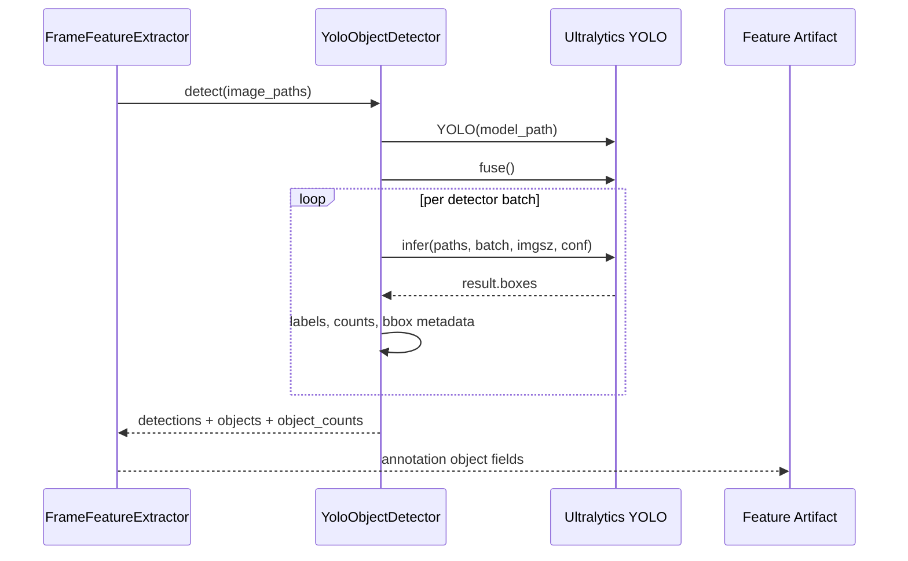
```mermaid
sequenceDiagram
  participant FFE as FrameFeatureExtractor
  participant Obj as YoloObjectDetector
  participant YOLO as Ultralytics YOLO
  participant Artifact as Feature Artifact

  FFE->>Obj: detect(image_paths)
  Obj->>YOLO: YOLO(model_path)
  Obj->>YOLO: fuse()
  loop per detector batch
    Obj->>YOLO: infer(paths, batch, imgsz, conf)
    YOLO-->>Obj: result.boxes
    Obj->>Obj: labels, counts, bbox metadata
  end
  Obj-->>FFE: detections + objects + object_counts
  FFE-->>Artifact: annotation object fields
```

### 10.4 Class Diagram

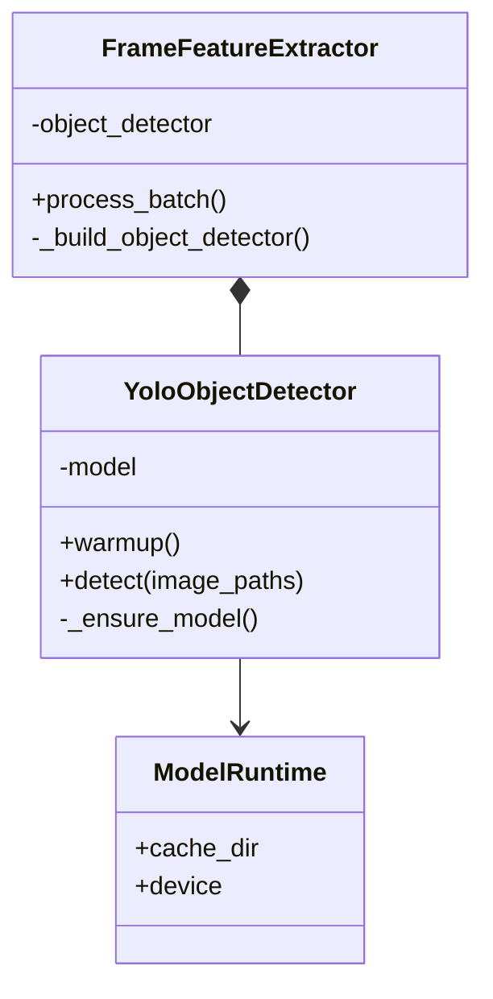
```mermaid
classDiagram
  class FrameFeatureExtractor {
    -object_detector
    +process_batch()
    -_build_object_detector()
  }
  class YoloObjectDetector {
    -model
    +warmup()
    +detect(image_paths)
    -_ensure_model()
  }
  class ModelRuntime {
    +cache_dir
    +device
  }

  FrameFeatureExtractor *-- YoloObjectDetector
  YoloObjectDetector --> ModelRuntime
```

## 11. OCR Flow

### 11.1 Configuration

| Profile | Provider | Detector | Recognizer | Notes |
| --- | --- | --- | --- | --- |
| `ocr_only` | `vietocr` / `paddle_vietocr` | PaddleOCR `PP-OCRv5_mobile_det` | VietOCR `vgg_seq2seq` | Requires Python 3.11 or 3.12 for OCR stack |
| `craft_easyocr_only` | `craft_easyocr` | EasyOCR/CRAFT | EasyOCR recognizer | Languages default to `vi`, `en` |
| `full` | `vietocr` default | PaddleOCR | VietOCR | Runs with caption/object/embedding |

### 11.2 Flow Diagram

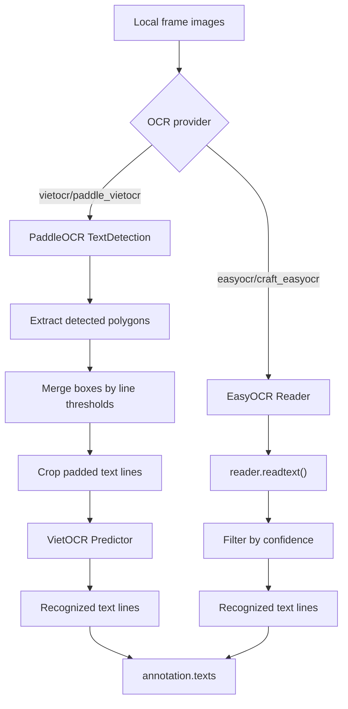
```mermaid
flowchart TD
  Images["Local frame images"] --> Provider{"OCR provider"}
  Provider -- "vietocr/paddle_vietocr" --> Paddle["PaddleOCR TextDetection"]
  Paddle --> Polys["Extract detected polygons"]
  Polys --> Merge["Merge boxes by line thresholds"]
  Merge --> Crop["Crop padded text lines"]
  Crop --> VietOCR["VietOCR Predictor"]
  VietOCR --> TextA["Recognized text lines"]

  Provider -- "easyocr/craft_easyocr" --> Reader["EasyOCR Reader"]
  Reader --> ReadText["reader.readtext()"]
  ReadText --> Filter["Filter by confidence"]
  Filter --> TextB["Recognized text lines"]

  TextA --> Artifact["annotation.texts"]
  TextB --> Artifact
```

### 11.3 Sequence Diagram

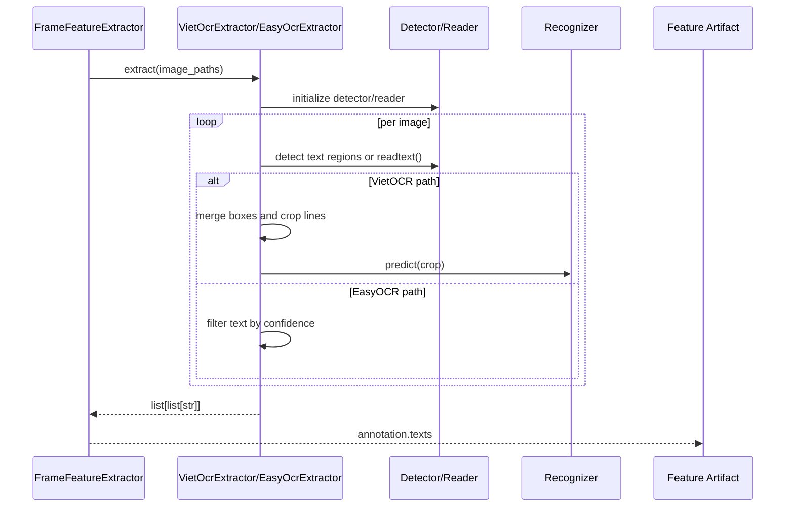
```mermaid
sequenceDiagram
  participant FFE as FrameFeatureExtractor
  participant OCR as VietOcrExtractor/EasyOcrExtractor
  participant Detector as Detector/Reader
  participant Recognizer as Recognizer
  participant Artifact as Feature Artifact

  FFE->>OCR: extract(image_paths)
  OCR->>Detector: initialize detector/reader
  loop per image
    OCR->>Detector: detect text regions or readtext()
    alt VietOCR path
      OCR->>OCR: merge boxes and crop lines
      OCR->>Recognizer: predict(crop)
    else EasyOCR path
      OCR->>OCR: filter text by confidence
    end
  end
  OCR-->>FFE: list[list[str]]
  FFE-->>Artifact: annotation.texts
```

### 11.4 Class Diagram

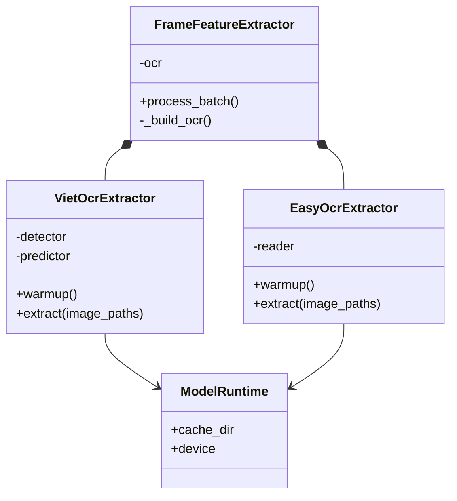
```mermaid
classDiagram
  class FrameFeatureExtractor {
    -ocr
    +process_batch()
    -_build_ocr()
  }
  class VietOcrExtractor {
    -detector
    -predictor
    +warmup()
    +extract(image_paths)
  }
  class EasyOcrExtractor {
    -reader
    +warmup()
    +extract(image_paths)
  }
  class ModelRuntime {
    +cache_dir
    +device
  }

  FrameFeatureExtractor *-- VietOcrExtractor
  FrameFeatureExtractor *-- EasyOcrExtractor
  VietOcrExtractor --> ModelRuntime
  EasyOcrExtractor --> ModelRuntime
```

## 12. Captioning Flow

### 12.1 Configuration

| Profile | Provider | Model | Runtime Dependency |
| --- | --- | --- | --- |
| `caption_only` | `blip2` | `Salesforce/blip2-opt-2.7b` | Transformers, local GPU/RAM-heavy |
| `full_blip2` | `blip2` | `Salesforce/blip2-opt-2.7b` | More GPU/RAM and optional offload |
| `blip2_caption_verification` | `blip2` | `Salesforce/blip2-opt-2.7b` | Heavy caption/verification only |
| `shot_context_caption_qwen_vl` | `openai_compatible_vlm` | `Qwen/Qwen2.5-VL-3B-Instruct` | `VLM_BASE_URL`, optional `VLM_API_KEY` |
| `shot_context_caption_gemini` | `openai_compatible_vlm` | `gemini-1.5-flash` | `GEMINI_OPENAI_BASE_URL`, optional `GEMINI_API_KEY` |

### 12.2 Flow Diagram

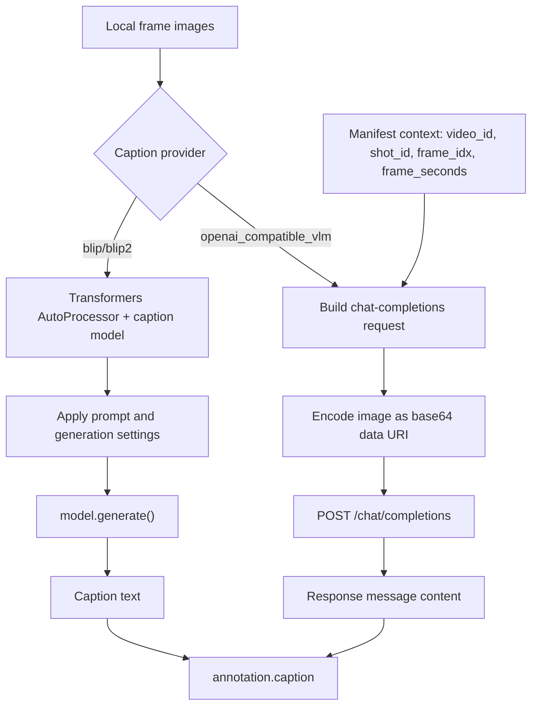
```mermaid
flowchart TD
  Images["Local frame images"] --> Provider{"Caption provider"}
  Context["Manifest context: video_id, shot_id, frame_idx, frame_seconds"] --> VLM

  Provider -- "blip/blip2" --> HF["Transformers AutoProcessor + caption model"]
  HF --> Prompt["Apply prompt and generation settings"]
  Prompt --> Generate["model.generate()"]
  Generate --> CaptionA["Caption text"]

  Provider -- "openai_compatible_vlm" --> VLM["Build chat-completions request"]
  VLM --> DataURI["Encode image as base64 data URI"]
  DataURI --> Endpoint["POST /chat/completions"]
  Endpoint --> CaptionB["Response message content"]

  CaptionA --> Artifact["annotation.caption"]
  CaptionB --> Artifact
```

### 12.3 Sequence Diagram

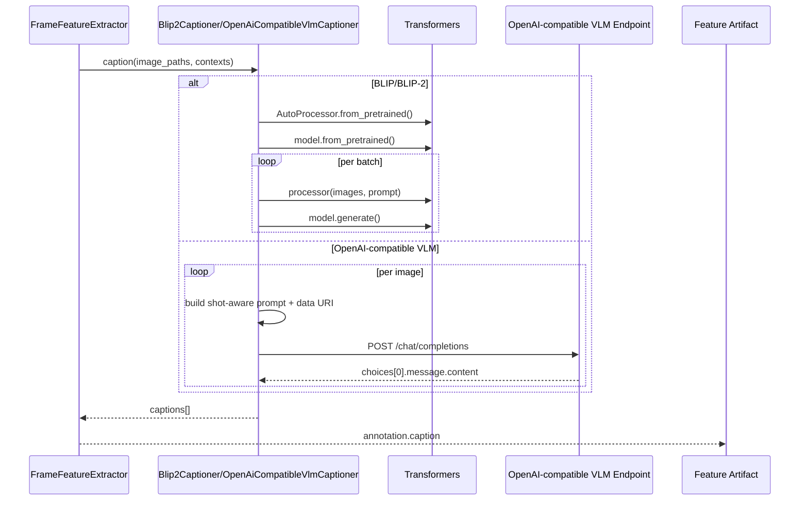
```mermaid
sequenceDiagram
  participant FFE as FrameFeatureExtractor
  participant Cap as Blip2Captioner/OpenAiCompatibleVlmCaptioner
  participant HF as Transformers
  participant VLM as OpenAI-compatible VLM Endpoint
  participant Artifact as Feature Artifact

  FFE->>Cap: caption(image_paths, contexts)
  alt BLIP/BLIP-2
    Cap->>HF: AutoProcessor.from_pretrained()
    Cap->>HF: model.from_pretrained()
    loop per batch
      Cap->>HF: processor(images, prompt)
      Cap->>HF: model.generate()
    end
  else OpenAI-compatible VLM
    loop per image
      Cap->>Cap: build shot-aware prompt + data URI
      Cap->>VLM: POST /chat/completions
      VLM-->>Cap: choices[0].message.content
    end
  end
  Cap-->>FFE: captions[]
  FFE-->>Artifact: annotation.caption
```

### 12.4 Class Diagram

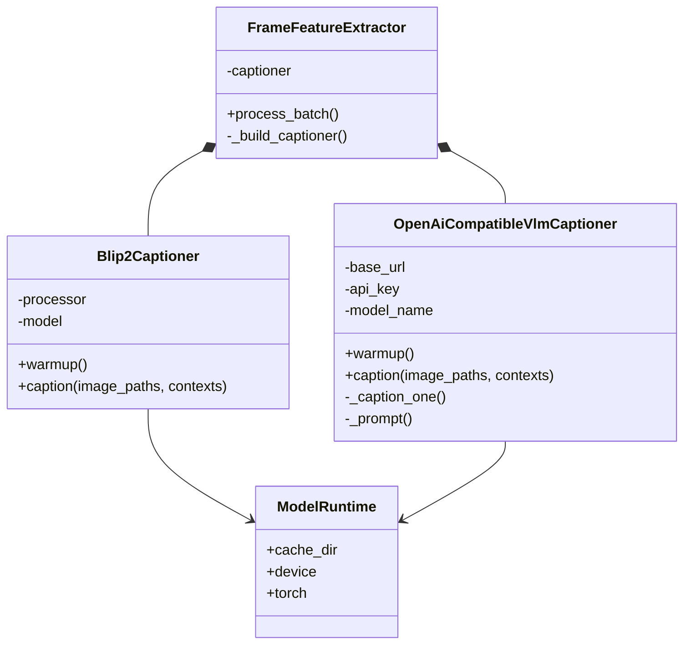
```mermaid
classDiagram
  class FrameFeatureExtractor {
    -captioner
    +process_batch()
    -_build_captioner()
  }
  class Blip2Captioner {
    -processor
    -model
    +warmup()
    +caption(image_paths, contexts)
  }
  class OpenAiCompatibleVlmCaptioner {
    -base_url
    -api_key
    -model_name
    +warmup()
    +caption(image_paths, contexts)
    -_caption_one()
    -_prompt()
  }
  class ModelRuntime {
    +cache_dir
    +device
    +torch
  }

  FrameFeatureExtractor *-- Blip2Captioner
  FrameFeatureExtractor *-- OpenAiCompatibleVlmCaptioner
  Blip2Captioner --> ModelRuntime
  OpenAiCompatibleVlmCaptioner --> ModelRuntime
```

## 13. ASR Flow

ASR is separate from `FrameFeatureExtractor` because it processes raw video files rather than frame images.

### 13.1 Configuration

| Source | Key | Example |
| --- | --- | --- |
| Role YAML | `raw_video_prefix` | `raw/source=kaggle/dataset=ai_challenge_2025/source_version=kaggle_current/batch=L21` |
| Role YAML | `model` | `faster-whisper-small` |
| CLI | `--model-size` | `small` |
| CLI | `--language` | `vi` |
| CLI | `--device` | `auto` |
| CLI | `--compute-type` | `auto`, resolved to `float16` on CUDA or `int8` on CPU |

### 13.2 Flow Diagram

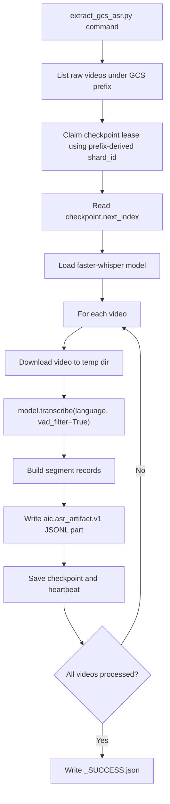
```mermaid
flowchart TD
  Cmd["extract_gcs_asr.py command"] --> List["List raw videos under GCS prefix"]
  List --> Claim["Claim checkpoint lease using prefix-derived shard_id"]
  Claim --> Resume["Read checkpoint.next_index"]
  Resume --> Load["Load faster-whisper model"]
  Load --> Loop["For each video"]
  Loop --> Download["Download video to temp dir"]
  Download --> Transcribe["model.transcribe(language, vad_filter=True)"]
  Transcribe --> Segment["Build segment records"]
  Segment --> Artifact["Write aic.asr_artifact.v1 JSONL part"]
  Artifact --> Save["Save checkpoint and heartbeat"]
  Save --> Done{"All videos processed?"}
  Done -- "No" --> Loop
  Done -- "Yes" --> Success["Write _SUCCESS.json"]
```

### 13.3 Sequence Diagram

```mermaid
sequenceDiagram
  actor Worker
  participant ASR as extract_gcs_asr.py
  participant GCS as Google Cloud Storage
  participant Checkpoint as CheckpointStore
  participant Whisper as faster_whisper.WhisperModel
  participant Store as ArtifactStore

  Worker->>ASR: run_asr(args)
  ASR->>GCS: list raw videos
  ASR->>Checkpoint: try_claim(stage, prefix_shard_id)
  ASR->>Checkpoint: load()
  ASR->>Whisper: WhisperModel(model_size, device, compute_type)
  loop per video
    ASR->>GCS: download video
    ASR->>Whisper: transcribe(local_path, language, vad_filter=True)
    Whisper-->>ASR: segments, info
    ASR->>Store: write_jsonl(part_uri, [asr_record])
    ASR->>Checkpoint: heartbeat()
    ASR->>Checkpoint: save(next_index, output_parts)
  end
  ASR->>Checkpoint: mark_complete(summary)
```

### 13.4 Class Diagram

```mermaid
classDiagram
  class ExtractGcsAsr {
    +parse_args()
    +run_asr(args)
    -_load_model(args)
    -_list_videos()
    -_build_asr_record()
    -_part_uri()
  }
  class CheckpointStore
  class ArtifactStore
  class WhisperModel

  ExtractGcsAsr --> CheckpointStore
  ExtractGcsAsr --> ArtifactStore
  ExtractGcsAsr --> WhisperModel
```

## 14. Text Embedding And Import Flow

Text embeddings are produced during artifact import, not during notebook feature extraction. The importer merges caption, OCR, object labels, and ASR segment text into text records, encodes them with SentenceTransformers, and writes them to a dedicated Milvus collection.

### 14.1 Configuration

| Key | Default |
| --- | --- |
| `models.text_embedding.model_name` | `dangvantuan/vietnamese-embedding` |
| `models.text_embedding.batch_size` | `32` |
| `models.text_embedding.normalize` | `true` |
| Import option | `write_text_embeddings=True` |
| Default Milvus collection | `text_embeddings_vietnamese` |

### 14.2 Flow Diagram

```mermaid
flowchart TD
  Artifacts["Feature + ASR JSONL artifacts"] --> Load["ArtifactStore.list_jsonl/read_jsonl"]
  Load --> Merge["Merge frame artifacts by keyframe_id"]
  Merge --> TextFrame["Build frame_text from caption + OCR + objects"]
  Load --> ASR["Extract ASR segment records"]
  ASR --> TextASR["Build asr_segment text records"]
  TextFrame --> Encode["VietnameseTextEmbedder.encode()"]
  TextASR --> Encode
  Encode --> Payload["TextMilvusPayload"]
  Payload --> Milvus["MilvusTextEmbeddingSink.upsert()"]
```

### 14.3 Sequence Diagram

```mermaid
sequenceDiagram
  participant Importer as import_feature_artifacts()
  participant Store as ArtifactStore
  participant Embedder as VietnameseTextEmbedder
  participant TextSink as MilvusTextEmbeddingSink

  Importer->>Store: list_jsonl(artifact_uris)
  Importer->>Store: read_jsonl(each_file)
  Importer->>Importer: merge frame annotations by keyframe_id
  Importer->>Importer: build frame_text + asr_segment records
  Importer->>Embedder: encode(texts)
  Embedder-->>Importer: vectors
  Importer->>TextSink: upsert(TextMilvusPayload[])
```

### 14.4 Class Diagram

```mermaid
classDiagram
  class ArtifactImportOptions {
    +artifact_uris
    +batch_size
    +write_text_embeddings
    +text_embedding_collection
    +text_embedding_model_name
  }
  class VietnameseTextEmbedder {
    +warmup()
    +encode(texts)
  }
  class MilvusTextEmbeddingSink {
    +upsert(payloads)
  }
  class TextMilvusPayload {
    +id
    +vector
    +keyframe_id
    +video_id
    +text
    +doc_type
  }

  ArtifactImportOptions --> VietnameseTextEmbedder
  VietnameseTextEmbedder --> TextMilvusPayload
  TextMilvusPayload --> MilvusTextEmbeddingSink
```

## 15. Database Import Flow

### 15.1 Flow Diagram

```mermaid
flowchart TD
  Prefix["Artifact URI or prefix"] --> Expand["Expand JSONL files"]
  Expand --> Read["Read each artifact row"]
  Read --> Kind{"schema_version"}
  Kind -- "aic.feature_artifact.v1" --> MergeFrame["Merge annotation by keyframe_id"]
  Kind -- "aic.asr_artifact.v1" --> ASRSegments["Build ASR segment docs"]
  MergeFrame --> Chunks["Chunk frame records"]
  Chunks --> PG{"write_pg?"}
  Chunks --> ES{"write_elasticsearch?"}
  Chunks --> MV{"write_milvus?"}
  PG -- "yes" --> PGSink["PostgresAnnotationSink.upsert"]
  ES -- "yes" --> ESSink["ElasticsearchAnnotationSink.upsert"]
  MV -- "yes and embedding present" --> MVSink["MilvusEmbeddingSink.upsert"]
  ASRSegments --> ASRES{"write_elasticsearch?"}
  ASRES -- "yes" --> ASRIndex["ElasticsearchAsrSink.upsert"]
  MergeFrame --> TextEmb["Text embedding flow"]
  ASRSegments --> TextEmb
```

### 15.2 Sequence Diagram

```mermaid
sequenceDiagram
  actor Operator
  participant CLI as processor_cli.py
  participant Import as ingest_artifacts.py
  participant Store as ArtifactStore
  participant PG as PostgresAnnotationSink
  participant ES as ElasticsearchAnnotationSink
  participant MV as MilvusEmbeddingSink
  participant TXT as MilvusTextEmbeddingSink

  Operator->>CLI: import-feature-artifacts --artifact-uri ...
  CLI->>Import: import_feature_artifacts(config, options)
  Import->>Store: list_jsonl()
  Import->>Store: read_jsonl()
  Import->>Import: merge annotations and build text/asr docs
  opt write text embeddings
    Import->>TXT: upsert(text payloads)
  end
  loop frame chunks
    opt write_pg
      Import->>PG: upsert(frames, annotations)
    end
    opt write_elasticsearch
      Import->>ES: upsert(frames, annotations)
    end
    opt write_milvus
      Import->>MV: upsert(frames_with_embeddings, vectors)
    end
  end
```

### 15.3 Class Diagram

```mermaid
classDiagram
  class SinkConfig {
    +database_url
    +milvus_uri
    +elasticsearch_url
    +dataset_code
    +milvus_collection
    +elasticsearch_index
    +write_pg
    +write_milvus
    +write_elasticsearch
  }
  class ArtifactImportOptions
  class PostgresAnnotationSink {
    +upsert(frames, annotations)
  }
  class ElasticsearchAnnotationSink {
    +upsert(frames, annotations)
  }
  class ElasticsearchAsrSink {
    +upsert(records)
  }
  class MilvusEmbeddingSink {
    +upsert(frames, embeddings)
  }
  class MilvusTextEmbeddingSink {
    +upsert(payloads)
  }

  SinkConfig --> PostgresAnnotationSink
  SinkConfig --> ElasticsearchAnnotationSink
  SinkConfig --> ElasticsearchAsrSink
  SinkConfig --> MilvusEmbeddingSink
  SinkConfig --> MilvusTextEmbeddingSink
  ArtifactImportOptions --> SinkConfig
```

## 16. Direct GCS Annotation Flow

`extract_gcs_annotations.py` is the direct runner. It is useful for local or controlled environments where frame processing and sink writes happen in one process. It does not use manifest shards, role planning, or checkpoint lease semantics.

### 16.1 Flow Diagram

```mermaid
flowchart TD
  Cmd["extract_gcs_annotations.py"] --> Config["Load config + apply CLI overrides"]
  Config --> Source["GCSFrameSource.list_frames()"]
  Source --> Dry{"--dry-run?"}
  Dry -- "Yes" --> Summary["Print frame/video summary"]
  Dry -- "No" --> Extractor["FrameFeatureExtractor"]
  Extractor --> Sink["CloudAnnotationSink"]
  Sink --> Loop["For each frame batch"]
  Loop --> Download["Download frames"]
  Download --> Infer["process_batch()"]
  Infer --> Audit["Optional annotations JSONL audit"]
  Infer --> Fanout["Upsert to PG/Milvus/Elasticsearch"]
  Fanout --> Summary2["Print totals"]
```

### 16.2 Sequence Diagram

```mermaid
sequenceDiagram
  actor Operator
  participant Runner as extract_gcs_annotations.py
  participant Source as GCSFrameSource
  participant Extractor as FrameFeatureExtractor
  participant Sink as CloudAnnotationSink

  Operator->>Runner: run with profile and options
  Runner->>Source: list_frames(prefix, shot_segments, video_ids, limit)
  Runner->>Extractor: FrameFeatureExtractor(model_config)
  opt warmup
    Runner->>Extractor: warmup()
  end
  Runner->>Sink: CloudAnnotationSink(SinkConfig)
  loop frame batches
    Runner->>Source: download_to(each frame)
    Runner->>Extractor: process_batch(local_paths)
    Runner->>Sink: upsert_batch(frames, annotations, embeddings)
  end
```

### 16.3 Class Diagram

```mermaid
classDiagram
  class ExtractGcsAnnotations {
    +parse_args()
    +main()
    -_download_batch()
  }
  class GCSFrameSource
  class FrameFeatureExtractor
  class CloudAnnotationSink {
    +upsert_batch()
  }
  class SinkConfig

  ExtractGcsAnnotations --> GCSFrameSource
  ExtractGcsAnnotations --> FrameFeatureExtractor
  ExtractGcsAnnotations --> CloudAnnotationSink
  CloudAnnotationSink --> SinkConfig
```

## 17. Artifact Contracts

Detailed per-flow input/output field definitions are in Section 6.1. This section gives compact examples of the two durable JSONL artifact families.

### 17.1 Feature Artifact

Feature stages write one JSON object per frame:

```json
{
  "schema_version": "aic.feature_artifact.v1",
  "run_id": "mvp_l21_20260723_000000",
  "stage": "visual_primary",
  "shard_id": "shard-00000",
  "worker_id": "kaggle_l21_primary_visual",
  "attempt_id": "kaggle_l21_primary_visual-1780000000",
  "part_index": 0,
  "record_index": 0,
  "created_at": "2026-07-23T00:00:00Z",
  "frame": {
    "dataset_id": "ai_challenge_2025",
    "batch": "L21",
    "bucket": "aic_ai_2026",
    "blob_name": "processed/keyframes/dataset=ai_challenge_2025/batch=L21/profile=autoshot_v1/video_id=L21_V001/shot_0000_middle_f000001.jpg",
    "video_id": "L21_V001",
    "keyframe_id": "L21_V001_F000001",
    "shot_id": "L21_V001_S0000",
    "shot_index": 0,
    "image_name": "shot_0000_middle_f000001.jpg",
    "frame_idx": 1,
    "frame_seconds": 1.48,
    "fps": 25.0,
    "frame_type": "middle",
    "manifest_global_index": 0,
    "gcs_uri": "gs://aic_ai_2026/processed/keyframes/..."
  },
  "annotation": {
    "caption": "",
    "texts": ["visible OCR line"],
    "objects": ["person"],
    "object_counts": {"person": 1},
    "detections": [
      {
        "label": "person",
        "confidence": 0.9123,
        "bbox_xyxy_px": [10.0, 20.0, 200.0, 300.0],
        "bbox_xyxy_norm": [0.01, 0.02, 0.2, 0.3]
      }
    ]
  },
  "embedding": [0.0123, 0.0456],
  "timings_seconds": {
    "embedding": 0.12,
    "total": 0.15
  },
  "status": "ok"
}
```

### 17.2 ASR Artifact

ASR writes one JSON object per processed video:

```json
{
  "schema_version": "aic.asr_artifact.v1",
  "run_id": "mvp_l21_20260723_000000",
  "stage": "asr",
  "shard_id": "raw_source-kaggle_dataset-ai_challenge_2025_batch-L21",
  "worker_id": "colab_l21_asr",
  "attempt_id": "colab_l21_asr-1780000000",
  "created_at": "2026-07-23T00:00:00Z",
  "video_id": "L21_V001",
  "source": {
    "video_id": "L21_V001",
    "bucket": "aic_ai_2026",
    "blob_name": "raw/source=kaggle/dataset=ai_challenge_2025/source_version=kaggle_current/batch=L21/L21_V001.mp4",
    "gcs_uri": "gs://aic_ai_2026/raw/source=kaggle/..."
  },
  "segments": [
    {
      "segment_id": "L21_V001_ASR_000000",
      "start_seconds": 0.0,
      "end_seconds": 4.2,
      "text": "xin chao",
      "language": "vi",
      "confidence": null
    }
  ],
  "model": {
    "name": "faster-whisper-small",
    "language": "vi"
  }
}
```

### 17.3 Artifact Path Pattern

```text
<feature_output_prefix>/
  run_id=<RUN_ID>/
  stage=<stage>/
  shard_id=<shard-id>/
  worker_id=<worker-id>/
  attempt_id=<attempt-id>/
  part-00000.jsonl
```

The append-only `worker_id` and `attempt_id` partitions prevent retry runs from overwriting partial artifacts.

## 18. Operational Playbook

### 18.1 Standard L21 Run

1. Set `.env` or notebook secrets.
2. Run `doctor` per target runtime.
3. Create a `RUN_ID`.
4. Run `discover-gcs-keyframes`.
5. Run `plan-notebook-run`.
6. Execute one shard per role, beginning with primary visual.
7. Re-run stopped notebook commands as needed; completed shards return `already_complete`.
8. Run `reconcile-run`.
9. Import primary and secondary visual artifacts to separate Milvus collections.
10. Import object/OCR/caption/ASR artifacts to PostgreSQL and Elasticsearch.
11. Build text embeddings during import.
12. Smoke test retrieval with backend profile `competition_mvp_v1`.

### 18.2 Runtime Assignment Guidance

| Runtime | Best Stages | Reason |
| --- | --- | --- |
| Kaggle GPU | `visual_primary`, `visual_secondary`, `objects` | High GPU throughput, good for visual embedding and YOLO |
| Colab GPU | `ocr`, `caption`, `asr` | More flexible runtime for OCR/ASR dependencies and VLM proxy work |
| Local/backend machine | `import-feature-artifacts`, `reconcile-run` | Has trusted database credentials and durable network access |

### 18.3 Failure Behavior

| Failure | Expected Behavior | Recovery |
| --- | --- | --- |
| Notebook stops mid-shard | Last saved `checkpoint.next_index` is retained | Re-run same command after lease expires or with same worker |
| Worker loses lease | Worker stops before writing more checkpoint state | Start another worker after validating old session is stopped |
| One model batch fails | `failed` increments and runner advances cursor | Inspect logs/artifacts; reprocess if needed with new run or repaired shard |
| Sink import fails | Depends on `fail_on_sink_error` and CLI flags | Fix sink endpoint/credentials, re-run import; artifacts are durable |
| `_SUCCESS.json` exists | Shard is treated as complete | No action needed unless forced repair is required |
| `doctor` fails | Command exits non-zero | Install package, switch Python version, or set missing env var |

## 19. How To Read Each Reported Output

| Output | Produced By | Meaning |
| --- | --- | --- |
| `manifest_summary.json` | `discover-gcs-keyframes` | Canonical frame count, shard root, and shard URI list |
| `checkpoint.json` | `CheckpointStore.save()` | Current cursor, processed count, failed count, output parts |
| `lease.json` | `CheckpointStore.try_claim()` / `heartbeat()` | Worker ownership and lease expiration |
| `_SUCCESS.json` | `CheckpointStore.mark_complete()` | Terminal shard completion marker |
| `part-*.jsonl` | feature/ASR workers | Append-only feature or ASR artifacts |
| Import summary JSON | `import-feature-artifacts` | Counts for records, ASR records, text records, PG/ES/Milvus writes |
| Doctor report JSON | `doctor` | Runtime/package/env/GCS readiness |
| Reconcile report JSON | `reconcile-run` | Whether artifacts and checkpoints are sufficient for import |

## 20. Extension Points

| Need | Extension Point | Expected Change |
| --- | --- | --- |
| Add a new image embedding model | `models.embedding` profile plus `OpenClipImageEmbedder` if provider remains OpenCLIP | New profile and Milvus collection |
| Add a non-OpenCLIP embedder | `FrameFeatureExtractor._build_embedder()` | Add provider branch and extractor class |
| Add a new caption backend | `FrameFeatureExtractor._build_captioner()` | Add provider branch and captioner class |
| Add a new OCR backend | `FrameFeatureExtractor._build_ocr()` | Add provider branch and OCR extractor |
| Add another sink | `cloud_sinks/` and `ingest_artifacts.py` | New sink adapter and import fan-out |
| Add scheduler automation | Outside current scope | Run rendered commands via orchestrator while preserving checkpoint contract |

## 21. Appendix: Model Flow Comparison

| Flow | Input | Main Class | Output Artifact Field | Import Destination |
| --- | --- | --- | --- | --- |
| Primary visual embedding | Keyframe image | `OpenClipImageEmbedder` | `embedding` | `keyframe_embeddings_pe_core_bigG_14_448` |
| Secondary visual embedding | Keyframe image | `OpenClipImageEmbedder` | `embedding` | `keyframe_embeddings_openclip_vith14` |
| Object detection | Keyframe image | `YoloObjectDetector` | `annotation.objects`, `detections` | PostgreSQL + Elasticsearch |
| OCR | Keyframe image | `VietOcrExtractor` or `EasyOcrExtractor` | `annotation.texts` | PostgreSQL + Elasticsearch + text Milvus |
| Captioning | Keyframe image + context | `Blip2Captioner` or `OpenAiCompatibleVlmCaptioner` | `annotation.caption` | PostgreSQL + Elasticsearch + text Milvus |
| ASR | Raw video | `extract_gcs_asr.py` + `WhisperModel` | `segments[]` | Elasticsearch ASR index + text Milvus |
| Text embedding | Merged text | `VietnameseTextEmbedder` | Milvus text vector payload | `text_embeddings_vietnamese` |

## 22. Appendix: Class Diagram For Model Stack

```mermaid
classDiagram
  class FrameFeatureExtractor {
    +config
    +runtime
    +embedder
    +captioner
    +ocr
    +object_detector
    +warmup()
    +process_batch(image_paths, contexts)
  }
  class ModelRuntime {
    +config
    +cache_dir
    +device
    +torch
  }
  class OpenClipImageEmbedder {
    +warmup()
    +encode(image_paths)
  }
  class Blip2Captioner {
    +warmup()
    +caption(image_paths, contexts)
  }
  class OpenAiCompatibleVlmCaptioner {
    +warmup()
    +caption(image_paths, contexts)
  }
  class VietOcrExtractor {
    +warmup()
    +extract(image_paths)
  }
  class EasyOcrExtractor {
    +warmup()
    +extract(image_paths)
  }
  class YoloObjectDetector {
    +warmup()
    +detect(image_paths)
  }

  FrameFeatureExtractor --> ModelRuntime
  FrameFeatureExtractor *-- OpenClipImageEmbedder
  FrameFeatureExtractor *-- Blip2Captioner
  FrameFeatureExtractor *-- OpenAiCompatibleVlmCaptioner
  FrameFeatureExtractor *-- VietOcrExtractor
  FrameFeatureExtractor *-- EasyOcrExtractor
  FrameFeatureExtractor *-- YoloObjectDetector
  OpenClipImageEmbedder --> ModelRuntime
  Blip2Captioner --> ModelRuntime
  OpenAiCompatibleVlmCaptioner --> ModelRuntime
  VietOcrExtractor --> ModelRuntime
  EasyOcrExtractor --> ModelRuntime
  YoloObjectDetector --> ModelRuntime
```

## 23. Appendix: Sequence Diagram For A Complete Run

```mermaid
sequenceDiagram
  actor Operator
  participant CLI as processor_cli.py
  participant GCS as GCS
  participant Worker as Kaggle/Colab Worker
  participant CP as CheckpointStore
  participant FE as FrameFeatureExtractor
  participant Importer as Importer Machine
  participant DB as PG/ES/Milvus

  Operator->>CLI: doctor
  CLI-->>Operator: readiness report
  Operator->>CLI: discover-gcs-keyframes
  CLI->>GCS: write manifest and shards
  Operator->>CLI: plan-notebook-run
  CLI-->>Operator: role commands
  Operator->>Worker: run role command
  Worker->>CP: claim lease
  Worker->>GCS: read shard and download frames
  Worker->>FE: process_batch()
  FE-->>Worker: annotations + embeddings
  Worker->>GCS: write feature artifact part
  Worker->>CP: save checkpoint
  Worker->>CP: mark _SUCCESS
  Operator->>CLI: reconcile-run
  CLI-->>Operator: completeness report
  Operator->>Importer: import-feature-artifacts
  Importer->>GCS: read artifacts
  Importer->>DB: write metadata/search/vector records
  Importer-->>Operator: import summary
```

## 24. Google Cloud Storage Layout After Extraction

This is the expected GCS layout when the Kaggle/Colab-first extraction flow is used. The bucket and roots come from `notebook_roles.yaml`, `processor_cli.py`, and command-line arguments.

### 24.1 Source Inputs

Keyframe image inputs:

```text
gs://<GCS_BUCKET>/
  processed/
    keyframes/
      dataset=<dataset_id>/
        batch=<batch>/
          profile=<frame_profile>/
            video_id=<video_id>/
              <image_name>.jpg
```

Example:

```text
gs://aic_ai_2026/processed/keyframes/dataset=ai_challenge_2025/batch=L21/profile=autoshot_v1/video_id=L21_V001/shot_0000_middle_f000001.jpg
```

Raw video inputs for ASR:

```text
gs://<GCS_BUCKET>/
  raw/
    source=kaggle/
      dataset=ai_challenge_2025/
        source_version=kaggle_current/
          batch=<batch>/
            <video_id>.mp4
```

### 24.2 Manifest Outputs

Default manifest root:

```text
gs://aic_ai_2026/manifests/dataset=ai_challenge_2025/pipeline=feature_ingest/
  run_id=<RUN_ID>/
    keyframes.jsonl
    manifest_summary.json
    shards/
      shard-00000.jsonl
      shard-00001.jsonl
      ...
```

Files:

| Path | Type | Contents |
| --- | --- | --- |
| `keyframes.jsonl` | JSONL | One normalized keyframe manifest row per frame |
| `manifest_summary.json` | JSON | Run id, manifest URI, shard root, frame count, shard count, shard URI list |
| `shards/shard-*.jsonl` | JSONL | Manifest rows assigned to one worker shard, with `shard_index` and `shard_local_index` |

### 24.3 Feature And ASR Artifact Outputs

Default feature output prefix:

```text
gs://aic_ai_2026/features/dataset=ai_challenge_2025/frame_profile=autoshot_v1/feature_profile=mvp_v1/
  run_id=<RUN_ID>/
    stage=visual_primary/
      shard_id=<shard-id>/
        worker_id=<worker-id>/
          attempt_id=<attempt-id>/
            part-00000.jsonl
            part-00001.jsonl
    stage=visual_secondary/
      shard_id=<shard-id>/
        worker_id=<worker-id>/
          attempt_id=<attempt-id>/
            part-00000.jsonl
    stage=objects/
      shard_id=<shard-id>/
        worker_id=<worker-id>/
          attempt_id=<attempt-id>/
            part-00000.jsonl
    stage=ocr/
      shard_id=<shard-id>/
        worker_id=<worker-id>/
          attempt_id=<attempt-id>/
            part-00000.jsonl
    stage=caption/
      shard_id=<shard-id>/
        worker_id=<worker-id>/
          attempt_id=<attempt-id>/
            part-00000.jsonl
    stage=asr/
      shard_id=<safe-raw-video-prefix>/
        worker_id=<worker-id>/
          attempt_id=<attempt-id>/
            part-00000.jsonl
```

Stage-specific file contents:

| Stage | File Type | Main JSON Payload |
| --- | --- | --- |
| `visual_primary` | JSONL | `aic.feature_artifact.v1`; `embedding` contains PE-Core visual vector |
| `visual_secondary` | JSONL | `aic.feature_artifact.v1`; `embedding` contains OpenCLIP ViT-H/14 visual vector |
| `objects` | JSONL | `aic.feature_artifact.v1`; `annotation.objects`, `object_counts`, `detections` populated |
| `ocr` | JSONL | `aic.feature_artifact.v1`; `annotation.texts` populated |
| `caption` | JSONL | `aic.feature_artifact.v1`; `annotation.caption` populated |
| `asr` | JSONL | `aic.asr_artifact.v1`; `segments[]` populated per raw video |

The artifact writer is append-only. A retry creates a new `attempt_id` partition instead of overwriting older part files.

### 24.4 Checkpoint Outputs

Default checkpoint root:

```text
gs://aic_ai_2026/checkpoints/pipeline=feature_ingest/
  run_id=<RUN_ID>/
    stage=<stage>/
      shard_id=<shard-id>/
        lease.json
        checkpoint.json
        _SUCCESS.json
```

Checkpoint files:

| File | Type | Contents |
| --- | --- | --- |
| `lease.json` | JSON | `run_id`, `stage`, `shard_id`, `worker_id`, `claimed_at`, `heartbeat_at`, `expires_at_epoch` |
| `checkpoint.json` | JSON | Worker id, attempt id, `next_index`, `next_part_index`, processed/failed counts, row/video count, output part URIs, `updated_at` |
| `_SUCCESS.json` | JSON | Terminal completion marker. Its presence makes the shard `already_complete` on rerun |

### 24.5 Import Outputs

The importer reads artifact JSONL files from GCS and writes to external systems rather than producing new feature files:

| Import Target | Output Structure |
| --- | --- |
| Supabase/PostgreSQL | Dataset, video, shot, frame, and frame annotation rows |
| Elasticsearch frame index | One document per keyframe in `keyframe_annotations` |
| Elasticsearch ASR index | One document per ASR segment in `<keyframe_index>_asr_segments` unless overridden |
| Milvus/Zilliz primary visual collection | `keyframe_embeddings_pe_core_bigG_14_448` |
| Milvus/Zilliz secondary visual collection | `keyframe_embeddings_openclip_vith14` |
| Milvus/Zilliz text collection | `text_embeddings_vietnamese` by default |

If `--report-uri` is passed to `import-feature-artifacts`, the import summary JSON is written to that local or `gs://` URI.
