# AIC Keynote - Tài liệu tổng hợp kỹ thuật

## 0. Mục tiêu tài liệu

Tài liệu này tổng hợp lại các phần chính mà dự án **Multimodal Retrieval Assistant** đã xây dựng cho bài toán truy xuất video trong bối cảnh AIC/Codabench. Mục tiêu không chỉ là ghi lại “đã làm gì”, mà là giải thích **cách hệ thống hoạt động**, vì sao cần từng thành phần, dữ liệu đi qua hệ thống ra sao, và khi trình bày có thể kể câu chuyện kỹ thuật theo một dòng mạch lạc.

Các phần chính:

- **Research trong notebook**: các thí nghiệm xử lý dữ liệu, trích keyframe, embedding, OCR/object/caption, event embedding và query expansion.
- **Frontend**: workspace React dùng để tìm kiếm, xem frame, kiểm chứng video/context và xuất submission.
- **Backend**: FastAPI service điều phối metadata, model runtime, vector search, text search, media và submission.
- **Data ingestion**: pipeline đưa dữ liệu từ Kaggle/Drive/GCS vào hệ thống, tạo artifact, checkpoint và import vào PostgreSQL/Milvus/Elasticsearch.
- **Agent**: lớp query planning bằng LLM/Deep Agents để biến query tự nhiên thành kế hoạch truy xuất.
- **Search pipeline**: luồng retrieval hybrid cho KIS, QA và TRAKE, gồm query normalization, vector/text retrieval, fusion, reranking, temporal search và export.

## 1. Bức tranh tổng thể

Hệ thống được thiết kế theo tư duy **offline-heavy, online-fast**:

- Các bước nặng như tách frame, chạy embedding, OCR, caption, object detection và ASR được làm offline trên Kaggle/Colab/GCS.
- Backend online chỉ cần nhận query, gọi embedding query, tìm trong index đã dựng sẵn, hợp nhất điểm và trả ranked results.
- Frontend tối ưu cho thao tác thi đấu: nhập query, xem kết quả, kiểm chứng bằng context/video và chọn dòng nộp.

Kiến trúc tổng quát:

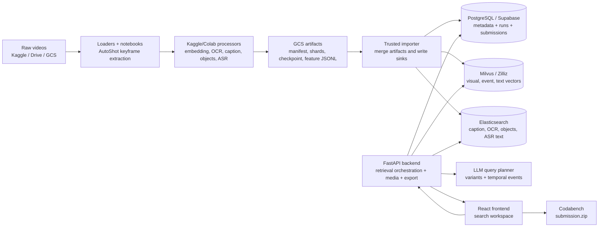

Vai trò của từng kho lưu trữ:

| Thành phần           | Vai trò                                                                                                  |
| -------------------- | -------------------------------------------------------------------------------------------------------- |
| PostgreSQL/Supabase  | Nguồn sự thật cho dataset, video, shot, keyframe, annotation, query run, retrieval result và submission. |
| Milvus/Zilliz        | Vector database cho image/keyframe embedding, event embedding và text embedding.                         |
| Elasticsearch        | Text index cho caption, OCR, object labels và ASR segments.                                              |
| Google Cloud Storage | Lưu raw video, keyframe image, manifest, checkpoint và feature artifact.                                 |
| FastAPI backend      | Điều phối retrieval, media, ingest jobs, model registry và export.                                       |
| React frontend       | Human-in-the-loop workspace cho người thi.                                                               |

Giải thích các thành phần trong sơ đồ:

| Node                                  | Giải thích khi trình bày                                                              |
| ------------------------------------- | ------------------------------------------------------------------------------------- |
| `Raw videos`                          | Nguồn dữ liệu ban đầu: video thô từ Kaggle/Drive hoặc object đã mirror trên GCS.      |
| `Loaders + notebooks`                 | Lớp nghiên cứu và vận hành để chuẩn hóa dữ liệu, tách shot và tạo keyframe.           |
| `Kaggle/Colab processors`             | Worker chạy model nặng offline, không ghi trực tiếp database.                         |
| `GCS artifacts`                       | Vùng trung gian có manifest, shard, checkpoint và JSONL feature; giúp retry và audit. |
| `Trusted importer`                    | Máy tin cậy có credential DB/search/vector, chịu trách nhiệm import tập trung.        |
| `PostgreSQL / Milvus / Elasticsearch` | Ba chỉ mục bổ sung cho nhau: metadata chuẩn, vector similarity và text search.        |
| `FastAPI backend`                     | Ghép các tín hiệu lại thành retrieval result có score breakdown và media URL.         |
| `LLM query planner`                   | Biến query tự nhiên thành variants và temporal events trước khi search.               |
| `React frontend`                      | Giao diện người thi dùng để kiểm chứng kết quả và chọn dòng nộp.                      |

Điểm quan trọng khi trình bày: hệ thống không coi “AI model” là một khối duy nhất. Nó tách thành nhiều tín hiệu: **visual vector**, **caption**, **OCR**, **object**, **ASR**, **temporal structure** và **LLM query planning**. Retrieval tốt đến từ việc phối hợp các tín hiệu này.

## 2. Research trong notebook

Notebook là nơi nhóm thử nghiệm và ổn định các ý tưởng trước khi đóng gói thành script/backend. Có thể chia research thành bốn nhóm:

1. **Loaders**: đưa video/raw data lên cloud và trích keyframe.
2. **Processors/extractors**: tạo embedding, event embedding, OCR, caption và object feature.
3. **Agent notebooks**: nghiên cứu query expansion và đánh giá prompt/model.
4. **Reports**: chuẩn hóa lại contract để backend có thể ingest.

### 2.0 Sơ đồ research-to-production

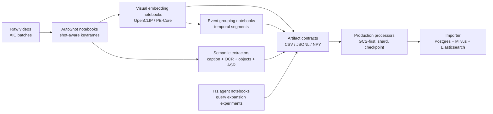

Giải thích thành phần trong luồng research:

| Thành phần                   | Vai trò                                                                                             |
| ---------------------------- | --------------------------------------------------------------------------------------------------- |
| `Raw videos`                 | Dữ liệu gốc theo batch AIC, chưa thể search trực tiếp vì quá dài và nặng.                           |
| `AutoShot notebooks`         | Chứng minh cách tách video thành shot và keyframe đại diện thay vì lấy frame đều.                   |
| `Visual embedding notebooks` | Thử nghiệm đưa keyframe vào không gian vector để phục vụ semantic retrieval.                        |
| `Event grouping notebooks`   | Gom nhiều keyframe liên tiếp thành event để hỗ trợ truy vấn theo chuỗi thời gian.                   |
| `Semantic extractors`        | Sinh tín hiệu phụ: caption, OCR, object label, ASR; đây là phần giúp search không chỉ dựa vào ảnh.  |
| `H1 agent notebooks`         | Nghiên cứu cách biến query tự nhiên thành nhiều biến thể truy xuất ngắn và kiểm soát hallucination. |
| `Artifact contracts`         | Chuẩn hóa output của notebook thành file có schema rõ ràng để backend/importer đọc được.            |
| `Production processors`      | Đóng gói ý tưởng notebook thành luồng có shard, checkpoint, retry và GCS artifact.                  |
| `Importer`                   | Đưa artifact đã chuẩn hóa vào các chỉ mục online: quan hệ, vector và text search.                   |

### 2.1 Video to frame bằng AutoShot

Notebook chính:

- `notebooks/data processing/processors/get-keyframe-autoshot.ipynb`
- `notebooks/data processing/loaders/frame-extraction-v2.ipynb`
- `notebooks/data processing/loaders/frame-extraction-v3-optimized.ipynb`

Bài toán đầu tiên là biến video dài thành một tập frame đại diện đủ nhỏ để index. Nếu lấy frame đều theo thời gian, ta có thể bỏ lỡ các khoảnh khắc quan trọng hoặc tạo quá nhiều frame trùng. Vì vậy notebook dùng hướng **shot-aware keyframe extraction**.

Luồng lý thuyết:

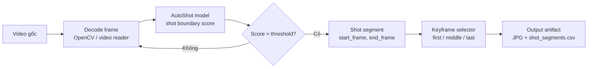

Giải thích thành phần trong luồng AutoShot:

| Thành phần          | Vai trò                                                            |
| ------------------- | ------------------------------------------------------------------ |
| `Video gốc`         | File video dài, chứa nhiều cảnh và chuyển cảnh.                    |
| `Decode frame`      | Đọc frame tuần tự để model có dữ liệu đầu vào.                     |
| `AutoShot model`    | Dự đoán điểm xác suất chuyển cảnh giữa các frame.                  |
| `Score > threshold` | Quyết định vị trí nào là ranh giới shot.                           |
| `Shot segment`      | Khoảng frame liên tục cùng một cảnh/ngữ cảnh.                      |
| `Keyframe selector` | Chọn frame đại diện ở đầu, giữa và cuối shot.                      |
| `Output artifact`   | Ảnh keyframe và metadata `shot_segments.csv` để downstream ingest. |

AutoShot chạy trên frame đã resize nhỏ để phát hiện ranh giới cảnh nhanh hơn. Sau đó frame đại diện được đọc lại từ video gốc bằng OpenCV để giữ chất lượng ảnh tốt. Mỗi shot sinh tối đa ba frame:

- `first`: đầu shot, giúp bắt hành động vừa xuất hiện.
- `middle`: frame đại diện ổn định nhất của shot.
- `last`: cuối shot, giúp bắt trạng thái kết thúc.

Tên keyframe và shot được chuẩn hóa:

```text
shot_id      = <video_id>_S<shot_index:04d>
keyframe_id  = <video_id>_F<frame_idx:06d>
image_name   = shot_0000_middle_f000037.jpg
```

Output quan trọng:

```text
frames/<video_id>/*.jpg
shot_segments.csv
frames_manifest.jsonl
summary.json
errors.jsonl
_SUCCESS
```

`shot_segments.csv` là cầu nối giữa research và backend. Nó chứa `video_id`, `shot_start_frame`, `shot_end_frame`, `frame_idx`, `frame_sec`, `image_storage_key`, `keyframe_id`, `profile_version`, `run_id`. Backend/importer dùng các cột này để tạo `videos`, `shots` và `keyframes`.

### 2.2 Frame to vector bằng OpenCLIP

Notebook chính:

- `notebooks/data processing/processors/keyframe-embeddings.ipynb`
- `notebooks/data processing/extractors/fe-vector-embedding-v1.ipynb`

Mục tiêu là đưa mỗi ảnh keyframe vào cùng một không gian vector với text query. Hệ thống ban đầu dùng OpenCLIP ViT-B/32, sau đó processor production bổ sung PE-Core và OpenCLIP ViT-H/14.

Luồng:

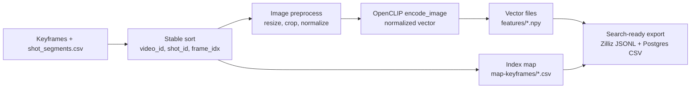

Giải thích thành phần trong luồng embedding:

| Thành phần                      | Vai trò                                                    |
| ------------------------------- | ---------------------------------------------------------- |
| `Keyframes + shot_segments.csv` | Input gồm ảnh và metadata frame/shot đã chuẩn hóa.         |
| `Stable sort`                   | Đảm bảo thứ tự vector trùng tuyệt đối với thứ tự metadata. |
| `Image preprocess`              | Chuẩn hóa ảnh đúng yêu cầu của OpenCLIP.                   |
| `OpenCLIP encode_image`         | Sinh vector L2-normalized cho từng keyframe.               |
| `Vector files`                  | Lưu embedding dạng `.npy` theo video để xử lý batch nhanh. |
| `Index map`                     | Ánh xạ vector index sang `keyframe_id`/frame metadata.     |
| `Search-ready export`           | Định dạng lại output cho Zilliz/Milvus và PostgreSQL.      |

Quy ước rất quan trọng:

```text
vector index i trong .npy <-> dòng n = i + 1 trong map-keyframes/<video_id>.csv
```

Nếu quy ước này bị lệch, retrieval có thể trả đúng vector nhưng sai frame. Vì vậy notebook luôn sort metadata và embedding cùng một thứ tự.

Vector được L2-normalize. Khi đó cosine similarity có thể tính bằng dot product hoặc dùng metric `COSINE` trong Milvus/Zilliz.

Output:

```text
features/<model_folder>/<video_id>.npy
map-keyframes/<video_id>.csv
per_video_summary.csv
model_info.json
zilliz/keyframe_embeddings/*.jsonl
postgres/*.csv
```

### 2.3 Frame to event

Notebook chính:

- `notebooks/data processing/processors/event-embeddings.ipynb`

Keyframe-level retrieval phù hợp với KIS, nhưng TRAKE cần tìm chuỗi sự kiện. Vì vậy nhóm nghiên cứu thêm bước gom keyframe liên tiếp thành event.

Logic gom event:

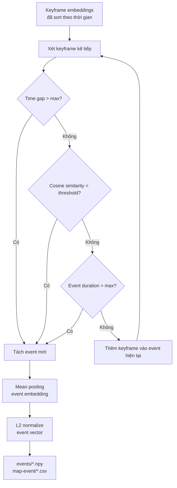

Giải thích thành phần trong luồng event:

| Thành phần            | Vai trò                                                         |
| --------------------- | --------------------------------------------------------------- |
| `Keyframe embeddings` | Chuỗi vector frame đã có thứ tự thời gian trong video.          |
| `Time gap`            | Phát hiện khoảng cách thời gian lớn, thường báo hiệu event mới. |
| `Cosine similarity`   | Đo mức thay đổi nội dung hình ảnh giữa hai keyframe liên tiếp.  |
| `Event duration`      | Chặn event quá dài để giữ tính đặc trưng.                       |
| `Tách event mới`      | Đóng event hiện tại và bắt đầu event tiếp theo.                 |
| `Mean pooling`        | Gộp vector các keyframe trong event thành vector đại diện.      |
| `events/map-event`    | Artifact giúp backend biết event gồm những keyframe nào.        |

Tham số nghiên cứu:

| Tham số                             | Ý nghĩa                                                          |
| ----------------------------------- | ---------------------------------------------------------------- |
| `MAX_TIME_GAP_SEC = 6.0`            | Hai keyframe cách nhau quá 6 giây thì khả năng thuộc event khác. |
| `SCENE_SIMILARITY_THRESHOLD = 0.72` | Nếu embedding thay đổi nhiều, xem là đổi cảnh/ngữ cảnh.          |
| `MAX_EVENT_DURATION_SEC = 45.0`     | Tránh event quá dài làm mất tính đặc trưng.                      |

Output:

```text
events/<video_id>.npy
map-event/<video_id>.csv
event_summary.csv
```

Mỗi event có:

- `event_id`
- `start_sec`, `end_sec`
- `start_frame`, `end_frame`
- danh sách keyframe thuộc event
- event embedding đại diện

Trong backend, event concept được dùng cho hai mục tiêu: lưu cấu trúc thời gian của video và hỗ trợ các chiến lược retrieval theo chuỗi.

### 2.4 Caption, OCR và object feature

Notebook chính:

- `notebooks/data processing/processors/get-features.ipynb`
- `notebooks/data processing/extractors/fe-ocr-v1.ipynb`

Vector ảnh mạnh ở mô tả thị giác tổng quát, nhưng nhiều query trong AIC phụ thuộc vào chữ, biển báo, logo, phụ đề hoặc object cụ thể. Do đó hệ thống tạo thêm metadata dạng text/object.

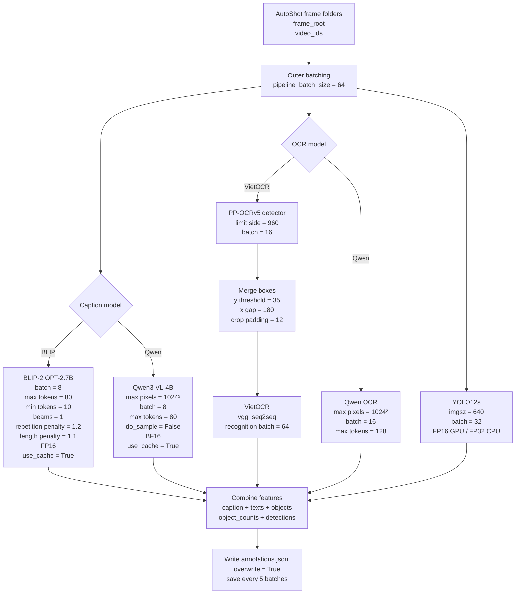

Ba nhánh chính:

| Nhánh            | Model/logic                                                | Output                             |
| ---------------- | ---------------------------------------------------------- | ---------------------------------- |
| Caption          | BLIP-2 hoặc Qwen/Qwen2.5-VL                                | Mô tả ảnh 1-3 câu.                 |
| OCR              | PaddleOCR/CRAFT detect vùng chữ, VietOCR/EasyOCR recognize | Danh sách text trong ảnh.          |
| Object detection | Ultralytics YOLO                                           | Object labels, counts, detections. |

Một record `annotations.jsonl` có dạng:

```json
{
  "video_id": "L30_V001",
  "image_name": "shot_0000_middle_f000037.jpg",
  "caption": "a photo of ...",
  "texts": ["Tuổi Trẻ TV", "tv.tuoitre.vn"],
  "objects": ["person", "tv"],
  "object_counts": { "person": 2, "tv": 1 },
  "detections": [{ "label": "person", "confidence": 0.9342 }]
}
```

Những trường này về sau được import vào:

- `frame_annotations` trong PostgreSQL.
- `keyframe_annotations` trong Elasticsearch.
- `text_embeddings_vietnamese` trong Milvus nếu materialize text vector.

### 2.5 H1 query expansion research

Notebook chính:

- `notebooks/agent/h1_expand_query.ipynb`
- `notebooks/agent/h1_expand_query_pipeline.ipynb`
- `notebooks/agent/h1_experiment.md`

Vấn đề: query AIC thường viết bằng tiếng Việt, dài, chứa nhiều chi tiết thị giác hoặc thứ tự sự kiện. Nếu gửi nguyên query vào embedding/text search, hệ thống có thể bỏ sót từ khóa quan trọng. H1 nghiên cứu cách dùng LLM để tạo các query biến thể ngắn, tiếng Anh, search-ready.

Mục tiêu của H1:

- Giữ đúng ý nghĩa query gốc.
- Không thêm chi tiết không có trong query.
- Tạo đủ đa dạng cho visual search, OCR, ASR, caption và keyword search.
- Output có schema ổn định để backend dùng được.

Synthetic dataset gồm các case KIS/QA/TRAKE, mỗi case có:

- `required_concepts`: concept bắt buộc phải giữ.
- `forbidden_terms`: từ bị cấm để phát hiện hallucination/drift.
- `reference_expansions`: query mẫu để so overlap.

Metric chính:

| Metric                       | Ý nghĩa                                       |
| ---------------------------- | --------------------------------------------- |
| `exact_k`                    | Có trả đúng số lượng query yêu cầu không.     |
| `unique_ratio`               | Tỉ lệ query không trùng.                      |
| `required_concept_coverage`  | Giữ được bao nhiêu concept bắt buộc.          |
| `forbidden_avoidance`        | Tránh hallucination/drift tốt không.          |
| `pairwise_lexical_diversity` | Các query có đủ đa dạng không.                |
| `englishish_score`           | Output có phù hợp cho search tiếng Anh không. |
| `length_score`               | Query có đủ ngắn và search-ready không.       |
| `overall_score`              | Điểm tổng hợp để so prompt/model.             |

Kết quả summary cho thấy cấu hình Groq `openai/gpt-oss-120b` với prompt `keyword_control_v1` có overall score cao nhất trong thí nghiệm H1. Từ đó backend milestone sau đưa query expansion vào production qua `configs/agent.yaml` và `query_planning.py`.

## 3. Frontend

Frontend nằm trong `apps/web`, dùng:

| Thành phần         | Công nghệ                      |
| ------------------ | ------------------------------ |
| Framework          | React 19                       |
| Ngôn ngữ           | TypeScript                     |
| Bundler            | Vite 6                         |
| Styling            | CSS variables + responsive CSS |
| Icon               | lucide-react                   |
| ZIP local fallback | JSZip                          |

Mục tiêu của frontend không phải là landing page, mà là **search workspace** cho người thi: nhập query, xem kết quả nhanh, mở context, xem video, chọn đáp án và xuất ZIP.

### 3.0 Sơ đồ luồng frontend

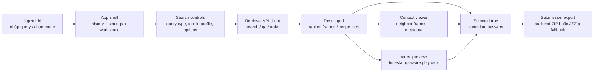

Giải thích thành phần trong luồng frontend:

| Thành phần             | Vai trò                                                                           |
| ---------------------- | --------------------------------------------------------------------------------- |
| `Người thi`            | Người nhập query, đổi mode KIS/QA/TRAKE và kiểm chứng kết quả trước khi nộp.      |
| `App shell`            | Khung điều hướng chính, giữ history, setting và layout ba vùng của workspace.     |
| `Search controls`      | Tạo request contract: dataset, query name, query type, top_k, profile và options. |
| `Retrieval API client` | Chọn endpoint backend tương ứng với KIS, QA hoặc TRAKE.                           |
| `Result grid`          | Hiển thị ranked results, score, thumbnail và sequence nếu là TRAKE.               |
| `Context viewer`       | Cho phép xem các frame lân cận để xác nhận khoảnh khắc có đúng không.             |
| `Video preview`        | Mở video tại timestamp của frame để kiểm tra diễn biến trước/sau.                 |
| `Selected tray`        | Lưu các frame/sequence người dùng chọn để chuẩn bị submission.                    |
| `Submission export`    | Gọi backend validate/export ZIP; nếu lỗi thì dùng JSZip fallback cho demo.        |

### 3.1 App shell

UI chính có ba vùng:

```text
left sidebar       main pane                 right sidebar
history/settings   result grid/chat/auto      selected frames/export/context
```

Ba mode:

| Mode     | Mục đích                                              |
| -------- | ----------------------------------------------------- |
| `Search` | Search thủ công KIS/QA/TRAKE.                         |
| `Auto`   | Search có reasoning trace và mô phỏng workflow agent. |
| `Chat`   | Chat/QA style, có upload file và trace.               |

Điểm đáng chú ý là UI dùng chung nhiều state giữa các mode: `queryType`, `queryName`, `queryText`, `topK`, `results`, `selected`, `context`. Nhờ vậy người dùng có thể chuyển mode mà không mất hoàn toàn ngữ cảnh làm việc.

### 3.2 Data contract frontend-backend

Type chính là `SearchResult`:

```ts
interface SearchResult {
  id: string;
  rank: number;
  video_id: string;
  video_code: string;
  frame_id: string | null;
  frame_idx: number | null;
  timestamp_ms: number | null;
  answer: string | null;
  score: number;
  score_breakdown: Record<string, number | string>;
  sequence_frames: Array<{
    frame_id: string;
    frame_idx: number;
    video_code: string;
    score: number;
  }>;
  thumbnail_url: string | null;
  image_url: string | null;
  image_uri: string | null;
  image_storage_key: string | null;
  video_url: string | null;
  video_uri: string | null;
}
```

Với KIS/QA, result thường là một frame. Với TRAKE, result có thể là một sequence trong `sequence_frames`.

### 3.3 Search flow

Khi người dùng bấm search:

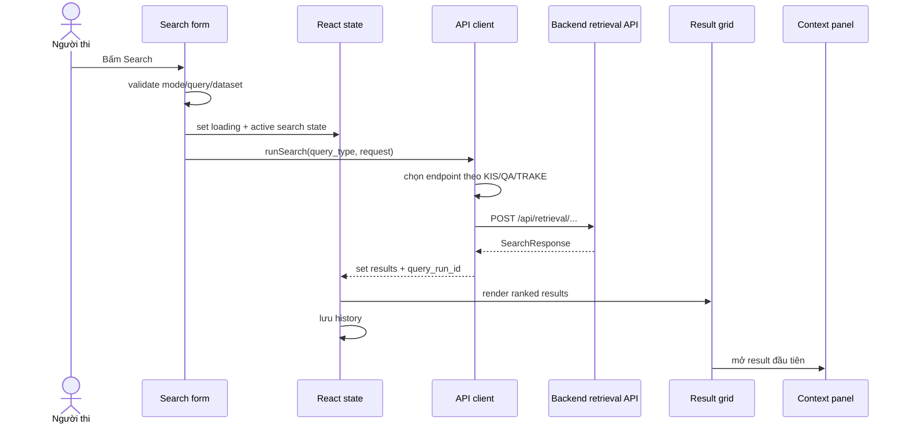

Giải thích thành phần trong search flow frontend:

| Thành phần              | Vai trò                                                   |
| ----------------------- | --------------------------------------------------------- |
| `Search form`           | Thu query và options, validate trước khi gọi backend.     |
| `React state`           | Giữ loading, results, selected, context và history.       |
| `API client`            | Đóng gói request và chọn endpoint phù hợp với query type. |
| `Backend retrieval API` | Thực thi search thật và trả `SearchResponse`.             |
| `Result grid`           | Render ranked results để người dùng scan nhanh.           |
| `Context panel`         | Tự mở result đầu tiên để người dùng kiểm chứng ngay.      |

Endpoint được chọn:

| Query type | Endpoint                     |
| ---------- | ---------------------------- |
| KIS        | `POST /api/retrieval/search` |
| QA         | `POST /api/retrieval/qa`     |
| TRAKE      | `POST /api/retrieval/trake`  |

Request body gồm:

```json
{
  "dataset_id": "...",
  "query_name": "query-1-kis",
  "query_type": "KIS",
  "query_text": "...",
  "top_k": 100,
  "profile": "competition_default",
  "options": {
    "use_query_expansion": true,
    "use_metadata": true,
    "delta_t_max_ms": 180000
  }
}
```

Nếu backend chưa sẵn sàng hoặc dataset rỗng, UI fallback sang mock results để vẫn demo được giao diện. Đây là quyết định thực dụng cho milestone, nhưng khi chạy thi thật thì backend/data phải là nguồn chính.

### 3.4 Media rendering

Frontend không giả định media luôn public. Mỗi frame có nhiều candidate URL:

1. `thumbnail_url`
2. `image_url`
3. `image_uri`
4. `image_storage_key`

Component `CloudFrameImage` thử lần lượt từng candidate. Nếu ảnh lỗi, nó chuyển sang candidate tiếp theo. Nếu tất cả lỗi, nó render placeholder. Nhờ vậy UI chịu được nhiều trạng thái storage:

- local file được backend serve;
- private GCS qua signed redirect;
- public GCS URL;
- object key cần resolve bằng `VITE_GCS_BUCKET`.

Video preview dùng:

```text
/api/media/videos/{video_id}/preview
```

Nếu có `timestamp_ms`, frontend thêm media fragment:

```text
#t=<seconds>
```

để video mở gần frame được retrieve.

### 3.5 Selected rows và submission export

Khi người dùng chọn result, frontend tạo `SubmissionRow`:

```ts
{
  (query_name, query_type, rank, video_code, frame_indices, answer);
}
```

Quy tắc:

- KIS: một frame index.
- QA: một frame index + answer.
- TRAKE: danh sách frame index theo thứ tự.

Export ưu tiên backend:

```text
POST /api/submissions
POST /api/submissions/{id}/items
POST /api/submissions/{id}/export
GET  /api/submissions/{id}/download
```

Nếu backend export lỗi, frontend dùng JSZip tạo local ZIP theo folder `submission/`. Đây là fallback giúp workflow demo không bị chặn.

## 4. Backend

Backend nằm trong `apps/backend`, dùng FastAPI, SQLAlchemy, Pydantic và các adapter cho Milvus, Elasticsearch, object storage và model runtime.

### 4.0 Sơ đồ backend service topology

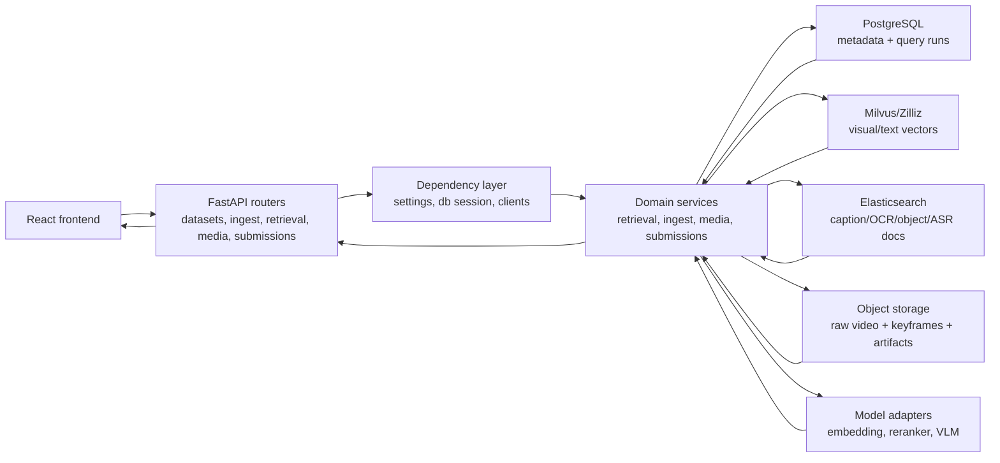

Giải thích thành phần trong topology backend:

| Thành phần         | Vai trò                                                                                   |
| ------------------ | ----------------------------------------------------------------------------------------- |
| `FastAPI routers`  | Lớp HTTP contract, validate request/response và chia endpoint theo module.                |
| `Dependency layer` | Tạo cấu hình, database session và adapter clients theo lifecycle request.                 |
| `Domain services`  | Nơi chứa nghiệp vụ chính: search, ingest, media resolve, submission validate/export.      |
| `PostgreSQL`       | Nguồn sự thật cho metadata, quan hệ video-shot-keyframe, query run và result persistence. |
| `Milvus/Zilliz`    | Chỉ mục vector cho semantic retrieval trên visual/text embedding.                         |
| `Elasticsearch`    | Chỉ mục text/metadata cho caption, OCR, object, ASR và fuzzy keyword search.              |
| `Object storage`   | Lưu raw video, keyframe image, manifest và feature artifact.                              |
| `Model adapters`   | Bao các runtime không ổn định như embedder, reranker hoặc VLM để backend có fallback.     |

### 4.1 Vai trò backend

Backend là lớp điều phối trung tâm:

```text
React frontend
  -> FastAPI routers
  -> domain services
  -> adapters
  -> PostgreSQL / Milvus / Elasticsearch / GCS / model endpoints
```

Các router chính:

| Router             | Vai trò                                              |
| ------------------ | ---------------------------------------------------- |
| `/api/datasets`    | Liệt kê/tạo dataset.                                 |
| `/api/models`      | Đọc model registry.                                  |
| `/api/ingest`      | Demo ingest, upload GCS, upload Milvus.              |
| `/api/pipeline`    | Chạy video pipeline background.                      |
| `/api/jobs`        | Poll trạng thái job.                                 |
| `/api/retrieval`   | Search KIS/QA/TRAKE.                                 |
| `/api/media`       | List frame, frame context, thumbnail, video preview. |
| `/api/submissions` | Validate/export submission ZIP.                      |

### 4.2 Database schema lõi

Schema được thiết kế quanh quan hệ:

```text
Dataset
  -> Video
    -> Shot
      -> Keyframe
        -> FrameAnnotation
    -> Event
      -> EventKeyframe
QueryRun
  -> RetrievalResult
Submission
  -> SubmissionItem
```

Các bảng quan trọng:

| Bảng                | Ý nghĩa                                                                           |
| ------------------- | --------------------------------------------------------------------------------- |
| `datasets`          | Một tập dữ liệu logical, có code, version, root_uri, status.                      |
| `videos`            | Metadata video, đường dẫn raw, fps, duration, kích thước, số keyframe.            |
| `shots`             | Segment theo cảnh, gồm start/end frame và seconds.                                |
| `keyframes`         | Frame đại diện, có `keyframe_id`, `frame_idx`, timestamp, storage key, image URL. |
| `frame_annotations` | Caption/OCR/object/detection/text metadata cho frame.                             |
| `events`            | Đoạn event gom từ nhiều keyframe.                                                 |
| `event_keyframes`   | Mapping event -> keyframe sequence.                                               |
| `query_runs`        | Lưu mỗi lần search và normalized query.                                           |
| `retrieval_results` | Lưu ranked result, score breakdown, selected state.                               |
| `submissions`       | Draft/export status và path ZIP.                                                  |
| `submission_items`  | Dòng nộp bài theo query.                                                          |
| `jobs`              | Background job status/progress/message.                                           |

Điểm cần nhấn mạnh: backend lưu **ID ổn định** (`video_id`, `keyframe_id`, `event_id`) để vector DB, text index, GCS và frontend có thể join lại với nhau.

### 4.3 Dependency và adapter pattern

Backend không gọi trực tiếp Milvus/GCS/Elasticsearch trong router. Thay vào đó:

- `core/deps.py` tạo singleton adapter bằng `lru_cache`.
- Router inject adapter vào service.
- Service chỉ phụ thuộc vào protocol/interface.

Ví dụ:

| Adapter                         | Trách nhiệm                                                               |
| ------------------------------- | ------------------------------------------------------------------------- |
| `MilvusVectorSearchClient`      | `search()`, `upsert()`, tạo collection nếu cần.                           |
| `ElasticsearchTextSearchClient` | `multi_match` search, upsert document.                                    |
| `GCSObjectStorageClient`        | upload object, list, download, public URL, signed URL.                    |
| `OpenAICompatibleTextEmbedder`  | gọi `/embeddings` endpoint theo chuẩn OpenAI-compatible.                  |
| `OpenAICompatibleVisualQaModel` | gọi `/chat/completions` để sinh answer ngắn cho QA.                       |
| `CrossEncoderTextReranker`      | rerank top candidates bằng sentence-transformers hoặc heuristic fallback. |

Adapter pattern giúp backend đổi provider bằng YAML/env thay vì sửa retrieval service.

### 4.4 Model registry

File `configs/model_registry.yaml` mô tả các nhóm model:

- `embedders`: PE-Core, OpenCLIP ViT-H/14, OpenAI-compatible ViT-B/32.
- `ocr`: EasyOCR/CRAFT, Paddle/VietOCR.
- `asr`: faster-whisper.
- `vision_language`: Gemini/Qwen/VLM cho caption/QA.
- `rerankers`: cross-encoder MiniLM.
- `llm`: query expansion fallback.
- `text_embedders`: Vietnamese sentence transformer.

Ở runtime backend hiện hỗ trợ trực tiếp:

- OpenAI-compatible text embedding endpoint cho query embedding.
- OpenAI-compatible query expander nếu bật `llm`.
- OpenAI-compatible visual QA nếu bật VLM.
- Cross-encoder reranker.
- Fallback classes nếu model chưa cấu hình.

Vì vector search yêu cầu query và index cùng vector space, model query-time phải khớp model ingest-time. Đây là lý do registry ghi rõ model, dimension, normalization và collection.

### 4.5 Media service

Media router giải quyết bài toán “frame ở đâu và browser load bằng cách nào”.

Thumbnail endpoint:

```text
GET /api/media/frames/{frame_id}/thumbnail
```

Thứ tự resolve:

1. Tìm file local dưới `DATA_ROOT`.
2. Nếu storage là GCS và có object key, trả signed URL redirect.
3. Nếu có public URL, redirect public URL.
4. Không có media thì trả 404.

Video preview:

```text
GET /api/media/videos/{video_id}/preview
```

Thứ tự resolve:

1. Local video file.
2. Direct HTTP(S) video URL.
3. GCS signed URL.
4. Public GCS URL fallback.

### 4.6 Submission service

Submission service kiểm tra format trước khi export ZIP.

Rule chính:

- Mỗi query tối đa 100 dòng.
- KIS phải có đúng 1 frame index.
- QA phải có đúng 1 frame index, answer tối đa 100 ký tự.
- TRAKE phải có ít nhất 1 frame index và frame index phải tăng nghiêm ngặt.
- `video_code` không được kèm `.mp4`.
- ZIP có cấu trúc `submission/<query_name>.csv`, UTF-8, không header.

Backend ghi `validation_report` gồm errors, warnings và violations chi tiết để frontend có thể báo lỗi.

## 5. Data ingestion

Data ingestion có hai lớp:

1. **Research/prod cloud pipeline** trong notebooks, `scripts/loaders`, `scripts/processors`.
2. **Backend API pipeline** cho upload, demo ingest và background processing.

### 5.1 Kaggle/Drive to GCS raw ingestion

Source of truth:

```text
configs/data_ingestion_sources.yaml
```

Mục tiêu là đưa raw video/archive từ Kaggle hoặc Drive vào GCS theo layout ổn định.

Luồng:

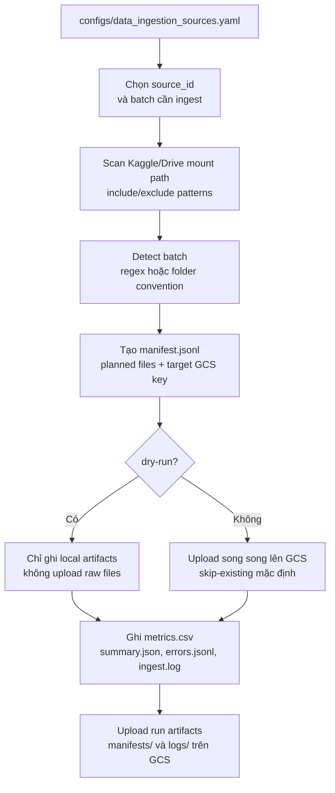

Cách đọc sơ đồ:

| Thành phần | Ý nghĩa                                                                               |
| ---------- | ------------------------------------------------------------------------------------- |
| `Config`   | Nguồn sự thật cho source, dataset id, expected batches, regex batch và GCS prefix.    |
| `Scan`     | Chỉ lập danh sách file từ dữ liệu đã mount, không download Kaggle API trực tiếp.      |
| `Detect`   | Map mỗi file vào batch như `L21`, `K01`; file không map được đi vào `unmapped.jsonl`. |
| `Manifest` | Đóng băng kế hoạch upload để retry/audit không phụ thuộc trạng thái folder thay đổi.  |
| `Upload`   | Đẩy file raw lên GCS theo object key chuẩn, có `skip-existing` để chạy lại an toàn.   |
| `Metrics`  | Tạo dữ liệu vận hành cho dashboard: số file upload/skipped/failed, bytes, duration.   |

Layout raw GCS:

```text
raw/source=<source_type>/
  dataset=<dataset_id>/
    source_version=<source_version>/
      batch=<batch_id>/
        <relative_path>
```

Artifacts vận hành:

```text
ingestion_runs/<run_id>/
  manifest.jsonl
  summary.json
  errors.jsonl
  metrics.csv
  ingest.log
```

Vì ingest raw là bước có nhiều lỗi đường dẫn/batch nhất, pipeline luôn có `--dry-run`, `--max-files`, `--skip-existing` và `--fail-on-unmapped`.

### 5.2 Frame extraction to GCS

Pipeline video-to-frame production theo mô hình:

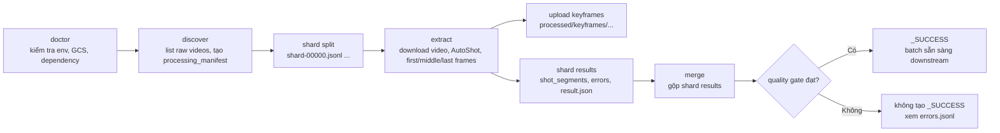

Ý nghĩa:

| Stage      | Vai trò                                                               |
| ---------- | --------------------------------------------------------------------- |
| `doctor`   | Kiểm tra GCS credential, dependency, raw prefix.                      |
| `discover` | List video, tạo `processing_manifest.jsonl`, chia shard.              |
| `extract`  | Download video, chạy AutoShot, upload keyframe và shard result.       |
| `merge`    | Gộp result, chạy quality gate, tạo `shot_segments.csv` và `_SUCCESS`. |

Giải thích thành phần trong luồng:

| Thành phần         | Vai trò kỹ thuật                                                                                 |
| ------------------ | ------------------------------------------------------------------------------------------------ |
| `doctor`           | Fail-fast trước khi tốn GPU/CPU: credential, prefix raw video, AutoShot dependency.              |
| `discover`         | Tạo manifest cố định cho một batch/run, gồm video URI, generation, output prefix.                |
| `shard split`      | Chia manifest để nhiều worker chạy song song và retry riêng phần lỗi.                            |
| `extract`          | Stage nặng nhất: download video, phát hiện shot boundary, trích keyframe chất lượng gốc.         |
| `upload keyframes` | Đưa ảnh và per-video manifest lên `processed/keyframes`.                                         |
| `merge`            | Gộp kết quả từng shard thành `shot_segments.csv` cuối cùng.                                      |
| `quality gate`     | Chặn downstream nếu thiếu video, lỗi, trùng keyframe, sai frame range hoặc ảnh chưa có trên GCS. |

Quality gate trước `_SUCCESS`:

- Video planned đều có result.
- Không có lỗi.
- Keyframe không rỗng.
- Không trùng `keyframe_id`.
- Frame nằm trong shot.
- Profile version đúng.
- Ảnh tồn tại trên GCS.

Điểm này quan trọng vì downstream chỉ nên xử lý batch có `_SUCCESS`, tránh index dữ liệu thiếu hoặc sai.

### 5.3 Processor feature ingest

Processor production nằm trong `scripts/processors`. Đây là phần trưởng thành nhất cho feature ingestion.

Tư duy thiết kế:

- Notebook workers không ghi trực tiếp DB.
- Workers chỉ đọc manifest shard, chạy model, ghi JSONL artifact lên GCS.
- Một importer tin cậy đọc artifact và ghi vào Supabase/PostgreSQL, Milvus/Zilliz, Elasticsearch.

Luồng:

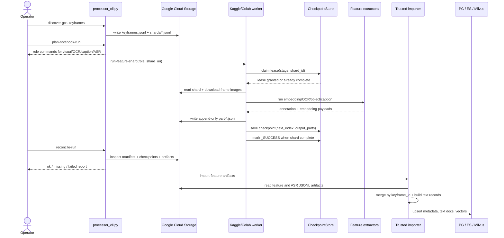

Cách đọc sequence diagram:

| Thành phần           | Giải thích                                                              |
| -------------------- | ----------------------------------------------------------------------- |
| `Operator`           | Người vận hành hoặc notebook control cell khởi tạo run và phân shard.   |
| `processor_cli.py`   | Control plane: discover, plan, run role, reconcile, import.             |
| `GCS`                | Lưu cả input keyframe, manifest/shard, checkpoint và feature artifacts. |
| `CheckpointStore`    | Đảm bảo resume và tránh hai worker ghi cùng shard bằng lease/heartbeat. |
| `Feature extractors` | Model runtime theo stage: PE-Core/OpenCLIP, YOLO, OCR, VLM caption.     |
| `Trusted importer`   | Máy có credential database; notebook worker không cần quyền ghi DB.     |
| `PG / ES / Milvus`   | Ba sink cuối: metadata chuẩn, text search và vector search.             |

Các stage chính:

| Stage              | Runtime phù hợp        | Output                                |
| ------------------ | ---------------------- | ------------------------------------- |
| `visual_primary`   | Kaggle GPU             | PE-Core embedding artifact.           |
| `visual_secondary` | Kaggle GPU             | OpenCLIP ViT-H/14 embedding artifact. |
| `objects`          | Kaggle GPU             | YOLO labels/counts/detections.        |
| `ocr`              | Colab/Python 3.11-3.12 | OCR texts.                            |
| `caption`          | Colab/GPU/VLM endpoint | Shot-context caption.                 |
| `asr`              | Colab/local            | faster-whisper ASR segments.          |

Artifact contract:

```json
{
  "schema_version": "aic.feature_artifact.v1",
  "run_id": "...",
  "stage": "visual_primary",
  "shard_id": "shard-00000",
  "worker_id": "...",
  "attempt_id": "...",
  "frame": {
    "dataset_id": "ai_challenge_2025",
    "batch": "L21",
    "video_id": "L21_V001",
    "keyframe_id": "L21_V001_F000001",
    "frame_idx": 1,
    "frame_seconds": 1.48,
    "gcs_uri": "gs://..."
  },
  "annotation": {
    "caption": "",
    "texts": [],
    "objects": [],
    "object_counts": {},
    "detections": []
  },
  "embedding": [0.0123, 0.0456],
  "status": "ok"
}
```

Checkpoint contract:

```text
checkpoints/pipeline=feature_ingest/
  run_id=<RUN_ID>/
    stage=<stage>/
      shard_id=<shard-id>/
        lease.json
        checkpoint.json
        _SUCCESS.json
```

Các field quan trọng:

- `next_index`: dòng tiếp theo trong shard để resume.
- `next_part_index`: part JSONL tiếp theo.
- `processed`, `failed`: số record đã xử lý.
- `output_parts`: danh sách artifact đã ghi.
- `lease`: worker ownership để tránh hai notebook ghi cùng shard.
- `_SUCCESS.json`: marker shard hoàn tất.

Append-only path có `worker_id` và `attempt_id`, nên retry không ghi đè artifact cũ.

### 5.4 Import artifact vào DB/search/vector

Importer làm ba việc:

1. Đọc toàn bộ JSONL artifact từ một hoặc nhiều URI.
2. Merge theo `keyframe_id`: caption, OCR, objects, detections và embedding.
3. Ghi ra các sink.

Fan-out:

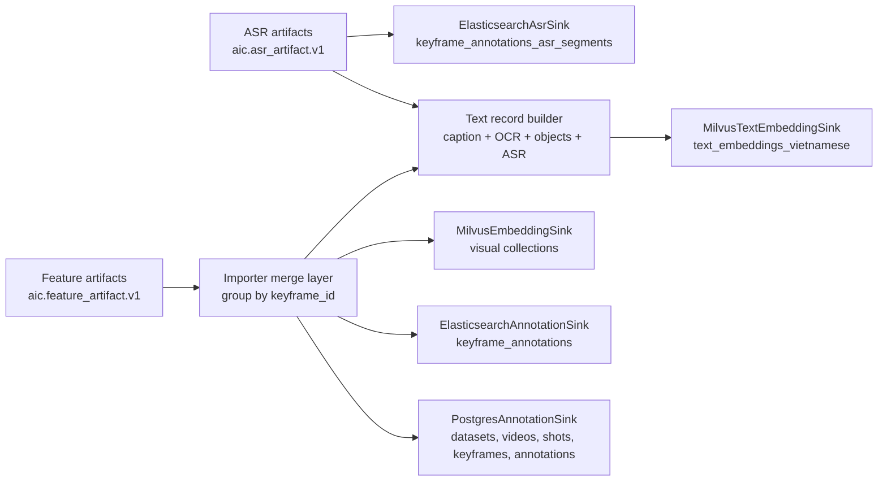

Giải thích fan-out:

| Thành phần                    | Vai trò                                                                            |
| ----------------------------- | ---------------------------------------------------------------------------------- |
| `Feature artifacts`           | Mỗi dòng đại diện một keyframe ở một stage, có thể chứa annotation hoặc embedding. |
| `ASR artifacts`               | Mỗi dòng đại diện một video, bên trong có nhiều speech segments.                   |
| `Importer merge layer`        | Gộp nhiều stage theo `keyframe_id` để một frame có đủ caption/OCR/object/vector.   |
| `Text record builder`         | Tạo văn bản tổng hợp phục vụ text embedding: caption + OCR + object labels + ASR.  |
| `PostgresAnnotationSink`      | Ghi metadata có quan hệ và ID ổn định.                                             |
| `ElasticsearchAnnotationSink` | Ghi document phục vụ keyword/fuzzy/multi-match search.                             |
| `MilvusEmbeddingSink`         | Ghi vector ảnh/event để semantic search.                                           |
| `MilvusTextEmbeddingSink`     | Ghi vector text tiếng Việt để mở rộng search theo semantic text.                   |

Text embedding được tạo bằng `dangvantuan/vietnamese-embedding` từ text đã merge:

```text
caption + OCR texts + object labels + ASR segments
```

Nhờ vậy hệ thống không chỉ có image-vector search mà còn có text-vector search và metadata keyword search.

### 5.5 Backend ingestion endpoints

Backend cung cấp thêm các endpoint thực dụng:

| Endpoint                              | Vai trò                                            |
| ------------------------------------- | -------------------------------------------------- |
| `POST /api/ingest/jobs`               | Demo ingest từ folder `demo/`.                     |
| `POST /api/ingest/upload/gcs`         | Upload folder/zip server-side lên GCS.             |
| `POST /api/ingest/upload/file/gcs`    | Upload file từ browser lên GCS.                    |
| `POST /api/ingest/upload/milvus`      | Upsert `.npy/.npz` vector vào Milvus.              |
| `POST /api/ingest/upload/file/milvus` | Upload vector file từ browser rồi index.           |
| `POST /api/pipeline/jobs`             | Chạy video pipeline background từ raw object keys. |

Lưu ý: backend `pipeline/stages/keyframe_extraction.py` hiện là một stage xử lý video trực tiếp bằng histogram shot detection/OpenCV cho MVP backend pipeline. Production data path vẫn ưu tiên AutoShot notebook/loader và processor GCS-first vì có manifest, shard, checkpoint, quality gate tốt hơn cho dữ liệu lớn.

## 6. Agent

Agent là lớp nằm trước retrieval. Nó không thay thế search engine, mà biến query tự nhiên thành **kế hoạch truy xuất** rõ hơn.

### 6.1 Từ H1 research đến production

H1 chứng minh query expansion có ích nếu:

- output giữ concept gốc;
- không hallucinate;
- tạo variants đủ ngắn;
- tách được các góc visual/OCR/ASR/object/temporal.

Production hóa trong:

- `configs/agent.yaml`
- `apps/backend/app/modules/retrieval/query_planning.py`
- `apps/backend/app/modules/retrieval/service.py`

### 6.2 Deep Agents architecture

Agent production dùng LangChain Deep Agents với một root planner và hai subagent:

| Agent                       | Vai trò                                                                       |
| --------------------------- | ----------------------------------------------------------------------------- |
| `query_planner_agent`       | Điều phối, yêu cầu output JSON duy nhất.                                      |
| `query_decomposition_agent` | Tách subjects, actions, objects, attributes, scene, OCR/text cues, time cues. |
| `query_expansion_agent`     | Sinh retrieval rewrites ngắn cho vector/metadata/OCR/object/temporal.         |

Output schema:

```json
{
  "language": "auto|vi|en|mixed",
  "intent": "KIS|QA|TRAKE|IMAGE|FREEFORM",
  "summary": "one short sentence",
  "search_factors": {
    "subjects": [],
    "actions": [],
    "objects": [],
    "attributes": [],
    "scene": [],
    "text_cues": [],
    "time_cues": [],
    "negative_constraints": []
  },
  "temporal_events": [
    { "order": 1, "query": "standalone event query", "must_have": [] }
  ],
  "variants": [{ "text": "concise retrieval rewrite", "purpose": "semantic" }]
}
```

Backend parse JSON này thành `QueryPlanningResult`:

- `variants`: đưa vào vector search và metadata search.
- `temporal_events`: đưa vào TRAKE/adaptive temporal search.
- `decomposition`: lưu trong `normalized_query` để debug.
- `agent_metadata`: profile/provider/model/config path.

### 6.3 Provider và fallback

Config hiện có hai profile:

| Profile             | Provider   | Model                 | Env key          |
| ------------------- | ---------- | --------------------- | ---------------- |
| `groq_gpt_oss_120b` | ChatGroq   | `openai/gpt-oss-120b` | `GROQ_API_KEY`   |
| `openai_gpt4o`      | ChatOpenAI | `gpt-4o`              | `OPENAI_API_KEY` |

Agent là optional. Nếu thiếu API key, thiếu dependency hoặc remote call lỗi, backend fallback:

```text
source = "fallback"
variants = [query gốc]
temporal_events = heuristic split bằng "then", "sau đó", "tiếp theo", ";", ...
```

Nhờ đó search vẫn chạy được. Đây là thiết kế quan trọng cho demo và vận hành: agent cải thiện retrieval khi có điều kiện, nhưng không làm hệ thống chết khi LLM không khả dụng.

### 6.4 Agent trong lifecycle search

Trong `RetrievalService._normalize_query()`, agent được gọi như một nhánh lập kế hoạch trước retrieval:

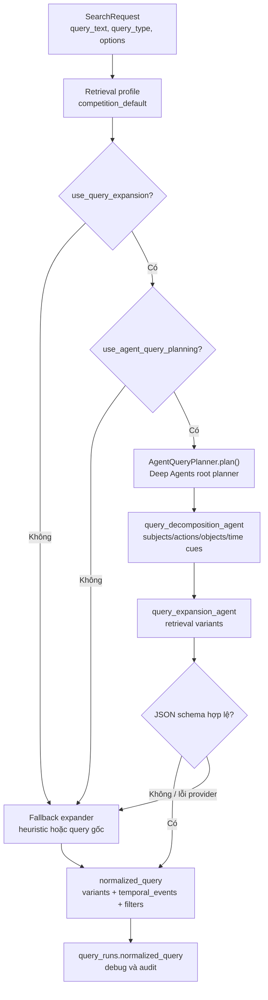

Giải thích thành phần trong luồng agent:

| Thành phần                    | Vai trò                                                                            |
| ----------------------------- | ---------------------------------------------------------------------------------- |
| `SearchRequest`               | Query gốc và options do frontend gửi lên.                                          |
| `Retrieval profile`           | Cấu hình quyết định có dùng expansion, agent, reranker, hybrid search hay không.   |
| `AgentQueryPlanner`           | Root planner gọi các subagent và yêu cầu output JSON duy nhất.                     |
| `query_decomposition_agent`   | Tách query thành subject, action, object, scene, OCR/text cue, time cue.           |
| `query_expansion_agent`       | Sinh variants ngắn, mỗi variant phù hợp cho vector hoặc metadata retrieval.        |
| `JSON schema hợp lệ`          | Bước bảo vệ production: chỉ dùng agent output nếu parse được đúng schema.          |
| `Fallback expander`           | Đảm bảo search vẫn chạy khi thiếu API key, provider lỗi hoặc output không hợp lệ.  |
| `normalized_query`            | Dạng query nội bộ mà retrieval dùng: variants, tokens, temporal events và filters. |
| `query_runs.normalized_query` | Lưu lại kế hoạch search để debug, audit và tái hiện kết quả.                       |

`normalized_query` được lưu vào `query_runs`, nên sau này có thể kiểm tra query đã được biến đổi ra sao.

## 7. Search pipeline

Search pipeline là phần nối tất cả lại. Nó nhận query từ frontend và trả ranked frames/sequences.

### 7.0 Sơ đồ online retrieval tổng quan

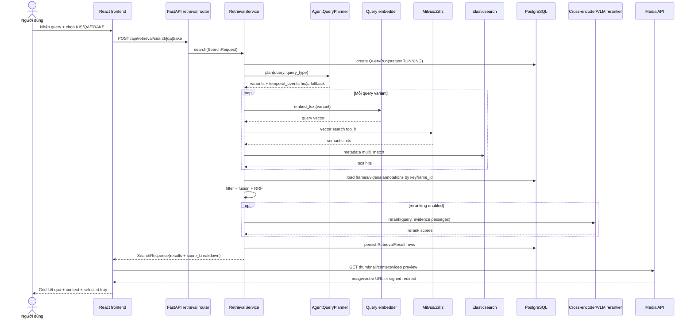

Giải thích thành phần trong online retrieval:

| Thành phần                 | Vai trò                                                                                      |
| -------------------------- | -------------------------------------------------------------------------------------------- |
| `React frontend`           | Gửi request, render result grid, mở context/video và tạo selected rows.                      |
| `FastAPI retrieval router` | Chọn endpoint theo query type và inject DB/model/vector/text clients.                        |
| `RetrievalService`         | Trung tâm nghiệp vụ: normalize query, gọi search backend, fusion, rerank, persist.           |
| `AgentQueryPlanner`        | Tạo `variants` và `temporal_events`; fallback an toàn nếu LLM chưa sẵn sàng.                 |
| `Query embedder`           | Biến text variant thành vector cùng không gian với keyframe embedding.                       |
| `Milvus/Zilliz`            | Trả semantic candidates theo similarity vector.                                              |
| `Elasticsearch`            | Trả metadata candidates theo caption/OCR/object/ASR text.                                    |
| `PostgreSQL`               | Enrich candidate IDs thành metadata đầy đủ: video, frame, timestamp, annotation, media keys. |
| `Reranker`                 | Chấm lại top candidates bằng passage evidence để tăng độ chính xác.                          |
| `Media API`                | Resolve thumbnail/context/video preview, hỗ trợ local, public GCS và signed URL.             |

### 7.1 Input contract

Request:

```json
{
  "dataset_id": "...",
  "query_name": "query-1-kis",
  "query_type": "KIS",
  "query_text": "người áo đỏ đi xe máy",
  "top_k": 100,
  "profile": "competition_default",
  "options": {
    "use_query_expansion": true,
    "use_agent_query_planning": true,
    "use_metadata": true,
    "use_reranker": true,
    "strict_hybrid": false,
    "delta_t_max_ms": 180000,
    "video_codes": [],
    "objects": [],
    "scene": null
  }
}
```

Response:

```json
{
  "query_run_id": "...",
  "query_type": "KIS",
  "query_name": "query-1-kis",
  "normalized_query": {...},
  "results": [...]
}
```

### 7.2 Query normalization

Normalization làm ba việc:

1. Tạo `variants` cho query expansion.
2. Tạo `tokens` để debug/heuristic.
3. Tạo `temporal_events` cho TRAKE hoặc query có thứ tự.

Ví dụ query:

```text
Tìm chuỗi cảnh người giao hàng đặt gói hàng trước cửa, bấm chuông, rồi rời đi.
```

Agent/heuristic có thể tách thành:

```text
event 1: người giao hàng đặt gói hàng trước cửa
event 2: người giao hàng bấm chuông
event 3: người giao hàng rời đi
```

Với KIS/QA đơn giản, `temporal_events` thường chỉ có một event bằng query chính.

### 7.3 Semantic vector retrieval

Luồng semantic:

```text
for each query variant:
  query_vector = embedder.embed_text(variant)
  hits = Milvus.search("keyframe_embeddings", query_vector, top_k)
  resolve hit.id / metadata -> keyframe_id
  giữ score cao nhất cho mỗi keyframe_id
```

Milvus adapter trả:

```text
VectorHit(id, score, metadata)
```

Metadata thường gồm:

- `keyframe_id`
- `video_id`
- `frame_idx`
- `model_version`
- `dataset_id`

Search service lọc kết quả theo video thuộc dataset hiện tại để tránh lẫn index giữa nhiều dataset.

### 7.4 Metadata text retrieval

Luồng metadata:

```text
for each query variant:
  Elasticsearch multi_match trên keyframe_annotations
  fields có boost: OCR, caption, detected_objects
  lấy score cao nhất cho mỗi keyframe_id
```

Boost từ profile:

| Field              | Ý nghĩa                               |
| ------------------ | ------------------------------------- |
| `ocr_texts`        | Quan trọng cho chữ/phụ đề/biển báo.   |
| `caption`          | Mô tả scene/action tổng quát.         |
| `detected_objects` | Object labels như person, car, phone. |

Elasticsearch dùng `multi_match` với `fuzziness: AUTO`, nên chịu được lỗi OCR hoặc sai chính tả nhẹ.

### 7.5 Candidate merge và filtering

Candidate set:

```text
candidate_ids = semantic_scores.keys ∪ text_scores.keys
```

Sau đó backend query PostgreSQL để lấy `Frame`, `Video`, `FrameAnnotation` tương ứng:

```text
keyframe_id từ Milvus/ES
  -> JOIN PostgreSQL keyframes/videos/annotations
  -> lấy frame_idx, timestamp, media URL, text evidence, quality_score
```

Filter hỗ trợ:

- `video_codes`
- `time_range_start_seconds`
- `time_range_end_seconds`
- `objects`
- `scene`

Nếu `debug_filters=true`, `score_breakdown.filter_debug` ghi lại filter nào được áp dụng và match ra sao.

### 7.6 Scoring và fusion

Backend normalize score theo max trong candidate set:

```text
semantic_score = raw_semantic / max_semantic
text_score     = raw_text / max_text
quality_score  = clamp(frame.quality_score, 0, 1)
```

Weighted score:

```text
weighted_score =
  semantic_weight * semantic_score
  + metadata_weight * text_score
  + quality_weight * quality_score
```

Với `competition_default`:

```yaml
semantic_weight: 0.85
metadata_weight: 0.05
user_boost_weight: 0.05
rrf.enabled: true
```

RRF bổ sung tín hiệu thứ hạng:

```text
semantic_rrf = 1 / (k + semantic_rank)
text_rrf     = 1 / (k + text_rank)
rrf_raw      = semantic_weight * semantic_rrf + text_weight * text_rrf
rrf_score    = rrf_raw / max_rrf_raw
```

Final score:

```text
final_score =
  (1 - rrf_blend) * weighted_score
  + rrf_blend * rrf_score
```

Ý nghĩa:

- Weighted score tận dụng độ lớn similarity.
- RRF tận dụng thứ hạng tương đối giữa các backend.
- Fusion giúp một frame vừa tốt về visual vừa khớp OCR/caption được ưu tiên hơn.

Nếu cả Milvus và Elasticsearch đều không trả candidate, backend fallback sang overlap heuristic trên text trong PostgreSQL, trừ khi `strict_hybrid=true`.

### 7.7 Reranking

Nếu profile bật reranking:

```text
top candidates
  -> passage = caption + OCR + object labels
  -> cross_encoder.rerank(query, passages)
  -> normalize cross scores
  -> optional MLLM/VLM alignment
  -> blend lại final score
```

Formula:

```text
rerank_signal =
  cross_encoder_weight * cross_score
  + mllm_weight * mllm_score

reranked_final =
  (1 - blend) * old_final
  + blend * rerank_signal
```

Cross-encoder giúp so khớp query với evidence text kỹ hơn so với embedding/text search bước đầu. Nếu model sentence-transformers không load được, adapter dùng heuristic token overlap để hệ thống vẫn chạy.

### 7.8 QA retrieval

QA dùng cùng frame-level ranking với KIS, sau đó sinh answer:

```text
top frame
  -> evidence = frame caption + OCR + detected objects
  -> answer_hint nếu annotation có
  -> visual_qa.answer(question, evidence, answer_hint)
  -> postprocess answer <= 100 ký tự
```

Điểm cần lưu ý: trong code hiện tại QA answer chủ yếu dựa trên evidence text/answer hint qua VLM adapter. Khi VLM không cấu hình, fallback model có thể raise lỗi; vì vậy QA production cần bật VLM hoặc bảo đảm annotation có answer hint phù hợp.

### 7.9 TRAKE và Adaptive Temporal Search

TRAKE khác KIS vì cần sequence đúng thứ tự.

Sơ đồ luồng TRAKE:

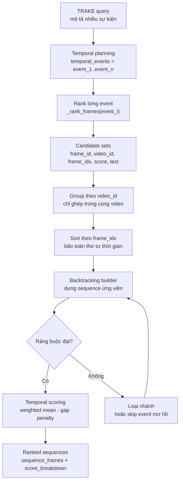

Giải thích thành phần trong luồng TRAKE:

| Thành phần              | Vai trò                                                                                      |
| ----------------------- | -------------------------------------------------------------------------------------------- |
| `TRAKE query`           | Query yêu cầu nhiều khoảnh khắc liên tiếp, ví dụ trước/sau hoặc hành động theo thứ tự.       |
| `Temporal planning`     | Biến query thành danh sách `temporal_events`; nguồn có thể là agent hoặc heuristic fallback. |
| `_rank_frames(event_i)` | Chạy pipeline ranking thông thường cho từng event độc lập.                                   |
| `Candidate sets`        | Tập ứng viên theo event, mỗi ứng viên có frame, video, frame_idx, score và text evidence.    |
| `Group theo video_id`   | Chỉ ghép sequence trong cùng một video để tránh chuỗi vô nghĩa.                              |
| `Sort theo frame_idx`   | Chuẩn bị cho kiểm tra thứ tự tăng dần.                                                       |
| `Backtracking builder`  | Duyệt tổ hợp ứng viên giữa các event để dựng sequence hợp lệ.                                |
| `Ràng buộc đạt`         | Kiểm tra frame index tăng dần, khoảng cách không vượt `delta_frame_max`, đủ `min_match`.     |
| `Temporal scoring`      | Chấm điểm chuỗi bằng trung bình có trọng số và trừ gap penalty.                              |
| `Ranked sequences`      | Output cuối cho frontend và submission, gồm `sequence_frames` và `score_breakdown`.          |

Mỗi candidate gồm:

```text
frame_id, video_id, video_code, frame_idx, score, text
```

Adaptive Temporal Search:

1. Group candidates theo `video_id`.
2. Sort candidate trong mỗi event theo `frame_idx`.
3. Dùng recursion/backtracking để xây sequence.
4. Chỉ nhận candidate có `frame_idx` tăng dần.
5. Khoảng cách giữa hai frame không vượt `delta_frame_max`.
6. Cho phép skip event mơ hồ nếu vẫn đạt `min_match`.
7. Score sequence = trung bình score có trọng số trừ gap penalty.

Gap penalty:

```text
gap_penalty = min(0.15, avg_gap / delta_frame_max * 0.08)
```

Điều này giúp chuỗi quá rời rạc bị giảm điểm, nhưng không loại bỏ hoàn toàn nếu vẫn đúng thứ tự.

`score_breakdown` cho TRAKE gồm:

- `temporal_score`
- `matched_events`
- `expected_events`
- `ordering.is_strictly_increasing`
- `ordering.frame_indices`
- `ordering.delta_frames`
- `stable_sort_key`

### 7.10 Result persistence

Mỗi lần search tạo một `QueryRun`:

```text
status = RUNNING
normalized_query = {...}
options = original request JSON
```

Sau khi search xong:

```text
status = DONE
latency_ms = ...
retrieval_results = ranked results
```

Mỗi `RetrievalResult` lưu:

- `rank`
- `video_id`
- `frame_id`
- `answer`
- `score`
- `score_breakdown`
- `sequence_frames`
- `selected`

Nhờ persistence, frontend có thể lấy lại run bằng:

```text
GET /api/retrieval/runs/{run_id}
```

### 7.11 End-to-end search story

Có thể trình bày search pipeline bằng flowchart sau:

```mermaid
flowchart LR
  User["1. Query tiếng Việt<br/>KIS / QA / TRAKE"]
  Agent["2. Agent planner<br/>variants + events"]
  Embed["3. Query embedding<br/>text to vector"]
  Milvus["4. Milvus search<br/>semantic candidates"]
  Elastic["5. Elasticsearch search<br/>caption/OCR/object/ASR"]
  Merge["6. Candidate merge<br/>dedupe + union/intersection"]
  Enrich["7. PostgreSQL enrich<br/>metadata + media + evidence"]
  Filter["8. Filters<br/>video/time/object/scene"]
  Fusion["9. Fusion + RRF<br/>semantic + metadata + quality"]
  Route{"10. Query type"}
  KIS["KIS output<br/>ranked frames"]
  QA["QA output<br/>answer from evidence"]
  TRAKE["TRAKE output<br/>ordered sequences"]
  Frontend["11. Frontend review<br/>grid + context + video"]
  Select["12. Selected tray<br/>human verification"]
  Export["13. Validate/export<br/>submission.zip"]

  User --> Agent --> Embed --> Milvus --> Merge
  Agent --> Elastic --> Merge
  Merge --> Enrich --> Filter --> Fusion --> Route
  Route -- "KIS" --> KIS --> Frontend
  Route -- "QA" --> QA --> Frontend
  Route -- "TRAKE" --> TRAKE --> Frontend
  Frontend --> Select --> Export
```

Giải thích thành phần trong end-to-end flow:

| Thành phần             | Vai trò                                                                                          |
| ---------------------- | ------------------------------------------------------------------------------------------------ |
| `Query tiếng Việt`     | Input tự nhiên từ người dùng, có thể là tìm một khoảnh khắc, trả lời câu hỏi hoặc chuỗi sự kiện. |
| `Agent planner`        | Chuẩn hóa query thành variants/events để nhiều backend retrieval cùng hiểu được.                 |
| `Query embedding`      | Đưa text query vào cùng không gian vector với keyframe/image embedding.                          |
| `Milvus search`        | Tìm ứng viên theo ngữ nghĩa thị giác.                                                            |
| `Elasticsearch search` | Tìm ứng viên theo caption, OCR, object, ASR và metadata text.                                    |
| `Candidate merge`      | Hợp nhất/deduplicate ứng viên từ nhiều nguồn trước khi enrich.                                   |
| `PostgreSQL enrich`    | Bổ sung video code, frame index, timestamp, annotation, media key và evidence.                   |
| `Filters`              | Áp điều kiện video/time/object/scene để giảm nhiễu.                                              |
| `Fusion + RRF`         | Gộp điểm semantic, metadata, quality và reciprocal rank để xếp hạng cuối.                        |
| `Query type`           | Rẽ nhánh output theo KIS, QA hoặc TRAKE.                                                         |
| `Frontend review`      | Người dùng kiểm tra bằng grid, context frame và video preview.                                   |
| `Selected tray`        | Lớp human-in-the-loop trước khi nộp.                                                             |
| `Validate/export`      | Kiểm tra format competition và xuất `submission.zip`.                                            |

## 8. Cách trình bày theo narrative

Nếu cần trình bày ngắn gọn trước hội đồng, có thể đi theo 5 ý:

1. **Bài toán**: AIC cần tìm khoảnh khắc trong video từ query tự nhiên, gồm KIS, QA và TRAKE.
2. **Offline indexing**: Video được tách thành keyframe bằng AutoShot, sau đó tạo visual embedding, OCR, caption, object, ASR và event.
3. **Hybrid retrieval**: Query được agent mở rộng/tách sự kiện, rồi search song song trên Milvus và Elasticsearch.
4. **Fusion + temporal reasoning**: Backend hợp nhất điểm, rerank và với TRAKE dựng chuỗi frame đúng thứ tự bằng Adaptive Temporal Search.
5. **Human-in-the-loop UI**: Frontend cho người thi xem grid, mở context/video, chọn frame và xuất ZIP đúng Codabench.

Một câu tóm tắt:

> Hệ thống của chúng tôi biến video thành một tập chỉ mục đa tín hiệu, rồi biến query tự nhiên thành kế hoạch truy xuất, kết hợp vector search, text search và temporal search để người dùng nhanh chóng kiểm chứng và nộp kết quả.

## 9. Điểm mạnh hiện tại

- Có pipeline dữ liệu từ raw video đến searchable feature artifact.
- Có contract ID ổn định giữa GCS, PostgreSQL, Milvus, Elasticsearch và frontend.
- Có checkpoint/lease/resume cho worker Kaggle/Colab.
- Có hybrid search thay vì chỉ dựa vào một model.
- Có agent query planning nhưng vẫn fallback an toàn.
- Có frontend đầy đủ cho thao tác thi đấu: search, context, video preview, selected tray, export.
- Có validation submission theo KIS/QA/TRAKE.

## 10. Hạn chế và hướng phát triển

Các điểm cần nói rõ nếu được hỏi:

- Query-time backend hiện search collection mặc định `keyframe_embeddings`; profile `competition_mvp_v1` đã khai báo nhiều visual collection nhưng service cần mở rộng đầy đủ để search multi-collection theo weight.
- QA answer phụ thuộc vào chất lượng evidence text/VLM; cần bật VLM thật hoặc có answer hint tốt.
- Backend pipeline trực tiếp trong `apps/backend/app/modules/pipeline` là MVP path; production-scale vẫn nên dùng processor GCS-first với manifest/checkpoint/importer.
- Text embedding collection đã có trong processor import, nhưng retrieval online hiện chủ yếu dùng Elasticsearch metadata và visual Milvus; có thể thêm text-vector retrieval làm một kênh riêng.
- Frontend Auto/Chat mode hiện còn thiên về UI/trace; agent thật đã nằm ở backend query planning, chưa phải autonomous UI workflow đầy đủ.
- Cần benchmark retrieval thật với ground truth để có Recall@K, MRR, nDCG thay vì chỉ metric query expansion synthetic.

## 11. Glossary

| Thuật ngữ            | Giải thích                                                      |
| -------------------- | --------------------------------------------------------------- |
| KIS                  | Known-item search: tìm đúng frame/video theo mô tả.             |
| QA                   | Question answering: tìm evidence frame và trả lời ngắn.         |
| TRAKE                | Temporal retrieval: tìm chuỗi frame theo thứ tự sự kiện.        |
| Keyframe             | Frame đại diện được trích từ shot.                              |
| Shot                 | Đoạn cảnh liên tục giữa hai ranh giới chuyển cảnh.              |
| Event                | Nhóm keyframe liên tiếp cùng ngữ cảnh/thời gian.                |
| Embedding            | Vector biểu diễn ảnh/text để so similarity.                     |
| Milvus/Zilliz        | Vector database cho ANN search.                                 |
| Elasticsearch        | Search engine cho text metadata.                                |
| RRF                  | Reciprocal Rank Fusion, hợp nhất kết quả theo thứ hạng.         |
| Reranker             | Model chấm lại top candidates kỹ hơn sau retrieval bước đầu.    |
| Agent query planning | LLM phân tích query thành variants, factors và temporal events. |
| Artifact             | File JSONL/CSV/NPY trung gian có contract rõ ràng để import.    |
| Checkpoint           | Trạng thái resume của worker xử lý shard.                       |
| `_SUCCESS`           | Marker báo một shard/batch đã hoàn tất và qua quality gate.     |
