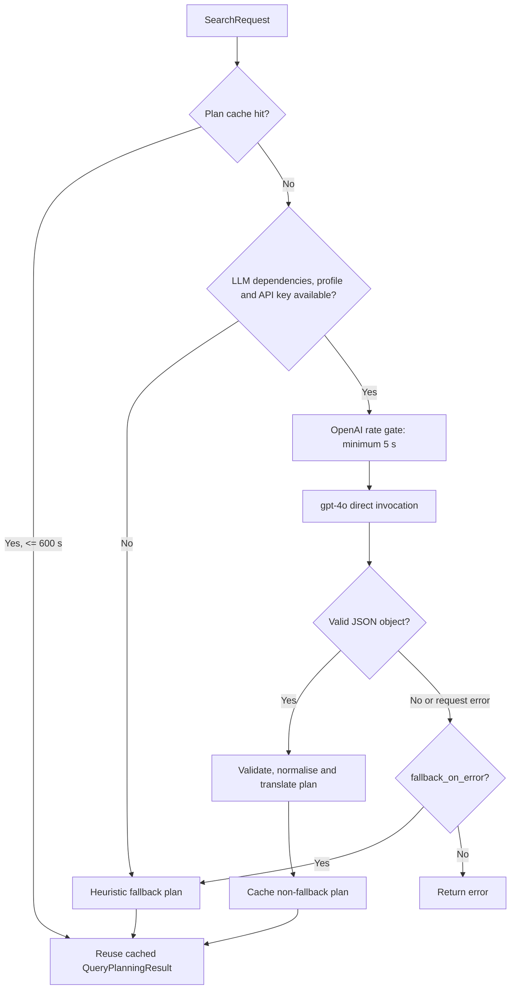
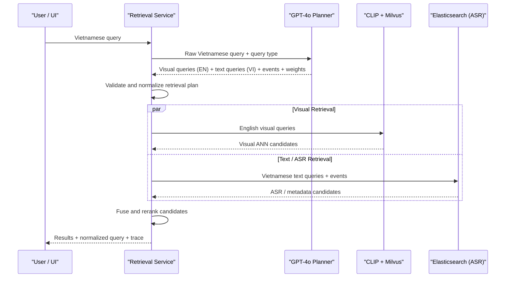
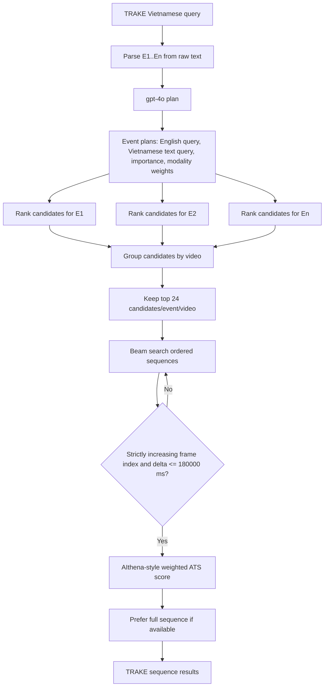
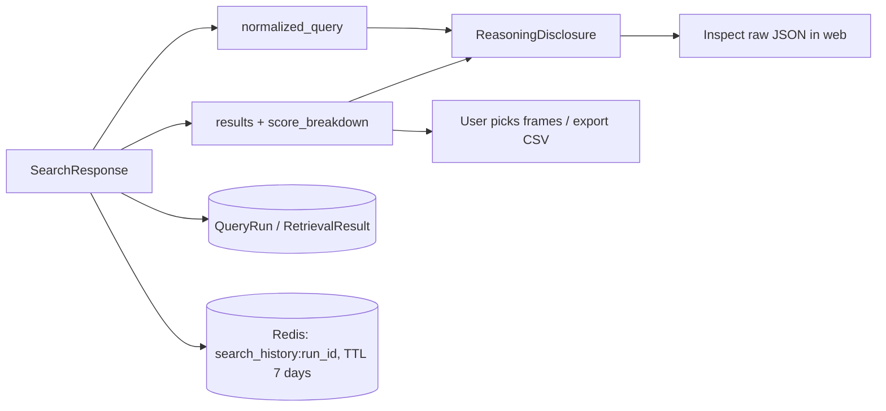

# Agent V1 Technical Report

## 1. Mục đích và phạm vi

`Agent` là tầng **lập kế hoạch truy vấn** cho hệ thống video retrieval. Nó không tự thực hiện tìm kiếm và không được cấp tool truy cập filesystem, database hay web. Nhiệm vụ của agent là biến một câu truy vấn tự nhiên, thường là tiếng Việt, thành một kế hoạch JSON có cấu trúc để backend quyết định:

- nội dung nào phải tìm từ hình ảnh và vector embedding;
- nội dung nào phải tìm từ ASR/OCR/metadata;
- cách cân bằng trọng số visual và text theo ngữ cảnh thay vì gán cứng;
- các event có thứ tự cho bài toán TRAKE;
- các câu tiếng Anh ngắn gọn để encode vào CLIP/Milvus, đồng thời giữ câu tiếng Việt để tìm ASR qua Elasticsearch.

Agent phục vụ ba luồng retrieval chính: **KIS** (tìm keyframe), **QA** (tìm evidence frame và answer hint), và **TRAKE** (tìm chuỗi event theo thời gian). Trang **Video** là tra cứu metadata trực tiếp theo mã/tên video và frame index; nó không gọi LLM agent.

> Trạng thái cấu hình hiện tại: `gpt-4o`, OpenAI, `execution_mode: direct`, `max_agent_iterations: 1`, tối đa 8 event thời gian. `agent.yaml` có default 3 variants khi không được caller chỉ định; web profile `competition_default` hiện truyền giới hạn 5 variants. Xem `configs/agent.yaml` và `configs/retrieval_profiles.yaml`.

## 2. Kiến trúc và ranh giới trách nhiệm

```mermaid
flowchart LR
    U[User Vietnamese query] --> W[React web UI]
    W -->|POST /api/retrieval/search, /qa, /trake| API[FastAPI retrieval router]
    API --> RS[RetrievalService]
    RS --> QP[AgentQueryPlanner]

    QP -->|JSON plan| NQ[Normalized query]
    NQ --> V[English semantic variants]
    NQ --> T[Original Vietnamese text variants]
    V --> E[CLIP text encoder]
    E --> M[(Milvus CLIP collection)]
    T --> ES[(Elasticsearch keyframe_annotations)]

    M --> F[Hybrid fusion and frame scoring]
    ES --> F
    F --> R[Ranked frame results]
    R --> DB[(PostgreSQL / Supabase)]
    R --> C[(Redis search-history cache)]
    R --> W
```

| Thành phần                              | Trách nhiệm                                                                                        |
| --------------------------------------- | -------------------------------------------------------------------------------------------------- |
| React (`apps/web/src/App.tsx`)          | Gửi request, hiện trace có thể mở rộng, kết quả/điểm thành phần, video preview và lựa chọn CSV.    |
| FastAPI (`modules/retrieval/router.py`) | Chọn endpoint theo query type: `/search`, `/qa`, `/trake`; ép `query_type` ở endpoint QA và TRAKE. |
| `RetrievalService`                      | Chuẩn hoá query, gọi agent, gọi Milvus/Elasticsearch, fusion, temporal search, persistence.        |
| `AgentQueryPlanner`                     | Gọi LLM và kiểm tra/chuẩn hoá JSON plan; fallback khi LLM không hoạt động.                         |
| Milvus                                  | ANN vector search của keyframe visual embedding.                                                   |
| Elasticsearch                           | Tìm metadata, đặc biệt ASR tiếng Việt; index chính là `keyframe_annotations`.                      |
| PostgreSQL/Supabase                     | Metadata `Dataset`, `Video`, `Frame`, `QueryRun`, `RetrievalResult` và dữ liệu submission.         |
| Redis                                   | Cache response search 7 ngày, tối đa 100 run ID gần nhất.                                          |

## 3. LLM planner đang chạy thực tế

### 3.1 Runtime profile

Agent được tạo từ `AgentQueryPlanner.from_config(...)`. Profile đang active là `openai_gpt4o`:

| Thuộc tính                                |                                          Giá trị |
| ----------------------------------------- | -----------------------------------------------: |
| Provider                                  |         OpenAI qua `langchain_openai.ChatOpenAI` |
| Model                                     |                                         `gpt-4o` |
| Temperature                               |                                            `0.1` |
| Max completion tokens                     |                                            `700` |
| Timeout                                   |                                           `30 s` |
| Retries                                   |                                              `5` |
| Khoảng cách tối thiểu giữa request OpenAI |                                            `5 s` |
| TTL cache plan in-memory                  |                                          `600 s` |
| Key cache                                 | `(profile, query_type, raw_query, max_variants)` |

`execution_mode: direct` là điểm quan trọng: mỗi query gọi **một** LLM request gồm system prompt của planner và JSON user payload. Cấu hình vẫn có `query_decomposition_agent` và `query_expansion_agent`, nhưng hai sub-agent này chỉ được dựng khi đổi sang `execution_mode: deep_agent`. Vì vậy Agent V1 hiện là một planner một lượt, có output chặt chẽ và chi phí/độ trễ dễ kiểm soát, không phải multi-agent tool loop.



### 3.2 Contract output của agent

Planner bắt buộc trả đúng một JSON object, không Markdown. Các trường chính:

```json
{
  "language": "vi",
  "intent": "TRAKE",
  "summary": "Short English description of the target moment",
  "search_factors": {
    "subjects": ["..."],
    "actions": ["..."],
    "objects": ["..."],
    "attributes": ["..."],
    "scene": ["..."],
    "text_cues": ["..."],
    "time_cues": ["..."],
    "negative_constraints": ["..."]
  },
  "retrieval_strategy": {
    "clauses": [
      {
        "text": "atomic requirement",
        "evidence": "visual|text|both",
        "importance": 0.0
      }
    ],
    "weights": { "visual": 0.0, "text": 0.0 },
    "rationale": "short evidence-based explanation"
  },
  "temporal_events": [
    {
      "order": 1,
      "query": "standalone English event query",
      "must_have": ["..."],
      "importance": 1.0,
      "retrieval_weights": { "visual": 0.0, "text": 0.0 }
    }
  ],
  "variants": [
    { "text": "concise English retrieval rewrite", "purpose": "semantic" }
  ]
}
```

Sau khi nhận response, backend:

1. Trích variants, temporal events, clauses và weights.
2. Chuẩn hoá `visual`/`text`: không âm và tổng bằng `1.0`.
3. Giới hạn variants theo profile, deduplicate không phân biệt hoa/thường.
4. Kiểm tra tiếng Việt. Nếu semantic variant/event vẫn là tiếng Việt, planner thực hiện một request dịch sửa lỗi ngắn, yêu cầu JSON `{"translations": [...]}` với cùng số phần tử và đúng thứ tự.
5. Nếu agent lỗi, dùng `parse_temporal_events` và heuristic trọng số; query vẫn có thể chạy.

## 4. Suy luận modality: visual hay text

Agent không coi mọi truy vấn video là visual. Prompt yêu cầu tách câu thành **atomic clauses**, gán evidence `visual`, `text`, hoặc `both`, sau đó suy ra trọng số.

| Loại tín hiệu trong query                                               | Routing ưu tiên                          |
| ----------------------------------------------------------------------- | ---------------------------------------- |
| Người, hành động, vật thể, màu sắc, bố cục, không gian, tiếp xúc vật lý | Visual / CLIP-Milvus                     |
| Lời nói, hội thoại, narration, tên, số, năm, trích dẫn, tiêu đề/OCR     | Text / Elasticsearch                     |
| Câu có cả action và fact được nói/hiện chữ                              | Cân bằng theo importance của từng clause |
| TRAKE với thao tác/object contact                                       | Thường visual-heavy theo từng event      |

Khi LLM không trả weights hợp lệ, heuristic có các fallback hiện tại:

- TRAKE với ít lexical evidence: `visual=0.78`, `text=0.22`.
- Có từ khoá lexical rõ ràng: `visual=0.28`, `text=0.72`.
- Có một lexical cue: `visual=0.45`, `text=0.55`.
- Cảnh/hành động thuần quan sát: `visual=0.67`, `text=0.33`.

Nguồn weight trong response được ghi là `agent`, `heuristic`, hoặc `profile`, giúp UI và benchmark debug biết quyết định đến từ đâu.

## 5. Song ngữ: embedding tiếng Anh, ASR tiếng Việt



`normalized_query` giữ hai tập input độc lập:

- `semantic_variants`, `temporal_events`: tiếng Anh cho CLIP text encoder và Milvus.
- `text_variants`, `text_temporal_events`: câu tiếng Việt đầu vào hoặc event parser cho Elasticsearch. Khi parser không thể tách đủ event tương ứng, raw Vietnamese query được lặp cho các event để không mất ASR recall.

Điều này là bắt buộc vì embedding vector đang dùng CLIP text encoder phù hợp hơn với English prompt, còn transcript ASR được ingest bằng tiếng Việt. Không dịch truy vấn sang tiếng Anh rồi gửi Elasticsearch, vì làm giảm lexical matching với ASR thực tế.

## 6. Retrieval frame-level: KIS và QA

### 6.1 Candidate generation

Profile web gửi `competition_default`, `top_k=50`, query expansion/planning/metadata/reranker đều được request bật. Tuy nhiên reranker trong `competition_default` hiện **tắt ở profile**, nên KIS và QA đang dừng sau hybrid fusion trừ khi chuyển profile.

1. **Semantic path**: encode mỗi English variant bằng `clip_vith14_quickgelu_dfn5b_v2`, tìm trong collection `keyframe_embeddings_clip_vith14_quickgelu_dfn5b_v2`.
2. **Text path**: tìm từng Vietnamese variant trong `keyframe_annotations` với `multi_match`, kiểu `best_fields`, `operator: or`, `minimum_should_match` theo số token.
3. **Metadata boosts hiện tại** trong profile default: caption `5.0`, OCR `3.0`, ASR và normalized ASR `2.5`, objects `1.8`.
4. Dataset filter loại candidate ngoài dataset hiện tại; filter option có thể lọc video code, time range, object, scene.

CLIP active hiện tại có dimension **1024**. SigLIP2 có dimension 1152 nhưng `enabled: false`; nó chỉ tham gia visual RRF khi được bật sau khi ingest/kiểm chứng đúng embedding collection.

### 6.2 Fusion và score

Với một frame `f`, score semantic/text được chuẩn hoá theo max score của candidate set:

$$
S_w(f)=w_s S_s(f)+w_t S_t(f) + w_q S_q(f)
$$

Trong đó `w_s` và `w_t` lấy từ profile rồi được phân bổ lại theo weights của agent; `S_q` là quality score. `competition_default` có base weights semantic `0.60`, metadata `0.30`, quality/user boost `0.05`.

Khi RRF bật (`k=60`), hệ thống tính rank fusion cho hai list:

$$
R(f)=w'\_s\frac{1}{k+r_s(f)} + w'\_t\frac{1}{k+r_t(f)}
$$

Sau đó chuẩn hoá `R(f)` và blend với score weighted:

$$
S_{final}(f)=(1-b)S_w(f)+b\widehat{R}(f)
$$

`b` mặc định là `0.35` khi profile không ghi đè. Score breakdown trả về visual score, text score, quality, RRF score, source hit, text hit, filter debug và rerank detail để UI giải thích từng frame.

### 6.3 QA

QA dùng cùng frame-level pipeline, sau đó gọi `model_registry.visual_qa.answer(query, evidence, answer_hint)` trên các candidate đã rank. `evidence` là text metadata của frame và `answer_hint` được đọc từ annotation nếu có; nếu call lỗi backend trả answer hint. Visual QA model trong registry hiện disabled, nên đây chưa phải một agent VQA độc lập có grounding mạnh từ pixel. Chất lượng câu trả lời vì vậy phụ thuộc đáng kể vào evidence metadata/ASR/OCR và selected frame.

## 7. TRAKE: event planning và Adaptive Temporal Search

TRAKE được thiết kế cho query có `E1...En` hoặc các cụm “then / after that / finally”. Parser ưu tiên event label, tiếp theo numbered lines, rồi soft separators. Agent có thể thay các event bằng bản tiếng Anh độc lập nhưng phải giữ số lượng và thứ tự khi query có label rõ ràng.



Mỗi event gọi `_rank_frames` riêng. Per-event candidate depth là `max(80, min(500, request.top_k * 20))`; ANN top-k không bị bó về default 100 khi TRAKE yêu cầu candidate pool rộng hơn.

Sau đó `adaptive_temporal_search`:

- group candidate theo `video_id`;
- giữ tối đa 24 candidate tốt nhất cho mỗi event trong một video;
- beam search width mặc định 400;
- chỉ nối candidate có `frame_idx` tăng chặt (`next > previous`) và khoảng cách không vượt `delta_frame_max`;
- `delta_t_max_ms=180000` được đổi xấp xỉ sang frame bằng giả định 30 fps;
- `min_match` mặc định là số event; `prefer_full_sequences=true` nên ưu tiên chuỗi đủ toàn bộ E1..En;
- weight sequence là importance của từng event, được scale để tổng weight bằng số event.

Điểm sequence theo triển khai ATS:

$$
S*{seq}=\frac{1}{|C|}\sum*{i\in C} w_i\,S_i
$$

với `C` là các candidate event hợp lệ theo thời gian. Kết quả trả về `sequence_frames` chứa index event, frame index, timestamp, visual/text/RRF score và event query, nên UI có thể hiển thị lane E1..En và cho người dùng thay frame từng slot.

## 8. Reranking và các profile

`competition_default` dùng RRF nhưng `reranking.enabled: false`. Khi đổi sang `competition_mvp_v1`, backend rerank tối đa 80 candidate với cross-encoder `cross-encoder/ms-marco-MiniLM-L-6-v2`:

$$
S*{rerank}=0.85S*{cross}+0.15S_{mllm}
$$

$$
S'_{final}=(1-0.30)S_{final}+0.30S_{rerank}
$$

MLLM rerank cấu hình disabled. Nếu CrossEncoder không tải được, adapter có fallback token-overlap cosine-like score, giữ pipeline hoạt động nhưng không tương đương model cross-encoder. Với TRAKE, temporal ATS là re-ranker cấp sequence sau khi từng event đã được frame-level ranked.

## 9. Trace, persistence và UI reasoning

Response trả `normalized_query.agent_query_plan`, modality weights, semantic/text variants, event plans và score breakdown. UI chuyển chúng thành các cell reasoning có thể expand:

1. Agent profile: provider/model, key configured, LangSmith state.
2. Decompose query: intent, language, summary.
3. Search factors: subject, action, object, attribute, scene, OCR, time and negative constraints.
4. Route modalities: visual/text weights và source.
5. Embedding query: English variants.
6. ASR query: Vietnamese variants.
7. Split events: English embedding events và Vietnamese ASR events.
8. Retrieve candidates: số kết quả, latency, top result score breakdown.



`QueryRun` được tạo trước retrieval với trạng thái `RUNNING`, sau đó `DONE` hoặc `FAILED`; response được cache Redis với TTL 7 ngày. Vì cache history là phụ trợ, lỗi Redis chỉ tạo log warning và không làm search fail.

## 10. Failure handling và giới hạn hiện tại

| Tình huống                                          | Hành vi hiện tại                                                                                        |
| --------------------------------------------------- | ------------------------------------------------------------------------------------------------------- |
| Không có API key, dependency agent, hay profile sai | Heuristic fallback plan; retrieval vẫn chạy.                                                            |
| LLM JSON sai hoặc timeout                           | Fallback nếu `fallback_on_error=true`; error được đưa vào agent plan/trace.                             |
| LLM trả semantic tiếng Việt                         | Dịch sửa bằng cùng LLM; nếu không thể gọi LLM, không xoá hết variants để tránh visual retrieval rỗng.   |
| Milvus hay Elasticsearch lỗi                        | Nhánh còn lại vẫn chạy nếu `strict_hybrid=false` (mặc định).                                            |
| `strict_hybrid=true`                                | Backend trả lỗi nếu một backend lỗi hoặc không có hybrid candidate.                                     |
| Elasticsearch query quá lớn                         | Adapter dùng `best_fields`, `operator: or`, MSM 100% / 75% / 50% theo độ dài để hạn chế nested clauses. |
| Cross encoder unavailable                           | Heuristic overlap rerank nếu fallback được bật.                                                         |
| SigLIP2 chưa sẵn sàng                               | Không được chọn vì profile/model registry đang disabled.                                                |

Các giới hạn cần nêu rõ khi benchmark:

- Agent lập kế hoạch bằng text-only LLM, không xem trực tiếp video/keyframe.
- CLIP-only baseline yếu với micro-temporal cooking actions hoặc thay đổi trạng thái rất gần nhau; cách khắc phục thực tế là bật/đánh giá SigLIP2 đúng collection và bổ sung caption/VLM/video temporal model.
- QA hiện evidence-oriented, chưa có VLM QA runtime active.
- Quy đổi thời gian TRAKE sang frame hiện giả định 30 fps cho constraint, trong khi metadata video có thể có FPS khác.
- LLM planning tự tăng độ trễ; cache 10 phút và 5 giây rate gate ưu tiên ổn định API hơn throughput cao.

## 11. Vận hành và kiểm chứng

### Kiểm tra plan riêng

```powershell
$body = @{
  dataset_id = "<dataset-id>"
  query_type = "TRAKE"
  query_text = "E1: ...`nE2: ..."
  profile = "competition_default"
  options = @{ use_agent_query_planning = $true; use_metadata = $true }
} | ConvertTo-Json -Depth 6

Invoke-RestMethod -Method Post `
  -Uri "http://localhost:8000/api/retrieval/plan" `
  -ContentType "application/json" `
  -Body $body | ConvertTo-Json -Depth 12
```

Kết quả cần kiểm tra:

- `semantic_variants` và `temporal_events` là English;
- `text_variants` và `text_temporal_events` giữ Vietnamese;
- `retrieval_weights.visual + retrieval_weights.text = 1`;
- TRAKE có cùng số event như E-label đầu vào;
- `retrieval_weight_source` phản ánh `agent`, `heuristic`, hoặc `profile`;
- `agent_query_plan.error` rỗng khi LLM hoạt động, hoặc lý do fallback khi degraded.

### File nguồn chính

- `configs/agent.yaml`: runtime profile, prompt và fallback policy.
- `configs/retrieval_profiles.yaml`: weights, RRF, reranker, temporal configuration.
- `configs/model_registry.yaml`: CLIP, SigLIP2, cross-encoder và runtime enablement.
- `apps/backend/app/modules/retrieval/query_planning.py`: LLM invocation, cache, rate gate, validation, translation repair.
- `apps/backend/app/modules/retrieval/service.py`: normalization, hybrid fusion, persistence và TRAKE integration.
- `apps/backend/app/modules/temporal/ats.py`: beam search và ATS sequence score.
- `apps/backend/app/adapters/text_search/elasticsearch.py`: ASR/metadata search adapter.
- `apps/web/src/App.tsx`: request dispatch và `ReasoningDisclosure` rendering.

## 12. Khuyến nghị Agent V2

1. Tách `translation` thành service riêng có cache theo raw query để không dùng thêm LLM request khi planner vi phạm English contract.
2. Bổ sung structured-output/schema enforcement tại provider layer để giảm parse repair.
3. Truyền FPS thật vào ATS thay vì giả định 30 fps khi áp dụng `delta_t_max_ms`.
4. Bật SigLIP2 chỉ sau khi kiểm tra collection dimension, model/text pre-processing và benchmark delta; sau đó dùng visual RRF CLIP + SigLIP2.
5. Bổ sung captioning/VLM cho candidate top-N để phân biệt micro-events trong TRAKE và tạo QA answer có grounding mạnh hơn.
6. Lưu agent plan/evaluation fields có versioned schema để so sánh prompt, model, weight routing và Recall@K theo benchmark qua các lần chạy.
