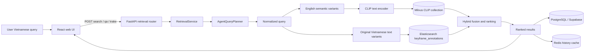
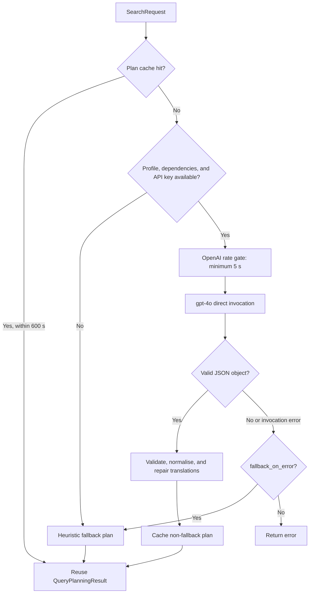
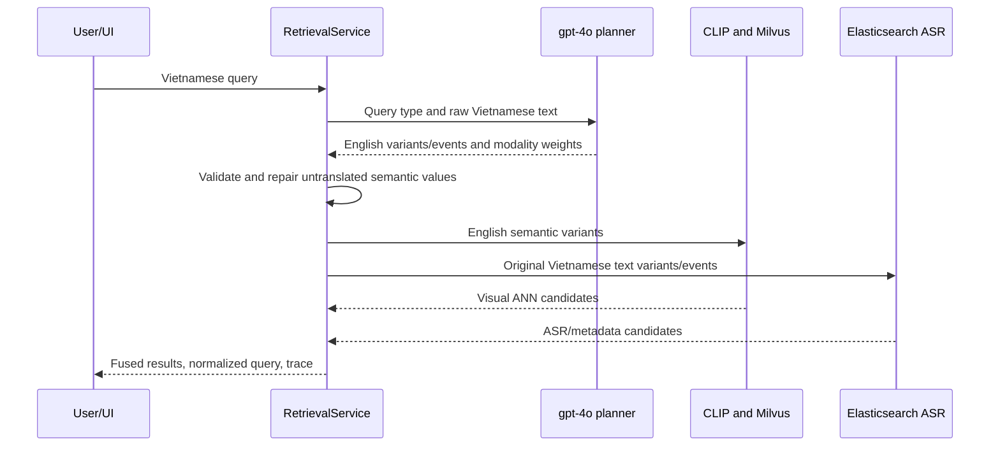
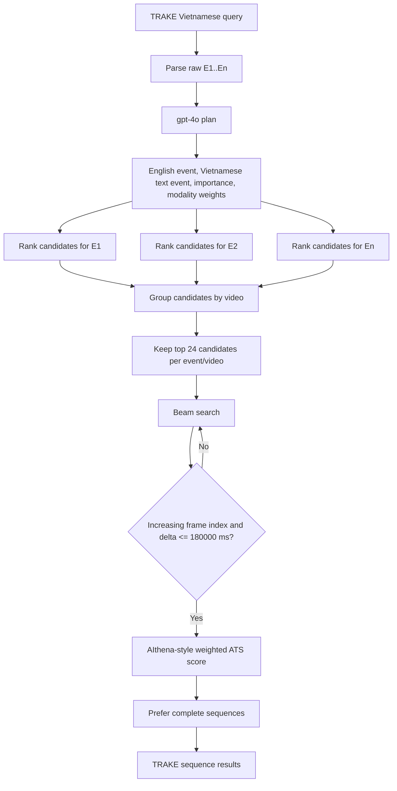
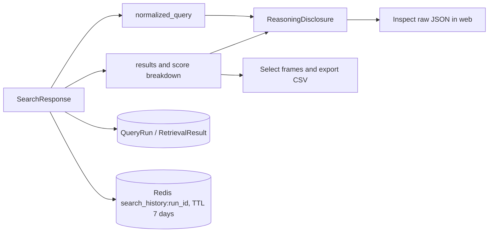

# Agent V1 Technical Report

## 1. Purpose and scope

`Agent V1` is the **query-planning layer** of the video retrieval system. It does not execute retrieval itself and has no filesystem, database, or web tools. Its role is to turn a natural-language query, normally Vietnamese, into a structured JSON plan that tells the backend:

- which evidence should be retrieved from visual embeddings;
- which evidence should be retrieved from ASR, OCR, and metadata;
- how to assign visual and text weights from context rather than a fixed visual bias;
- how to represent ordered events for TRAKE;
- which concise English rewrites are sent to CLIP/Milvus while the original Vietnamese is retained for Elasticsearch ASR matching.

Agent V1 supports **KIS** (keyframe search), **QA** (evidence-frame retrieval and answer generation), and **TRAKE** (ordered event sequence retrieval). The **Video** page is a direct metadata lookup by video name/code and frame index, so it does not invoke the LLM agent.

> Current runtime: OpenAI `gpt-4o`, `execution_mode: direct`, and `max_agent_iterations: 1`. `agent.yaml` uses three variants as its no-caller default, while the web `competition_default` profile currently requests up to five variants. The maximum number of temporal events is eight.

## 2. System boundaries



| Component              | Responsibility                                                                                                    |
| ---------------------- | ----------------------------------------------------------------------------------------------------------------- |
| `apps/web/src/App.tsx` | Sends requests, renders inspectable reasoning trace, results, component scores, video preview, and CSV selection. |
| Retrieval router       | Exposes `/search`, `/qa`, and `/trake`; forces the QA and TRAKE type at their dedicated endpoints.                |
| `RetrievalService`     | Query normalization, candidate retrieval, hybrid fusion, temporal search, persistence, and caching.               |
| `AgentQueryPlanner`    | LLM planning, response validation, translation repair, caching, throttling, and fallback.                         |
| Milvus                 | ANN retrieval over keyframe visual embeddings.                                                                    |
| Elasticsearch          | ASR and other text/metadata retrieval through `keyframe_annotations`.                                             |
| PostgreSQL/Supabase    | Dataset, video, frame, query-run, retrieval-result, and submission data.                                          |
| Redis                  | Seven-day search-response cache and a bounded recent-run list.                                                    |

## 3. Actual LLM execution model

### 3.1 Active profile

The planner is built with `AgentQueryPlanner.from_config(...)`. The active `openai_gpt4o` profile is configured as follows:

| Property                                 |                                            Value |
| ---------------------------------------- | -----------------------------------------------: |
| Provider                                 |     OpenAI through `langchain_openai.ChatOpenAI` |
| Model                                    |                                         `gpt-4o` |
| Temperature                              |                                            `0.1` |
| Maximum completion tokens                |                                            `700` |
| Timeout                                  |                                           `30 s` |
| Retries                                  |                                              `5` |
| Minimum interval between OpenAI requests |                                            `5 s` |
| In-memory plan cache TTL                 |                                          `600 s` |
| Cache key                                | `(profile, query_type, raw_query, max_variants)` |

The current `direct` execution mode is important: a query causes **one** LLM invocation containing the planner system prompt and a JSON user payload. `query_decomposition_agent` and `query_expansion_agent` are present in configuration, but they are only constructed when `execution_mode` changes to `deep_agent`. Therefore, the deployed V1 behavior is a single-pass planner, not a multi-agent tool-use loop.



### 3.2 Planner output contract

The planner must emit exactly one JSON object and no Markdown. Its main fields are:

```json
{
  "language": "vi|en|mixed|auto",
  "intent": "KIS|QA|TRAKE|IMAGE|FREEFORM",
  "summary": "short English target description",
  "search_factors": {
    "subjects": [],
    "actions": [],
    "objects": [],
    "attributes": [],
    "scene": [],
    "text_cues": [],
    "time_cues": [],
    "negative_constraints": []
  },
  "retrieval_strategy": {
    "clauses": [
      {
        "text": "atomic requirement",
        "evidence": "visual|text|both",
        "importance": 0.0
      }
    ],
    "weights": { "visual": 0.0, "text": 0.0 },
    "rationale": "evidence-based explanation"
  },
  "temporal_events": [
    {
      "order": 1,
      "query": "standalone English event query",
      "must_have": [],
      "importance": 1.0,
      "retrieval_weights": { "visual": 0.0, "text": 0.0 }
    }
  ],
  "variants": [
    { "text": "concise English retrieval rewrite", "purpose": "semantic" }
  ]
}
```

The backend deduplicates variants, clamps and normalizes visual/text weights to sum to `1.0`, enforces the configured maximums, and extracts event-level plans. If a semantic variant or event is still detected as Vietnamese, it performs a compact JSON-only translation repair request that preserves the number and order of queries. LLM failures fall back to deterministic parsing and heuristic weights.

## 4. Context-aware modality reasoning

The prompt first decomposes the request into atomic clauses and classifies each clause as `visual`, `text`, or `both`. It then derives weights from clause importance. Video retrieval is explicitly not assumed to be visual-only.

| Query evidence                                                                 | Preferred route                               |
| ------------------------------------------------------------------------------ | --------------------------------------------- |
| People, actions, objects, colours, spatial relations, scenes, physical contact | Visual: CLIP embedding and Milvus             |
| Speech, narration, dialogue, names, numbers, dates, quotes, titles, OCR        | Text: Elasticsearch ASR/metadata              |
| Action plus a spoken or written fact                                           | Balanced according to clause importance       |
| TRAKE contact/action event                                                     | Usually visual-heavy, independently per event |

When LLM weights are unavailable or invalid, the current heuristic uses:

- TRAKE with little lexical evidence: `visual=0.78`, `text=0.22`.
- Strong lexical/named-fact evidence: `visual=0.28`, `text=0.72`.
- One lexical cue: `visual=0.45`, `text=0.55`.
- Observable scene/action: `visual=0.67`, `text=0.33`.

The normalized response records whether the final weights came from `agent`, `heuristic`, or `profile`.

## 5. Bilingual routing: English embeddings and Vietnamese ASR



The response intentionally stores two independent query sets:

- `semantic_variants` and `temporal_events`: English strings for the CLIP text encoder and Milvus.
- `text_variants` and `text_temporal_events`: the original Vietnamese query or parser-produced Vietnamese events for Elasticsearch.

If the raw temporal parser cannot produce the same number of events as semantic TRAKE events, the raw Vietnamese query is reused for text search so ASR recall is not discarded. Elasticsearch is not given an English translation by default because the ASR corpus was ingested in Vietnamese.

## 6. Frame-level retrieval for KIS and QA

The web client sends `competition_default`, `top_k=50`, and enables planning, query expansion, metadata retrieval, and reranker options. The active default profile itself has `reranking.enabled: false`, so KIS and QA stop after hybrid fusion unless a different profile is selected.

1. Each English semantic variant is embedded with `clip_vith14_quickgelu_dfn5b_v2` and searched in `keyframe_embeddings_clip_vith14_quickgelu_dfn5b_v2`.
2. Each Vietnamese text variant is searched in Elasticsearch index `keyframe_annotations`.
3. Default metadata boosts are caption `5.0`, OCR `3.0`, ASR/normalized ASR `2.5`, and detected objects `1.8`.
4. Candidates outside the active dataset are removed, then optional video/time/object/scene filters are applied.

The active CLIP embedding dimension is **1024**. SigLIP2 is a 1152-dimensional secondary embedding but is currently disabled; it should only be enabled after collection and benchmark validation.

For a frame `f`, the weighted candidate score is:

$$
S_w(f)=w_sS_s(f)+w_tS_t(f)+w_qS_q(f)
$$

where semantic and text weights are redistributed by agent modality weights and `S_q` is the frame quality signal. When RRF is enabled with `k=60`:

$$

R(f)=w'\_s\frac{1}{k+r_s(f)}+w'\_t\frac{1}{k+r_t(f)}
$$

The normalized RRF value is blended with the weighted score:

$$
S_{final}(f)=(1-b)S_w(f)+b\widehat{R}(f)
$$

The score breakdown returned to the UI includes visual, text, quality, RRF, source-hit, text-hit, filter, and reranker data.

For QA, the same ranked frames are used as evidence. The backend calls `model_registry.visual_qa.answer(query, evidence, answer_hint)`, where evidence is frame metadata and an answer hint is read from annotations when available. On failure it returns the answer hint. The visual-QA model in the registry is currently disabled, so QA is not yet a pixel-grounded VQA agent.

## 7. TRAKE: event planning and Adaptive Temporal Search

TRAKE detects ordered events from `E1...En`, numbered lines, or temporal separators such as _then_, _after that_, and _finally_. Explicit E-labels require the planner to preserve the event count and order.



Each event runs `_rank_frames` independently. The per-event pool is `max(80, min(500, top_k * 20))`, and the ANN depth honours that wider recall target. `adaptive_temporal_search` groups candidates by video, retains 24 candidates per event/video, searches with beam width 400, requires strictly increasing frame indices, and rejects gaps above the temporal limit. The millisecond constraint is currently converted using a 30 FPS approximation.

Event importance values are normalized to sum to the number of events. The implemented sequence score is:

$$

S*{seq}=\frac{1}{|C|}\sum*{i\in C}w_iS_i
$$

`sequence_frames` returns every selected event frame, its frame index and timestamp, event index/query, and visual/text/RRF score. This is the data source for the web TRAKE lanes and per-slot frame replacement.

## 8. Reranking, persistence, and UI trace

`competition_default` uses RRF but disables the final cross-encoder reranker. `competition_mvp_v1` enables the `cross-encoder/ms-marco-MiniLM-L-6-v2` reranker for up to 80 candidates:

$$
S_{rerank}=0.85S_{cross}+0.15S_{mllm}
$$

$$

S'_{final}=0.70S_{final}+0.30S\_{rerank}
$$

MLLM reranking is disabled. If the CrossEncoder cannot load, the adapter falls back to token-overlap scoring when allowed. In TRAKE, the temporal ATS stage is the sequence-level reranker after event-level ranking.



The web trace displays the active profile, decomposition, factors, visual/text routing weights, English embedding query, Vietnamese ASR query, temporal events, result count, latency, and top-result score breakdown. `QueryRun` is persisted as `RUNNING`, then `DONE` or `FAILED`. Redis history errors are logged but never fail a search.

## 9. Failure handling and known limits

| Condition                                   | Current behavior                                                                       |
| ------------------------------------------- | -------------------------------------------------------------------------------------- |
| API key, dependency, or profile unavailable | Produce a heuristic fallback plan and keep retrieval available.                        |
| Invalid LLM JSON or timeout                 | Use fallback when `fallback_on_error=true`.                                            |
| Vietnamese semantic output                  | Make a translation repair request; do not empty the visual query set in degraded mode. |
| Milvus or Elasticsearch failure             | Use the surviving branch when `strict_hybrid=false` (default).                         |
| `strict_hybrid=true`                        | Fail the request if a required backend fails or no hybrid candidate exists.            |
| Large Elasticsearch query                   | `best_fields`, `operator: or`, and length-sensitive MSM reduce nested-clause pressure. |
| CrossEncoder unavailable                    | Use overlap fallback when configured.                                                  |
| SigLIP2 not validated                       | It remains disabled in the active profile and model registry.                          |

Current technical constraints are: a text-only planner cannot inspect video pixels; CLIP-only retrieval struggles with fine-grained temporal state changes; QA depends heavily on ASR/OCR/metadata; TRAKE currently uses a 30 FPS conversion for time constraints; and planning trades some latency for stable rate-limited operation.

## 10. Operational verification

```powershell
$body = @{
  dataset_id = "<dataset-id>"
  query_type = "TRAKE"
  query_text = "E1: ...`nE2: ..."
  profile = "competition_default"
  options = @{ use_agent_query_planning = $true; use_metadata = $true }
} | ConvertTo-Json -Depth 6

Invoke-RestMethod -Method Post `
  -Uri "http://localhost:8000/api/retrieval/plan" `
  -ContentType "application/json" `
  -Body $body | ConvertTo-Json -Depth 12
```

Verify that:

- `semantic_variants` and `temporal_events` are English;
- `text_variants` and `text_temporal_events` remain Vietnamese;
- `retrieval_weights.visual + retrieval_weights.text = 1`;
- TRAKE preserves the explicit E-label count;
- `retrieval_weight_source` is `agent`, `heuristic`, or `profile` as expected;
- `agent_query_plan.error` is empty for a healthy LLM call, or explains the fallback path.

## 11. Primary implementation sources

- `configs/agent.yaml`: LLM profile, system prompt, rate policy, and fallback policy.
- `configs/retrieval_profiles.yaml`: fusion weights, RRF, reranking, and temporal configuration.
- `configs/model_registry.yaml`: CLIP, SigLIP2, CrossEncoder, and VLM enablement.
- `apps/backend/app/modules/retrieval/query_planning.py`: planning, cache, throttling, JSON validation, and translation repair.
- `apps/backend/app/modules/retrieval/service.py`: normalization, hybrid retrieval, persistence, and TRAKE integration.
- `apps/backend/app/modules/temporal/ats.py`: beam search and ATS sequence scoring.
- `apps/backend/app/adapters/text_search/elasticsearch.py`: ASR and metadata search adapter.
- `apps/web/src/App.tsx`: request dispatch and `ReasoningDisclosure` rendering.

## 12. Recommended Agent V2 improvements

1. Move translation to a dedicated cached service so a planner contract violation does not create an additional LLM call.
2. Use provider-level structured output/schema enforcement to reduce JSON parsing and repair work.
3. Pass actual video FPS into temporal constraints instead of the current 30 FPS approximation.
4. Enable CLIP + SigLIP2 visual RRF only after validating collection dimension, preprocessing, and benchmark impact.
5. Add captioning/VLM verification on top candidates for micro-events and better grounded QA.
6. Version the agent-plan/evaluation schema to compare prompts, models, modality routing, and Recall@K across benchmark runs.
