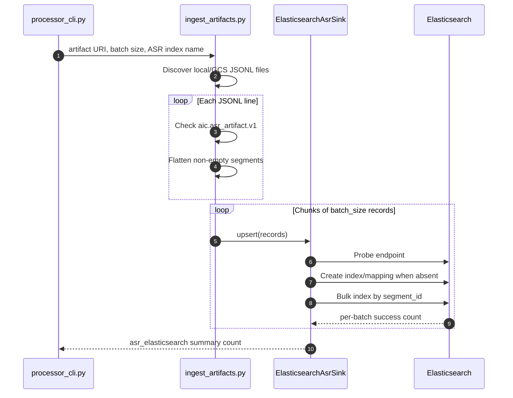
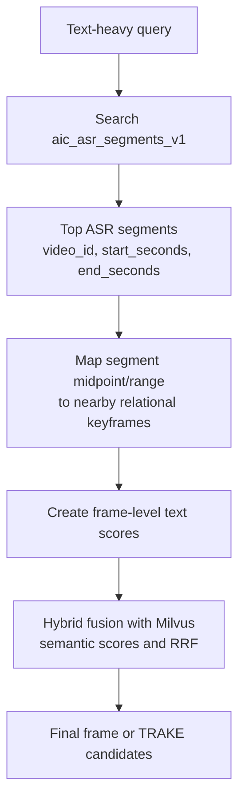

# ASR Text Ingestion into Elasticsearch

## 1. Purpose

This document explains how the project's corrected ASR artifacts are loaded
into local Elasticsearch, why the data is stored at segment level, and how the
resulting index should be connected to multimodal retrieval.

The source data is located at:

```text
data/extracted/asr/asr_output_corrected_split/
```

It contains one JSONL artifact per batch from `L21` through `L30`. According to
the included manifest, the corpus contains 873 videos and 41,201 ASR segments.
Most text was corrected after transcription; each segment retains its video ID,
start/end time, original/corrected text, language, and correction provenance.

The importer described here is intentionally **ASR-only**. It does not write
PostgreSQL/Supabase, Milvus, visual embeddings, OCR, captions, or object
detections. It only creates or upserts the Elasticsearch ASR segment index.

## 2. Why segment-level ASR indexing is useful

ASR evidence is temporal and lexical:

- a title, person name, number, location, quote, or spoken event may not be
  visible in a frame;
- an entire-video transcript makes it difficult to locate the relevant moment;
- a short segment with `start_seconds` and `end_seconds` identifies where the
  evidence occurs in the video;
- segment IDs give a stable, idempotent Elasticsearch document identity.

For example, a query asking about a statement mentioning "Berlin" should find
the spoken segment first. The retrieval system can then map the segment time to
one or more nearby keyframes for visual verification and submission.

## 3. Source Artifact Format

Each line in `Lxx/asr_segments.jsonl` is a video-level wrapper that conforms to
`aic.asr_artifact.v1`:

```json
{
  "schema_version": "aic.asr_artifact.v1",
  "run_id": "fe-asr-v1_full_...",
  "stage": "asr",
  "dataset_code": "ai_challenge_2025",
  "batch_id": "L21",
  "video_id": "L21_V001",
  "source": {
    "video_id": "L21_V001",
    "filename": "L21_V001.mp4",
    "duration_seconds": 1261.726
  },
  "model": {
    "name": "hf-openai/whisper-large-v3-turbo-vad",
    "language": "vi"
  },
  "segments": [
    {
      "segment_id": "L21_V001_ASR_000000",
      "start_seconds": 0.0,
      "end_seconds": 8.32,
      "timestamp_ms_start": 0,
      "timestamp_ms_end": 8320,
      "text": "Corrected transcript text",
      "normalized_text": "corrected transcript text",
      "raw_text": "Original transcript text",
      "language": "vi",
      "confidence": null,
      "correction_status": "corrected"
    }
  ]
}
```

The importer reads the wrapper, skips blank text, and flattens each item in
`segments` into one Elasticsearch document. Therefore the expected output
document count is close to 41,201, subject to intentionally blank segments.

## 4. Architecture and Data Flow

```mermaid
flowchart LR
    A[Corrected ASR JSONL\nL21 ... L30] --> B[processor_cli.py\nimport-feature-artifacts]
    B --> C[Artifact loader\nvalidates schema_version]
    C --> D[ASR record flattener\none document per segment]
    D --> E[ElasticsearchAsrSink]
    E --> F[(Elasticsearch\naic_asr_segments_v1)]
    F --> G[Segment lexical search\nBM25 / fuzzy match]
    G --> H[Temporal join\nvideo_id + time range]
    H --> I[(PostgreSQL/Supabase\nVideos and Keyframes)]
    I --> J[Frame candidates for\nhybrid visual + text ranking]
```



### 4.1 Importer control flow



The sink uses the Elasticsearch bulk helper with `_op_type: index` and
`_id = segment_id`. Re-running the same command overwrites documents with the
same segment IDs instead of creating duplicates. This is idempotent for updated
or corrected segment content. It does not delete documents whose source segment
has been removed; a full rebuild is required for that case.

## 5. Elasticsearch Index Schema

By default, the generic feature importer chooses:

```text
<elasticsearch_index>_asr_segments
```

For this data, use an explicit, versioned index name:

```text
aic_asr_segments_v1
```

The ASR sink creates the following mapping if the index does not already exist:

```json
{
  "mappings": {
    "properties": {
      "segment_id": {"type": "keyword"},
      "video_id": {"type": "keyword"},
      "run_id": {"type": "keyword"},
      "stage": {"type": "keyword"},
      "start_seconds": {"type": "float"},
      "end_seconds": {"type": "float"},
      "text": {"type": "text"},
      "language": {"type": "keyword"},
      "model_name": {"type": "keyword"},
      "source_gcs_uri": {"type": "keyword"}
    }
  }
}
```

The flattened source written to Elasticsearch is:

```json
{
  "segment_id": "L21_V001_ASR_000000",
  "video_id": "L21_V001",
  "run_id": "fe-asr-v1_full_...",
  "stage": "asr",
  "start_seconds": 0.0,
  "end_seconds": 8.32,
  "text": "Corrected transcript text",
  "language": "vi",
  "confidence": null,
  "model_name": "hf-openai/whisper-large-v3-turbo-vad",
  "source_gcs_uri": ""
}
```

### 5.1 Current schema limitation

The raw artifact contains `normalized_text`, `raw_text`, correction status, and
correction provenance. The current `ElasticsearchAsrSink` writes the corrected
`text` field but does not persist those additional fields. This is adequate for
basic lexical retrieval, but an audit-oriented schema should add:

```text
normalized_text         text
raw_text                text
timestamp_ms_start      long
timestamp_ms_end        long
batch_id                keyword
dataset_code            keyword
correction_status       keyword
correction_provenance   object
```

Adding a mapping to an existing index is safe for new fields. Changing an
existing field type requires a new versioned index and reindexing.

## 6. Relation to the Current Backend Search Path

There are two Elasticsearch document shapes in the project:

| Index/document type | Primary ID | Granularity | Current consumer |
| --- | --- | --- | --- |
| `keyframe_annotations` | `keyframe_id` | Keyframe | `RetrievalService._text_scores()` in the current backend. |
| `aic_asr_segments_v1` | `segment_id` | ASR time segment | Imported by this runbook; requires temporal mapping to become frame candidates. |

This distinction matters. The current `RetrievalService._text_scores()` queries
`keyframe_annotations` and expects a `keyframe_id`/`frame_id` that can be
resolved directly to the relational `keyframes` table. The ASR importer writes
one document per spoken segment and has `video_id` plus time range, not a
keyframe ID. Therefore, inserting this ASR index alone does **not** automatically
make segment hits contribute to the present hybrid frame ranker.

The correct integration path is:



Two valid implementation options are:

1. **Segment-first retrieval adapter (recommended)**: add an ASR segment
   search adapter in the backend, query `aic_asr_segments_v1`, resolve the
   segment time range against PostgreSQL `keyframes`, and assign its lexical
   score to one or several nearest frames. This preserves precise temporal ASR
   evidence and makes it available to TRAKE.
2. **Materialized keyframe text**: during ingest, map each ASR segment to nearby
   frames and upsert `asr_text` and `normalized_asr_text` into
   `keyframe_annotations`. This works with the current backend without a new
   adapter, but duplicates ASR text and loses some segment-level precision.

Until one option is active, the new ASR index can still be inspected directly
for data validation and manual evidence lookup.

## 7. Prerequisites

Run commands from the repository root unless stated otherwise.

### 7.1 Start Elasticsearch

```powershell
docker compose up -d elasticsearch
docker compose ps
Invoke-RestMethod http://localhost:9200
```

Expected output includes Elasticsearch cluster metadata. The local compose
service is exposed at `http://localhost:9200` with security disabled for local
development only.

### 7.2 Install processor dependencies

Create a dedicated virtual environment once. The full processor requirements
are the safest option because the importer shares modules with the extraction
pipeline.

```powershell
python -m venv .venv-processors
.\.venv-processors\Scripts\Activate.ps1
python -m pip install --upgrade pip
python -m pip install -r scripts\processors\requirements.txt
```

Set the local Elasticsearch endpoint for the current PowerShell session:

```powershell
$env:ELASTICSEARCH_URL = "http://localhost:9200"
```

`processor_cli.py` also loads `.env` without overriding variables already set
in the shell. The explicit environment variable above avoids accidentally
targeting a remote Elasticsearch instance.

## 8. Dry Run Before Insert

The dry run discovers and parses all matching JSONL files but does not call any
database sink. It is the required preflight step.

```powershell
Set-Location scripts\processors

python processor_cli.py import-feature-artifacts `
  --artifact-uri "..\..\data\extracted\asr\asr_output_corrected_split" `
  --asr-elasticsearch-index "aic_asr_segments_v1" `
  --batch-size 500 `
  --no-pg `
  --no-milvus `
  --no-text-embeddings `
  --dry-run
```

Review the JSON summary. The important fields are:

```text
artifact_files       # all L21 ... L30 ASR JSONL files discovered
asr_records          # number of non-empty flattened ASR segments
asr_elasticsearch    # 0 during dry run
dry_run              # true
```

If `asr_records` is unexpectedly zero, stop and verify that the input JSONL
contains video-level records with `schema_version: aic.asr_artifact.v1` and a
`segments` list.

## 9. Insert ASR Documents into Elasticsearch

After the dry run is correct, run the same command without `--dry-run`:

```powershell
Set-Location scripts\processors

python processor_cli.py import-feature-artifacts `
  --artifact-uri "..\..\data\extracted\asr\asr_output_corrected_split" `
  --asr-elasticsearch-index "aic_asr_segments_v1" `
  --batch-size 500 `
  --no-pg `
  --no-milvus `
  --no-text-embeddings
```

Expected summary fields:

```json
{
  "asr_records": 41201,
  "asr_elasticsearch": 41201,
  "pg": 0,
  "milvus": 0,
  "elasticsearch": 0,
  "text_milvus": 0,
  "dry_run": false
}
```

The exact count may be lower if the importer skips blank text. If a previous
partial run failed, re-run this command. Stable `segment_id` values make the
operation safe to repeat.

Return to the repository root afterward:

```powershell
Set-Location ..\..
```

## 10. Verification Queries

### 10.1 Inspect mapping and document count

```powershell
Invoke-RestMethod "http://localhost:9200/aic_asr_segments_v1/_mapping" |
  ConvertTo-Json -Depth 10

Invoke-RestMethod "http://localhost:9200/aic_asr_segments_v1/_count" |
  ConvertTo-Json
```

### 10.2 Search transcript text directly

```powershell
$body = @{
  size = 5
  query = @{
    match = @{
      text = "Berlin"
    }
  }
} | ConvertTo-Json -Depth 6

Invoke-RestMethod -Method Post `
  -Uri "http://localhost:9200/aic_asr_segments_v1/_search" `
  -ContentType "application/json" `
  -Body $body |
  ConvertTo-Json -Depth 10
```

Confirm that each hit includes `video_id`, `start_seconds`, `end_seconds`, and
the corrected `text`. Those fields are the contract needed to map the segment
to a playback position and nearby keyframes.

### 10.3 Operational checks

```powershell
Invoke-WebRequest "http://localhost:9200/_cat/indices?v"
docker compose logs --tail 100 elasticsearch
```

For a reproducible ingest record, redirect the importer output to a timestamped
file outside the source ASR directory:

```powershell
New-Item -ItemType Directory -Force data\reports | Out-Null
python scripts\processors\processor_cli.py import-feature-artifacts `
  --artifact-uri "data\extracted\asr\asr_output_corrected_split" `
  --asr-elasticsearch-index "aic_asr_segments_v1" `
  --batch-size 500 `
  --no-pg --no-milvus --no-text-embeddings `
  | Tee-Object data\reports\asr_elasticsearch_insert.json
```

Use either the command from `scripts\processors` or the root-level command,
not both in the same run. The artifact path is relative to the chosen working
directory.

## 11. Failure Handling and Safe Re-runs

| Symptom | Likely cause | Action |
| --- | --- | --- |
| `Elasticsearch unavailable` | Container is stopped, wrong URL, or port 9200 is occupied. | Start Elasticsearch, check `docker compose ps`, then set `ELASTICSEARCH_URL`. |
| `asr_records: 0` | Wrong folder, malformed JSONL, or unsupported artifact schema. | Run the dry run and inspect one source line. |
| Bulk request failure | Mapping conflict, disk pressure, or service failure. | Read Elasticsearch logs; use a new versioned index if field types changed. |
| Import stops mid-run | Shell/process interruption. | Run the same command again; existing segment IDs are overwritten. |
| Count is larger than expected | An old index was reused with stale documents. | Create a new index version or explicitly delete/rebuild after approval. |
| Backend KIS/QA does not use ASR results | Segment index is not yet mapped to keyframes in the frame ranker. | Implement the segment-first adapter or materialize ASR into `keyframe_annotations`. |

Avoid deleting an index during normal operation. A deliberate full rebuild can
use a new name such as `aic_asr_segments_v2`, validate it, then switch a backend
alias/configuration to the new index. Versioned indexes provide rollback without
destroying the validated previous corpus.

## 12. Recommended Production Improvements

1. Add a Vietnamese text analyzer or an appropriate custom analyzer to improve
   tokenization and matching for Vietnamese ASR.
2. Store `normalized_text` separately from corrected display text and use it as
   an additional boosted field.
3. Save batch, dataset, correction provenance, and millisecond timestamps in
   Elasticsearch for audit and filtering.
4. Implement a segment-to-keyframe temporal join in the backend, then expose
   ASR score and excerpt in `score_breakdown`.
5. Add phrase and highlight queries for exact spoken quotes and UI evidence.
6. Create an index alias such as `aic_asr_segments_current` so new index
   versions can be promoted without code changes.
7. Monitor document count, bulk error count, refresh latency, query p95, and
   zero-hit rate for text-heavy benchmark queries.

## 13. Implementation References

| File | Responsibility |
| --- | --- |
| `scripts/processors/processor_cli.py` | CLI entry point and `import-feature-artifacts` command. |
| `scripts/processors/src/ingest_artifacts.py` | Discovers JSONL artifacts, flattens ASR segments, chunks records, and produces import summary. |
| `scripts/processors/src/cloud_sinks/asr_elasticsearch.py` | Creates ASR mapping and performs idempotent bulk upserts by `segment_id`. |
| `scripts/processors/extract_gcs_asr.py` | Reference producer for `aic.asr_artifact.v1` artifacts. |
| `apps/backend/app/adapters/text_search/elasticsearch.py` | Backend Elasticsearch search adapter for frame-level metadata. |
| `apps/backend/app/modules/retrieval/service.py` | Current frame-level hybrid retrieval path and text score fusion. |
