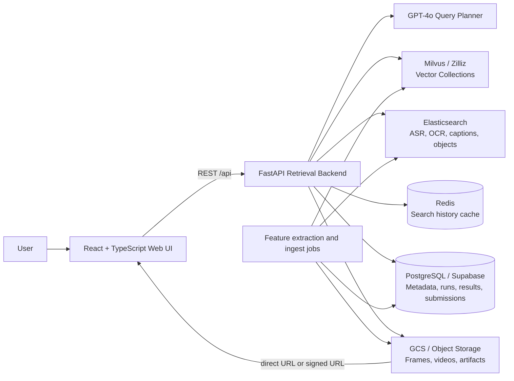
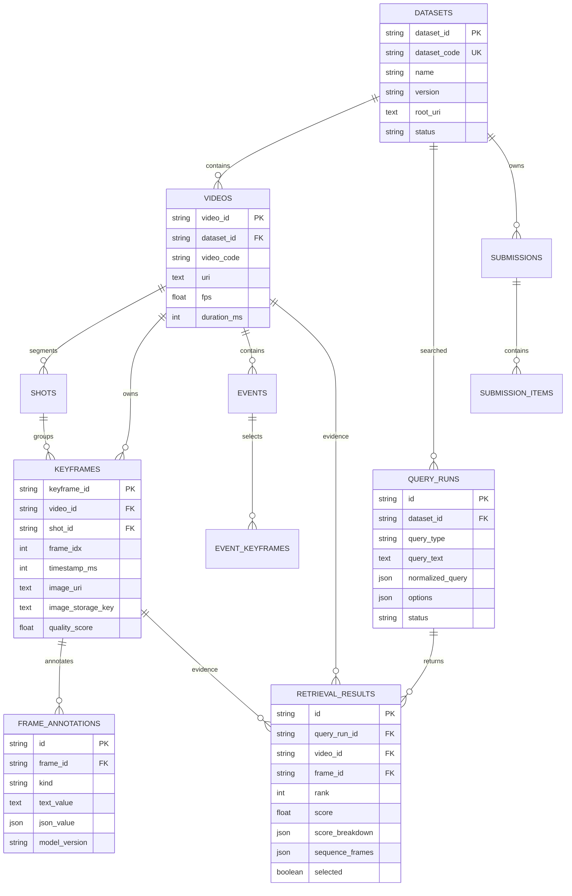
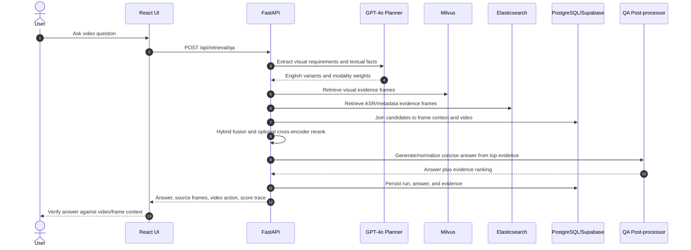

# Technical Report: Multimodal Video Retrieval System

## 1. Executive Summary

This project implements a production-oriented multimodal video retrieval system
for AI Challenge-style KIS, QA, and TRAKE tasks. The system accepts a natural
language query, uses an LLM planner to separate visual and textual evidence,
retrieves candidates from vector and lexical indexes, ranks them with hybrid
fusion, and presents verifiable frame and video evidence in a browser UI.

The current system is intentionally cloud-first for media: frame images and
videos are returned as Google Cloud Storage (GCS) URLs or signed redirects so
the browser loads media from object storage rather than copying assets through
the application server. Search state is durable in the relational database and
cached in Redis. Elasticsearch provides ASR-centered lexical retrieval, while
Milvus provides image-text vector retrieval from OpenCLIP embeddings.

The core retrieval path is:

```text
User query
  -> GPT-4o query planner
  -> English query variants + visual/text weights + temporal events
  -> Milvus semantic retrieval and Elasticsearch lexical retrieval
  -> normalized score fusion + Reciprocal Rank Fusion (RRF)
  -> optional cross-encoder reranking
  -> QA or TRAKE-specific post-processing
  -> PostgreSQL/Supabase audit record + Redis history cache + React UI
```

The current default LLM profile is `openai_gpt4o`. It is called through a
direct LangChain model invocation rather than a tool-less agent loop, which
keeps query planning responsive while retaining the structured JSON contract
and trace payload used by the UI.

## 2. Scope and Current Implementation Status

### 2.1 Supported search modes

| Mode | User objective | Retrieval and result contract |
| --- | --- | --- |
| KIS | Find the keyframe that best matches a description. | Returns independently ranked frame candidates. |
| QA | Locate visual evidence and answer a concise question. | Retrieves frame evidence, applies QA post-processing, and returns an answer plus supporting video/frame. |
| TRAKE | Find an ordered sequence of events in one video. | Retrieves event-level candidates, enforces chronological order, and returns `sequence_frames` with one frame per event. |

### 2.2 Active and planned components

| Component | Current state | Notes |
| --- | --- | --- |
| React web application | Active | KIS, QA, TRAKE, reasoning trace, score display, video preview, frame selection, CSV workflow. |
| FastAPI backend | Active | REST API, retrieval orchestration, media redirects, persistence, and ingest endpoints. |
| GPT-4o planner | Active when `OPENAI_API_KEY` is configured | Produces structured English-oriented retrieval plans. A deterministic fallback preserves search availability. |
| Elasticsearch | Active in the local compose stack | ASR and other text fields are indexed for lexical retrieval. |
| Redis | Active in the local compose stack | Seven-day cached search response history; latest 100 run IDs retained. |
| Relational database | Active with SQLite in the checked-in local compose file; PostgreSQL/Supabase supported by configuration | PostgreSQL/Supabase is the intended cloud catalog and audit store. |
| Milvus/Zilliz | Supported by the backend adapter and ingestion flow | May be external to the compact local compose stack; collection schema must be provisioned before vector ingest. |
| GCS media | Supported and used as the cloud-first media path | Browser receives direct public or signed URLs/redirects. |
| CLIP/OpenCLIP | Active primary visual registry entry | `clip_vith14_quickgelu_dfn5b_v2` is the default visual model. |
| SigLIP2 | Registered but disabled | Intended as the second visual collection for RRF fusion after validated feature ingest. |
| OCR, captions, object detection | Schema and adapters available; not required for current ASR-first text search | Text index can be expanded without changing the search API. |
| VLM reranking | Configured as an extension point, disabled | Candidate-level VLM verification is a future optimization. |

## 3. System Architecture



The design separates four concerns:

1. **Catalog and audit plane**: relational metadata provides the authoritative
   mapping from dataset to video to frame, plus query runs, results, and
   submissions.
2. **Retrieval plane**: Milvus and Elasticsearch independently retrieve a
   large candidate set using distinct evidence types.
3. **Reasoning plane**: GPT-4o converts an ambiguous human query into compact,
   searchable English variants and evidence-aware modality weights.
4. **Presentation plane**: the web UI renders candidates, explanations,
   temporal lanes, and cloud media without requiring the backend to stream
   image bytes for normal cloud-backed frames.

## 4. Data Model and Relational Database

### 4.1 Entity model

The SQLAlchemy schema models the video corpus and the retrieval audit trail:

```text
Dataset -> Video -> Shot -> Frame
                      |
                      +-> Event -> EventKeyframe

Frame -> FrameAnnotation

Dataset -> QueryRun -> RetrievalResult
Dataset -> Submission -> SubmissionItem

ModelRegistryRecord, IndexBuild, and Job record operational state.
```

Important tables and responsibilities are:

| Table/model | Responsibility |
| --- | --- |
| `Dataset` | Dataset code, version, root URI, state, and corpus boundary. |
| `Video` | Video identity, code, source URI, duration, and cloud media metadata. |
| `Shot` and `Frame` | Temporal positions, frame indices, timestamps, quality score, image URI/key, and links to video/shot. |
| `FrameAnnotation` | Normalized ASR, OCR, captions, object detections, and other searchable annotations. |
| `QueryRun` | Original query, normalized plan, options, latency, status, and reproducibility record. |
| `RetrievalResult` | Rank, final score, per-component score breakdown, selected state, QA answer, and TRAKE sequence frames. |
| `Submission` and `SubmissionItem` | Human-curated submission rows and validation/export state. |
| `IndexBuild` and `Job` | Ingestion/indexing lifecycle and asynchronous operational tracking. |

### 4.2 Supabase/PostgreSQL design

The same SQLAlchemy model supports PostgreSQL/Supabase through `DATABASE_URL`.
In a cloud deployment, Supabase should be treated as the source of truth for
metadata and audit history. Milvus and Elasticsearch only store retrieval
representations keyed by stable `frame_id`/`keyframe_id`; they should not
replace the relational catalog.

This split has three advantages:

- schema changes to metadata do not require re-embedding the corpus;
- every vector or text hit is resolved back to a validated `Frame` and `Video`;
- a query can be replayed from `QueryRun.normalized_query` and its saved
  options, even if the UI state has changed.

The local Docker compose configuration deliberately sets a SQLite development
database. This makes the local demo self-contained, but it is not a replacement
for PostgreSQL/Supabase in shared or production use. A deployment should set
`DATABASE_URL` to the Supabase PostgreSQL endpoint and run the schema migration
before serving traffic.

### 4.3 Database schemas and cross-store keys

#### Relational schema: PostgreSQL/Supabase



The relational tables hold the following minimum operational contract:

| Table | Primary key | Important fields | Constraints and purpose |
| --- | --- | --- | --- |
| `datasets` | `dataset_id` | `dataset_code`, `name`, `version`, `root_uri`, `status` | Unique dataset code and unique `(name, version)`. Defines the corpus boundary. |
| `videos` | `video_id` | `dataset_id`, `video_code`, `uri`, `fps`, `duration_ms`, source feature/map paths | Unique `(dataset_id, video_code)`. Supplies video identity and cloud source. |
| `shots` | `shot_id` | `video_id`, `shot_index`, start/end frames and seconds | Unique `(video_id, shot_index)` with ordered temporal checks. |
| `keyframes` | `keyframe_id` | `video_id`, `shot_id`, `frame_idx`, `timestamp_ms`, image URI/key, `map_n`, `embedding_index_0`, quality | Unique `(video_id, frame_idx)`. Canonical join target for all retrieval stores. |
| `frame_annotations` | UUID `id` | `frame_id`, `kind`, text/JSON value, caption, OCR, detections, confidence, model version | Allows multiple annotation producers and versions per frame. |
| `events` / `event_keyframes` | `event_id` / `(event_id, seq_no)` | event time boundaries, representative frame, ordered keyframes | Stores shot/event segmentation independently from search-time TRAKE events. |
| `query_runs` | UUID `id` | raw query, mode, normalized LLM plan, options, status | Durable reproducibility and audit record. |
| `retrieval_results` | UUID `id` | rank, final score, score breakdown, QA answer, TRAKE sequence JSON, selection flag | Unique `(query_run_id, rank)`. Preserves explainable result evidence. |
| `submissions` / `submission_items` | UUID `id` | submission state, query name/type, rank, video code, frame indices, answer | Validates and exports selected human-reviewed outputs. |

#### Milvus collection schema

Each model has an independent collection. The invariant is one canonical vector
record per `(model_key, keyframe_id)`, while the `keyframe_id` remains the same
join key used by PostgreSQL and Elasticsearch.

```text
Collection: keyframe_embeddings_<model_version>

id                   VARCHAR PRIMARY KEY
vector               FLOAT_VECTOR[D]

# Dynamic scalar metadata for resolution and audit
keyframe_id          VARCHAR
frame_id             VARCHAR
video_id             VARCHAR
frame_idx            INT
dataset_id           VARCHAR
batch_id             VARCHAR
model_key            VARCHAR
model_version        VARCHAR
embedding_family     VARCHAR
embedding_space      VARCHAR
embedding_dim        INT
extractor            VARCHAR
extractor_version    VARCHAR
frame_profile        VARCHAR
source_embedding_uri VARCHAR
source_map_uri       VARCHAR
canonical_mapping    JSON-compatible metadata
```

The adapter provisions cosine similarity and HNSW (`M=16`,
`efConstruction=200`) when using the explicit collection path. The vector ID or
the `keyframe_id` metadata is resolved to `keyframes.keyframe_id` before a
candidate can enter the final ranker. This prevents an embedding shard's local
array index from being confused with the actual video frame index.

#### Elasticsearch document schema

The text index is denormalized for fast lexical candidate generation but keeps
the same canonical identifiers:

```json
{
  "_id": "L26_V194_F0004700",
  "keyframe_id": "L26_V194_F0004700",
  "frame_id": "L26_V194_F0004700",
  "video_id": "L26_V194",
  "video_code": "L26_V194",
  "dataset_code": "ai_challenge_2025",
  "batch_id": "L26",
  "frame_idx": 4700,
  "timestamp_ms": 156667,
  "source_type": "asr",
  "kind": "asr",
  "asr_text": "...",
  "normalized_asr_text": "...",
  "raw_asr_text": "...",
  "context_before": "...",
  "context_after": "...",
  "caption": "...",
  "ocr_texts": "...",
  "detected_objects": "..."
}
```

Text fields are mapped as Elasticsearch `text`; identifiers and source type are
`keyword`; frame/time values are numeric. The backend searches with a fuzzy
`multi_match` query and profile-configured field boosts.

#### Redis and object-storage schema

Redis is a cache, not the source of truth:

```text
search_history:{query_run_id}  -> JSON SearchResponse, TTL 7 days
search_history:recent          -> Redis list of latest query_run_id values, max 100
```

GCS/object storage keeps immutable or versioned media and processing artifacts:

```text
processed/keyframes/dataset=<dataset>/batch=<batch>/profile=<frame_profile>/
  video_id=<video_code>/<image-file>.jpg

processed/videos/dataset=<dataset>/batch=<batch>/video_id=<video_code>/<video-file>.mp4

features/extractors/dataset=<dataset>/batch=<batch>/frame_profile=<profile>/
  extractor=vector-embedding/extractor_version=<version>/
  embeddings/<shard>.npy
  map-keyframes/<shard>.jsonl
```

The exact bucket/prefix is deployment-configured. Relational `image_uri` and
`image_storage_key` are the authoritative media references; the frontend only
uses browser-ready public or signed URLs derived from them.

## 5. Vector Database and Embedding Strategy

### 5.1 Milvus schema and indexing

The Milvus adapter uses a string primary key and a floating-point vector field.
Collections are created with cosine similarity and either HNSW (`M=16`,
`efConstruction=200`) or Milvus `AUTOINDEX`, depending on the creation path.
Dynamic scalar fields keep retrieval lineage with each vector, including:

```text
frame_id, keyframe_id, video_id, frame_idx, dataset_id, batch_id,
model_key, model_version, embedding_family, embedding_space, embedding_dim,
extractor, extractor_version, frame_profile, source_embedding_uri,
source_map_uri, and canonical mapping fields.
```

This lineage is essential. A vector result is useful only if the backend can
map it to a canonical relational frame and then to a cloud image/video URL.

### 5.2 Visual models

The retrieval profile uses the following visual-collection pattern:

| Role | Registry key | Collection | State |
| --- | --- | --- | --- |
| Primary global visual model | `clip_vith14_quickgelu_dfn5b_v2` | `keyframe_embeddings_clip_vith14_quickgelu_dfn5b_v2` | Enabled |
| Fine-grained second model | `siglip2_so400m16_384_webli_openclip_1152_v1` | `keyframe_embeddings_siglip2_so400m16_384_webli_openclip_1152_v1` | Disabled until validated ingest |

For every query variant, the backend embeds the text in the matching model
space, queries each enabled collection, and keeps the best score per frame.
When more than one visual model is enabled, a visual-level RRF stage can merge
their ranked lists before hybrid text/visual fusion.

### 5.3 Dimension contract: a required pre-ingest check

The current model registry declares the primary CLIP model as `1024` dimensions
and the SigLIP2 model as `1152` dimensions. The Milvus collection dimension,
the extractor output shape, and the query text encoder dimension must match
exactly for each collection. In particular, a CLIP feature directory described
as `1152` dimensions must not be ingested into the currently configured CLIP
collection until the model registry and collection schema have been reconciled.

Recommended preflight for every extractor version:

1. Read a representative embedding file and confirm `(N, D)`.
2. Confirm the extractor model and preprocessing version that generated it.
3. Create or verify a Milvus collection with dimension `D` and cosine metric.
4. Save the extractor version, model key, dimension, source URI, and canonical
   keyframe mapping in vector metadata.
5. Run a text-query smoke test and confirm returned IDs resolve to `Frame` rows.

This check prevents a silent but severe retrieval error: using a text encoder
from one embedding space to query image vectors from another.

## 6. Elasticsearch Text Retrieval

Elasticsearch is the lexical evidence store. Its index mapping supports the
following text-bearing fields:

```text
caption, text_value, ocr_texts, detected_objects, asr_text,
normalized_asr_text, raw_asr_text, context_before, context_after
```

The adapter uses a `multi_match` query with `fuzziness: AUTO`. Boosts are
profile-controlled; the default competition profile gives ASR a strong boost
(`2.5`) and reserves separate boost controls for OCR, object detections, and
captions. Keyword fields such as `video_id`, `video_code`, `keyframe_id`,
`dataset_code`, and `batch_id` preserve efficient identity and filter queries.

ASR is therefore useful for benchmark questions that depend on named entities,
spoken statements, titles, locations, numbers, dates, or other information that
cannot reliably be inferred from a single keyframe. The planner can assign text
a larger share of the retrieval budget for these cases.

## 7. LLM Query Planning Agent

### 7.1 Model and execution model

The configured default profile is:

```yaml
active_profile: openai_gpt4o
execution_mode: direct
provider: openai
model: gpt-4o
```

The planner invokes GPT-4o through LangChain with a strict JSON instruction.
The direct execution mode is deliberate: the previous Deep Agent wrapper had no
runtime tools to call, so direct invocation removes unnecessary orchestration
latency without reducing the retrieval plan quality or output contract.

The API response records `agent_query_plan.source=langchain_direct_llm` on a
successful plan. If the key, dependency, provider, or remote request is
unavailable, the backend records a fallback reason and continues using a
deterministic plan. Retrieval availability is never made dependent on an LLM.

### 7.2 Plan contract

The planner returns:

```json
{
  "language": "vi|en|mixed|auto",
  "intent": "KIS|QA|TRAKE",
  "summary": "English retrieval summary",
  "search_factors": {
    "subjects": [], "actions": [], "objects": [], "attributes": [],
    "scene": [], "text_cues": [], "time_cues": [],
    "negative_constraints": []
  },
  "retrieval_strategy": {
    "clauses": [{"text": "...", "evidence": "visual|text|both", "importance": 0.0}],
    "weights": {"visual": 0.0, "text": 0.0},
    "rationale": "..."
  },
  "temporal_events": [{
    "order": 1, "query": "English event query", "importance": 1.0,
    "retrieval_weights": {"visual": 0.0, "text": 0.0}
  }],
  "variants": [{"text": "English retrieval rewrite", "purpose": "semantic|metadata|temporal"}]
}
```

The system prompt explicitly asks the planner to:

- translate semantic retrieval rewrites into English while preserving exact OCR
  text in its original script;
- split TRAKE queries with `E1 ... En` labels into exactly `n` ordered events;
- classify each requirement as visual, text, or both;
- infer visual/text weights from evidence instead of hard-coding a visual bias;
- give textual evidence substantial weight for ASR, dialogue, titles, names,
  dates, numbers, and quoted phrases.

### 7.3 Dynamic modality routing

The backend normalizes LLM weights so they are non-negative and sum to one.
They reallocate the retrieval profile's semantic/text budget rather than
introducing unbounded scores. If no valid LLM weights are present, a deterministic
heuristic routes the query. For example, ordered cooking actions are generally
visual-heavy, while questions containing named spoken facts are text-heavy.

For TRAKE, the same decision is made per event. One event may rely on visual
object contact, while another event in the same sequence can prioritize ASR.
The normalized plan, event plans, sources, and raw strategy are returned to the
frontend reasoning trace for inspection.

### 7.4 Agent flows for KIS, QA, and TRAKE

#### KIS: visual/text evidence-aware keyframe search

```mermaid
sequenceDiagram
    autonumber
    actor User
    participant UI as React UI
    participant API as FastAPI
    participant LLM as GPT-4o Planner
    participant VDB as Milvus
    participant ES as Elasticsearch
    participant DB as PostgreSQL/Supabase

    User->>UI: Enter KIS description
    UI->>API: POST /api/retrieval/search (KIS, top_k=50)
    API->>LLM: Query plus structured JSON prompt
    LLM-->>API: English variants, factors, visual/text weights
    par Visual recall
        API->>VDB: Embed variants and ANN cosine search
        VDB-->>API: Ranked keyframe IDs and distances
    and Text recall
        API->>ES: ASR/OCR/caption multi_match search
        ES-->>API: Ranked keyframe IDs and BM25 scores
    end
    API->>DB: Resolve frames, videos, annotations; apply filters
    API->>API: Normalize scores, weighted fusion, RRF, optional rerank
    API->>DB: Persist QueryRun and RetrievalResults
    API-->>UI: Frames, score breakdown, plan trace, cloud media references
    UI-->>User: Inspect result and select frame
```

The KIS agent typically gives visual evidence high weight for people, objects,
actions, colors, layout, and scene. It gives text evidence high weight when the
query identifies a spoken phrase, person name, program title, number, date, or
other lexical fact.

#### QA: retrieve evidence before answering



The QA path is retrieval-first. The answer is associated with retrieved visual
and textual evidence rather than being emitted as an unsupported LLM-only
assertion. The UI intentionally gives the user the full source video and
neighboring frames for human verification.

#### TRAKE: ordered multi-event retrieval and ATS reranking

```mermaid
sequenceDiagram
    autonumber
    actor User
    participant UI as React UI
    participant API as FastAPI
    participant LLM as GPT-4o Planner
    participant VDB as Milvus
    participant ES as Elasticsearch
    participant ATS as Adaptive Temporal Search
    participant DB as PostgreSQL/Supabase

    User->>UI: Submit E1 ... En ordered events
    UI->>API: POST /api/retrieval/trake
    API->>LLM: Split events and classify evidence per event
    LLM-->>API: Ordered English event queries, importance, modality weights
    loop Each event Ei
        par Visual candidates for Ei
            API->>VDB: Query Ei in matching embedding collection
            VDB-->>API: Visual frame candidates
        and Text candidates for Ei
            API->>ES: Query Ei against ASR/metadata fields
            ES-->>API: Text frame candidates
        end
        API->>API: Per-event hybrid fusion and candidate pruning
    end
    API->>ATS: Candidate sets, event importances, time gap limit
    ATS->>ATS: Group by video; beam search strictly increasing frame_idx
    ATS-->>API: Ordered full sequences and temporal scores
    API->>DB: Persist sequence_frames and score breakdown
    API-->>UI: Event lanes with Visual/Text/RRF/Event scores
    UI-->>User: Compare sequences, inspect paused video, select frames
```

For TRAKE, each `Ei` is independently retrievable and may receive different
visual/text weights. ATS joins only candidates from the same video and preserves
strict temporal order. This is critical for cooking, procedure, and event
transition queries where a collection of individually relevant frames is not a
valid answer unless their order is correct.

## 8. Hybrid Retrieval, Fusion, and Reranking

### 8.1 Candidate generation

For each query variant the backend executes, independently:

1. **Semantic retrieval**: embed the query with the text encoder matched to an
   enabled Milvus collection and retrieve nearest image embeddings.
2. **Text retrieval**: search Elasticsearch over ASR and other available
   annotation fields.
3. **Catalog resolution**: resolve candidate IDs to relational `Frame` rows,
   load their videos and annotations, and apply metadata/time/object filters.

The union of semantic and lexical candidates is scored. If a backend is absent
or returns no candidates, the service can use a database-backed fallback ranker.
With `strict_hybrid=true`, a failed semantic or text backend is surfaced as an
error instead, which is useful for operational verification.

### 8.2 Score fusion

Scores are first normalized by the maximum value in the candidate set:

```text
weighted_score = w_visual * visual_score
               + w_text   * text_score
               + w_quality * quality_score
```

When RRF is enabled, the rank-based score is:

```text
rrf_raw = w_visual * 1 / (k + semantic_rank)
        + w_text   * 1 / (k + text_rank)

final_score = (1 - rrf_blend) * weighted_score + rrf_blend * normalized_rrf
```

The default profile uses `k=60`. RRF improves robustness when Milvus cosine
scores and Elasticsearch BM25 scores are not directly comparable. The response
retains `semantic_score`, `text_score`, `rrf_score`, and final score so a user
can identify why a frame ranked highly.

### 8.3 Reranking

The model registry contains a cross-encoder reranker,
`cross-encoder/ms-marco-MiniLM-L-6-v2`, with a lexical-overlap fallback. The
frontend requests reranking, while profile configuration determines whether the
cross-encoder stage is enabled for a given profile. This separation supports
fast experimentation: candidate recall can be measured independently from the
expense of reranking.

## 9. TRAKE Temporal Search

TRAKE is not a single-frame search. The backend creates one candidate set for
each temporal event, restricted to frames from the same video, then applies an
Adaptive Temporal Search (ATS)-style beam search.

Constraints for a valid sequence are:

```text
frame_idx(E1) < frame_idx(E2) < ... < frame_idx(En)
frame_idx(Ei+1) - frame_idx(Ei) <= delta_frame_max
```

`delta_frame_max` is derived from `delta_t_max_ms` using a 30 FPS conversion.
The configured default is 180,000 ms. Candidate event importance comes from the
LLM plan when available and is normalized across events. The temporal sequence
score is the weighted average of matched event scores, following the ATS
interpretation used by the implementation:

```text
sequence_score = sum(event_importance_i * event_score_i) / matched_event_count
```

The competition profile prefers full sequences. Partial sequences are returned
only when the request explicitly relaxes `min_match`. Each result stores:

- event order and event query;
- frame index and timestamp;
- visual, text, RRF, and event score for each selected frame;
- aggregate temporal, visual, text, and RRF scores;
- ordering diagnostics, gaps, and matched-event count.

The frontend deliberately no longer hides duplicate candidate frames across
different ranked sequences. A valid individual sequence still requires strictly
increasing frame indices, so an event cannot reuse the same temporal position
inside that one sequence.

## 10. Frontend Application

The frontend is a React and TypeScript retrieval workspace served by Vite. It
is designed for investigation rather than a marketing flow.

### 10.1 Search workspace

Key frontend behaviors include:

- KIS and QA results render as sortable/inspectable frame cards.
- TRAKE renders temporal event lanes. Every result cell shows `Visual`, `Text`,
  `RRF`, and `Event` scores for that event frame.
- The reasoning panel displays the active LLM profile, planner source, query
  factors, temporal split, modality weights, and raw trace payload.
- The default top-k is 50, limiting first-screen rendering and retrieval work.
- A result can be added to the submission state; TRAKE preserves the ordered
  frame list.

### 10.2 Video and frame inspection

Selecting the `Video` action opens a browser-native video player. The player:

- requests a direct cloud preview URL where one is available;
- opens paused, including after a frame switch or source change;
- uses `preload="metadata"` and a poster image to reduce unnecessary transfer;
- lets the user step backward/forward through retrieved contextual frames;
- allows the selected contextual frame to be added to a submission.

The browser only plays after a user presses its Play control. This prevents
multiple result previews from unexpectedly consuming bandwidth or audio focus.

### 10.3 Export workflow

The UI maintains selected rows locally and exports the expected submission CSV
directly. The relational submission endpoints remain available for server-side
validation, persistence, and download workflows.

## 11. Cloud Media and Delivery Design

Frame thumbnails are cloud-first. The frame thumbnail endpoint performs a 307
redirect to a signed GCS URL when possible, otherwise to a public cloud URL.
It intentionally does not load a local file from `DATA_ROOT` for a cloud-backed
frame. This keeps application CPU, memory, and network bandwidth out of the
image delivery path.

For video, `/api/media/videos/{video_id}/preview-url` returns the direct URL
and marks it `direct: true` for GCS/HTTP media. The browser then performs normal
HTTP media requests, including byte-range requests supported by the object
store. The fallback `/preview` endpoint redirects to the same cloud URL or
serves a local byte-range response only when a video is genuinely local.

This architecture resembles the important delivery principle used by video
platforms: application services issue authorization/metadata while the CDN or
object store serves the large media object. It is not yet a full adaptive
bitrate HLS/DASH transcoding pipeline. HLS/DASH renditions, CDN cache policy,
and per-user signed URL expiry are recommended next steps for large-scale public
deployment.

## 12. Ingestion and Data Engineering

The project contains both API-driven ingestion stages and script-based data
processors. The intended data flow is:

```text
Raw video in GCS or local source
  -> dataset scan and manifest
  -> shot/keyframe extraction
  -> ASR/OCR/caption/object extraction as available
  -> frame metadata and annotations in PostgreSQL/Supabase
  -> embedding files and canonical frame mapping
  -> Milvus upsert and Elasticsearch upsert
  -> validation report and sample retrieval smoke test
```

The processor utilities include artifact I/O, checkpoint storage, shard
execution, GCS source reading, annotation extraction, ASR-to-Elasticsearch
sinks, Milvus writers, metadata writers, and reconciliation tools. This supports
restartable batch processing rather than relying on one opaque notebook run.

For ingestion correctness, the following invariants should be validated:

1. Every `frame_id` in Milvus resolves to one relational `Frame` row.
2. Every Elasticsearch document contains the same canonical frame/video
   identifiers used by the relational catalog.
3. Frame timestamp, frame index, and video ID are preserved through feature
   extraction and canonical mapping.
4. The vector dimension and model/extractor version are compatible with the
   target Milvus collection.
5. The cloud image/video URI is reachable by the frontend identity or through
   a signed redirect.

## 13. Reliability, Observability, and Testing

### 13.1 Failure isolation

The retrieval path degrades in layers:

- missing or failed LLM planning -> deterministic English/temporal fallback;
- unavailable Milvus or Elasticsearch -> other backend and catalog fallback may
  still serve results unless strict hybrid mode is enabled;
- Redis failure -> search remains successful; only cache history is skipped;
- unavailable cloud media -> result metadata remains visible and the media
  endpoint returns a clear 404 rather than silently selecting local assets.

External service calls use short connection/search timeouts for Milvus and
Elasticsearch. Query runs are marked `DONE` or `FAILED`, and exception handling
rolls back partial persistence before writing a failed run record.

### 13.2 Auditability

For every search, the backend persists:

- original user query and options;
- normalized variants, temporal events, dynamic weights, planner source, and
  latency;
- ranked results and their score breakdowns;
- selected state and any QA answer.

Redis stores a serialized search response under `search_history:{query_run_id}`
for seven days and keeps a `search_history:recent` list capped at 100 entries.
The relational database remains the durable audit system; Redis is an auxiliary
latency optimization.

### 13.3 Automated verification

Focused tests cover agent fallback behavior, OpenAI profile metadata, evidence
weight extraction, TRAKE ordering/score metadata, and ATS sequence scoring.
Frontend production compilation is verified with `npm run build`. The practical
end-to-end smoke test is a four-event asparagus TRAKE query, which validates
LLM temporal decomposition, text/visual candidate retrieval, ATS ordering, and
score fields returned to the UI.

## 14. Security and Deployment Considerations

Secrets must remain in `.env`, a secret manager, or the deployment platform;
they must not be committed to the repository. This includes OpenAI, Supabase,
LangSmith, GCS service-account, Milvus/Zilliz, and object-storage credentials.

For deployment:

- use Supabase/PostgreSQL rather than local SQLite for a shared instance;
- use managed Milvus/Zilliz or a separately managed Milvus cluster;
- expose Elasticsearch only inside a private network;
- configure CORS and authenticated API access before public use;
- issue scoped, expiring GCS signed URLs for private media;
- place the web application and API behind TLS reverse proxy/CDN infrastructure;
- monitor LLM usage, timeout rate, empty-plan fallback rate, vector retrieval
  latency, Elasticsearch latency, and media redirect failures.

The current ngrok setup is useful for demos and remote review, not as a
production ingress. A stable deployment should use a managed domain, TLS,
authentication, rate limiting, and persistent service infrastructure.

## 15. Performance Strategy

Current performance choices are intentionally conservative:

| Area | Technique | Purpose |
| --- | --- | --- |
| Candidate retrieval | ANN search in Milvus | Avoid scanning the full keyframe corpus. |
| Text retrieval | Elasticsearch multi-match | Fast lexical recall for ASR and metadata. |
| Score fusion | Normalization plus RRF | Stabilize ranking across heterogeneous score scales. |
| TRAKE | Per-event candidates plus bounded beam search | Search ordered sequences without enumerating all frame combinations. |
| Media | Direct GCS/public/signed URLs | Keep media bytes off the FastAPI server. |
| UI | Metadata preload, poster frame, 50-result default | Improve perceived responsiveness. |
| History | Redis TTL cache | Reduce repeated history/database reads. |
| LLM | Direct structured GPT-4o plan | Avoid tool-less agent overhead while retaining reasoning. |

Recommended measurements for the next evaluation iteration are Recall@K and
MRR for KIS/QA, sequence recall or exact sequence accuracy for TRAKE, p50/p95
latency split by planner/vector/text/fusion/media stages, and ablations for
CLIP-only versus CLIP+SigLIP2 versus text-only versus hybrid RRF.

## 16. Limitations and Recommended Next Steps

1. **Validate embedding contracts before ingestion.** Reconcile the primary
   CLIP extractor's actual dimension with the registry and target collection.
2. **Enable SigLIP2 only after a separate, correctly dimensioned collection is
   populated.** Evaluate visual RRF on the benchmark before making it default.
3. **Complete annotation coverage.** Ingest captions, OCR, and object detection
   when available; retain ASR as the current text baseline.
4. **Calibrate retrieval weights.** Use benchmark-level ablations and save
   profile versions rather than relying only on prompt-derived weights.
5. **Add temporal diversification.** Permit repeated frames across ranked
   TRAKE results for recall, while optionally offering a diversity mode that
   reduces near-identical sequences.
6. **Add VLM verification for top candidates.** A compact VLM reranker can
   validate detailed object interactions or QA evidence after high-recall
   retrieval, not before it.
7. **Adopt streaming packaging for scale.** Generate HLS/DASH renditions and
   serve via CDN when video duration/concurrency increases.
8. **Harden multi-user deployment.** Add authentication, query quotas,
   observability dashboards, background workers, and secret management.

## 17. Conclusion

The project provides a coherent AI engineering stack rather than an isolated
embedding demo. Its central design decision is evidence-aware retrieval: visual
semantic similarity, ASR/metadata text matching, temporal constraints, and LLM
query interpretation contribute separately and remain visible to the user.

This makes the system practical for iterative benchmark work. New embeddings,
annotations, rerankers, and cloud data can be added behind stable interfaces,
while every query remains traceable through the relational audit record, score
breakdown, temporal sequence payload, and browser-visible cloud media.
