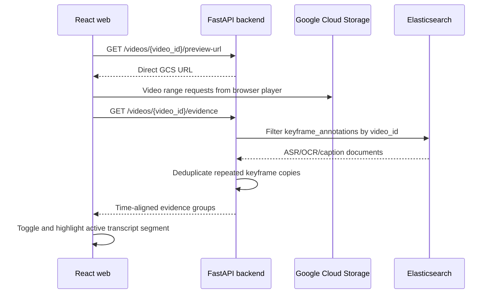
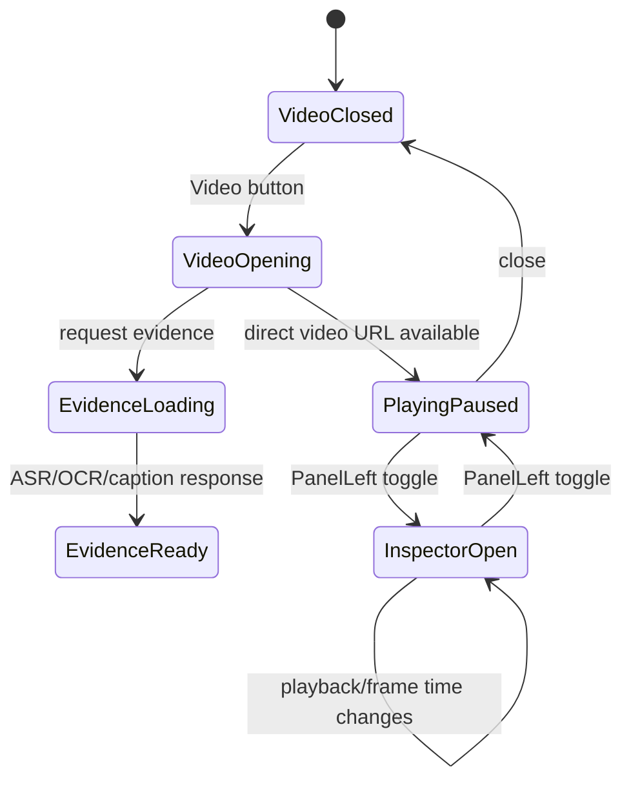

# Web UI Technical Report

## Scope

The web client is a React/Vite retrieval workspace for KIS, QA, TRAKE, direct video lookup, CSV submission, and video review. The UI keeps result cards compact: they show retrieval scores only. Long textual evidence is available only in the video inspector, where it can be read in full and related to video time.

## Result Cards

Each search result card renders four normalized signals supplied by the retrieval API:

| Signal | Purpose |
| --- | --- |
| Visual | CLIP/Milvus visual similarity |
| Text | Elasticsearch ASR/OCR/caption evidence score |
| RRF | Reciprocal-rank fusion contribution when enabled |
| Final | Final hybrid ranking score |

The card deliberately does not render ASR snippets. This avoids clipping long Vietnamese transcript text into a narrow grid and keeps repeated ASR segments from visually dominating image retrieval results.

Vector map metadata (`map_n`, source keyframe path, map frame index) is also not rendered in the user interface. It is ingestion/debug metadata, not a user-facing result attribute. A source map can refer to a decoded source frame that was not persisted as an indexed UI keyframe; displaying it creates misleading identifiers such as `shot_0046_first_f00285`.

## Video Evidence Inspector

Opening **Video** resolves a direct Google Cloud Storage video URL and requests both the frame context and video text evidence. The left `PanelLeft` icon in the video header toggles the evidence inspector. It does not interrupt playback or force a download through the backend.



`GET /api/media/videos/{video_id}/evidence` returns:

```json
{
  "video_id": "L26_V223",
  "video_code": "L26_V223",
  "evidence": {
    "asr": [{"text": "...", "start_seconds": 12.2, "end_seconds": 16.4}],
    "ocr": [],
    "captions": []
  }
}
```

ASR is indexed against multiple keyframes from one speech segment. The backend groups items by source type, start time, end time, and text before responding, so the inspector shows the transcript once rather than once per keyframe.

## Evidence States



The inspector has ASR, OCR, and Captions sections. Missing sources remain visible as explicit empty states, so future OCR/caption ingestion requires no UI restructuring. During playback, the item whose `[start_seconds, end_seconds]` contains the current time receives the active treatment.

## Frame Selection and TRAKE

The video panel remains the canonical frame-review surface:

1. The player starts paused at the result timestamp.
2. **Select current frame** resolves the nearest indexed keyframe from the selected second.
3. **Prev** and **Next** move across the full indexed sequence without a fixed window limit.
4. **Pick frame** writes a KIS/QA submission row, or replaces the chosen TRAKE event slot when the panel is opened from a TRAKE lane.

This separates evidence inspection from selection: reading ASR never changes a submission, and stepping a frame never hides transcript context.

## Responsive Behavior

On desktop, the inspector is a left column inside the modal and the player keeps the main column. On narrow screens it stacks above the player with an independent height cap and scroll area. The video stream remains a native browser `<video>` element pointing to GCS, allowing the browser to use HTTP range requests and its own buffer strategy.

## Main Modules

| Module | Responsibility |
| --- | --- |
| `apps/web/src/App.tsx` | Result cards, modal state, playback time, inspector toggle and evidence rendering |
| `apps/web/src/api/client.ts` | `getVideoEvidence()` request wrapper |
| `apps/web/src/types.ts` | `VideoEvidence` and time-aligned evidence types |
| `apps/web/src/styles.css` | Inspector layout, transcript scrolling, active segment, mobile stacking |
| `apps/backend/app/modules/media/router.py` | Video evidence endpoint and Elasticsearch deduplication |

## Verification

Use these checks after deployment:

```powershell
Invoke-RestMethod http://127.0.0.1:8000/api/media/videos/L26_V223/evidence | ConvertTo-Json -Depth 8
docker compose exec -T web npm run build
```

The first command should return a deduplicated `evidence.asr` list. The second verifies TypeScript and the production web bundle.
