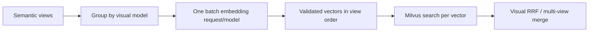

# Technical Report: Multimodal Video Retrieval System (Version 2)

## 1. Executive Summary

Milestone 5 upgrades the Milestone 4 retrieval system for efficient
multi-view visual search. The system now supports a hosted SigLIP2 embedding
endpoint, OpenCLIP/SigLIP2 selection and fusion, event-level multi-view
temporal retrieval, diverse KIS/QA result presentation, and batched embedding
requests.

The central performance change is batching all semantic query views for a
model into one OpenAI-compatible `/embeddings` request. This removes repeated
Kaggle/Cloudflare network round trips from the critical path while preserving
the per-view Milvus evidence required for RRF and temporal fusion.

```text
User query
  -> planner: event decomposition + semantic/text views
  -> batch text embeddings per visual model
  -> Milvus search for each returned vector
  -> visual RRF / lexical fusion / reranking
  -> temporal sequence alignment when requested
  -> diversified KIS/QA result list and evidence-aware web UI
```

## 2. Scope of the Milestone 5 Upgrade

| Area                        | Milestone 4 baseline                       | Milestone 5 Version 2                                                               |
| --------------------------- | ------------------------------------------ | ----------------------------------------------------------------------------------- |
| Visual encoder              | OpenCLIP primary path                      | OpenCLIP, SigLIP2, or both from the UI                                              |
| SigLIP2 runtime             | Registry-only extension                    | Kaggle/Cloudflare OpenAI-compatible endpoint verified from backend                  |
| Multi-view query processing | Scalar embedding call per view             | One embedding batch per model per search phase                                      |
| Temporal KIS                | Event candidates                           | Per-event English semantic views and Vietnamese lexical views, independently merged |
| Result diversity            | Global score ordering could cluster frames | Distinct videos are front-loaded; same-video frames are deferred and separated      |
| Video inspection            | Text evidence                              | Event query, view count, matched frame, and component scores above text evidence    |

## 3. SigLIP2 Hosted Embedding Integration

### 3.1 Runtime contract

The SigLIP2 registry entry uses the OpenAI-compatible embedding adapter and
expects the following contract:

| Property          | Value                                                             |
| ----------------- | ----------------------------------------------------------------- |
| Model             | `ViT-SO400M-16-SigLIP2-384-webli`                                 |
| Vector dimension  | 1152                                                              |
| Normalization     | L2 normalization in the backend adapter                           |
| Endpoint override | `SIGLIP2_EMBEDDING_BASE_URL`                                      |
| Credential source | `SIGLIP2_API_KEY`                                                 |
| Milvus collection | `keyframe_embeddings_siglip2_so400m16_384_webli_openclip_1152_v1` |

The environment override takes precedence over the registry's local fallback
URL. This lets the same deployment use a local service in development and a
Kaggle/Cloudflare endpoint in cloud mode without changing source code.

### 3.2 End-to-end verification

The deployed backend successfully called the configured hosted endpoint using
the production adapter. The endpoint returned vectors with the required 1152
dimensions, and the corresponding SigLIP2 Milvus collection was available.

| Verification                   | Observed result                      |
| ------------------------------ | ------------------------------------ |
| Adapter                        | `OpenAICompatibleTextEmbedder`       |
| Hosted endpoint                | Reachable from the backend container |
| SigLIP2 vector dimension       | 1152                                 |
| SigLIP2 collection             | 310,301 vectors                      |
| OpenCLIP comparison collection | 310,301 vectors                      |

The visual-search control supports three explicit modes:

- **OpenCLIP**: query only the OpenCLIP collection.
- **SigLIP2**: query only the SigLIP2 collection.
- **Both**: query both collections and merge visual ranks with RRF.

## 4. Batch Embedding Architecture

### 4.1 Problem in Version 1

Milestone 4 invoked scalar `embed_text()` calls inside the nested
variant-by-model loop. For a query with five semantic views and two visual
models, this caused ten remote/model invocations before Milvus search. Temporal
KIS multiplied this cost again for each event.

### 4.2 Version 2 design

The `TextImageEmbedder` contract now includes:

```python
def embed_texts(texts: list[str]) -> list[list[float]]:
    ...
```

The default implementation preserves compatibility by calling `embed_text()`
for each value. High-performance adapters override it:

1. `OpenAICompatibleTextEmbedder` sends `input: [view_1, view_2, ...]` in one
   HTTP request.
2. The response is restored by provider `index`, checked for one vector per
   input, dimension-validated, and normalized.
3. The local SigLIP2 adapter tokenizes and encodes the complete list in one
   model forward pass.
4. `RetrievalService._semantic_scores()` batches variants once per model and
   then retains individual Milvus searches for per-view rank evidence.



### 4.3 Measured hosted-endpoint performance

The following are operational smoke measurements from the backend container,
not a benchmark claim. Network conditions and Kaggle warm state affect them.

| Workload                                    | Observed latency | Result                          |
| ------------------------------------------- | ---------------: | ------------------------------- |
| One short text embedding, median of 3 calls |         652.5 ms | 1152-dimensional vector         |
| Direct batch of 3 views                     |        1088.6 ms | HTTP 200; 3 vectors             |
| Version 2 adapter warm batch of 3 views     |         609.3 ms | 3 vectors, each 1152 dimensions |

Three scalar calls at the observed median would take approximately 1.96
seconds. The initial three-view batch completed in 1.09 seconds, a reduction
of about 44%; the warm adapter verification completed in 609.3 ms. Batch
embedding therefore removes the largest avoidable remote overhead for
multi-view search.

## 5. Multi-view Temporal Retrieval

For KIS requests with Temporal Search enabled, the planner creates
`temporal_event_plans`. Each event contains:

- English `multi_views` for visual embedding and English caption search.
- Vietnamese `text_views` for ASR and OCR lexical search.
- Event-specific modality and text-source weights.

Each semantic view produces independent frame evidence. Matches are merged by
the `aithena_independent_view_merge` strategy, which combines the best score,
average score, view RRF, and multi-view coverage before temporal reranking.
The UI video panel displays the event query, number of views, selected frame,
final event score, and Visual/Text/RRF components before text evidence.

## 6. Diverse Result Presentation

Pure global score sorting can return many neighbouring frames from one video.
Milestone 5 applies result diversification after reranking while retaining the
complete candidate list for recall.

| Policy                               | Current default                                                                   |
| ------------------------------------ | --------------------------------------------------------------------------------- |
| Candidate pool before final ordering | 500 to 1000 candidates, bounded by profile                                        |
| First result pass                    | One top frame per video                                                           |
| Same-video spacing                   | At least 10 seconds and 300 frame indices                                         |
| Deferred candidates                  | Kept after the diverse head; never discarded solely for diversity                 |
| Client safeguard                     | First result from each video is front-loaded if an older API ordering is received |

This is a presentation and exploration policy, not a replacement for ranking.
Recall@K and MRR must be measured before changing the pool size or spacing,
especially for datasets in which the correct answer has several nearby
keyframes.

## 7. Reliability and Compatibility

- A batch response with a mismatched item count or vector dimension fails
  clearly instead of silently pairing a view with the wrong vector.
- Existing scalar-only embedders remain supported through the default batch
  fallback.
- A failure for one embedding model keeps hybrid retrieval available through
  the remaining model/text path unless strict hybrid mode is enabled.
- Hosted model credentials remain environment-only and must never be committed
  to repository files or reports.

## 8. Verification

The focused backend retrieval suite passed after the Version 2 changes:

```text
35 passed
```

Coverage includes visual model selection/RRF, event-level multi-view temporal
retrieval, diversity ordering, and the assertion that variants are embedded in
one batch per model. The deployed backend health endpoint also returned OK
after the rebuild.

## 9. Remaining Optimization Opportunities

1. Parallelize independent OpenCLIP and SigLIP2 batch requests in `Both` mode.
2. Add a short TTL embedding cache keyed by `(model, normalized view)`.
3. Batch Milvus vector searches if the selected Milvus/Zilliz deployment
   supports multi-query search with equivalent ranking semantics.
4. Record p50/p95 latency separately for planning, embedding, Milvus,
   Elasticsearch, fusion, and media loading.
5. Replace demo-oriented Kaggle/Cloudflare ingress with a persistent GPU
   endpoint for predictable cold-start and availability behavior.

## 10. Conclusion

Milestone 5 evolves the Milestone 4 system from a single-model, scalar-view
retrieval path into a multi-model and multi-view system with a bounded remote
embedding cost. The hosted SigLIP2 path is verified against its Milvus vector
space, batch embedding is active in the production adapter, and temporal and
diverse-result evidence remain visible to the user for inspection.
