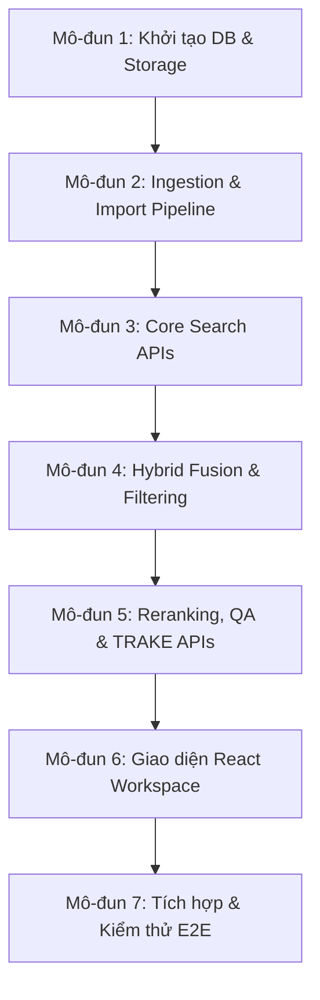

# Tài Liệu Đặc Tả Yêu Cầu Phát Triển Hệ Thống (Phase 2)
## Mô-đun Hóa Quy Trình Xây Dựng Frontend & Backend

Tài liệu này đóng vai trò là **sườn yêu cầu kỹ thuật chi tiết (Implementation Specification)** để định hướng cho các Agent hoặc lập trình viên tiếp theo xây dựng hệ thống tìm kiếm đa phương tiện (Multimodal Retrieval). 

Quy trình được thiết kế theo dạng **từng mô-đun độc lập**, yêu cầu hoàn thành và kiểm thử xong mô-đun trước mới chuyển sang mô-đun sau để đảm bảo tính toàn vẹn của hệ thống.

---



---

## 📑 MÔ-ĐUN 1: KHỞI TẠO CƠ SỞ DỮ LIỆU & LƯU TRỮ (DB & STORAGE)
*Mục tiêu: Xây dựng nền tảng lưu trữ cho toàn bộ hệ thống.*

Schema contract ưu tiên cho Module 1/2:
- `docs/database_schema_demo_v1.md`
- `docs/database_erd.md`

### 1. PostgreSQL Schema (Relational Data)
*   **Yêu cầu**: Sử dụng **SQLAlchemy** để định nghĩa các Model và tạo **Alembic migration** để quản lý phiên bản DB.
*   **Các bảng cần khởi tạo**:
    *   `datasets`: Lưu thông tin tập dữ liệu.
    *   `videos`: Lưu thông tin file video (`video_id`, `name`, `duration_seconds`, `fps`).
    *   `shots`: Phân đoạn cảnh cắt bởi AutoShot (`shot_id`, `start_frame`, `end_frame`, `start_seconds`, `end_seconds`).
    *   `keyframes`: Các khung hình đại diện (`frame_idx`, `frame_seconds`, `frame_type` [first/middle/last], `image_path`).
    *   `events`: Các sự kiện gộp từ nhiều shot (`event_id`, `start_seconds`, `end_seconds`, `representative_frame_id`).
    *   `frame_annotations`: Chú giải văn bản dạng thô để đồng bộ nhanh.
    *   `model_registry` & `index_builds`: Lưu lịch sử chạy model và build index.

### 2. Milvus Collection Setup (Vector Database)
*   **Yêu cầu**: Tạo script thiết lập Milvus collections.
*   **Cấu hình**:
    *   `keyframe_embeddings`: Chiều vector `512`, Metric Type `IP` (Inner Product) hoặc `L2`, Index Type `HNSW` hoặc `IVF_FLAT`.
    *   `event_embeddings`: Chiều vector `512`, cấu hình tương tự.
    *   Mỗi record vector cần lưu kèm `keyframe_id` hoặc `event_id` dạng `VARCHAR` để truy vấn ngược về PostgreSQL.

### 3. Elasticsearch Index Setup (Text Search Engine)
*   **Yêu cầu**: Tạo index mapping hỗ trợ tìm kiếm tiếng Việt.
*   **Cấu hình**:
    *   Index: `keyframe_annotations`.
    *   Các trường text (`caption`, `ocr_texts`) cần sử dụng **Vietnamese Analyzer** (ví dụ: `analysis-vietnamese` plugin).
    *   Các trường nhãn (`detected_objects`, `video_id`, `shot_id`) dùng kiểu `keyword`.

### 4. MinIO / S3 Storage Setup
*   **Yêu cầu**: Khởi tạo bucket `keyframes` trên MinIO. Cấu hình quyền đọc công khai (public read) hoặc sinh Pre-signed URL để frontend có thể hiển thị trực tiếp.

### 🔍 Tiêu chí nghiệm thu Mô-đun 1:
- [ ] Chạy lệnh `alembic upgrade head` thành công và các bảng được tạo đúng schema trong PostgreSQL.
- [ ] Khởi chạy thành công các Collection trên Milvus và Index trên Elasticsearch mà không gặp lỗi kết nối.
- [ ] Bucket trên MinIO được tạo và có thể kết nối thông qua S3 SDK.
- [ ] Chạy data-quality preflight để phát hiện mismatch giữa metadata và media thật trước khi import.

---

## 📑 MÔ-ĐUN 2: PIPELINE NẠP DỮ LIỆU (INGESTION & IMPORT PIPELINE)
*Mục tiêu: Đẩy toàn bộ dữ liệu thô và đặc trưng từ thư mục `demo/` vào hệ thống lưu trữ.*

### 1. Script `import_pg.py` (Nạp PostgreSQL)
*   Đọc file `demo/per_video_summary.csv` để nạp dữ liệu vào bảng `videos`.
*   Đọc file `demo/shot_segments.csv` để nạp dữ liệu vào bảng `shots` và `keyframes`.
*   Đọc file `demo/Event Embedding/event_mapping.csv` để nạp dữ liệu vào bảng `events`.

### 2. Script `import_milvus.py` (Nạp Milvus)
*   Đọc file numpy toàn cục `demo/Event Embedding/event_embeddings.npy` và nạp vào collection `event_embeddings`.
*   Duyệt qua từng video, đọc file `.npy` tại `demo/features/vit-ViT-B-32-laion2b_s34b_b79k/[video_id].npy` và ánh xạ với file mapping `.csv` tương ứng để nạp vector keyframe vào collection `keyframe_embeddings` (sắp xếp theo quy tắc `row index = csv n - 1`).

### 3. Script `import_es.py` (Nạp Elasticsearch)
*   Đọc từng dòng của file `demo/annotations.jsonl`.
*   Trích xuất: `caption`, `texts` (đưa vào `ocr_texts`), và `objects` (đưa vào `detected_objects`). Đẩy dạng bulk document lên Elasticsearch.

### 4. Script Upload Media
*   Đẩy toàn bộ ảnh JPG từ thư mục `demo/frames/[video_id]/` lên bucket `keyframes` của MinIO dưới dạng cấu trúc thư mục: `L30_V001/shot_0000_first_f000000.jpg`.

### 🔍 Tiêu chí nghiệm thu Mô-đun 2:
- [ ] Tổng số dòng trong bảng `keyframes` của PostgreSQL trùng khớp với số lượng ảnh trên MinIO và số lượng vector trong Milvus.
- [ ] Elasticsearch chứa đúng số lượng tài liệu bằng với số dòng trong `annotations.jsonl`.

---

## 📑 MÔ-ĐUN 3: CÁC API TÌM KIẾM CORE (CORE SEARCH & RETRIEVAL APIS)
*Mục tiêu: Xây dựng các API tìm kiếm đơn lẻ phục vụ việc truy xuất đặc trưng.*

### 1. Vector Search Endpoint (`POST /api/retrieval/search`)
*   **Input**:
    ```json
    {
      "query_text": "một người mặc áo đỏ",
      "top_k": 50
    }
    ```
*   **Logic xử lý**:
    1. Gọi Model Adapter (OpenCLIP) để chuyển `query_text` thành vector 512 chiều.
    2. Gửi vector truy vấn sang Milvus tìm kiếm trên collection `keyframe_embeddings`.
    3. Trả về danh sách `keyframe_id` và độ tương đồng cosine (`score`).

### 2. Metadata Search (Elasticsearch Query)
*   **Logic xử lý**:
    *   Tạo câu truy vấn `Multi-Match` trên Elasticsearch để tìm kiếm từ khóa.
    *   Áp dụng trọng số (boost) động: `ocr_texts` (boost 3.0), `caption` (boost 1.5), `detected_objects` (boost 1.0).
    *   Trả về danh sách `keyframe_id` và điểm số BM25 tương ứng.

### 🔍 Tiêu chí nghiệm thu Mô-đun 3:
- [ ] API trả về đúng cấu trúc JSON chứa danh sách kết quả kèm điểm số phân rã (`score_breakdown`).
- [ ] Thời gian phản hồi của API truy vấn đơn lẻ dưới 200ms với tập dữ liệu hiện tại.

---

## 📑 MÔ-ĐUN 4: BỘ GỘP HYBRID FUSION & BỘ LỌC CỨNG (FUSION & FILTERING)
*Mục tiêu: Kết hợp kết quả từ tìm kiếm vector và tìm kiếm văn bản để tăng độ chính xác.*

### 1. Hybrid Fusion Engine
*   **Yêu cầu**: Viết module Python tích hợp thuật toán **RRF (Reciprocal Rank Fusion)** và **Weighted Sum** (Cộng điểm có trọng số).
*   **Cấu hình**: Trọng số của mô hình được đọc từ file `configs/retrieval_profiles.yaml` (ví dụ: `weights: {vector: 0.4, text: 0.6}`).

### 2. Metadata Filtering (PostgreSQL Join & Filter)
*   **Yêu cầu**: Hỗ trợ lọc kết quả sau khi fusion dựa trên metadata lấy từ PostgreSQL.
*   **Bộ lọc gồm**:
    *   `video_code`: Giới hạn tìm kiếm trong một số video cụ thể.
    *   `time_range`: Tìm kiếm trong khoảng giây bắt đầu và kết thúc (`start_sec`, `end_sec`).
    *   `scene` / `objects`: Lọc theo nhãn đối tượng cụ thể.

### 🔍 Tiêu chí nghiệm thu Mô-đun 4:
- [ ] Khi nhập câu query vừa có chữ viết vừa có mô tả cảnh vật, kết quả Fusion phải hiển thị các khung hình thỏa mãn cả hai điều kiện ở vị trí cao nhất.
- [ ] Áp dụng bộ lọc `video_code` hoặc `time_range` phải loại bỏ hoàn toàn các kết quả nằm ngoài phạm vi lọc.

---

## 📑 MÔ-ĐUN 5: TÍNH NĂNG NÂNG CAO: RERANKER, QA & TRAKE APIS
*Mục tiêu: Giải quyết các bài toán chuyên biệt của AI Challenge.*

### 1. Reranker Integration
*   Tích hợp mô hình Cross-Encoder (như BGE-Reranker hoặc tương đương) để chấm điểm lại Top 50 kết quả sau khi Fusion để đưa kết quả chính xác nhất lên vị trí đầu tiên.

### 2. QA Endpoint (`POST /api/retrieval/qa`)
*   **Input**: Câu hỏi tự nhiên cần trả lời ngắn.
*   **Logic xử lý**:
    1. Tìm kiếm các keyframe làm bằng chứng (evidence) liên quan nhất đến câu hỏi.
    2. Đưa ảnh keyframe và câu hỏi vào mô hình VLM (như Qwen-VL hoặc Gemini API).
    3. Hậu xử lý (post-process) câu trả lời: cắt ngắn và chuẩn hóa đảm bảo dưới 100 ký tự.

### 3. TRAKE Endpoint (`POST /api/retrieval/trake`)
*   **Logic xử lý**: Hỗ trợ truy vấn chuỗi sự kiện tuần tự. Trả về danh sách các chuỗi keyframe có sự xuất hiện của các sự kiện theo đúng trật tự thời gian yêu cầu.

### 4. Submission Builder Module
*   Xây dựng chức năng validate kết quả người dùng đã chọn.
*   Xuất ra file `submission.zip` chứa file CSV đúng định dạng Codabench: **Không có hàng tiêu đề (no header), sử dụng bảng mã UTF-8, ngăn cách bởi dấu phẩy, tối đa 100 dòng**.

### 🔍 Tiêu chí nghiệm thu Mô-đun 5:
- [ ] Chạy API QA sinh ra câu trả lời ngắn gọn dưới 100 ký tự và trích xuất đúng tên thương hiệu/đối tượng từ ảnh.
- [ ] File `submission.zip` xuất ra phải vượt qua các bài test định dạng cấu trúc (validate format).

---

## 📑 MÔ-ĐUN 6: GIAO DIỆN NGƯỜI DÙNG REACT WORKSPACE (FRONTEND)
*Mục tiêu: Xây dựng giao diện tìm kiếm tương tác cao cho người thi.*

### 1. Search Workspace Component
*   Thanh tìm kiếm hỗ trợ nhập câu truy vấn tiếng Việt.
*   Nút chuyển đổi chế độ làm bài: **KIS Mode**, **QA Mode**, và **TRAKE Mode**.
*   Lưới kết quả (Results Grid) hiển thị ảnh thật load từ MinIO, khi hover vào ảnh sẽ hiển thị tooltip giải thích điểm số (`score_breakdown`: điểm vector bao nhiêu, điểm OCR bao nhiêu).

### 2. Filter Panel & Sidebar
*   Sidebar chứa các thanh trượt chọn khoảng thời gian (time range slider) và các ô chọn (checkbox/select) để chọn video hoặc nhãn đối tượng.

### 3. Context Viewer
*   Khi người dùng click vào một keyframe, hiển thị bảng xem ngữ cảnh (Context Panel) chứa 5 khung hình trước và 5 khung hình sau của keyframe đó để người dùng kiểm tra diễn biến của shot.

### 4. Chế độ QA & TRAKE Editor
*   **QA Editor**: Ô nhập câu trả lời có bộ đếm ký tự (cảnh báo đỏ nếu vượt quá 100 ký tự).
*   **TRAKE Sequence Editor**: Khu vực kéo thả (drag-and-drop) để người dùng sắp xếp các khung hình được chọn theo một chuỗi sự kiện có thứ tự.

### 🔍 Tiêu chí nghiệm thu Mô-đun 6:
- [ ] Giao diện hiển thị mượt mà các ảnh keyframe thật từ MinIO.
- [ ] Các tính năng xem context, kéo thả trong TRAKE editor hoạt động chính xác không bị lỗi giao diện.

---

## 📑 MÔ-ĐUN 7: TÍCH HỢP & KIỂM THỬ E2E (INTEGRATION & VALIDATION)
*Mục tiêu: Kết nối toàn bộ hệ thống và chạy thử nghiệm thực tế.*

### 1. Kết nối Frontend - Backend
*   Đảm bảo tất cả các tương tác từ UI (gửi query, chọn bộ lọc, chỉnh sửa câu trả lời QA, xếp chuỗi TRAKE) đều được gửi và xử lý chính xác ở Backend.

### 2. Chạy thử nghiệm và Đánh giá (Dry-Run)
*   Thực hiện chạy thử toàn bộ quy trình: Nhập query $\rightarrow$ Tìm kiếm $\rightarrow$ Chọn kết quả $\rightarrow$ Export submission $\rightarrow$ Chạy script kiểm tra định dạng file nộp.

### 🔍 Tiêu chí nghiệm thu Mô-đun 7:
- [ ] Hệ thống chạy thông suốt E2E từ Frontend đến Backend.
- [ ] File submission nộp thử nghiệm lên hệ thống Codabench thành công mà không bị lỗi cấu trúc.
- [ ] Tài liệu `runbook.md` hoặc `README.md` được cập nhật đầy đủ các lệnh vận hành.
